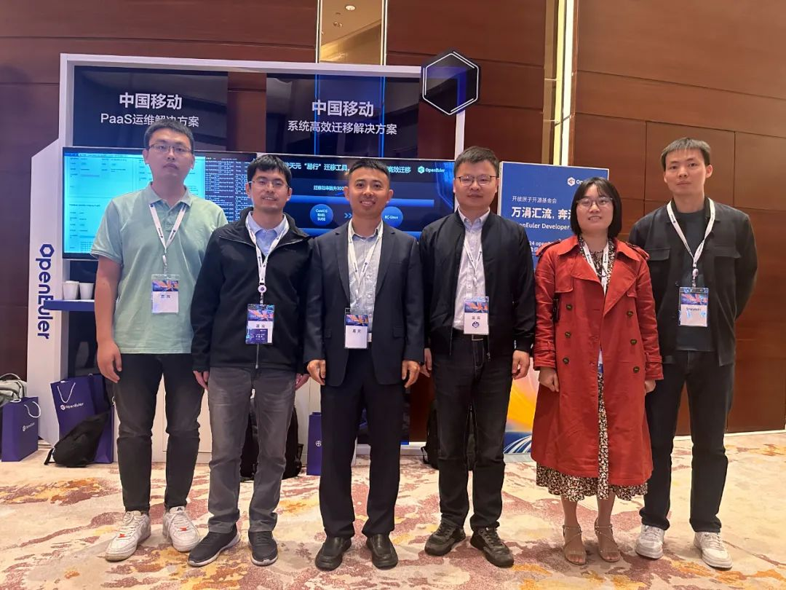
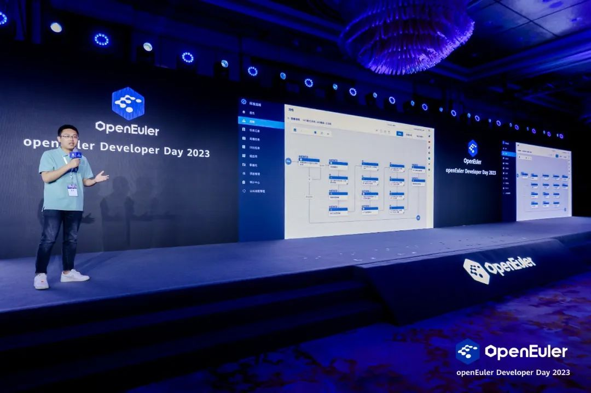

openEuler Developer Day 2023（简称 ODD 2023）开发者大会已于 4 月 21
号正式在上海落下帷幕，本次大会由开放原子开源基金会指导，中国软件行业协会、openEuler
社区、边缘计算产业联盟共同主办，旨在持续推动操作系统乃至基础软件的创新和突破。大会以"万涓汇流，奔涌向前"为主题，与社区开发者一起联合创新，用欧拉构筑坚实的软件根基，成就属于每位开发者的欧拉时代。

## "大云"云操作系统，从分布式云向算力网络演进

中国移动云能力中心 IaaS
产品部总经理刘军卫出席本次大会，并在大会主论坛作了"基于 openEuler
全栈自主创新，构筑移动云算网基座"的创新成果演讲。他表示自 2019
年启动云改战略之后，移动云进入发展快车道，2022
年三年云改收官，市场收入规模突破 500 亿，连续 3
年保持三位数增长规模，公有云市场份额迈入国内前六。此外，移动云持续深化"4+N+31+X"算力布局，已覆盖
31 个省，在长三角、京津冀、大湾区、陕川渝等四大热点地区发布 3AZ
节点，边缘节点达 1000+，移动云技术架构从分布式云 3.0 向算力网络 4.0
架构平滑演进，构建"大云"云操作系统技术体系，打造自主可信的移动云算网底座。其中天元操作系统（BC-Linux）作为技术体系中最核心、最关键的基础软件，在使能各种异构算力芯片，赋能上层业务创新等发面发挥重要的基础支撑作用。

## 根植国内开源社区，打造操作系统天元系列产品

作为中国移动自主研发的企业级 Linux 操作系统，大云天元操作系统自 2015
年启动研发，在 2021 年完成以国内 openEuler
社区为基础的重要转变，聚焦全栈自主、多样算力、安全可信、内核创新等领域，实现从系统到应用的全栈性能优化，充分释放多样性算力。

以天元操作系统为核心，移动云陆续发布了天元系列产品，涵盖内核、虚拟化和关键工具等方向：内核方面，在多个内核子系统上进行功能增强和性能优化，满足云场景极致性能需求。虚拟化方面，聚焦标准虚机和安全容器，以
Qemu 和 Stratovirt
为双技术路线，打造双平面的虚拟化技术栈。安全方面，实现多维安全加固能力和全栈国密支持，推出基于国密的虚拟化可信计算解决方案，满足用户多样性安全述求。工具方面，面向云场景打造操作系统智能运维、智能调优和迁移工具系列，持续提升操作系统关键组件可观测、可升级、可运维管理能力。

生态方面，借助中国移动应用产业链及上下游发展优势，大云天元操作系统全面兼容国产软硬件，具备南向广泛兼容、北向多生态应用适配的能力，目前已在移动云和
IT 云多个超大规模资源池部署上线，累计部署物理节点 30 万+，部署虚机节点 7
万+，在移动云租户订购操作系统镜像中稳居第一，为千行百业客户提供算力服务。

## 首发"易行"迁移工具，助力全场景业务规模迁移上线

作为大云天元系列产品之一，天元"易行"迁移工具是移动云与 openEuler
社区深度联创的一项成果，能够实现操作系统的一键式原地升级，支持命令行和图形化两种操作模式，提供迁移原子化能力，覆盖容器、虚拟化及大数据等复杂应用场景。通过"天元易行"迁移工具可以最大程度保留原有业务和操作系统配置不变，实现端到端的业务无感迁移。

在演示环节，以移动云文件存储业务为例，天元"易行"迁移工具与移动云智维作业平台深度集成，利用迁移工具升级、备份、回退等原子化能力，实现原地升级自动化编排流程。在移动云智维平台上，通过图形可视化的方式展示自动化编排整个流程，通过各子流程的图标颜色可查看流程的当前进度及状态，当出现执行失败时，平台向运维人员发送告警，运维人员收到告警后，可快速登录平台查看错误日志，进一步排查定位问题。操作系统升级自动化编排流程包含集群状态检查、数据配置备份、操作系统升级等子流程，其中操作系统升级子流程关键原子能力由"易行"迁移工具提供，整体升级时长控制在
1 小时之内，相比重装操作系统方式，自动化程度高，提高迁移效率 300%以上。

天元"易行"迁移工具已经累计通过了数十个系统版本和上百个业务模拟场景下的测试，并在移动云、IT
云和省节点资源池经过大规模迁移实践的验证，助力全场景业务高效迁移，打造行业级迁移案例标杆。

## 携手 openEuler 社区，共建开源生态

在与 openEuler
社区合作方面，刘军卫表示天元操作系统紧跟社区节奏每半年发布一个版本，并持续为社区做出贡献，上个月也非常荣幸当选为
openEuler 社区首届用户委员会主席，多人在多个 SIG 组担任
Maintainer，贡献关键补丁
130+。同时，天元操作系统团队基于移动云业务规模和丰富场景，与社区开展了多项关键核心技术联创：在安全方面，落地
IMA
完整性动态度量及性能优化方案，打造全链路安全可信解决方案；在云主机迁移方面，围绕虚机热迁移能力开展联创，提升热迁移效率与性能，增强稳定性；在混部调度方面，实现内核及应用混合部署技术，虚机混部场景资源利用率提升至
30%，QoS 下降在 5%以内；在网络协议栈方面，搭配自研拥塞控制算法，加速云盘
IOPS，打造移动云下一代高性能网络基础设施。

未来，移动云将聚焦聚焦算力网络本身，围绕自主创新软硬件平台，在算力资源利用率提升、算力安全可控能力提升、多元算力融合发展等方面深度研发。同时，也将继续携手
openEuler
社区，围绕多样性算力、基础软件和业务应用等维度，深化联合创新，落地更多联创成果。另外，移动云也即将会首发数据中心级软硬一体化片上计算架构
COCA（Compute on Chip Architecture），旨在围绕引领国产智算生态、共建自主
GPU+DPU
产业联盟、联创高性能网络技术革新三大核心领域，完善自主产业链，深化产学研合作，助推国家自主创新的高性能算力网络新基建。
