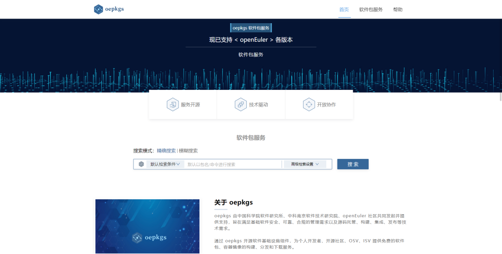
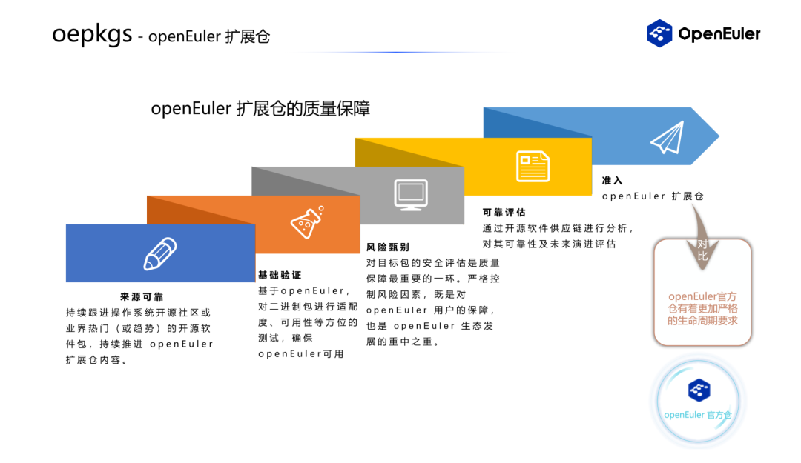
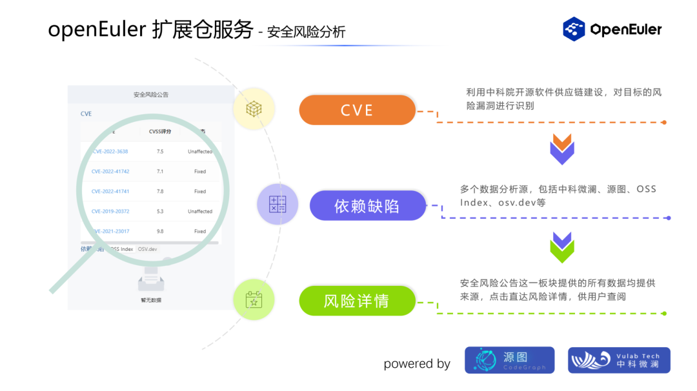
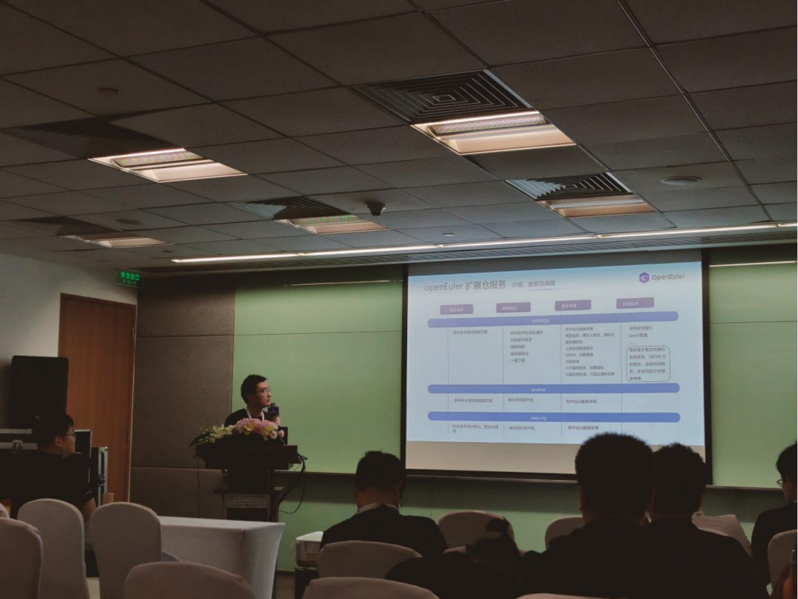

4月21日，中国科学院软件研究所在openEuler Developer Day 2023 （以下简称
ODD）上，正式公开**开放软件包服务**（Open External Packages
Service，以下简称oepkgs）。

oepkgs官网：https://oepkgs.net/。

oepkgs由中国科学院软件研究所、中科南京软件技术研究院、openEuler
社区共同发起并提供支持。本次ODD大会上重磅推出的oepkgs openEuler
扩展仓服务，为参与 CentOS、Fedora 等系统向 openEuler 迁移的开发者、OSV
等用户将提供一站式兼容性软件包支持。

oepkgs 展区现场

在ODD欧拉开发者服务分论坛上，oepkgs 产品经理纪涛针对 oepkgs 开放软件包服务，介绍了openEuler
扩展仓建设及服务两部分内容：

# 一、oepkgs openEuler扩展仓：

通过严格的RPM质量保障标准（来源可靠、基础验证、风险甄别、可靠评估）累计准入160余万openEuler适配RPM包；同时，oepkgs将通过对软件包的持续监控保障策略来确保软件包有效性，并及时更新风险信息。

# 二、基于openEuler扩展仓的软件包服务：

oepkgs团队整合了"源图"开源软件供应链基础设施平台、中科微澜等多项团队最新技术成果，面向openEuler生态推出了RPM软件包检索服务、元数据分析、SBOM和供应链分析、安全性及合规性风险分析等多项服务内容。

纪涛在会上作oepkgs开发软件包服务介绍

当前，oepkgs正在漏洞检测和漏洞感知方面持续发力，建设软件包patch管理系统，将通过分析
release等方式，进一步增强二进制包安全加固信息管理。
