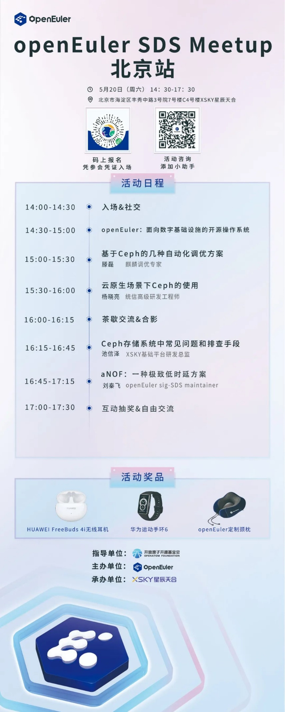
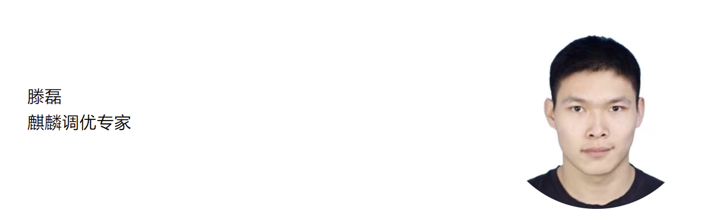
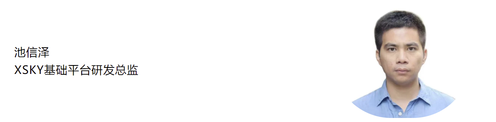
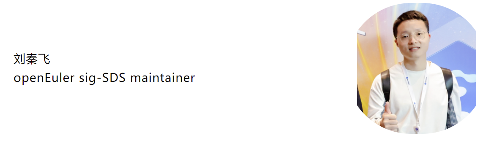

5月20日，**openEuler SDS Meetup**北京站来啦。本场Meetup由**openEuler
sig-SDS
&XSKY星辰天合**联合发起，旨在为开发者和用户提供一个分享和交流分布式存储技术的平台，本次活动邀请openEuler
SDS领域的专家和开发者，分享他们在分布式存储技术实际应用中的经验和案例，展示openEuler
SDS的最新进展和讨论未来发展方向，欢迎大家报名参加。

-   **时间：2023年5月20日（周六） 14:30-17:30**

-   **地点：北京市海淀区丰秀路3号院7号楼C4号楼-XSKY星辰天合**

快快扫码下方活动海报报名吧，凭参会凭证签到入场，5月20日北京见！

**议题亮点**

**基于Ceph的几种自动化调优方案**

**议题简介**：本次报告将介绍一款基于自动调优工具的ceph优化方案，在报告中我们将讲解A-tune自动化调优工具在ceph调优实践中的使用方法，除此之外我们还将详细地讲解A-tune中涉及到的智能算法的优劣对比，以及应用于ceph自动化调优时的性能对比。

**云原生场景下Ceph的使用**

**议题简介**：本议题主要阐述云原生环境下ceph集群多种部署方式、常见问题整理及解决、实际案例分析等。结合实际云原生场景，推荐合理、可靠的ceph部署组合。

**Ceph存储系统中常见问题和排查手段**

**议题简介**：1. 介绍Ceph 常用的性能定位手段以及优化的主要举措；2.
生产环境下常见的可能触发的问题以及修复方案；3.
硬件故障导致的存储故障的处理方法。

**aNOF：一种极致低时延方案**

**议题简介**：在OLTP领域，尤其在证券高频交易市场（HFT），对于数据写入有着极致低时延（ULL）的诉求。数据中心写入数据持久化要求在数据写入主节点后，并将副本写入远端节点（故障域）。因此，数据写入的整体时延取决于单点写入时延。我们提出了一种极致低时延的跨网络写入方案。

**惊喜福利**

除了一系列技术干货，openEuler社区还为大家带来诚意满满的线下互动奖品，参与Meetup互动环节的开发者可以现场抽奖，随机抽取幸运开发者送出惊喜礼品哦！

