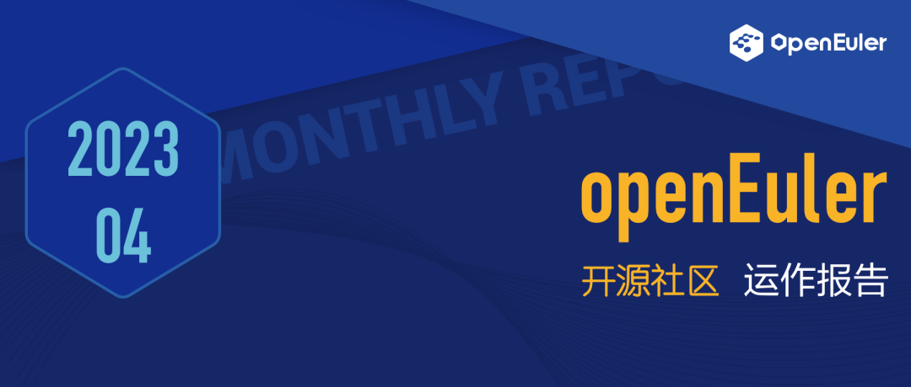

# 概述

过去一个月，openEuler社区全员参与openEuler Developer Day
2023，通过SIG组开放工作会议完成了下个版本的规划。openEuler社区也参加了在新加坡举办的FOSSASIA
SUMMIT。

在技术层面，社区不断推进创新，发布新项目，如NFS+协议、Kmesh等。同时，openEuler社区的EUR也为贡献软件包提供了更加便捷的方式，持续推动openEuler社区的发展。人才培养方面，开源之夏2023、openEuler-OECA工程师认证体系建设等，都在助力开源人才发展。随着不断推出的新功能和优化，openEuler正助力开源生态健康发展。

信息量巨大，阅读本报告需要15分钟。

# 社区活跃度

2023年4月，openEuler社区用户**超过120万**。有**超过1.4万**贡献者累计产生**103.5K** 个PR、**56.1K** 条Issue。累计加入openEuler社区的单位成员 **838**家，4月新增 **26**家。

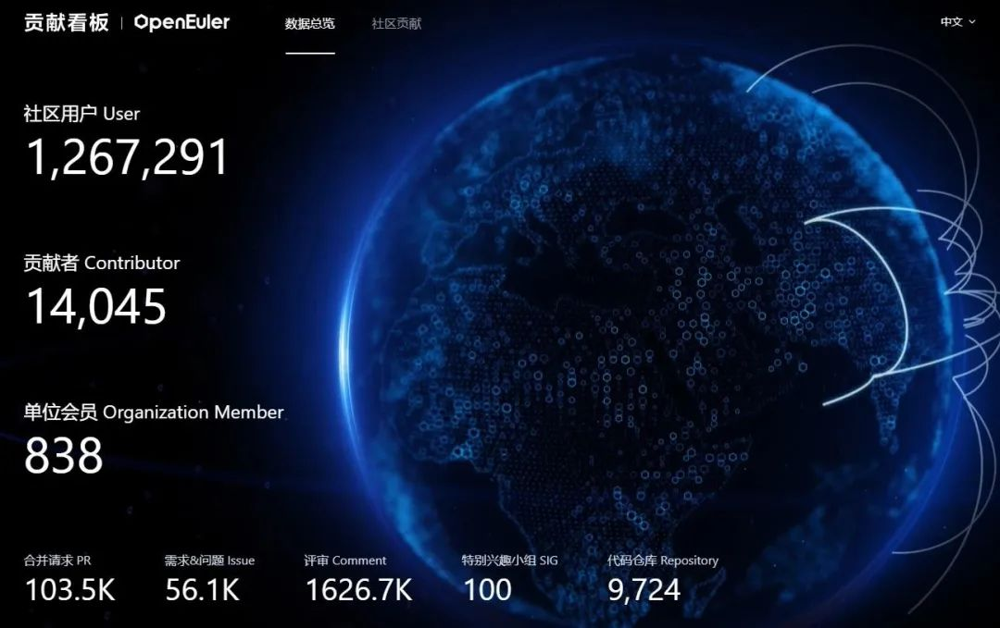

社区贡献看板（截至2023/4/30）

# 社区大事件

## openEuler Developer Day 2023召开

## 多项技术成果发布

4月20-21日，
由开放原子开源基金会指导，中国软件行业协会、openEuler社区、边缘计算产业联盟共同主办，华为、麒麟软件、麒麟信安、统信软件、超聚变、中科院软件所、英特尔、润和软件、凝思软件、软通动力等多家社区伙伴共同支持的 [openEuler
Developer Day
2023](https://mp.weixin.qq.com/s?__biz=MzI2NDE4OTE2Mg==&mid=2247503530&idx=1&sn=bc14c483b095e9335fc0916487a56036&chksm=eab2eb2fddc56239f9213b4c6218c0b9f23e48cad9a68a941c296651c294763daae1fc467234&token=40242134&lang=zh_CN&scene=21#wechat_redirect) 在上海举办。万涓汇流，奔涌向前！作为社区顶级会议，大咖齐聚的现场，openEuler展示了多项成果，涵盖技术、商业、生态、开源建设等各方面。

-   **五大项目完成捐赠openEuler意向签署，社区生态持续扩大**

电信天翼云的 Gostone 和 CTinspector
、湖南大学ZVM、北京航空航天大学的Rust-Shyper、华恒盛世的QuickPool等[五大项目完成捐赠openEuler意向签署](https://mp.weixin.qq.com/s?__biz=MzI2NDE4OTE2Mg==&mid=2247503530&idx=2&sn=6d9d0ef5997fc3b971deed0c46a316e0&chksm=eab2eb2fddc562397d8a32ca0d32970b5c772d92eba23ad9e967dee8127858e85416f6ec7588&token=143800814&lang=zh_CN&scene=21#wechat_redirect)，加速了新一代基础软件生态的繁荣。

-   **深入场景创新，加速行业应用，五大全场景联合创新方案亮相**

中国电信天翼云、中国移动苏研、中国移动IT、润和软件、达闼机器人带来了五大全场景联合创新方案，展示基于openEuler的创新成果。

-   **开放原子校源行@openEuler启动，加速基础软件人才培养**

"开放原子校源行"是开放原子开源基金会发起的长期性公益项目，拟通过资助开源社团、推广开源课程、设置开源助学金等方式，面向全国高校培育开源人才，加快推动开源生态繁荣发展。openEuler作为基金会的重要项目群，将参与其中，推动开源人才的培养。今年4月初，
openEuler参与了在北京航空航天大学举办的[开放原子校源行首站活动](https://mp.weixin.qq.com/s?__biz=MzI2NDE4OTE2Mg==&mid=2247502479&idx=3&sn=fabfffe804f69fcfcfb60e656107f213&chksm=eab2ef0addc5661c1fcbfe307256763054c46dd69dcff2e30ec82349c9f284dae2624b9db23c&token=143800814&lang=zh_CN&scene=21#wechat_redirect)。后续，openEuler将提供课程、创新项目，积极推动高校师生加入到该项目活动中，实现产教融合、产学融合，为中国基础软件培育更多的人才。

-   **融入全球开源体系，为全球开源贡献openEuler智慧**

openEuler积极对接全球四大开源基金会，目前已完成95%的项目兼容性支持，对于平台型开源软件，比如：OpenStack、KubeEdge、OpenHPC、Hadoop、Spark等，已经做到了上游社区的原生支持。覆盖云原生、大数据、分布式存储、数据库、HPC等主流应用场景，让全球用户可以便捷地部署使用openEuler。

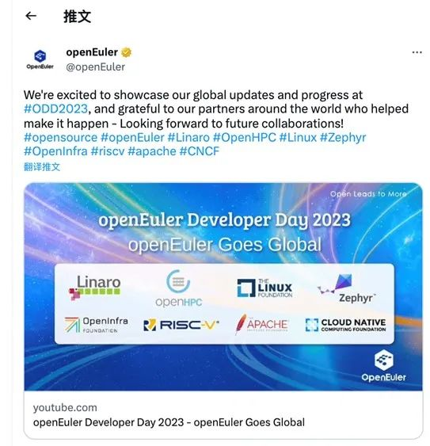

## 我参与，我做主！

## 43个SIG组开放工作会议同步进行

4月21日，openEuler社区年度大型会议------SIG组开放工作会议在上海举办。43个SIG组聚焦内核、云原生、嵌入式、多样性算力、基础设施等不同技术方向，近400名社区开发者带着自己的需求，现场展开讨论。在1.5小时的会议时长里，形成有关23.09版本开发计划60+项，包括内核、编译器选型，多样性算力支持与优化，安全，迁移与运维能力提升，主流开源社区openEuler原生支持计划，社区原创项目孵化及开发，海外拓展等技术方向。

[原文阅读\>\>\> ](https://mp.weixin.qq.com/s?__biz=MzI2NDE4OTE2Mg==&mid=2247503346&idx=1&sn=c3412ab9ca78bc659ed4184edbc43068&chksm=eab2e877ddc561617200bf4ac12371b827d6e37cfc4a81314a3efb44ed59c1f916e3c7458395&token=143800814&lang=zh_CN&scene=21#wechat_redirect)

## openEuler 亮相国际开源大会

## FOSSASIA Summit 2023

4月13-15日，亚洲开源盛会的FOSSASIA Summit
2023在新加坡举行。作为openEuler在亚太区的首次亮相，openEuler技术委员会委员熊伟、王建民带队做了充分准备，从社区建设、产品、技术等多个维护向现场开发者们展示openEuler优势与成果。大会现场，RedHat、Debian、MySql、RT-Thread等社区开发者前来openEuler展台咨询、现场体验openEuler。

[原文阅读\>\>\> ](https://mp.weixin.qq.com/s?__biz=MzI2NDE4OTE2Mg==&mid=2247503229&idx=3&sn=9bd9c6d3d3d5c04f5da8710c065373a9&chksm=eab2e8f8ddc561eef9aaa6b417a62eef929c324bf47744a8a6ebe52cfdfccb9cda6262d8e3dd&token=143800814&lang=zh_CN&scene=21#wechat_redirect)

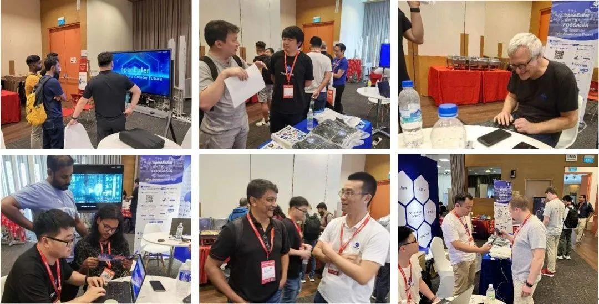

## openEuler携手超图软件共筑GIS生态圈

4月中旬，2023
SuperMap生态伙伴CTO峰会在山城重庆召开。openEuler安全委员会主席魏刚代表openEuler社区出席峰会。会上，openEuler与超图软件携手多家伙伴联合发布了"地理信息软件信创替代行动计划"。未来，openEuler社区将和伙伴一起，共同持续支持国内GIS产业的发展与壮大。

[原文阅读\>\>\>](https://mp.weixin.qq.com/s?__biz=MzI2NDE4OTE2Mg==&mid=2247503388&idx=2&sn=3ab84e1519f45a4d063d9383b479121e&chksm=eab2eb99ddc5628f9880d4cfeb0d572bb3dcc75df75a0d7efdddfbb30448d1729b229d1e6db2&token=143800814&lang=zh_CN&scene=21#wechat_redirect)

## openEuler TechDay 第四期开播

4月初，面向全球开发者的openEuler
TechDay第四期在YouTube上开播。活动围绕openEuler在RISC-V架构上的现有成果和未来发展路线图展开讨论。会上，RISC-V
SIG的开发者们也各自展示了基础设施、开发、测试和衍生版本等方面的贡献。

**Twitter**：https://twitter.com/openEuler

**LlinkedIn：**

https://www.linkedin.com/company/86315548/

**Reddit：**

https://www.reddit.com/user/openEuler

**YouTube：**

https://www.youtube.com/channel/UCPzSqXqCgmJmdIicbY7GAeA

## openEuler Compiler&Embedded Meetup在杭州举办

4月7日，openEuler Compiler&Embedded
Meetup在杭州举办，openEuler、CNRV、HelloLLVM等多家社区开发者围绕编译器和嵌入式的关键技术进行深度的探讨，吸引了来自金融、教育、互联网等行业的用户和开发者参加。

[原文阅读\>\>\> ](https://mp.weixin.qq.com/s?__biz=MzI2NDE4OTE2Mg==&mid=2247502780&idx=1&sn=123b1d59787f4826f768637cd75a910a&chksm=eab2ee39ddc5672f6238249013d1409f432c9e5d7489a608cd8c16db0a917d9a85415d43188b&token=143800814&lang=zh_CN&scene=21#wechat_redirect)

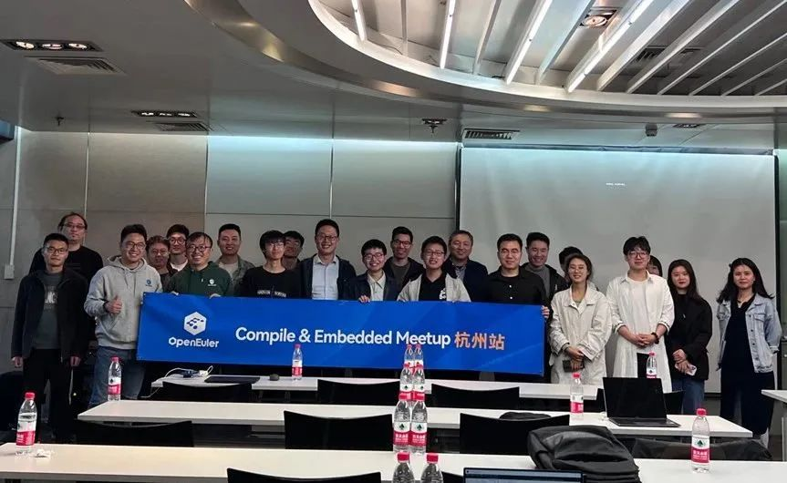
# 社区治理

## 2023-2024年 openEuler委员会第三次会议召开

4月20日，2023-2024年openEuler委员会第三次会议在上海浦东嘉里酒店召开。根据《openEuler项目群开源治理制度》，在本次会议上openEuler委员会决策通过了在openEuler项目群下成立工业操作系统委员会，审议了openEuler
Developer Day 2023的筹备工作和openEuler用户委员会2023年业务规划。

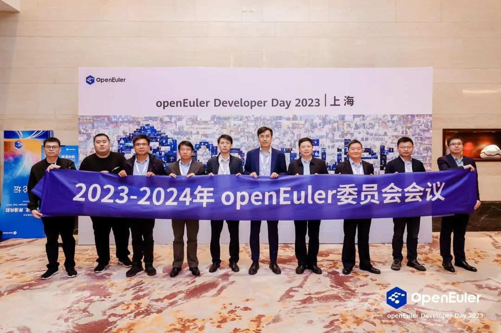

## 2023-2024年openEuler技术委员会会议在上海召开

4月21日下午，openEuler技术委员会会议在上海召开。本次会议由openEuler技术委员会委员、Compiler
SIG Maintainer
赵川峰主持。会议上，经openEuler技术委员会全体委员商议，同意分布式中间件SIG组（SIG
Distributed
Middleware）成立申请；同意天翼云云操作系统安全高性能鉴权组件GoStone在openEuler开源并运作。

-   **分布式中间件SIG组**

分布式中间件SIG组（SIG Distributed
Middleware）以欧拉鸿蒙协同为切入点，构建openEuler原生全场景支持多设备协同能力，解决端设备形态不一、稳定快速组网难、传输损耗大及接口不统一等一系列边端设备互联难点问题，为设备之间的互联互通提供统一的分布式通信能力开放标准，达成自动发现、即连即用、高带宽、低时延、稳定可靠的目标。

项目地址: 

https://gitee.com/openeuler/distributed-codelabs

-   **天翼云云操作系统安全高性能鉴权组件GoStone**

云操作系统安全高性能鉴权组件GoStone是天翼云对Openstack
Keystone的重构优化，兼容OpenStack
Queens版本Keystone的接口定义，重点优化鉴权认证性能，增加国密算法支持，可替代Keystone作为基于OpenStack实现的云平台鉴权组件，提供项目及用户信息管理、角色管理、鉴权认证等功能及服务，并且可以做到平滑切换、Token认证兼容等。在天翼云云操作系统的商业实践中，GoStone在大规模集群、大量并发场景下的认证效率有明显优势，提升10+倍。当前，该项目已在openEuler社区开源并运作。

项目地址: https://gitee.com/openeuler/gostone

[原文阅读
\>\>\> ](https://mp.weixin.qq.com/s?__biz=MzI2NDE4OTE2Mg==&mid=2247503429&idx=1&sn=90a2ed9e73af21cf796695d89ce79611&chksm=eab2ebc0ddc562d637b8860406b842ac297bb275b6bc52fad82e2d0123dd3775896808352bec&token=143800814&lang=zh_CN&scene=21#wechat_redirect)

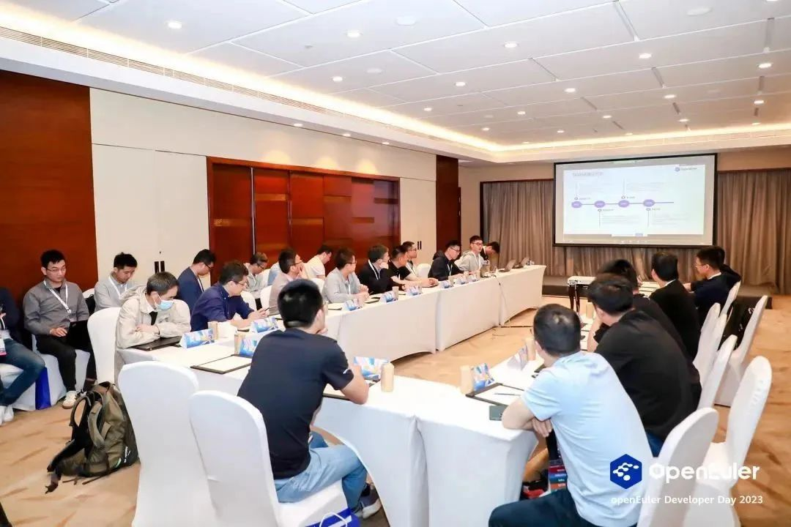

## 2023-2024年openEuler用户委员会第一次会议召开

4月20日，2023-2024年openEuler用户委员会第一次会议在上海浦东嘉里酒店召开。在本次会议上，就openEuler用户委员会2023年的工作规划展开探讨，2023年用户委员会将在用户案例发展、用户需求收集和反馈工作上持续发力。

## openEuler工业领域操作系统筹备委员会正式成立

2023年4月，经过openEuler委员会全体会议的批准，openEuler工业领域操作系统筹备委员会正式成立。

openEuler工业领域操作系统筹备委员会首批成员单位共12家，他们来自产业链上下游的核心厂商，包括：硬件、OSV和学术机构等。北京航空航天大学副校长吕卫锋担任筹备委员会顾问专家。筹备委员会将协同产业链的力量梳理和定义出工业领域操作系统的应用场景，基于统一的架构蓝图，以开源社区为协作平台，快速迭代演进版本。

工业领域操作系统筹备委员会将加速推进openEuler系在工业领域和机器人领域的推广，加速嵌入式能力和ROS能力的孵化。

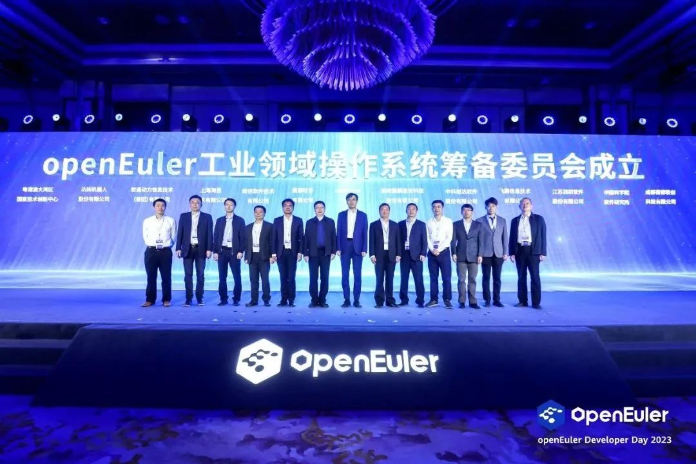

# 技术进展

## 统一构建 EulerMaker 面向白名单用户开放

EulerMaker
是一款软件包构建系统，完成源码到二进制软件包及系统镜像的构建，支持开发者通过搭积木方式，组装和定制出适合自己需求的场景化OS。主要提供增量/全量构建，软件包分层定制与镜像定制的能力。

如果您想申请使用EulerMaker平台，或者对EulerMaker有任何建议，欢迎通过邮件列表联系我们。

统一构建平台域名：

https://eulermaker.compass-ci.openeuler.openatom.cn/

邮件列表：

compass-ci@openeuler.org

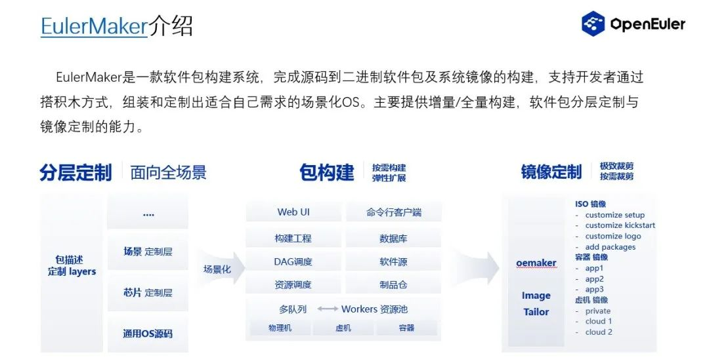

## 北京航空航天大学王雷教授团队贡献了新项目 Rust-Shyper

Rust-Shyper
是北京航空航天大学计算机学院王雷教授团队设计开发的虚拟机监控器，该系统基于
Rust 语言，实现了一个高可靠、嵌入式
Hypervisor，主要面向无人车、机器人等嵌入式场景。2023年2月15日
Rust-Shyper 正式在 openEuler 社区开源，并在4月21日的 openEuler Developer
Day 2023
嵌入式分论坛进行了展示：[基于Rust的嵌入式虚拟机监视器及热更新技术](https://mp.weixin.qq.com/s?__biz=MzI2NDE4OTE2Mg==&mid=2247503530&idx=3&sn=84681c8fef26a8e5089e9ad7525e40a3&chksm=eab2eb2fddc562392ae8d4a2edba18391d4f4da1a81359520b3c0cba9597b6e3376ec1cce648&token=143800814&lang=zh_CN&scene=21#wechat_redirect)。

项目地址：

https://gitee.com/openeuler/rust_shyper

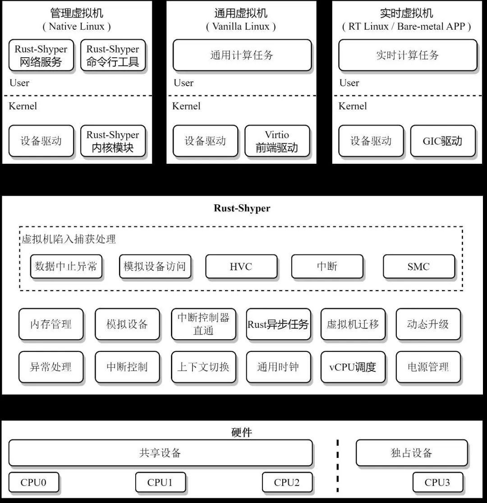

## Intel Arch SIG继续深入对Xeon平台的优化和使能工作

Intel Arch
SIG最近在openEuler社区逐步展开了对Intel现有Xeon平台的优化和未来几代Xeon平台特性的开发和集成工作，
包括对现有Intel Sapphire Rapids的调优和增强以及对Emerald Rapids, Grand
Ridge, Sierra Forest和Granite
Rapids等系列后续平台相关新特性的引入。本月开展的具体工作包含：在Intel
Field Scan（IFS）技术中引入multi-blob image的支持，对Intel
SGX技术的增强和修复，Running Average Power Limit（RAPL），Performance
Monitoring Unit（PMU）对Emerald Rapids平台的支持，以及针对Sapphire
Rapids和Alder Lake的fast rep string operation的性能优化，包含fast
zero-length MOVSB, fast short STOSB, fast short CMPSB,
SCASB等特性的支持。

同时，在openEuler社区和Intel DPDK团队的共同努力下，DPDK
23.03官方发布版本中正式引入了对openEuler 22.03 LTS
SP1的支持，并且已经将openEuler的支持列入到了DPDK
23.03的release官方文档中**\[DPDK Release 23.03
文档\]**。这意味着DPDK后续发布版本都会对openEuler相应版本提供官方的适配验证和支持。

DPDK Release 23.03 文档:

https://doc.dpdk.org/guides/rel_notes/release_23_03.html

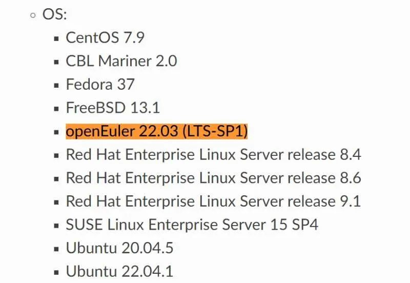

## openEuler RISC-V 成功适配 LicheePi 4A 开发板

近期，RISC-V SIG 在 LicheePi 4A
开发板上成功实现了欧拉操作系统的适配。这一成果再次展现了 openEuler
在推动 RISC-V 生态发展过程中所取得的新突破。

目前，最新版本的 openEuler RISC-V 23.03 V1 镜像已在 LicheePi 4A
开发板上可用。测试镜像基于最新的 23.03
创新版本，采用厂商已开源的固件与内核分支。经 RISC-V SIG
测试，基础系统、有线网络、WiFi
及其他几个部分外设目前已经可用，可以支持基础系统与 XFCE
桌面基本功能，运行整体较为流畅。

下载地址：

https://mirror.iscas.ac.cn/openeuler-sig-riscv/openEuler-RISC-V/preview/openEuler-23.03-V1-riscv64/lpi4a/

[原文阅读\>\>\>](https://mp.weixin.qq.com/s?__biz=MzI2NDE4OTE2Mg==&mid=2247503562&idx=1&sn=7a1c86a89f91545eb73e6a9cc2e38b1e&chksm=eab2eb4fddc56259233892f29ac46045f6b64994d0e6cc09c4c72057919ce78904e1b9ac25eb&token=143800814&lang=zh_CN&scene=21#wechat_redirect)

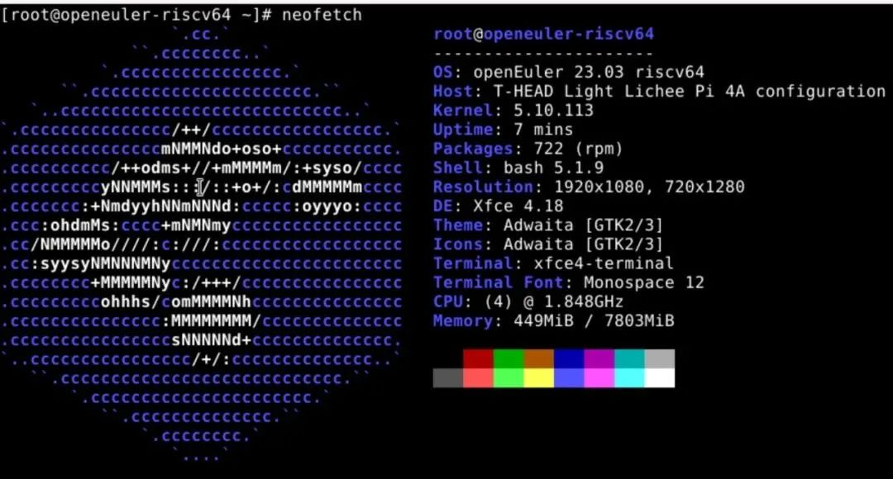

## 低时延务网格解决方案Kmesh发布

2023年4月，在openEuler孵化的新项目Kmesh正式发布，该项目为服务网格提供了一种低时延数据面解决方案，支持高性能的负载均衡、路由和灰度等能力。传统服务网格因为其sidecar代理架构，存在时延高和资源开销大的问题，如何提供一种低时延服务网格解决方案成为业界面临的挑战。kmesh项目基于可编程内核，在os中完成随流治理，做到网格内服务访问3跳变1跳，性能提升5倍。如果您对高性能服务网格感兴趣，Kmesh项目是您不容错过的选择。

项目地址：

https://gitee.com/openeuler/Kmesh

## openEuler NFS+协议发布

2023年4月，openEuler
NFS+协议全新发布，实现单客户端访问NAS存储可靠性提升3倍、性能提升6倍，助力NAS存储全面满足新型生产核心场景下苛刻要求。

[原文阅读
\>\>\> ](https://mp.weixin.qq.com/s?__biz=MzI2NDE4OTE2Mg==&mid=2247503346&idx=2&sn=7419ca045cd523bd6730ebe617fcc54d&chksm=eab2e877ddc561616d6ef124454753912db6ee7e3f5a5d8ca2a01ea87860ba24959bbb0e29de&token=143800814&lang=zh_CN&scene=21#wechat_redirect)

## 社区新项目热补丁服务 SysCare上线

近期，openEuler 社区推出一个创新项目：Linux 操作系统统一热补丁服务
SysCare。

SysCare 是一款操作系统运维工具，解决系统运行过程中的各类故障和风险，为
Linux 操作系统提供全方位保护。SysCare
提供一套简洁的命令，实现了内核热补丁 (kpatch) 和用户态热补丁 (upatch)
的制作及补丁管理能力。用户不需要关心技术细节和系统组件差异，也无需进行业务迁移，通过简单的命令就能在线修复系统漏洞。

[原文阅读
\>\>\> ](https://mp.weixin.qq.com/s?__biz=MzI2NDE4OTE2Mg==&mid=2247503429&idx=2&sn=bddedbe5a9ea8d4177eaa54b5e606e30&chksm=eab2ebc0ddc562d68eeec9d9ffb7aa55f92eb3bc1217e9f684c0752a9e4d442ac73819ba59ee&token=143800814&lang=zh_CN&scene=21#wechat_redirect)

## Embedded进一步完善基础设施和ROS2运行时的支持

2023年4月，openEuler
Embedded进一步完善基线管理相关基础设施、ROS2运行时的功能支持。目前支持ROS2的核心功能包（ros-core,
ros-base)，支持openCV和摄像头视觉，实现了单线激光雷达导航的POC，当前特点是轻量化、定制化，未来将与分级实时能力，多OS混合部署、分布式软总线等关键特性形成有机融合，并提供高效率、低门槛的开发工具，形成独特的核心竞争力。

地址：

https://openeuler.gitee.io/yocto-meta-openeuler/master/features/ros.html

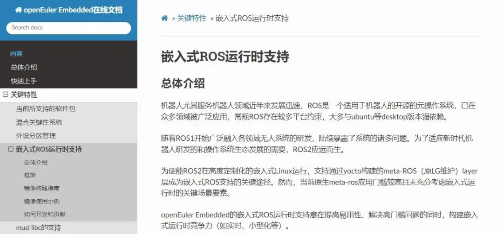

# 社区基础设施

## EUR支持一键贡献软件包到openEuler社区

EUR（openEuler User
Repo）已经支持通过openEuler社区的软件包贡献服务一键提交软件包到社区仓库（https://gitee.com/src-openeuler/），欢迎大家体验EUR和软件包贡献服务，任何疑问可以到论坛，quickissue，infra@openeuler.org反馈。

软件包贡献服务：

https://software-pkg.openeuler.org/zh/package

EUR（openEuler User Repo）：

https://eur.openeuler.openatom.cn/coprs/

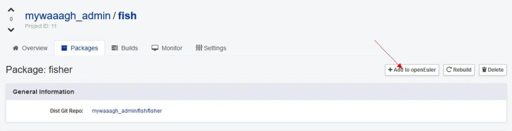

## 社区官网SIG主页支持自编辑

为降低openEuler官网开发门槛，及时更新SIG、活动等页面的动态信息，SIG-Infra与SIG-OpenDesign上线在线编辑服务平台------EasyEditor。目前，EasyEditor已支持相关用户在线实时编辑SIG页面，满足各SIG及时更新简介、会议等信息，新增自定义图文展示楼层等的便利工作流。后续，在线编辑服务将陆续增加支持更多内容与页面类型的自主编辑能力。操作流程详见：[可编辑平台支持SIG主页面编辑](https://mp.weixin.qq.com/s?__biz=MzI2NDE4OTE2Mg==&mid=2247503546&idx=1&sn=17ca93086776236f4af392a9645149b6&chksm=eab2eb3fddc562294eceb1261f2ad2cfa36af1e88a82ea2b868d77a5614783c3691ce0353f98&token=143800814&lang=zh_CN&scene=21#wechat_redirect)

## openEuler 23.03 WSL应用发布

openEuler 23.03版本的WSL（Windows Subsystem for Linux）
应用已经上线到应用商店了 欢迎大家使用体验
任何疑问可以到论坛，quickissue反馈，也欢迎到https://gitee.com/openeuler/wsl/  共同开发。

## openEuler Forum 支持邮件快捷回复

为方便开发者的使用，openEuler
Forum支持邮件快捷回复。即当帖子得到回复时，Forum服务中心会通过邮件告知发帖人，发帖人可通过邮件查看，并在该邮件上直接回复即可，不需要再登录论坛进行回复。

openEuler Forum：

https://forum.openeuler.org/

## 官网支持检索论坛数据

openEuler官网搜索功能优化，新增版本筛选，支持检索论坛数据。

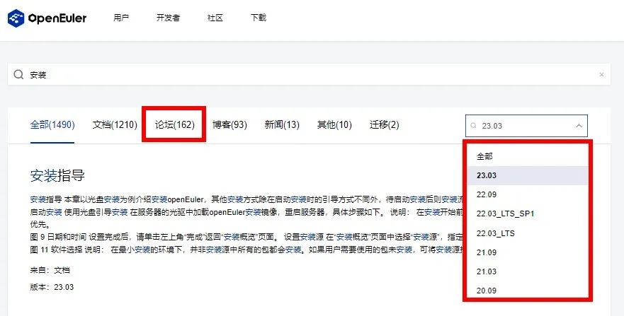

## 社区新增海外镜像站点

截止目前，社区全球镜像站点总共27个，本月新增2个，分别为：

（希腊）UOC：

https://ftp.cc.uoc.gr/mirrors/linux/openeuler/\
（瑞典）NORDLO:

 https://mirror.zetup.net/openeuler/

## 软硬件兼容性清单

当前，openEuler社区兼容性方案** 902 **个，北向 **518**，南向 **373**，OS **71**，4月新增北向 **79**，南向 **5**，OS **12**。

社区兼容性清单：

https://www.openeuler.org/zh/compatibility/

**安全公告**

2023年4月社区共发布安全公告 **70 **个，修复漏洞 **76 **个（其中
Critical **3**个，High **30**个，其它 **43**个），公告不受影响CVE **32**个。

-   **重点漏洞提醒**

如下漏洞评估影响较大，请重点关注：

**Hyperscan权限提升漏洞（CVE-2022-29486）**

**CVSS评分为9.8分**

公告链接：

https://www.openeuler.org/zh/security/cve/detail/?cveId=CVE-2022-29486&packageName=hyperscan

影响范围：

openEuler-20.03-LTS-SP1

openEuler-20.03-LTS-SP3

openEuler-22.03-LTS

openEuler-22.03-LTS-SP1

 

**protobuf-c无符号整数溢出漏洞（CVE-2022-48468）**

**CVSS评分为9.8分**

公告链接：

https://www.openeuler.org/zh/security/cve/detail/?cveId=CVE-2022-48468&packageName=protobuf-c

影响范围：

openEuler-20.03-LTS-SP1

openEuler-20.03-LTS-SP3

 

**HAProxy敏感信息泄露或拒绝服务漏洞（CVE-2023-25950）**

**CVSS评分为9.1分**

公告链接：

https://www.openeuler.org/zh/security/cve/detail/?cveId=CVE-2023-25950&packageName=haproxy

影响范围：

openEuler-22.03-LTS-SP1

-   **漏洞防护**

openEuler社区针对在维版本例行修复漏洞，发布安全补丁。建议用户关注openEuler官网安全公告，及时安装漏洞补丁进行防护。

openEuler安全公告：

https://www.openeuler.org/zh/security/security-bulletins/

# 人才培养

## 开源之夏2023学生报名启动

openEuler
社区作为开源之夏联合主办方，已连续三年参与组织活动，并作为开源社区发布项目任务。今年openEuler上线了**97**个项目任务。这些任务来自社区不同的SIG（Special
Interest
Group），涵盖内核、编辑器、嵌入式、多样性算力、基础设施等技术领域。

当前学生报名入口已开放，欢迎大家报名，参与各个SIG的项目开发中。在本活动中成功结项的学生将根据完成的项目难度获取丰厚奖金（基础：8000人民币；进阶：12000人民币）以及未来就业和深造机会，就等你啦！

报名要求：年满 18 周岁在校学生。

学生报名时间：4月29日 - 6月3日

openEuler项目任务：

https://summer-ospp.ac.cn/org/orgdetail/b9770f4d-f586-4373-bdac-ce6389065946?lang=zh

活动官网/报名链接：

https://summer-ospp.ac.cn/

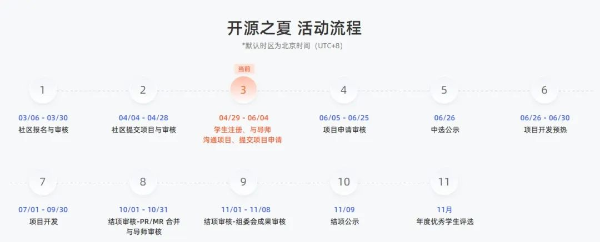

## openEuler-OECA工程师认证体系建设

为繁荣openEuler生态，加速培养业界所需的尖端人才，提供高质量的服务，openEuler开源社区人才与服务SIG组联合openEuler社区人才评定合作伙伴构建了人才评定体系。4月25日，统信软件考试系统已与openEuler证书管理系统完成IT系统对接并上线。

统信软件openEuler-OECA工程师认证考试平台报名链接：https://edu.uniontech.com/openEuler

在4月的运作中，新增openEuler-OECA认证工程师268人，同时，openEuler社区人才与服务SIG组完成openEuler专业认证（OECP-M）内容建设，并组织首批人才评定合作伙伴完成试运行。

## 感谢每一位朋友、开发者的支持

因为大家的辛勤贡献，openEuler的每一天都发生着好的事情。小编限于视野和能力，难免有所遗漏，在此表示歉意。同时，衷心感谢以下社区朋友、openEuler
SIG组成员以及开发者们对本月月报的贡献：

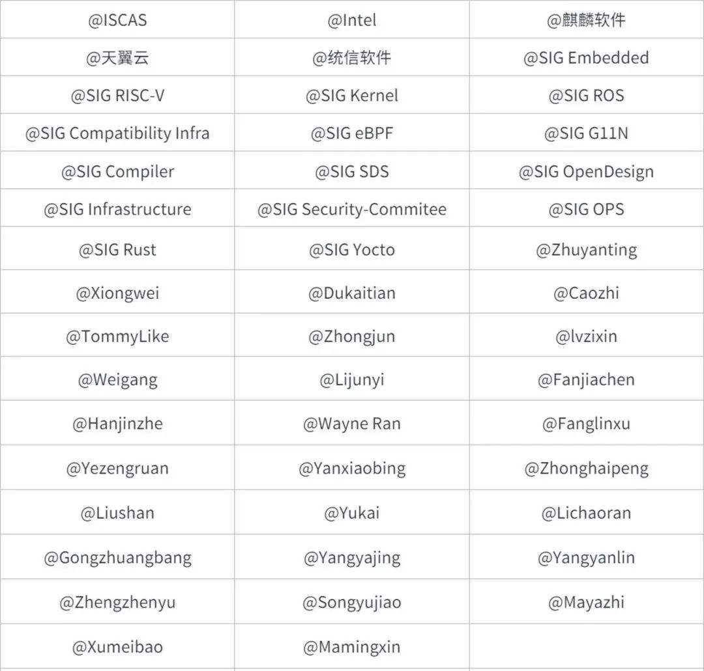

以上不分先后顺序

如果您希望在月报中增加您的工作内容，或对内容有任何改进建议，请联系wengqiaozhen@openeuler.sh。

**- END -**

编辑/排版：翁巧贞

封面设计：王一婷

审校：李永乐、梁冰、熊伟
