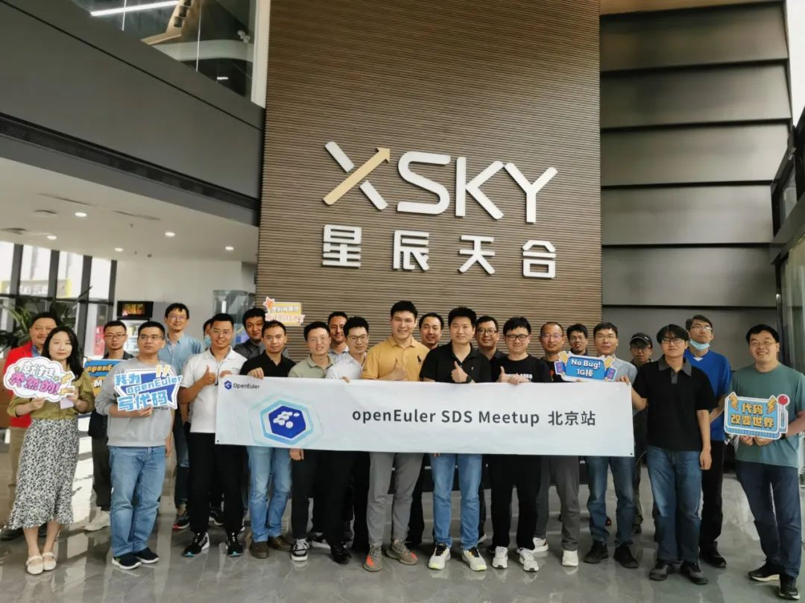
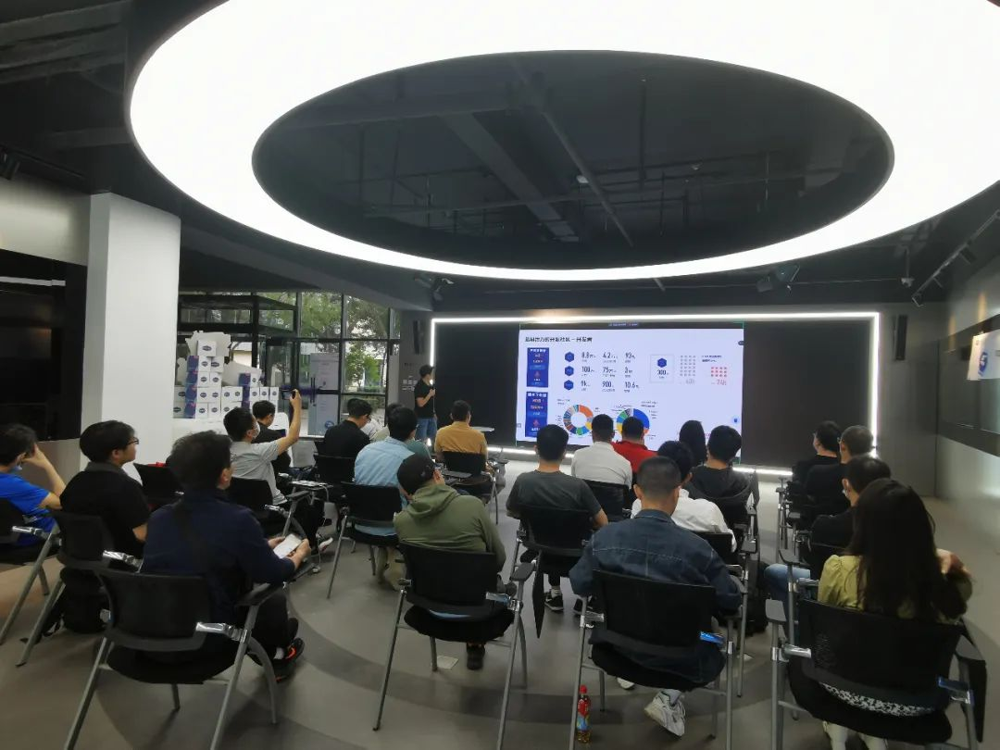
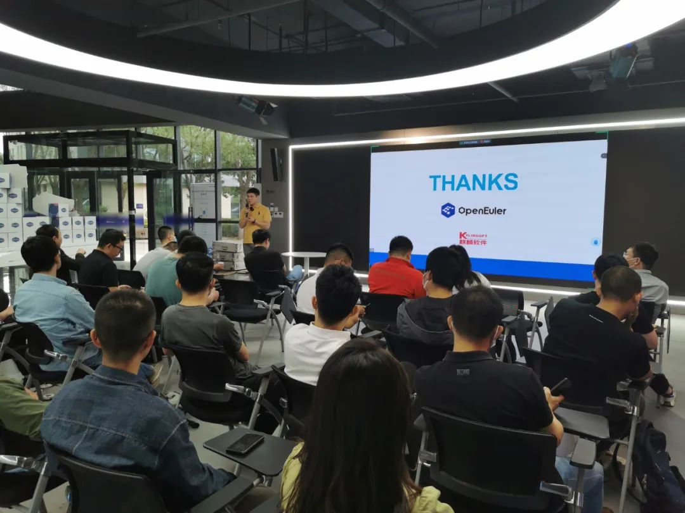
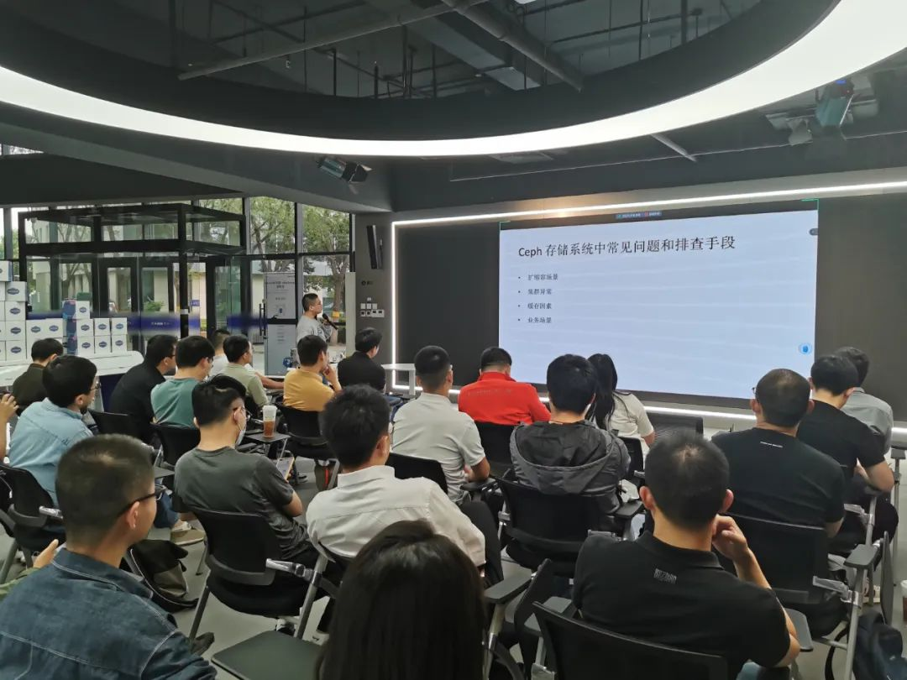
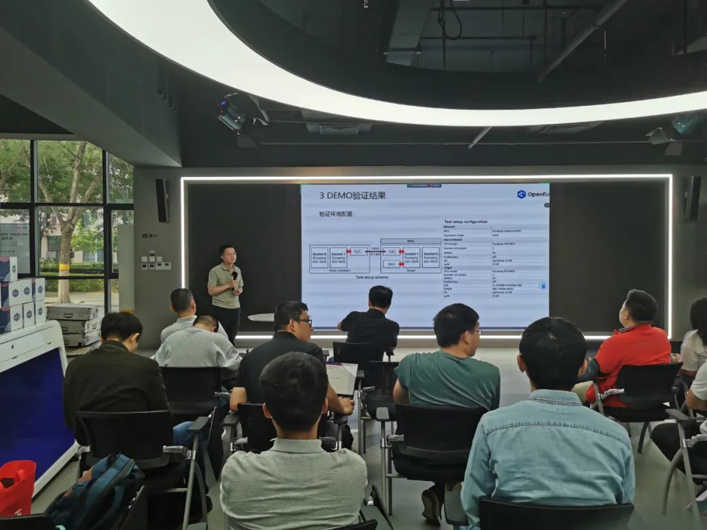
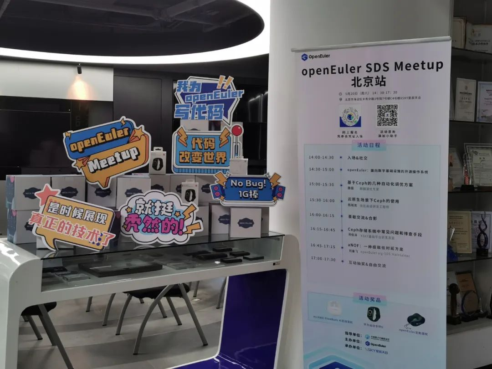

2023年5月20日，openEuler SDS
Meetup北京站圆满举行。openEuler希望搭建一个开放的平台，鼓励开发者们积极互动、交流经验、碰撞思想、激发创新，共同推动openEuler社区的发展。本场Meetup由**XSKY星辰天合&openEuler
sig-SDS** 联合发起，旨在为开发者和用户提供一个分享和交流分布式存储技术的平台。感谢**XSKY星辰天合**为本次活动提供场地支持\~

为了探讨分布式存储技术在openEuler领域的最新进展与创新应用，本次活动邀请openEuler
SDS领域的专家和开发者，分享他们在分布式存储技术实际应用中的经验和案例，展示openEuler
SDS的最新进展和讨论未来发展方向。

下面就让我们来回顾本次Meetup北京站的精彩内容（文末有彩蛋）！

# Part 1:  openEuler：面向数字基础设施的开源操作系统

openEuler社区资深专家张峰从多方位给大家介绍了openEuler的最新进展和社区亮点，给大家介绍openEuler是面向数字基础设施的开源操作系统，让现场开发者对openEuler有了进一步的认识。

# Part 2:  基于Ceph的几种自动化调优方案

麒麟调优专家滕磊给大家介绍一款基于自动调优工具的ceph优化方案，讲解A-tune自动化调优工具在ceph调优实践中的使用方法，还详细地介绍了A-tune中涉及到的智能算法的优劣对比，以及应用于ceph自动化调优时的性能对比。

# Part 3:云原生场景下Ceph的使用

 

统信高级研发工程师杨晓亮介绍了云原生环境下ceph集群多种部署方式、常见问题整理及解决、实际案例分析等。老师还结合实际云原生场景，为大家推荐合理、可靠的ceph部署组合。

# Part 4: Ceph存储系统中常见问题和排查手段

XSKY基础平台研发总监池信泽介绍了Ceph
常用的性能定位手段以及优化的主要举措，以及生产环境下常见的可能触发的问题以及修复方案；还给大家分享了硬件故障导致的存储故障的处理方法，干货满满。

 

# Part 5:aNOF：一种极致低时延方案

openEulersig-SDS
maintainer 刘秦飞给大家介绍了一种极致低时延方案。在OLTP领域，尤其在证券高频交易市场（HFT），对于数据写入有着极致低时延（ULL）的诉求。数据中心写入数据持久化要求在数据写入主节点后，并将副本写入远端节点（故障域）。因此，数据写入的整体时延取决于单点写入时延。在会议上，老师分享了一种极致低时延的跨网络写入方案aNOF。

精美礼品

# 彩蛋！！

*添加openEuler小助手，回复【北京Meetup】，即可领取本次北京Meetup部分讲师授权分享的演讲PPT。*

欢迎关注openEuler公众号，获取社区活动最新资讯。openEuler期待与你下次再见！
