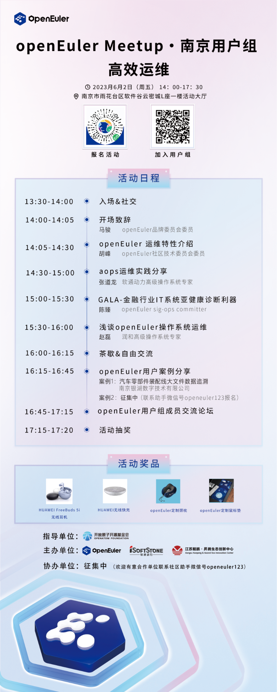

6月2日，openEuler南京用户组将召开运维专场活动，本次活动邀请了社区技术专家分享openEuler高效运维相关技术内容，以及邀请南京区域用户就openEuler的使用案例和经验进行分享和交流。

# openEuler南京用户组

去年11月，openEuler南京用户组成立，作为一个区域的用户交流与生态发展平台，用户组成员可以在这里交流openEuler技术、使用经验、案例，向社区反馈用户意见。[[点击查看用户组详情&加入用户组。]](http://mp.weixin.qq.com/s?__biz=MzI2NDE4OTE2Mg==&mid=2247501432&idx=1&sn=c597cdad68e93566dd5c439cba0168e0&chksm=eab2e3fdddc56aeb4d0c96655fe174854a5465e4c97992506a929c46323bf0afa08e0f0a1ac7&scene=21#wechat_redirect)

欢迎扫描下方二维码报名！

# 用户案例征集

**本次活动面向openEuler用户征集案例分享，欢迎正在使用openEuler社区版/商业发行版的用户报名在活动上分享实践经验，经社区评审后，案例将会在openEuler官网发布**！请添加openEuler小助手微信报名分享：

openEuler小助手
