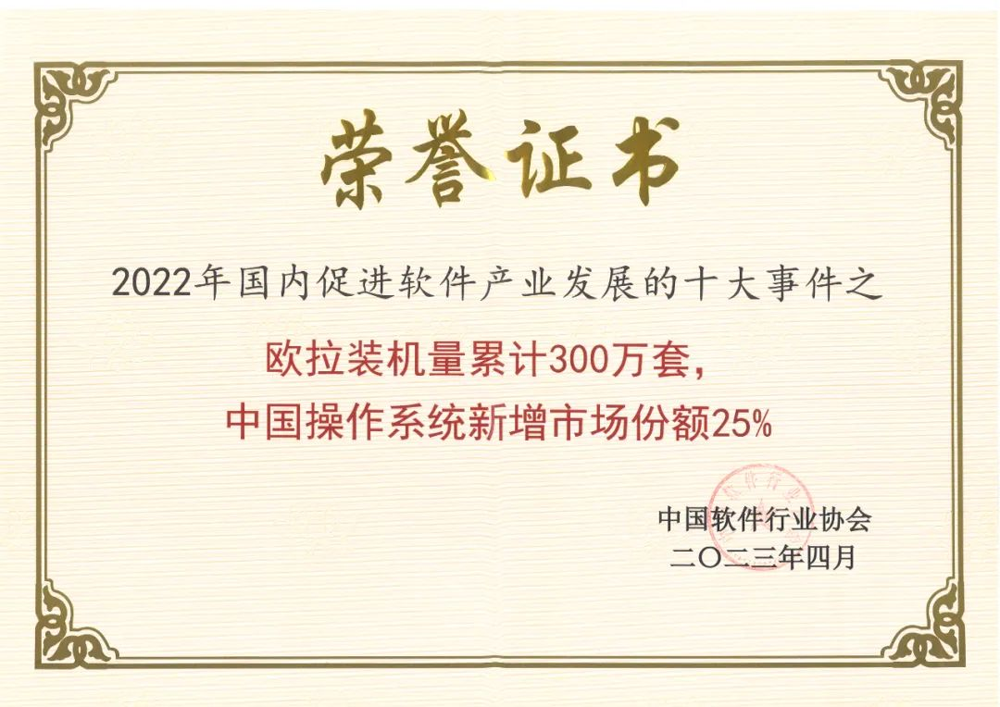
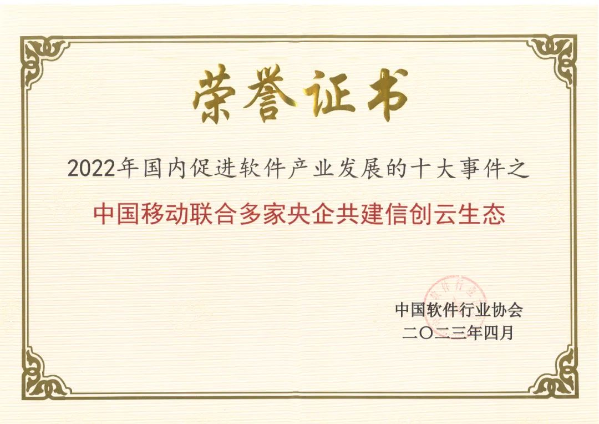
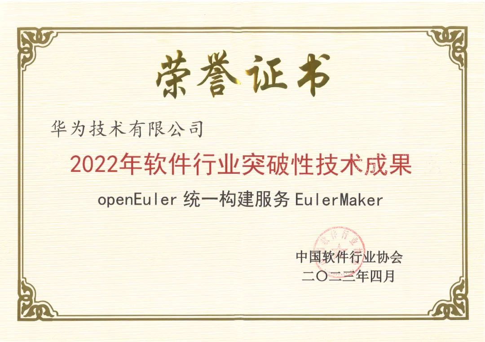
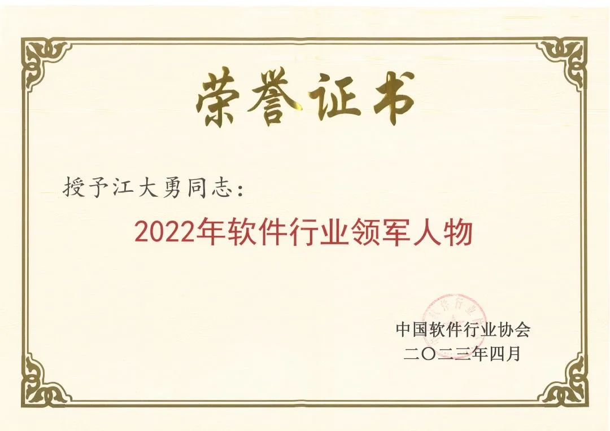
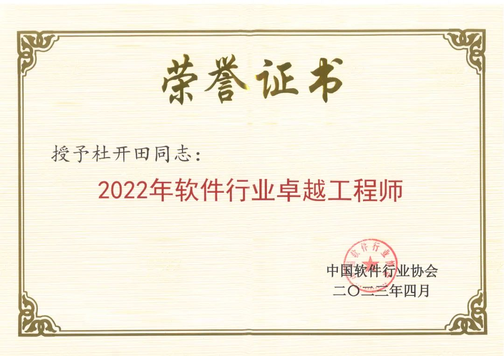
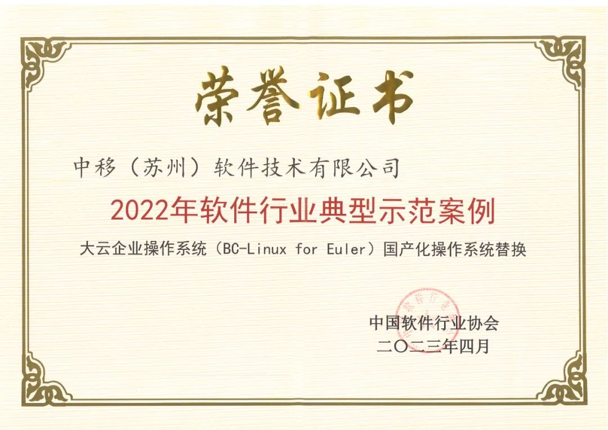
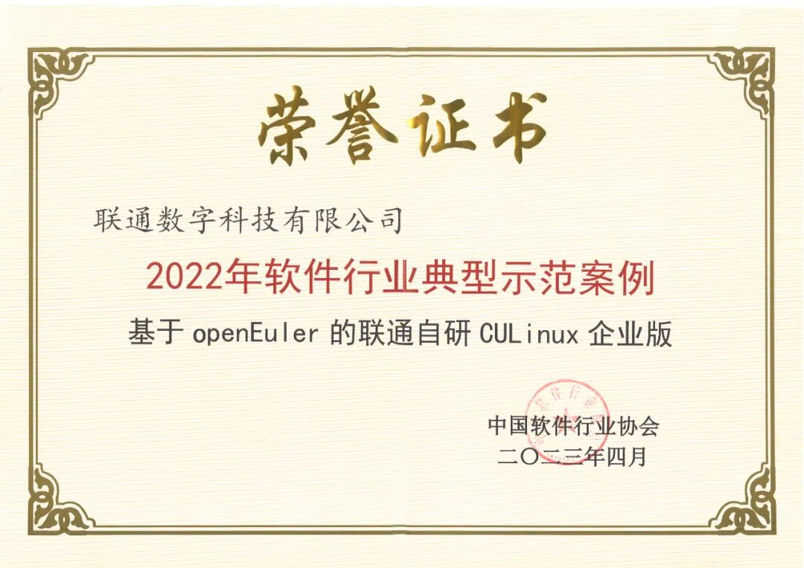
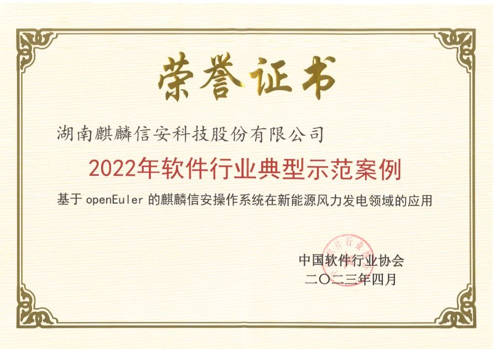
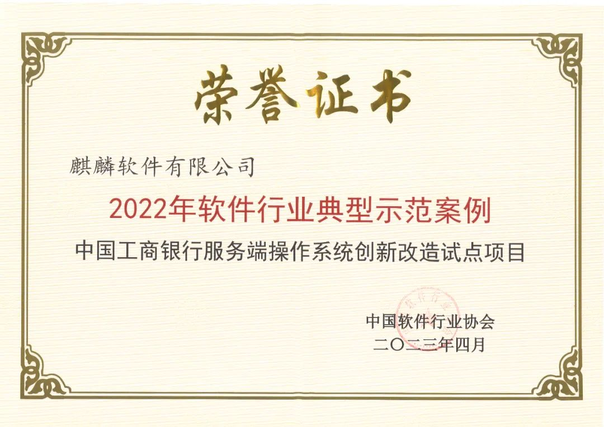

2023年4月18日，以"突破核心技术、赋能实体经济"为主题的第二届中国国际软件发展大会在北京国家会议中心隆重召开。期间，大会对2022年软件行业9类荣誉奖项进行了发布。**openEuler技术、社区代表、解决方案等获中国软协产业协会多个荣誉奖项。**

此次获奖是对 openEuler
2022年社区成果的一次总结，一次肯定：技术上面向全场景，持续进行场景创新，生态上凝聚更多伙伴，深化软硬适配，商业上使能客户伙伴，为企业提供可行、可靠、稳定的迁移技术路线。

openEuler委员会主席江大勇荣获"**2022年软件行业领军人物**"。

欧拉装机量累计300万套，中国操作系统新增市场份额25%、中国移动联合多家央企共建信创云生态入选"**2022年国内促进软件产业发展的十大事件**"。

openEuler统一构建服务EulerMaker入选"**2022年软件行业突破性技术成果**"。

openEuler兼容性SIG Maintainer杜开田荣获"**2022年软件行业卓越工程师**"。

openEuler多个商业发行版/企业自用版解决方案入选"**2022年软件行业典型示范案例**"。

# 2022年国内促进软件产业发展的十大事件

**欧拉装机量累计300万套，中国操作系统新增市场份额25%入选"2022年国内促进软件产业发展的十大事件"**

**中国移动联合多家央企共建信创云生态入选"2022年国内促进软件产业发展的十大事件"**

**2022年软件行业突破性技术成果**

# **2022年软件行业突破性技术成果**

**openEuler统一构建服务EulerMaker入选"2022年软件行业突破性技术成果"**

# 2022年软件行业领军人物

**openEuler委员会主席江大勇荣获"2022年软件行业领军人物"**

# 2022年软件行业卓越工程师

**openEuler兼容性SIG Maintainer杜开田荣获"2022年软件行业卓越工程师"**

# 2022年软件行业典型示范案例

openEuler多个商业发行版解决方案入选2022年软件行业典型示范案例。包括：

