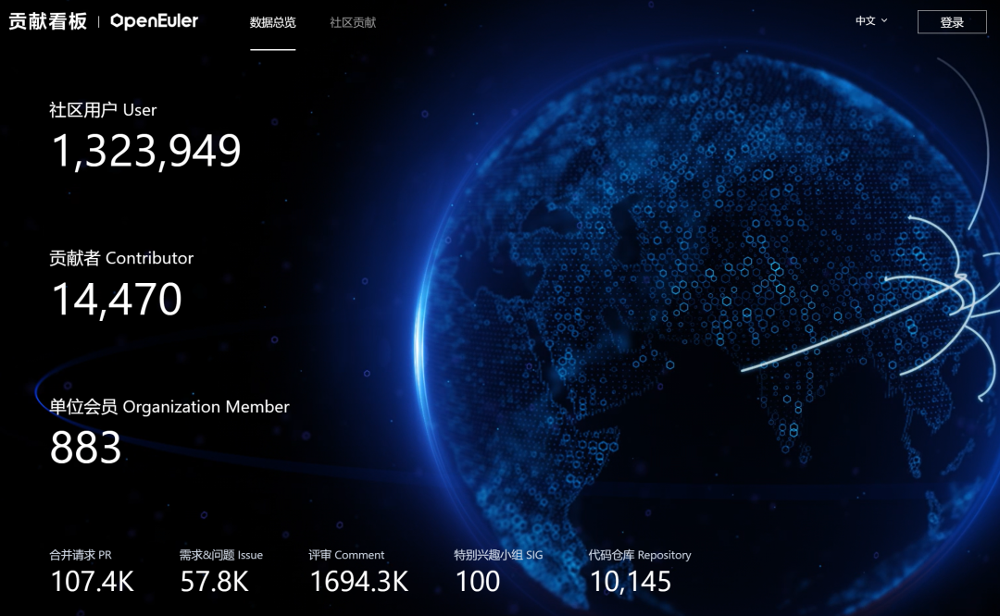
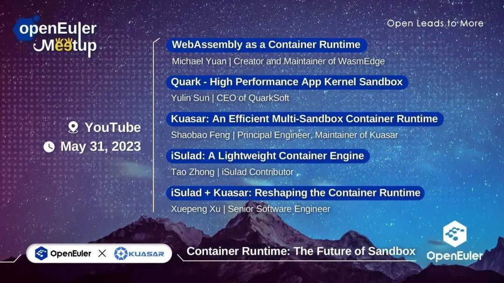
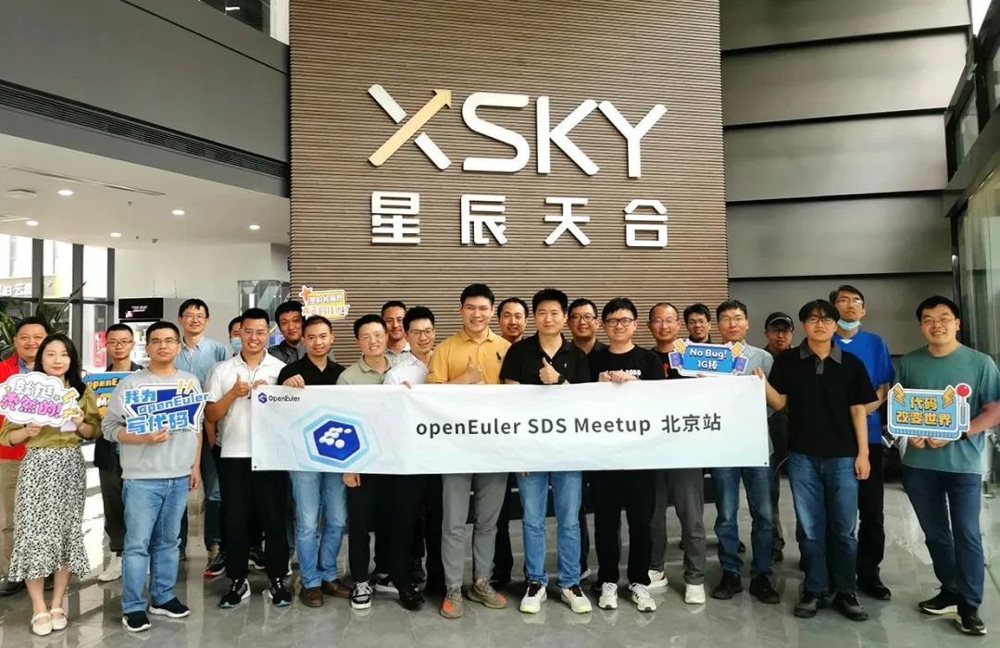
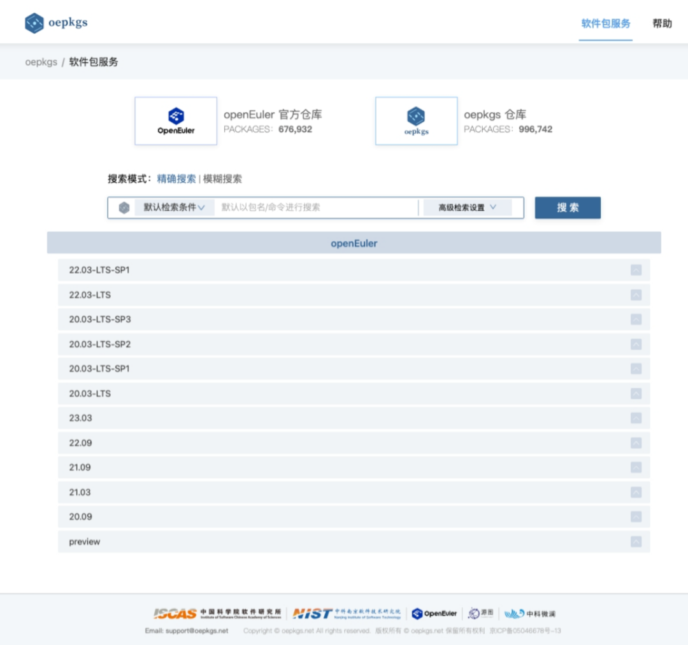
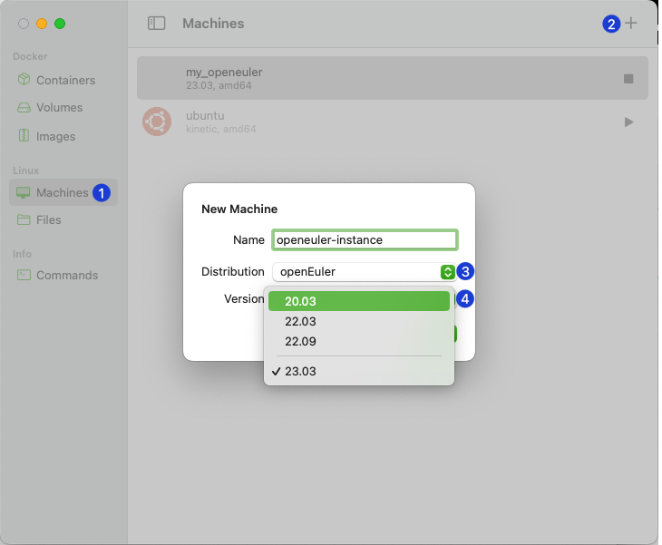
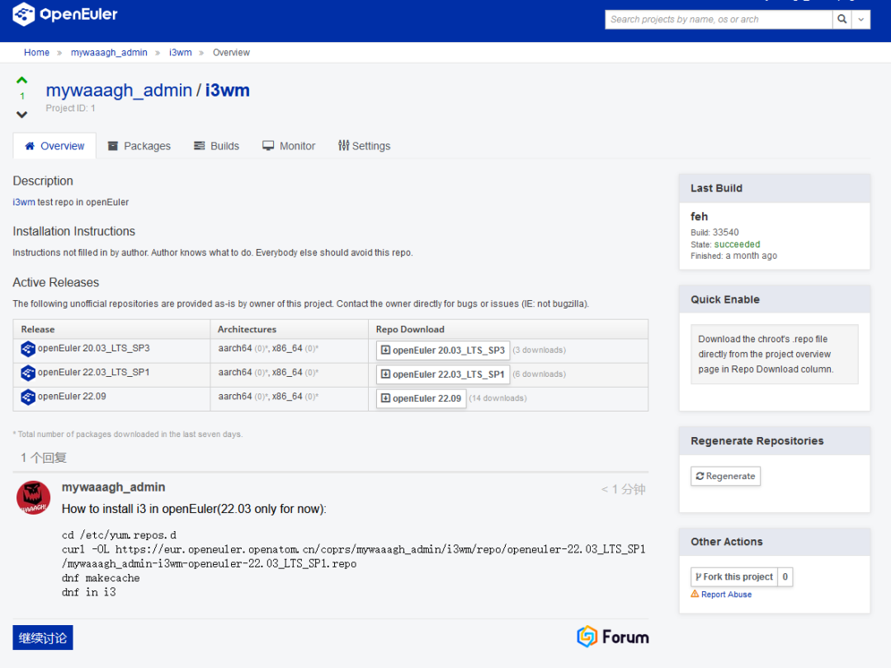
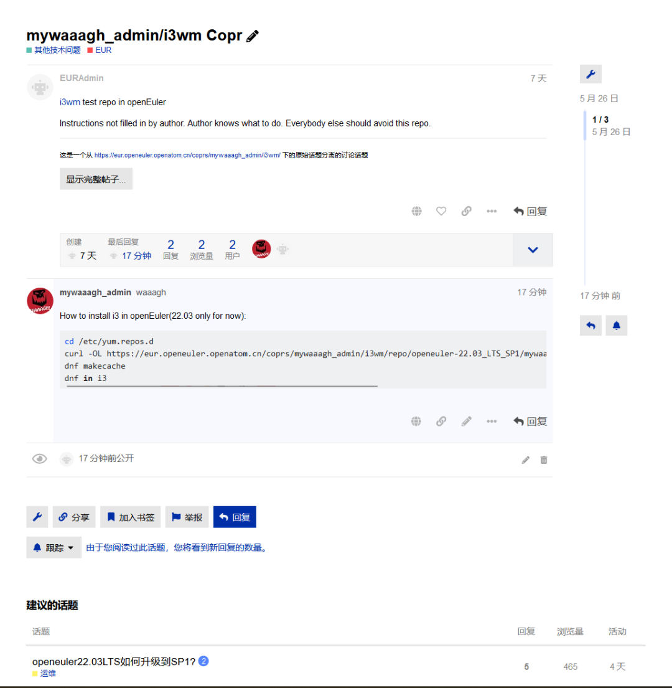
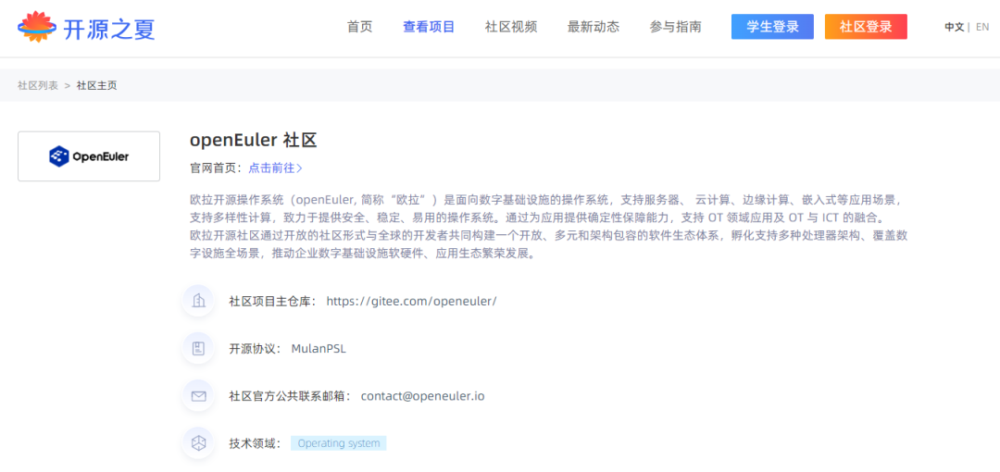
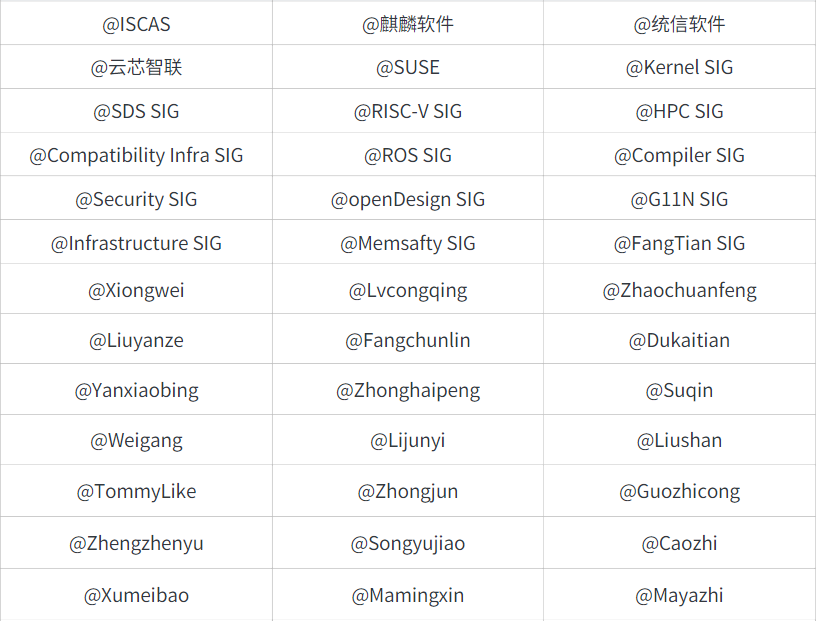

# 概述

5月，OEPKGS 开放软件包服务上线；3SNIC云芯智联网卡、RAID卡和HBA卡驱动在
openEuler 开源，进一步丰富 openEuler 的软硬件生态。

SIG组的工作也有许多亮眼的进展。基于LLVM技术栈构建 openEuler
软件包已进入开发阶段；ROS SIG计划在 openEuler
版本中引入ROS2-humble，共涉及450+个软件包；HPC
SIG在外部开源使能和工具建设颇具成效。基础设施中，在线编辑服务平台EasyEditor已投入使用，SIG
Maintainer能够实时更新官网SIG页面；社区用户仓服务EUR支持论坛交流，对开发者来说，沟通上更加方便。

经技术委员会商议，openEuler 新增两个SIG组并投入运作：聚焦视窗引擎技术的
FangTian SIG 以及 内存安全的 Memsafety SIG 。

openEuler
荣获中国软协产业协会的多个奖项，这是社区伙伴和用户的认可，也是社区上万名开发者的持续贡献的结果。

阅读本报告需要15分钟，欢迎细品。

# 社区活跃度

2023年5月，openEuler社区用户**超过130万**。**超过1.4万名**开发者在社区持续贡献，累计产生**103.5K**个PR、**56.1K**条Issue。截至目前，累计加入openEuler社区的单位成员**883**家，5月新增**45**家。

社区贡献看板（截至2023/5/31）

# 社区事件

## openEuler 荣获中国软协产业协会多个奖项

近期，以"突破核心技术、赋能实体经济"为主题的第二届中国国际软件发展大会在北京国家会议中心隆重召开。期间，大会对2022年软件行业9类荣誉奖项进行了发布。openEuler技术、社区代表、解决方案等获中国软协产业协会多个荣誉奖项。此次获奖是对
openEuler 2022年社区成果的一次总结和肯定。

详情请访问：[[https://mp.weixin.qq.com/s/jqzhs20TzBj6-5VQOgOCIA]{.underline}](https://mp.weixin.qq.com/s?__biz=MzI2NDE4OTE2Mg==&mid=2247504397&idx=1&sn=c3c5c55f46a1e37cbe5a09d4d317baf1&scene=21#wechat_redirect)

### openEuler RISC-V 发行版荣获

### 2022年中国开源创新大赛一等奖

5 月 15
日，在中央网信办信息化发展局的指导下，由中国互联网发展基金会、中国网络空间研究院、中国互联网投资基金联合主办的
"2022 年中国开源创新大赛" 正式发布了获奖名单。中国科学院软件研究所和
openEuler RISC-V SIG 联合参赛项目 "openEuler RISC-V 发行版" 获得一等奖。

[[原文阅读
\>\>\> ]](https://mp.weixin.qq.com/s?__biz=MzI2NDE4OTE2Mg==&mid=2247504303&idx=1&sn=0c135b646fa43dda018d7121f89a62ca&chksm=eab2f42addc57d3c65236b7ed4af943a8fef1fc7437003a6acacfa0b86265b80bdd945959024&token=1320089159&lang=zh_CN&scene=21#wechat_redirect)

## openEuler 携手 Kuasar 共探沙箱新纪元

5月底，由openEuler 与 Kuasar 联合发起的技术讨论会---openEuler Container
Runtime
Meetup在线上举行。活动聚焦容器运行时，携手Kuasar共探沙箱新纪元。本次活动邀请到WasmEdge创始人Michael
Yuan，QuarkSoft CEO Yulin Sun，以及openEuler
iSulad和Kuasar项目专家和开发者，探讨openEuler
iSulad和Kuasar在云原生领域最新进展与创新应用。

YouTube@openEuler：

https://www.youtube.com/@openeuler

Bilibili@openEuler：

https://b23.tv/NNQuCg7

## openEuler SDS Meetup 在北京举办

5月20日，openEuler SDS
Meetup在北京举办。本场Meetup由XSKY星辰天合&openEuler
SIG-SDS联合发起。现场吸引了来自19家企业伙伴30+位开发者参与。本次活动邀请SDS领域的专家和开发者，探讨分布式存储技术在openEuler领域的最新进展与创新应用。

openEuler
社区已开放全年活动路标，如果您有兴趣增加社区Meetup，请参考"申请攻略"申办活动。欢迎一起组织openEuler开发者活动，共同探讨前沿技术和开源发展趋势。

openEuler全年活动路标：

https://www.openeuler.org/zh/interaction/event-list/

活动征集/申请攻略：

https://www.openeuler.org/zh/interaction/event-list/collect/

常见问题总结：

https://gitee.com/openeuler/llvm-project/wikis

[[原文阅读
\>\>\> ]](https://mp.weixin.qq.com/s?__biz=MzI2NDE4OTE2Mg==&mid=2247504303&idx=3&sn=13064fccf731eadfb0b61f7d5d4bfa99&chksm=eab2f42addc57d3ce2f28a0c50ead68de76185643bfb97a5d43a7dcc66d9d257fe0acb6af4e8&token=1320089159&lang=zh_CN&scene=21#wechat_redirect)

## openEuler Mini Courses 已更新第5期

近期， openEuler G11N SIG和Kernel
SIG联合推出了一系列迷你课程，每期不超过10分钟，以简单易懂的语言分享操作系统领域的技术知识。课程已在openEulerB站专区呈现，已更新了5期。

[[原文阅读
\>\>\> ]](https://mp.weixin.qq.com/s?__biz=MzI2NDE4OTE2Mg==&mid=2247503595&idx=2&sn=9f7e2f199c88993556dcfeeb1406a035&chksm=eab2eb6eddc56278e80b2c8a68c7e4ff4a37686c24e8dae5420d5c5c9346eb9c77122ecd3875&token=1320089159&lang=zh_CN&scene=21#wechat_redirect)

# 社区治理

## openEuler 技术委员会会议召开

openEuler技术委员会委员通过每月双周例会，及时审视社区各项工作。在5月openEuler技术委员会会议上，经全体委员商议，同意
FangTian SIG、Memsafety SIG 的成立申请。技术委员会同意撤销 n5p SIG 。

## FangTian SIG 正式成立

经openEuler社区技术委员会讨论决定，[[openEuler 社区正式成立 FangTian
SIG]](https://mp.weixin.qq.com/s?__biz=MzI2NDE4OTE2Mg==&mid=2247504303&idx=2&sn=c3708d31fca4f1c734af4a9a0abbd912&chksm=eab2f42addc57d3c368a0c78e8e16979001780d096f1edf557abd98251a257eaab2b8b5b2d8a&token=1320089159&lang=zh_CN&scene=21#wechat_redirect)。FangTian
SIG由中科院软件所、华为、麒麟软件等公司共同发起成立。SIG将聚焦FangTian视窗引擎，包含显示服务，窗口管理，图形绘制、合成、送显等模块，同时推出新一代的FT显示协议，探索解决Linux桌面环境体验不佳的问题。

FangTian SIG：

hhttps://www.openeuler.org/zh/sig/sig-detail/?name=sig-FangTian

## 内存安全SIG 正式筹备成立

2023年5月，经openEuler社区技术委员会决议批准，由统信软件、华为发起的内存安全SIG（Memsafety
SIG）开始筹备成立。

该SIG组以发现并解决操作系统关键组件内存安全问题为宗旨，推动openEuler社区在内存安全领域的关注度，借助openEuler社区广大开发爱好者的力量，共同来解决和完善操作系统内存安全问题。

SIG组筹备成立的同时，完成了utsudo和utshell两个开源项目创建申请，utsudo和utshell由统信软件开发并开源贡献到
openEuler
社区，utsudo和utshell是使用rust语言对操作系统中sudo和bash进行了重新设计开发。

未来，SIG组还将积极与国外相关社区进行互动，吸收国外社区在内存安全问题上的解决经验，同时，推广openEuler社区在内存安全领域所取得的成果。

# 技术进展

## OEPKGS开放软件包服务正式上线

OEPKGS 开放软件包服务（Open External Packages Service）正式上线，为
openEuler 生态提供超过三万个兼容性软件包支持，可为参与 CentOS、Fedora
等系统向 openEuler 迁移的开发者、OSV 等用户提供一站式兼容性软件包支持。

此外，OEPKGS 还整合了中国科学院软件研究所 "源图"
开源软件供应链基础设施平台多项最新技术成果，面向 openEuler 生态推出了
RPM 软件包检索、元数据分析、SBOM
和供应链分析、安全性及合规性风险分析等多项服务内容。

相关链接：

https://search.oepkgs.net

## 3SNIC云芯智联网卡、

## RAID卡和HBA卡驱动在openEuler开源

2023年5月,
云芯智联智能网卡、RAID卡和HBA卡驱动在openEuler驱动源码仓和制品仓成功建仓，准备合入release发布版本。

SSSNIC 3S9xx系列上行支持PCIe 3.0 x8/PCIe 4.0
x16，下行端口速率支持100G/40G/25G/10G。支持IPv4、IPv6、VXLAN、TCP/UDP校验和卸载、TSO/LRO/RSS卸载、DPDK、SR-IOV等功能。

SSSRAID/SSSHBA 3S5xx系列上行支持PCIe 4.0 x8/x16, 下行支持6G SATA和12G
SAS。SSSHBA支持RAID 0/1/10/直通，SSSRAID支持RAID 0/1/10/5/6/50/60/直通。

## openEuler 成功适配 LeapFive InFive Poros 开发板

近日，[[openEuler RISC-V 23.03 创新版本在跃昉科技的 Poros
开发板上成功运行]](https://mp.weixin.qq.com/s?__biz=MzI2NDE4OTE2Mg==&mid=2247504133&idx=3&sn=977b007ffaa8db4fff601d7a00bb8bfd&chksm=eab2f480ddc57d96d9c66eada971fab4129f0de59dfc9588926307f55672aaea8ed239d1256a&token=1320089159&lang=zh_CN&scene=21#wechat_redirect)，XFCE
桌面启动正常，文件系统、终端模拟器和输入法等相关 GUI
应用也运行流畅，Chromium 浏览器和 LibreOffice
等应用也得到了支持。目前，图形界面依靠 LLVMpipe 渲染，后续跃昉科技将加强
GPU 的驱动优化。

此次适配不仅为 openEuler 提供了更多的硬件生态，同时也体现了 Poros
开发板对国内主流操作系统生态的支持，为行业应用发展注入了新的活力。

镜像链接：

https://mirror.iscas.ac.cn/openeuler-sig-riscv/openEuler-RISC-V/unstable/openEuler-23.03-V1-riscv64/poros/

## Musl libc 库成功适配到 openEuler Embedded

[[RISC-V SIG 在欧拉嵌入式操作系统上成功实现了 musl libc
的适配，完成了使用 musl libc 库替换 glibc
库构建镜像的工作。]](https://mp.weixin.qq.com/s?__biz=MzI2NDE4OTE2Mg==&mid=2247504321&idx=1&sn=945476290f84d7380e8d5b055e4ab782&chksm=eab2f444ddc57d527ba4bdf6da6c344958aa4ae5d289a4830c8b41fcb2bd96e1a7cf88abc166&token=1320089159&lang=zh_CN&scene=21#wechat_redirect)目前，以
musl libc 为基础库编译的镜像已在 Raspberry Pi4
开发板上可用，这一成果推动了 openEuler Embedded 的多态发展。

编译镜像步骤说明：

https://openeuler.gitee.io/yocto-meta-openeuler/master/features/muslc.html

## 基于LLVM技术栈构建openEuler软件包已进入开发阶段

由Compiler SIG和RISCV
SIG联合发起的LLVM平行宇宙计划已进入社区开发阶段，该计划致力于使用Clang/LLVM技术栈构建openEuler，目前华为编译器团队、中科院软件所、SUSE及统信已加入该计划，oEEP(openEuler
Evolution Proposal)已创建。

整个计划采用社区协作式运作，工程建设分为4个阶段，分别是最小OS、标准OS、全量OS和全量OS+EPOL。当前，在解决构建问题的同时，社区计划基于【阶段1】进行性能测试分析，包括Clang+LTO，PGO、BOLT等优化能力分析。参与指导与任务进展、常见问题等已公开，希望有兴趣的开发者加入我们，一起学习一起进步，共建openEuler社区。

oEEP(openEuler Evolution Proposal)：

https://gitee.com/openeuler/TC/tree/master/oEEP/oEEP-0003
LLVM平行宇宙计划\--基于LLVM技术栈构建oE软件包.md

参与指导与任务进展：

https://docs.qq.com/s/nQLURYS54g3KVxfWur0NrG/folder/LnrorGmLCwrA

常见问题总结：

https://gitee.com/openeuler/llvm-project/wikis

## ROS SIG 将在 openEuler22.03-sp2 中引入 ROS2-humble

随着 ROS
应用的领域越来越广，为满足机器人开发过程中日益增长的需求，从而诞生了
ROS2。ROS2 的开发继承了 ROS
的主要理念，同时加入实现商用化和实用化所需要的理念:包括嵌入式设备在内的多平台化、实时通信控制、应对多个机器人等。

Humble 是 ROS2 长期支持（LTS）版本，具备了丰富和成熟生态。

ROS2-humble 默认使用
Fast DDS (Data Distribution Service)，具有实时行为、DDS
安全、共享内存传输、同步和异步发布模式等优点，为机器人软件开发和应用提供更完备的解决方案。

ROS SIG 计划于 openEuler sp2 版本中引入
ROS2-humble，共涉及450+个软件包。移植成功后，用户将可以通过 openEuler
使用 ROS2，并基于 ROS2
开发机器人算法和软件，支持不限于机器人建图、定位、导航等算法包。欢迎感兴趣的朋友们加入
ROS SIG，持续关注项目工作，共同建设 openEuler 的 ROS 社区。

ROS SIG项目地址：

https://gitee.com/openeuler/community/tree/master/sig/sig-ROS

## HPC SIG 工作进展

openEuler HPC
SIG致力于使能头部开源社区，打造HPC多样性算力部署调优统一平台，固化优化成果，同时孵化HPC原创项目，服务于超算中心，提升集群交付效率。近期，HPC
SIG在开源使能、工具建设等各方面均有所成效：

-   **外部开源使能：**

SIG组成员于安坤（Gitee ID:
FlashSlothYu）在优化OpenFoam的过程中，发现当前版本OpenFoam数值计算求解代码的问题，基于场景新增了FPCG求解器，对symGS,GAMG路径进行了重新梳理重构，性能端到端提升了10%以上。期间，于安坤主动联系社区技术委员会相关专家，进行多轮沟通澄清，阐述本次修改的价值，获得委员会认可，最终合入社区，实现在OpenFoam的patch突破。

相关链接：

https://develop.openfoam.com/Development/openfoam/-/merge_requests/601/diffs

-   **HPCRunner部署工具建设：**

目前已支持100+依赖，60+应用一键部署安装，针对6款HPC应用发布了相应的开源实习计划。

-   **调度器许可证管理工具建设：**

新建portal-application-license-monitor仓，该工具提供了Donau
Portal对接FlexNet许可证管理服务的最佳实践脚本，方便用户参考和集成。后续根据多瑙管理平台客户需求和业务场景拓展，将新增对接第三方其他类型许可证管理服务。

-   **动态二进制修改工具建设：**

新建mambo项目仓库，mambo是一种用于ARM（支持AArch32和AArch64）和RISC-V（RV64GC）的低开销动态二进制检测和修改工具。基于鲲鹏架构做适配后，通过它可以对运行在Kunpeng服务器上的应用动态插入收集器，后续也将由鲲鹏Devkit进行维护。

HPC SIG项目地址：

https://gitee.com/openeuler/community/tree/master/sig/sig-HPC

**sysMaster：全新1号进程实现方案发布**

在 Linux 操作系统中，1 号进程是 init
进程，它是所有其他进程的祖先进程。在现代 Linux 系统中，init 进程已经被
systemd 进程所取代，但是 1
号进程的概念仍然存在。它的最小功能包括系统启动和回收僵尸进程。

「sysMaster」 是 openEuler 针对不同场景下 Linux
系统初始化和服务管理面临的问题和特点进行总结和思考后的一种改进和探索，旨在改进传统的
init
守护进程，提供统一的系统初始化和服务管理解决方案，支持嵌入式、服务器和云场景下的进程、容器和虚拟机管理。使用
rust 语言编码,引入故障监测和秒级自愈等多种技术手段,从而提升 OS
的稳定性和业务的可用度。

[原文阅读
\>\>\> ](https://mp.weixin.qq.com/s?__biz=MzI2NDE4OTE2Mg==&mid=2247504110&idx=1&sn=1835b6ade231640eaf439c2f62d48ff4&chksm=eab2f56bddc57c7dd6c53a22ce5c7a8d64669ff75843d7468da54ad725d1b5ec6f1808261151&token=1320089159&lang=zh_CN&scene=21#wechat_redirect)

# 社区基础设施

## 社区官网SIG主页支持实时编辑

在线编辑服务平台 EasyEditor
已投入官网使用，支持SIG组成员在线实时编辑SIG页面，自己增加面向贡献者、开发者等访问者对SIG业务范围、规划、会议等信息的编辑。操作流程详见：[[可编辑平台支持SIG主页面编辑]{.underline}](https://mp.weixin.qq.com/s?__biz=MzI2NDE4OTE2Mg==&mid=2247503546&idx=1&sn=17ca93086776236f4af392a9645149b6&chksm=eab2eb3fddc562294eceb1261f2ad2cfa36af1e88a82ea2b868d77a5614783c3691ce0353f98&token=143800814&lang=zh_CN&scene=21#wechat_redirect)

后续在线编辑服务将陆续增加支持更多内容与页面类型的自主编辑能力，敬请期待！

EasyEditor地址：

https://easyeditor.openeuler.org/

## OrbStack支持openEuler发行版

Mac平台的轻量级虚拟机平台OrbStack支持openEuler发行版，开发者可通过https://orbstack.dev/download下载后，点击创建虚拟机，选择openEuler版本，创建成功后即可在命令行中使用openEuler，步骤见下图。

地址：https://orbstack.dev/  

## EUR支持论坛互动

EUR (openEuler User Repo)
平台目前支持通过社区论坛进行评论。在EUR项目首页，开发者和项目owner可以看到评论信息，并通过社区论坛交流。

EUR(openEuler User Repo)：

https://eur.openeuler.openatom.cn/

## openEuler社区账号系统支持手机号注册

为方便开发者使用，社区账号服务系统现支持邮箱、手机号两种注册方式。

## 社区新增3个镜像站点

当前，社区全球镜像站点建设累计总共30个。本月新增3个，分别为：

美国 OCF@Berkeley：

https://mirrors.ocf.berkeley.edu/openeuler/\
加拿大 MUUG：

https://muug.ca/mirror/openeuler/

中国 网易：

https://mirrors.163.com/openeuler/

## 软硬件兼容性清单

当前，openEuler社区兼容性方案 **964** 个，北向**571**，南向**374**，OS** 79**，5月新增
北向**53**，南向 **1**，OS** 8 。**

社区兼容性清单：

https://www.openeuler.org/zh/compatibility/

**安全公告**

2023年5月，社区共发布安全公告 **31**个，修复漏洞 **52**个（其中
Critical **2**个，High **20**个，其它 **30**个），公告不受影响漏洞 **43**个。

-   **重点漏洞提醒**

如下漏洞评估影响较大，请重点关注：

**python-django绕过验证漏洞（CVE-2023-31047）**

**CVSS评分为9.8分**

公告链接：

https://www.openeuler.org/zh/security/cve/detail/?cveId=CVE-2023-31047&packageName=python-django

影响范围：

openEuler-20.03-LTS-SP1

openEuler-20.03-LTS-SP3

openEuler-22.03-LTS

openEuler-22.03-LTS-SP1

 

**mysql缓冲区读溢出漏洞（CVE-2022-37434）**

**CVSS评分为9.8分**

公告链接：

https://www.openeuler.org/zh/security/cve/detail/?cveId=CVE-2022-37434&packageName=mysql

影响范围：

openEuler-20.03-LTS-SP1

openEuler-20.03-LTS-SP3

openEuler-22.03-LTS

openEuler-22.03-LTS-SP1

-   **漏洞防护**

openEuler社区针对在维版本例行修复漏洞，发布安全补丁。建议用户关注openEuler官网安全公告，及时安装漏洞补丁进行防护。

openEuler安全公告：

https://www.openeuler.org/zh/security/security-bulletins/

# 人才培养

## 开源之夏2023，仅剩21个openEuler项目任务，先到先得

openEuler
社区作为开源之夏联合主办方，已连续三年参与组织活动，并作为开源社区发布项目任务。在openEuler发布的项目任务中，已有73个项目收到学生投递项目申请书，还有21个项目待你Pick！

在本活动中成功结项的学生将根据完成的项目难度获取丰厚奖金（基础：8000人民币；进阶：12000人民币）以及未来就业和深造机会，就等你啦！

报名要求：年满 18 周岁在校学生

报名时间：4月29日 - 6月3日

活动官网/报名链接：

https://summer-ospp.ac.cn/

[[点此查看openEuler项目任务
\>\>\> ]](https://mp.weixin.qq.com/mp/appmsgalbum?__biz=MzI2NDE4OTE2Mg==&action=getalbum&album_id=2950237052057403398#wechat_redirect)

## 2023鲲鹏应用创新大赛openEuler赛道全面开启

鲲鹏应用创新大赛-openEuler赛道是openEuler社区与各区域鲲鹏生态创新中心一起为开发者准备的赛事。大赛氛围区域赛和决赛两个大阶段。开发者可自行组队，完成任务参与奖项评选，角逐区域赛与决赛的前三等奖，最高奖金10万元！感兴趣的朋友可不要错过。

[[原文阅读
\>\>\> ]](https://mp.weixin.qq.com/s?__biz=MzI2NDE4OTE2Mg==&mid=2247504270&idx=1&sn=e631686ee213d8f2560fdd211b8f53ce&chksm=eab2f40bddc57d1de90f0d3ed816f5f0cd9184ea12f0ba7c47e218169476eaadb28cfff13b95&token=1320089159&lang=zh_CN&scene=21#wechat_redirect)

## openEuler社区OECP课程&题库启动开发

社区人才与服务SIG组和openEuler人才评定合作伙伴共同启动openEuler社区OECP课程&题库开发，预计7月份上线。

本月，openEuler认证工程师新增70+人，目前已累积发展800+人。

# 感谢每一位朋友、开发者的支持

因为大家的辛勤贡献，openEuler的每一天都发生着好的事情。小编限于视野和能力，难免有所遗漏，在此表示歉意。同时，衷心感谢以下社区朋友、开发者们以及openEuler
SIG组成员对本月月报的贡献：

\* 以上不分先后顺序

如果您希望在月报中增加您的工作内容，或对内容有任何改进建议，请联系wengqiaozhen@openeuler.sh。
