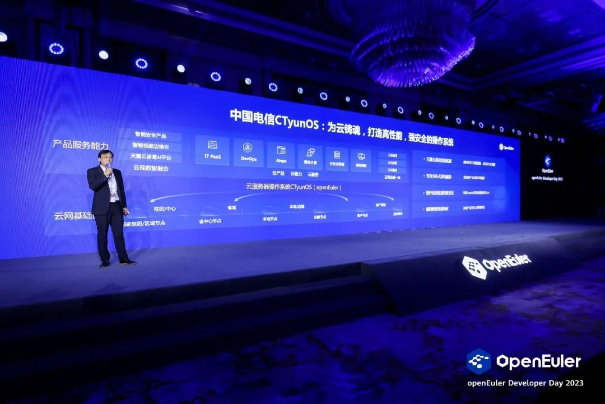

openEuler Developer Day 2023（简称 ODD 2023）开发者大会已于 4 月 21
号正式在上海落下帷幕，本次大会由开放原子开源基金会指导，中国软件行业协会、openEuler
社区、边缘计算产业联盟共同主办，旨在持续推动操作系统乃至基础软件的创新和突破。大会以"万涓汇流，奔涌向前"为主题，与社区开发者一起联合创新，用欧拉构筑坚实的软件根基，成就属于每位开发者的欧拉时代。

## 为云铸魂，打造高性能，强安全的操作系统

为打好科技仪器设备、操作系统和基础软件国产化攻坚战，提升国产化替代水平和应用规模。天翼云致力于开发和建设自主可控的操作系统及数据中心底座。2021
年 11 月，天翼云携手 openEuler 发布 CTyunOS 国产化操作系统，并加速现网
CentOS 向 CTyunOS 全量替换，预计 2023 年累计 60000 台的替换目标。

## OS 一键切换，实现业务"简单、易用、高效"替换

天翼云 CTyunOS
提供了完备的系统迁移方案，包括成立迁移保障组织、迁移分析、方案设计、移植适配、搬迁实施和测试上线六个阶段，天翼云基于社区提供的
X2openEuler 迁移工具，结合天翼云的迁移需求，开发出了 X2CTyunOS
迁移工具。借助 X2CTyunOS
的迁移评估和原地升级技术，实现了全场景业务的"简单、易用、高效"的替换。通过
X2CTyunOS
迁移评估技术，对软件、硬件、配置的兼容性情况给出全方位的分析，并生成可视化评估报告。单次升级可支持
500 台以上批量升级，并支持回滚等操作，保障了业务的安全、平滑迁移。通过
X2CTyunOS 的原地升级技术，一键式将存量 CentOS 升级到
CTyunOS，升级前后上层业务无需重新部署，参数无需重新配置，大大降低了升级时长。同时整个升级过程可以直接使用原有服务器资源，无需额外准备备用机，大大节省了迁移成本。原地升级技术将单节点的升级时长由重装替换的
4 小时以上提升至了 1 小时以内，效率提升了
300%，并最大程度的减少升级对业务的影响。

## CTyunOS 规模部署，助力打造天翼云数字化坚实底座

CTyunOS
自发布以来，应用范围不断扩展，以天翼云平台为立足点，作为服务器操作系统支持天翼云平台（3.0/4.0），为公有云、私有云、混合云等场景提供稳定的云底座服务器操作系统。22
年扩展 CTyunOS 作为 GuestOS 进行使用，为四云平台提供 Linux
操作系统服务，全业务支持内部业务提供四云平台云主机操作系统，支撑电信内部
IT 上云、业务上云等场景，为自研
PaaS、CDN、大数据平台等业务软件提供基础操作系统能力。当前 CTyunOS
操作系统已支持
IPTV，智慧领域，智慧城市等数百种类型业务。并在政企，金融，通信等行业领域实现应用，上线以来均运行稳定。CTyunOS
也将致力于不断扩展国产操作系统应用场景，为全面替代 CentOS
提供坚实保障。当前天翼云架构已从 3.0 升级到
4.0，在核心云平台技术上实现突破，其中包括云高性能自研鉴权组件、DirtyLimit
热迁算法等技术创新。通过持续开展基础软硬件层面的自主创新，打造天翼云坚实软硬件底座。支持鲲鹏等主流处理器架构，实现一云多芯和异构统一调度。在云网硬件方面，实现了紫金
DPU
的全自主研发。与此同时，我们还开展了多样性算力的创新部署，打造多样性算力平面，支持昇腾，寒武纪等多种国产
GPU 芯片，实现了多种算力资源共享。

## 面向未来持续演进，加速迁移，保障高性能天翼云

经过一年多的发展，CTyunOS
为天翼云底层基础硬件设施及上层云、网、边、端、数、智、安等产品提供了坚实的基础软件底座。同时支持了用户的大规模上云部署需求。并通过操作系统内核及组件的深度优化，实现了系统整体性能对比
CentOS 提升
30%以上，可快速响应用户的系统漏洞修复需求。真正的实现了为云铸魂，打造了一个高性能，强安全的国产操作系统。未来
CTyunOS
将继续致力于提升天翼云基础软件竞争力，在迁移，计算，云原生等多个技术方向上继续深耕，提升迁移工具的集成及定制能力。为计算提供
DPU 卸载及 CCI 服务功能，实现容器的高性能服务网格化。同时，也将不断扩展
CTyunOS
的应用场景，更好的支持桌面云，大数据，数据库，及视频直播等业务场景。CTyunOS
也将针对业务场景设计最优的系统迁移替换及新增部署方案，助力完成 2023
年实现 6 万台替换的目标。同时发布 CentOS
搬迁实施规范，针对大数据及数据库场景的搬迁提供定制化方案。致力于国产操作系统替代技术的创新与实践。
