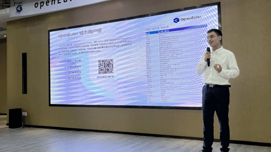
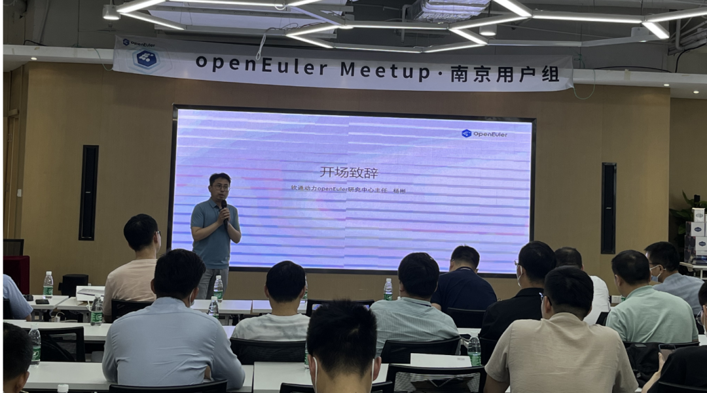
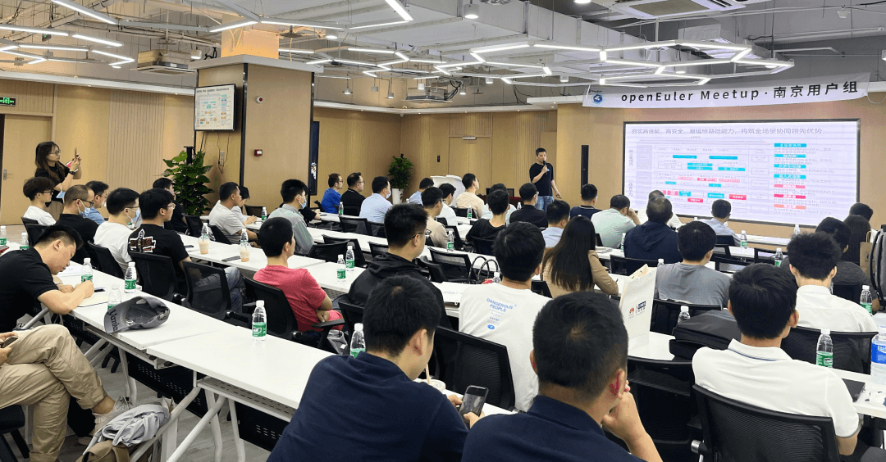
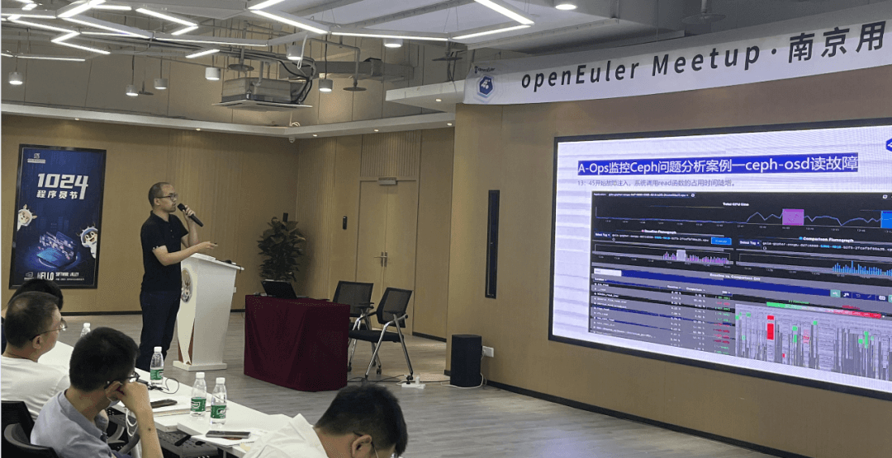
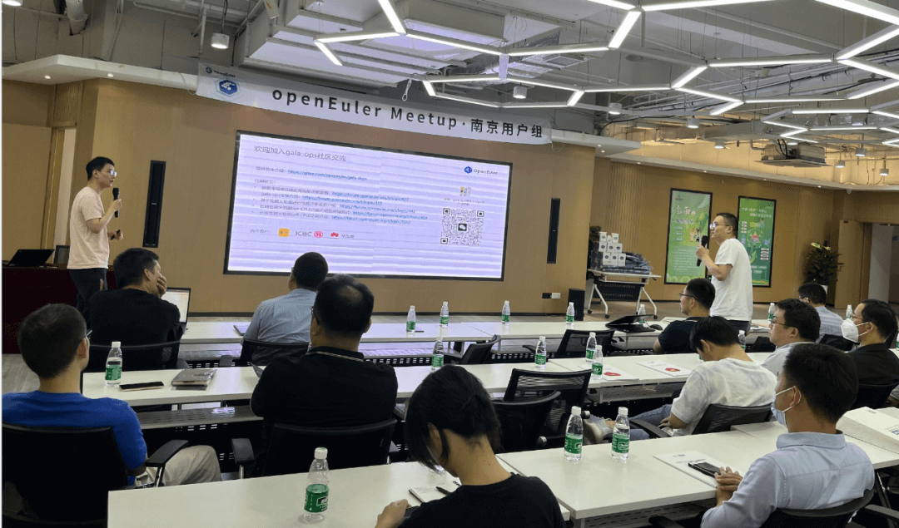
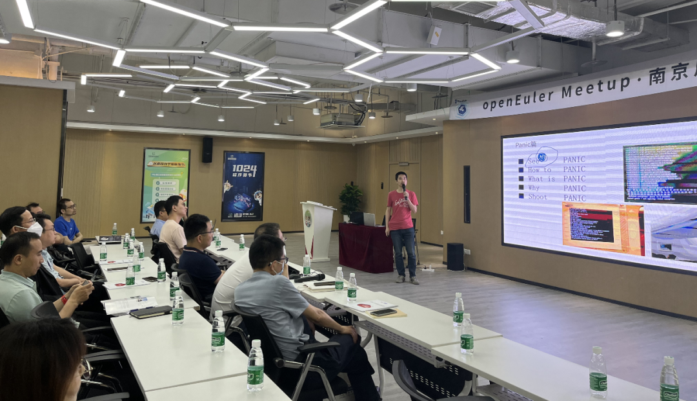
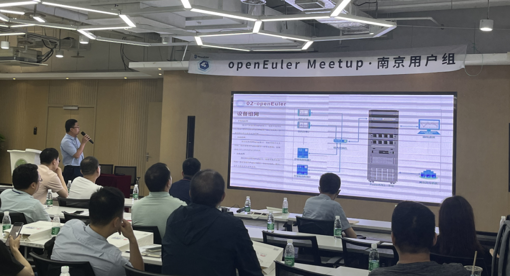
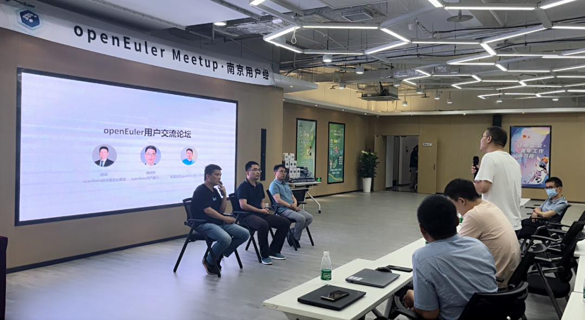
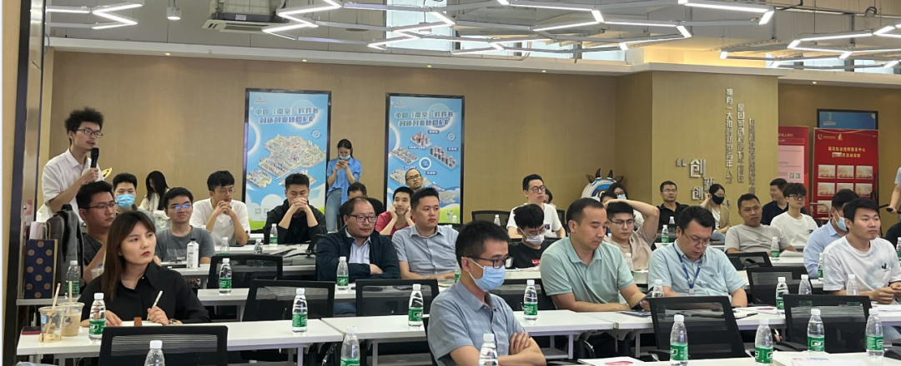

2023年6月2日，openEuler南京用户组举办了线下交流Meetup。本次Meetup由南京用户组成员单位**软通动力**发起**、江苏鲲鹏昇腾生态创新中心/江苏欧拉生态创新中心**联合主办，**润和软件、中软国际-华为云创新中心**协办，聚集了南京地域50+openEuler用户学习交流。\
本次Meetup以openEuler运维为主题展开议题分享，同时邀请到了南京用户组成员分享在实际业务中应用openEuler的实践案例和经验，并在用户交流论坛环节为到场用户提供了一个与社区专家与用户面对面交流关于openEuler应用疑问和诉求的机会。

江苏鲲鹏昇腾生态创新中心/江苏欧拉生态创新中心CTO汤景仁作为南京用户组Organizer对大家的到来表示欢迎。

活动发起方、主办方软通动力的openEuler研究中心主任杨彬为本场活动开场致辞。

**Part 1:  openEuler社区&运维特性介绍\
**openEuler社区技术委员会委员胡峰为大家分享了openEuler社区当前发展的最新进展，介绍了当前openEuler在运维上的特性，以及帮助客户解决用户痛点、实现系统运维能力提升的技术亮点。

**Part 2:  A-OPS在分布式存储Ceph中应用研究**\
软通动力高级操作系统专家张道龙分享了智能运维工具A-ops在分布式存储Ceph中的应用，结合案例介绍了A-ops的强大监控能力和优势、怎么去监控Ceph以及怎么快速准确定位到问题点，并提到了针对A-ops目前存在的不足正在做以及将要做的改进工作，并在功能完善后贡献到openEuler社区。

**Part 3:GALA-金融行业IT系统亚健康诊断利器**\
openEuler社区sig-ops commiter 陈臻分享了openEulerl
A-Ops智能运维平台下的亚健康诊断套件gala，就gala的背景与目标、技术特征与路线图、重点的场景与特性，并展示gala在应用性能诊断能力方面的成果进行解读和答疑。\
openEuler
gala组件通过全栈/全链路可观测+拓扑感知/可视化推导等技术进行自底向上的主动式智能运维，从而实现IT系统灰度故障分钟级诊断，降低用户运维成本。**gala项目介绍：**https://gitee.com/openeuler/gala-docs 

#  Part 4: openEuler操作系统运维经验总结

润和高级操作系统专家赵磊，基于openEuler运维工作的经验，为大家分享了系统中出现的常见故障以及故障的调查方法，并介绍调查故障中常用的工具，以及使用举例，提供了非常实用具体的运维实战经验。

# Part 5:openEuler 用户案例-汽车零部件装配线大文件数据追溯

openEuler已在各行各业有这广泛的应用，南京用户组成员、南京银湖数字技术有限公司销售总监张大鹏带来了openEuler在车辆及装备制造行业数字化服务上的应用案例，分享了基于openEuler社区版及DDE、vsftp、Samba、Docker、openGuass等组件和服务在汽车零部件装配线领域的关于大文件数据追溯的具体应用。

**Part 6:openEuler 用户交流论坛**\
openEuler用户组通过举办线下活动，为区域用户之间提供一个交流机会，同时连接社区和用户，倾听用户的声音，把用户的诉求反馈诉求带回社区。在本次活动的用户交流论坛环节，openEuler技术委员会委员胡峰、openEuler用户委员会委员魏建刚、软通动力openEuler研究中心主任杨彬3位社区专家与用户面对面自由交流，不少用户踊跃提出了他们在使用openEuler关心的技术问题、参与openEuler社区贡献的疑惑、对社区的诉求等，与社区专家进行了充分的交流。

# openEuler南京用户组

openEuler南京用户组成员持续招募中，作为一个区域的用户交流与生态发展平台，用户组成员可以在这里交流openEuler技术、使用经验、案例，向社区反馈用户意见，欢迎加入！

扫码申请加入openEuler南京用户组!

# 彩蛋！！ 

*添加openEuler小助手，回复【南京用户组Meetup】，即可领取本次Meetup讲师授权分享的演讲PPT。*

openEuler小助手微信号\
\
*社区开放活动申请，我们欢迎与 openEuler
一起组织开发者活动，共同探讨前沿技术和开源发展趋势，分享创新成果和实践经验，与
openEuler 社区共同成长！*
