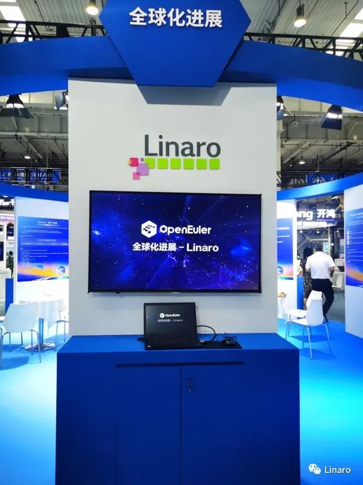
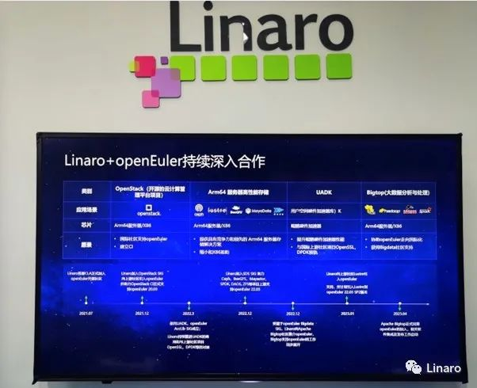

2023年6月11～13日，2023年开放原子全球开源峰会（OpenAtom）在北京经济开发区北人亦创国际会展中心召开，本届峰会旨在搭建全球开源生态发展合作交流平台，聚焦开源生态建设发展，并组织了openEuler、OpenHarmony等开源生态成果展示和相关论坛；

OpenAtom
openEuler（以下简称"openEuler"）自2021年贡献给开放原子开源基金会后，步入高速发展阶段，社区贡献者总计14000+人，成员单位总计905家，讨论（Comment）总计172万个，代码合入（PR）总计约11万个、软件包总计约30000+个；创新项目总计405个，2022年
openEuler
累计装机量达300+万，中国服务器市场份额达到25%，跨越生态拐点。倪光南院士评价openEuler社区"**已达同类社区的国际水准，发展成为该领域颇具世界影响力的开源社区**"。

Linaro作为Arm生态系统全球最大的开源软件协作组织，**自2021.7月签署CLA正式加入openEuler开源社区以来，利用在国际开源社区的影响力，在推动openEuler走向全球，国际化进程方面和openEuler展开了一系列的深入合作**，并与会议上展示了Linaro和openEuler的关键合作成果：

-   2012.12月，Linaro协助openEuler加入**openStack**（云计算管理平台）社区，助力**OpenStack CI**正式支持openEuler20.03版本；

-   2022.7月成立openEuler Acclib
    SIG，Linaro持续推进**UADK（用户空间加速器）的商用**，实现与OpenSSL，DPDK的对接；

-   2022.12月Linaro加入SDS
    SIG（Arm64服务器高性能存储），助力**Ceph，BeeGFS，Mayastor，SPDK，DAOS，ZFS**等项目上游对openEuler22.03版本的支持；

-   2023.1月，Linaro像上游社区**Lustre**引入openEuler，助力支持openEuler22.03
    SP2版本；

-   2023.4月，Linaro像**Apache
    BigTop**社区推荐openEuler，BigTop社区支持openEuler的工作持续展开。

后续**Linaro会和openEuler展开更多开源合作，加速openEuler的全球化进程！**

