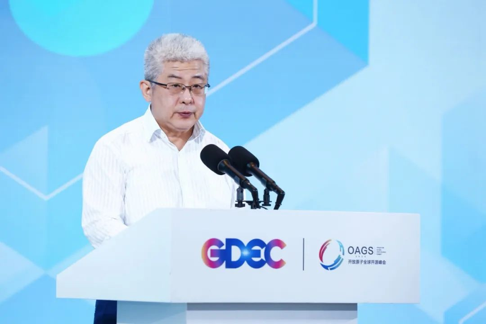
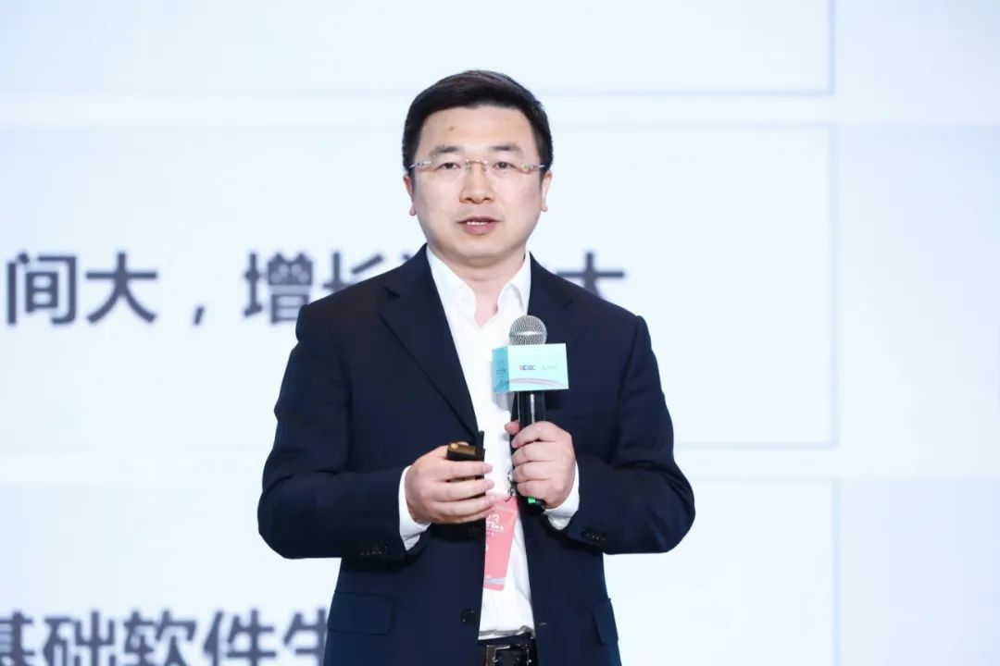
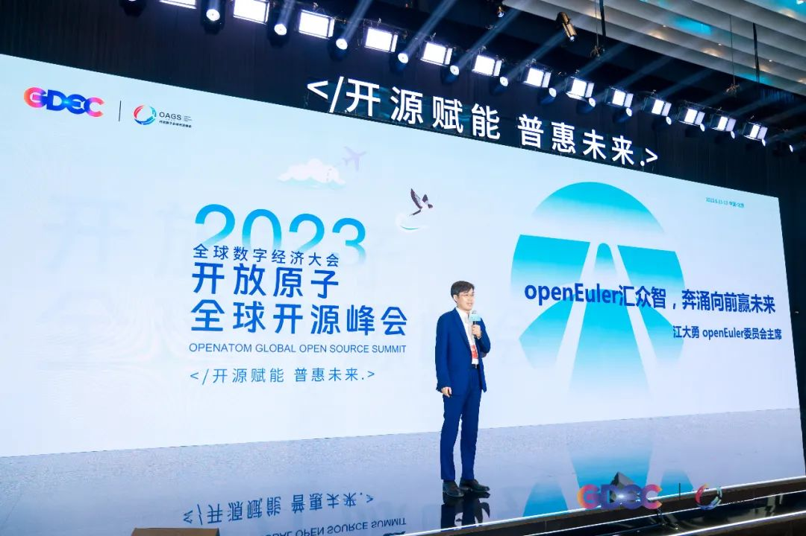
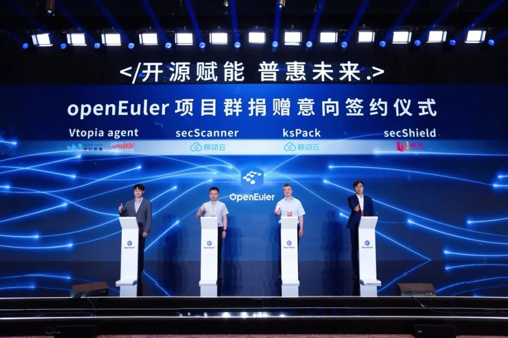
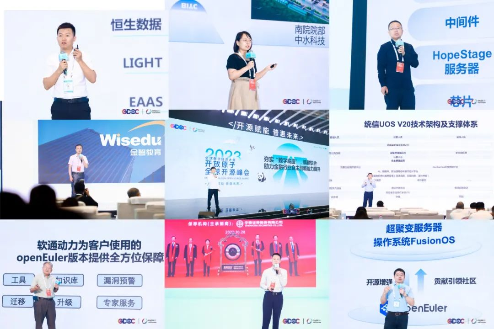
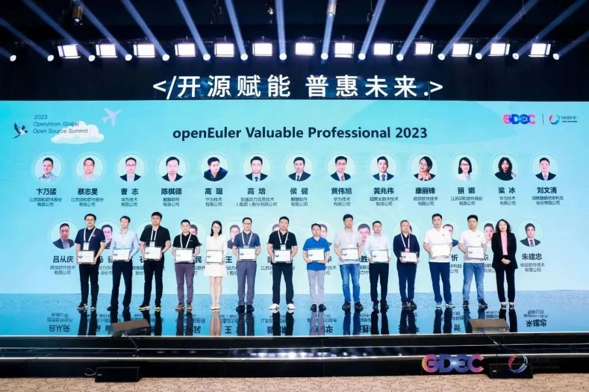

2023年6月12日，开放原子全球开源峰会OpenAtom
openEuler论坛成功召开。论坛以"openEuler汇众智，奔涌向前赢未来"为主题，众多openEuler社区成员、重磅开发者用户以及技术专家参与本次论坛。论坛充分展示了openEuler
社区的最新成果；充分阐述了openEuler开源开放的发展模式；充分介绍了如何结合业务场景进行技术创新和最佳落地实践。

> **孙文龙-开放原子开源基金会理事长**

开放原子开源基金会理事长孙文龙表示："openEuler 贡献给开放原子开源基金会以后，得到跨越式发展。openEuler 立足中国，面向全球，推进国际化进程，同时openEuler要紧跟基金会出海步伐，积极融入开源生态。"

> **戎珂-清华大学社科学院经济研究所副所长**

**清华大学社科学院长聘教授**清华大学社科学院经济研究所副所长、清华大学社科学院长聘教授戎珂发布《基础软件生态发展的溢出价值研究报告》，肯定了基础软件对国民经济的促进作用。**"基础软件成为促进我国经济增长的重要力量。据测算，2020年，我国在基础软件投资每增加1美元，可撬动GDP增加1.77美元，此外，基础软件对关键基础设施行业的溢出价值已超过本身价值（间接产值超过55%）。中国基础软件的投入产出效率（1:1.77）低于美国（1:4.17），基础软件产业发展空间巨大，将成为中国经济发展的重要推动力之一。"**

**江大勇-openEuler 委员会主席**openEuler
委员会主席江大勇分享了社区最新进展：openEuler
过去三年发展超预期，目前国内外已经有几十家OSV厂商，基于openEuler发布了商业发行版，累计完成装机量超300万套。2022年，openEuler系操作系统在服务器操作系统新增市场份额占比超过25%。openEuler
社区已有905家，超14500名开发者在社区做贡献，来自全球100多个国家，1000多个城市下载使用超130万次。**openEuler是中国首次在基础软件领域，依托全产业链力量，通过开源共建的方式，快速跨越一个技术路线的生态拐点。2023年openEuler目标是新增市场份额超过35%，将成为国内服务器操作系统新增市场份额第一，也是中国国内基础软件首个实现市场份额第一的开源项目**。

## 四大项目完成捐赠 openEuler 意向签署，生态持续扩大

开源三年来，openEuler开源社区累积已接受403个原创项目的贡献。2022年12月，开放原子开源基金会正式批准openEuler成为项目群，可以接受捐赠项目。本次大会上，四大项目完成捐赠openEuler意向签署，包括：

-   来自中科微澜和中科院软件所的Vtopia agent，用于提供原生的运行时安全漏洞管理能力；

-   来自中国移动云能力中心的操作系统安全扫描工具，secScanner；

-   来自中移云能力中心的ksPack，用于提供高效可靠的数据编解码；

-   来自凝思的SecShield，提供轻量级、灵活安全子系统这些开源项目的加入，推动openEuler生态的持续扩大，加速了新一代基础软件生态的繁荣。

## 深入场景创新，加速行业应用

携手行业用户，加速行业规模商用。会上，北京中水科水电科技开发有限公司携手麒麟信安、金智教育携手润和软件带来用户联合演讲。麒麟软件、统信软件、超聚变、恒生电子分享了openEuler在金融证券行业创新与应用。软通动力分享了为
openEuler
社区版用户提供的商业服务解决方案。

目前，国内主流OSV均基于 openEuler
发布了面向不同场景的商业发行版，oESP伙伴提供专业保障服务，头部用户也发布了自用版，繁荣的生态实现了多个路径满足不同用户的需求，欧拉也真正的成为推动各行业数字经济的原动力。

## 正式发布首批 openEuler Valuable Professional 名单

openEuler Valuable
Professional是openEuler社区颁发给专家的一项荣誉认证。以此表彰他们为openEuler社区建设和技术传播做出的卓越贡献，会上正式发布首批openEuler
Valuable Professional专家名单。

## openEuler Call for X 计划启动，使能每一场社区活动

"openEuler Call for X
计划"是一个开放的社区项目，鼓励所有社区成员以及开源爱好者积极贡献、乐于分享、热衷实践。发起这个活动的是希望openEuler社区的开发者都能感受到自己的价值和重要性，希望为
openEuler 社区汇聚人才，汇聚资源，汇聚知识，然后在 openEuler
社区共享这些人才、资源和知识，以更加开源的方式推动openEuler社区的营销和品牌。

