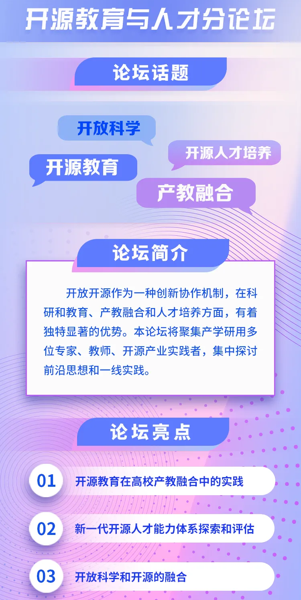

"行业发展，人才先行"，开源生态的繁荣发展，离不开人才的培育。开放开源作为一种创新协作机制，在科研和教育、产教融合和人才培养方面，有着独特优势。6
月 13 日，2023开放原子全球开源峰会开源教育和人才分论坛，将在北京经开区国家信创园拉开帷幕。

论坛现场，openEuler 开源社区人才与服务 SIG
组**「邓晖龙」**将进行《openEuler
的教育和人才培养实践》专题分享，并将参加工信部人才交流中心和开放原子开源基金会将联合发起的开源人才能力和评估标准草案研讨会，与华为、百度、腾讯、小米、浪潮、东软、中软、软通动力、新东方、CSDN
等产业代表，北京航空航天大学、北京理工大学、华东师范大学等高校代表，围绕新一代开源人才能力和评估标准进行深入研讨。

诚邀您与业界同仁一起探讨开源教育与人才培养的前沿思想和一线实践，共创开源繁荣生态未来！
