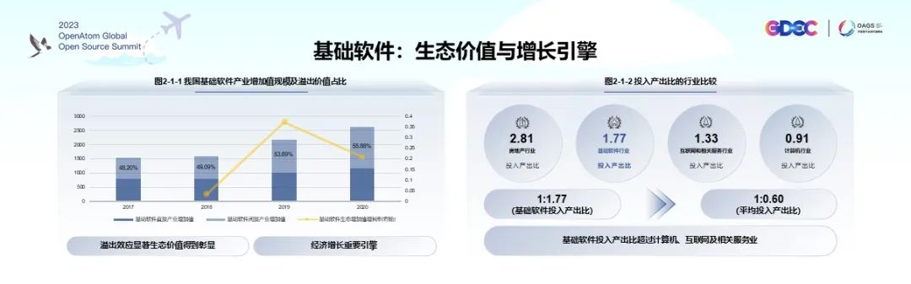
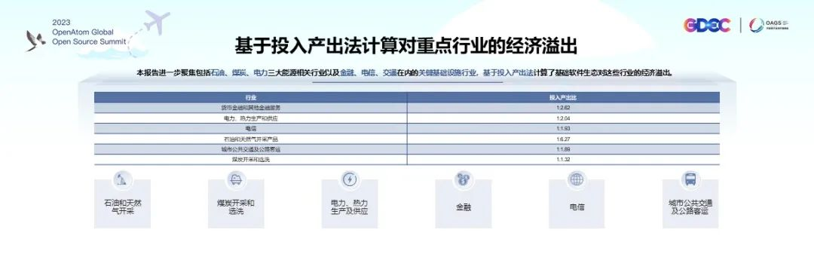
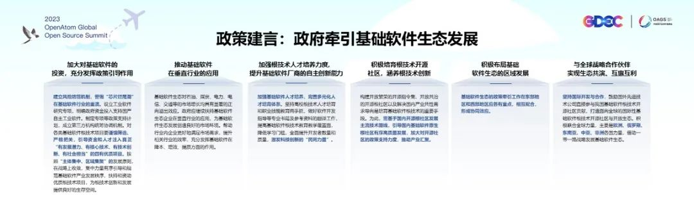

6 月 12 日，开放原子全球开源峰会 OpenAtom openEuler
论坛成功召开。清华大学社科学院经济研究所副所长、长聘教授戎珂在会上发布《基础软件生态发展的溢出价值研究报告》。

报告指出**基础软件产业成为推动我国经济增长的重要引擎**。据测算，**2020
年我国基础软件行业的投入产出比为 1:1.77，即基础软件投资每增加 1
美元，可撬动 GDP 增加 1.77 美元。**其中，0.78
个单位为基础软件自身增加值，0.99
个单位为基础软件所带来的其他行业的增加值总和。基础软件对 GDP
的撬动作用超过了计算机、互联网和相关服务对经济的撬动作用，但与房地产这类重要行业相比，仍然有提升的空间。

基础软件产业的**溢出效应显著，生态价值得到彰显**。2020
年，基础软件间接产业增加值占基础软件生态增加值的比重为
55.88%，表明基础软件对其他行业的溢出价值已超过其本身价值。**基础软件产业发展对石油、煤炭、电力、电信、金融、公共交通行业有较高的经济溢出价值，这些行业在基础软件方面的投入已取得较好的经济效益，**未来应继续加大对基础软件等数字基础设施的投资**。**

**基础软件产业发展空间巨大，将成为中国经济发展的重要推动力之一**。中国基础软件的投入产出效率（1:1.77）低于美国（1:4.17），从行业发展的阶段来看还未达到成熟阶段。但在当前投入产出比远不如美国的情况下，**中国基础软件生态已经产生了较为明显的经济溢出价值**，这表明中国基础软件仍然有很大的发展空间，对中国经济发展具有重要推动作用。报告建议**政府牵引基础软件生态**，在持续补贴的基础上需对各类基础软件根技术项目谨慎筛选、严格把关，引导资金和人才注入**真正"有发展潜力、有核心技术、有技术创新、有社会担当"的四有优质项目**。按照"主体集中、区域集聚"的发展原则，在战略上收敛，集中力量有序引导和规范基础软件产业发展秩序，扶持和资助优质根技术项目，培育根技术人才，为基础软件创新和生态发展创造良好条件。

