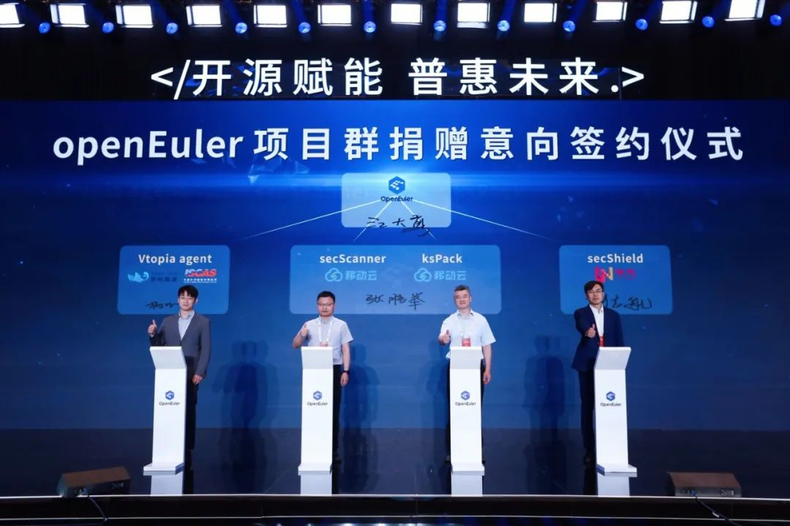
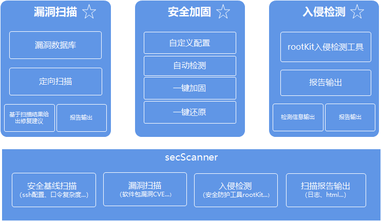
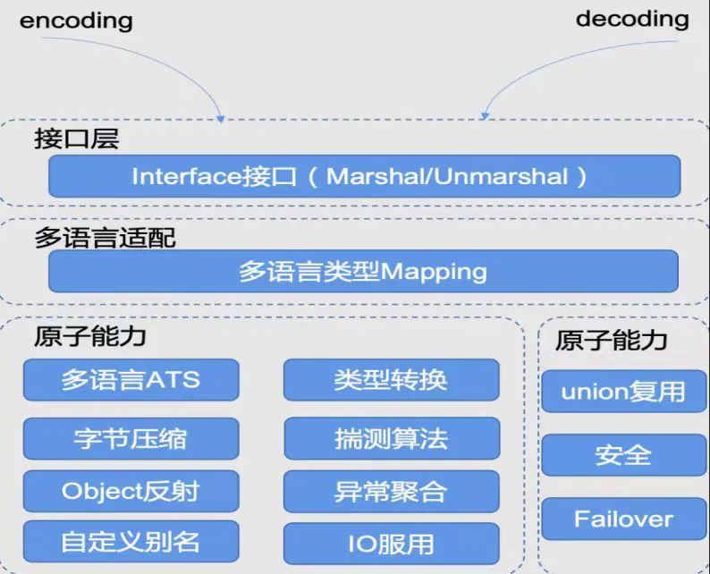

2023 开放原子全球开源峰会于 6 月 11 日至 13
日在全球数字经济大会期间召开。本届大会以"开源赋能、普惠未来"为主题，全面展示开源技术应用，聚焦全球开源生态最新发展与前沿技术动态。中国移动云能力中心张胜举出席本次大会，并代表移动云向
openEuler
项目群捐赠了两款项目：操作系统安全扫描工具（secScanner）和数据编解码套件（ksPack）。

## 操作系统安全扫描工具（secScanner）

secScanner
是由移动云操作系统团队研发的一款操作系统安全扫描工具，旨在为操作系统提供安全加固、漏洞扫描、rootkit
入侵检测等主要功能。用户利用配置文件可以对其进行参数控制，以定制化配置的形式对系统进行安全方面的扫描检测，**「满足系统基线安全加固的同时可以对用户所选定制软件包进行漏洞扫描，并且使用rootkit工具进行系统入侵检测，为系统筑起一道安全长城」**。secScanner
专注于系统加固，其逻辑架构主要由三个模块组成，分别是系统安全基线配置、系统软件包漏洞扫描及系统
rootkit 入侵检测，每个模块都能够由报告的形式输出。

1.  **「系统安全基线配置」**：可根据自定义配置进行一键加固、自动检测、一键还原，对于未满足安全要求的加固项以报告形式进行建议。

2.  **「系统软件包漏洞扫描」**：自动拉取漏洞数据库与自定义需要进行检测的软件包比对报告出所存在漏洞的信息。

3.  **「系统rootkit入侵检测」**：自动检测当前系统可能存在的 rootkit 入侵问题，并输出报告及提供建议。

#### secScanner 系统逻辑框架

当前，secScanner
已集成至移动云天元操作系统全量镜像版本，安装镜像时可以自动安装，用户可根据需求在该路径下根据其架构进行功能新增，无需编译可直接在该系统上运行。secScanner
以可定制化的形式开放，围绕系统安全基线加固、漏洞扫描、系统入侵检测等功能可进行多版本系统的创新开发，与社区共创安全可靠的系统环境。

## 数据编解码套件（ksPack）

KSPack 是移动云容器团队研发的另一款新项目，2023 年开始在 openEuler
codec-sig
中持续进行孵化与运作。该项目旨在解决分布式系统和应用程序架构中常见的跨语言、数据传输过程中，通用且高性能编解码问题，可以让业务更加专注于交付业务价值。KSPack
目标是构建完整、开箱即用的基础软件包 Package 集合：

-   高性能，多语言，Packagae 健壮

-   无外部版本依赖，自形生态

-   全能力开放

-   全自研，无 License 锁定

KSPack 具有以下几个特点：

-   **「自研序列化库」**：KSPack作为一种高效的二进制序列化格式。允许在多种语言之间交换数据，同时具备速度更快，体积更小的优势。**「在编解码过程中实现zero-copy和多路io复用」**，性能表现更加优异。

-   **「高性能和可扩展性」**：支持高性能结构化数据编解码。**「在整个编解码过程中实现更少的内存占用、内存拷贝和「cpu」占用」**。

-   **「多语言支持」**：将支持java、golang、rust、c/c++多语言生态，实现跨平台运行能力。

## 未来规划

移动云自加入 openEuler 社区以来，积极参与社区共建，同时担任 openEuler
委员会委员和用户委员会主席，先后加入虚拟化、内核、云原生和兼容性等多个
SIG 组，并在多个 SIG 组担任 Maintainer。未来，也将继续携手 openEuler
社区，深化联合创新，贡献更多开源项目，共享开源价值，积极推动中国开源软件生态的繁荣发展。
