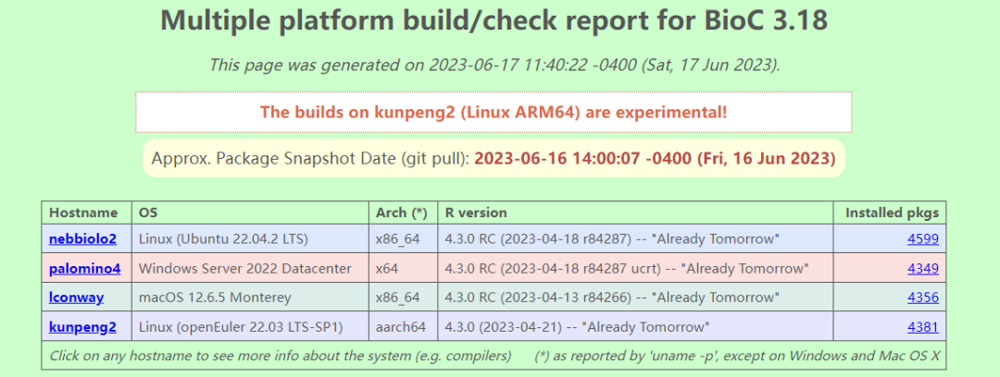
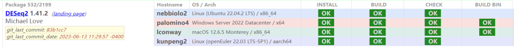

近日，生命信息领域最大社区之一Bioconductor社区宣布选择鲲鹏硬件+openEuler
作为默认平台之一。这意味着超2000款开源软件增加对鲲鹏硬件和openEuler操作系统的支持，高校、研究所、企业单位可以直接在鲲鹏上使用这些开源软件！

▲鲲鹏+openEuler 已成为Biconductor社区的Linux
aarch64版本的官方验证平台，相关软件包（如DESeq2）会在该平台持续验证，保证可用。

在生物信息学领域，高校、研究所依赖于特定开源社区，从其中选择多款开源软件组合使用，如聚焦生物信息数据分析的Bioconductor社区、提供高性能计算基础软件的OpenHPC社区等。本次Bioconductor社区全面支持鲲鹏和openEuler，将帮助高校科研人员和企业用户充分利用多样化算力开展研究和实验，加速科研成果转化。

接下来，鲲鹏社区、openEuler社区与Bioconductor社区将持续共同合作，确保每个新增特性、问题修复在合入软件版本前均在鲲鹏硬件和openEuler
OS上高效验证，为用户提供更高质量的开源软件，促进核心和前沿生物信息技术发展和应用。

# Bioconductor社区

[https://bioconductor.org/](https://bioconductor.org/)

Bioconductor社区致力于开发、支持和传播开源软件，助力用户开展严谨和高效的生物信息数据分析。Bioconductor社区提供了2000余款用于基因数据分析、统计、可视化、注释等生信领域常用的软件包，是生物信息领域最重要、用户量最多的开源社区之一。
