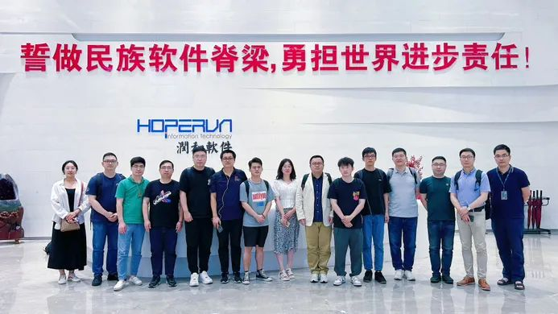
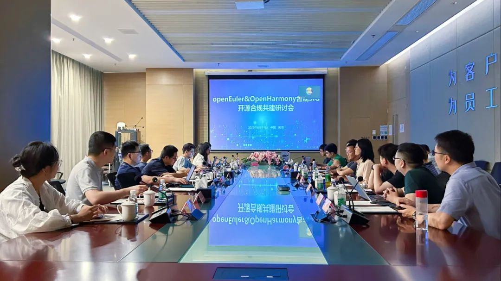
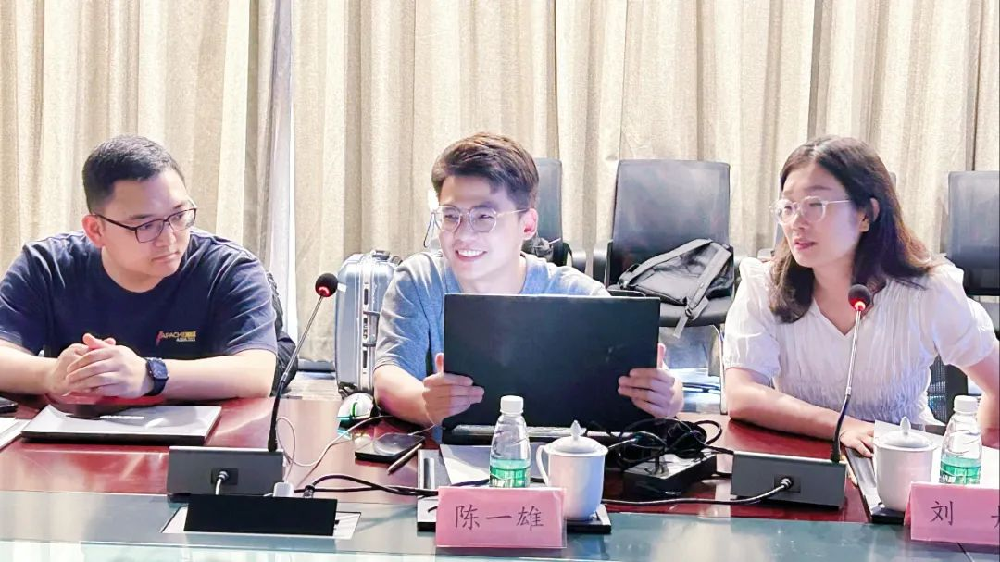
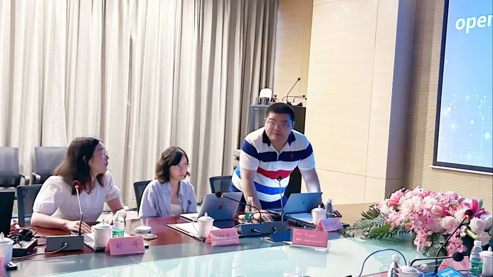
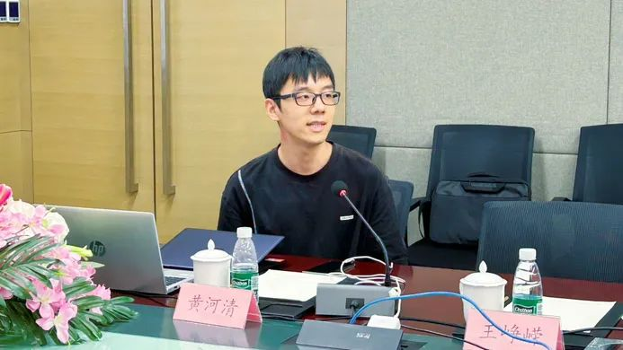
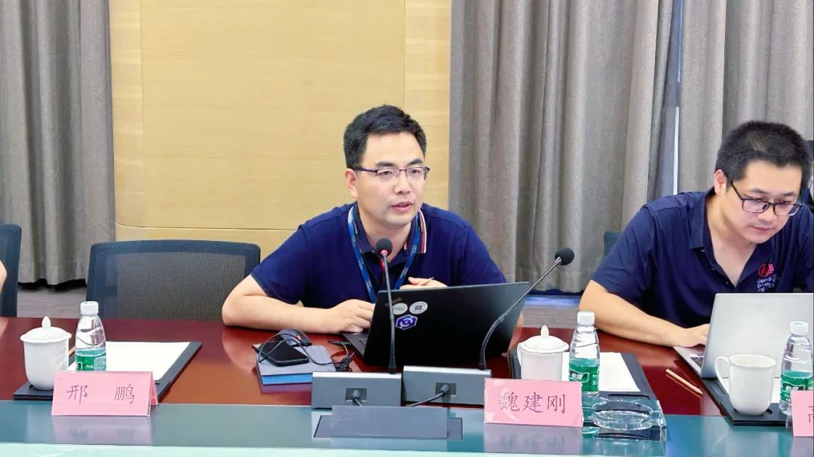
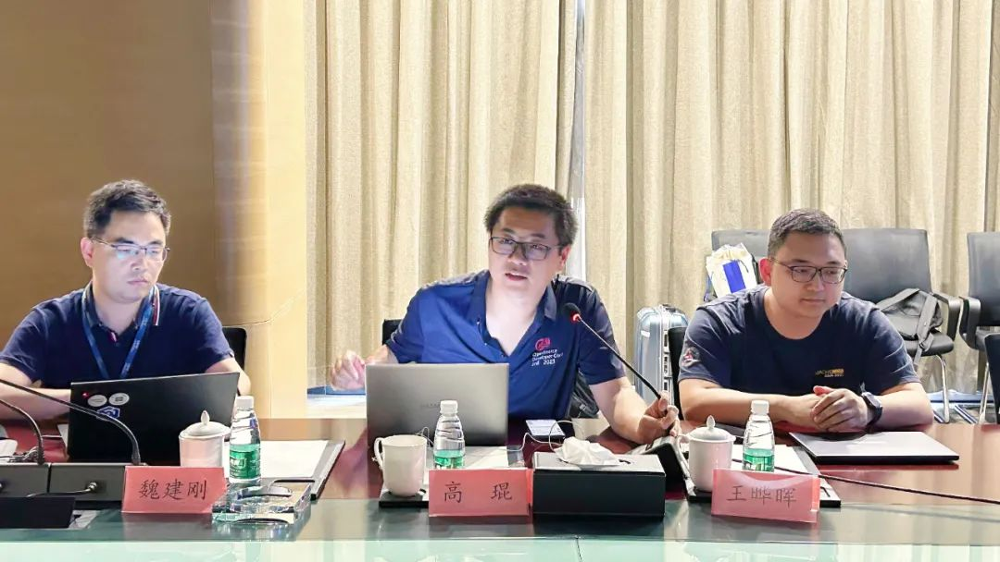
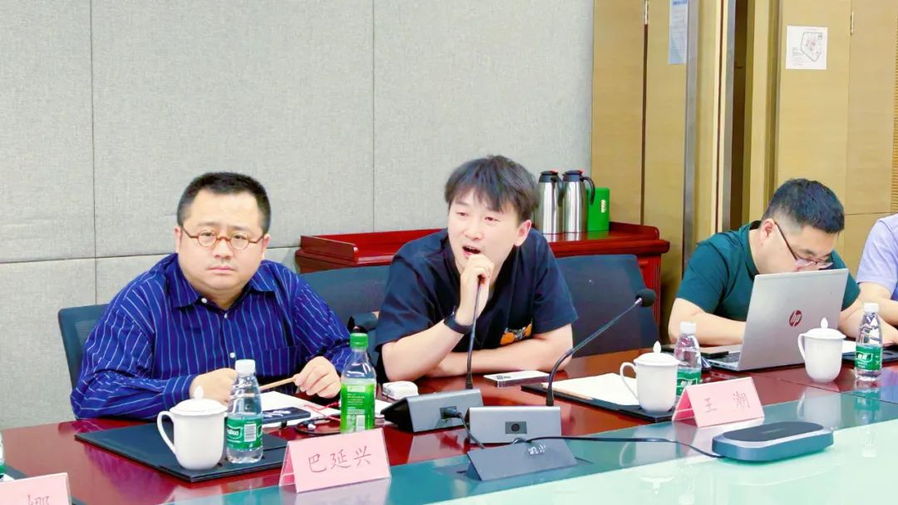
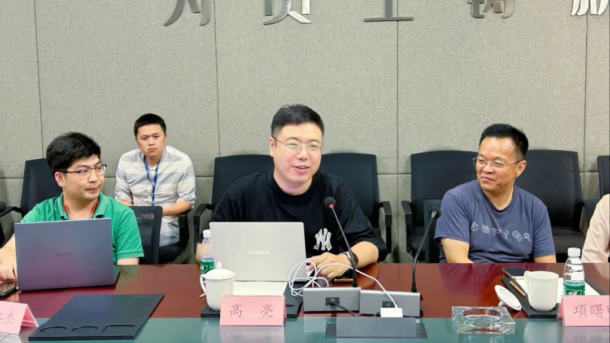
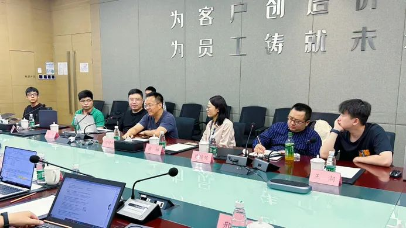

> 2023 年 6 月 14 日，由华为联合润和软件主办的"openEuler & OpenHarmony
> 社区合规 SIG 开源合规共建研讨会"于南京成功举办。作为 openEuler 和
> OpenHarmony 社区合规 SIG
> 第一次线下研讨会，本次研讨会聚集了来自华为、润和、中兴、深开鸿、麒麟软件、安势、维信金科等
> 10+企业的开源合规治理专家和法务专家，活动现场充满了激情和创造力，各位老师积极分享开源合规治理的经验、见解和最佳实践，共同探讨开源合规治理实践过程中遇到的痛点、难点与挑战，同时积极寻求开源合规能力共建的方向和落脚点，共同推动开源软件合规能力的建设和发展。

首先，来自华为的高亮老师作为 OpenHarmony
合规 SIG 的 Maintainer
对各位专家的到来表示诚挚的欢迎，同时对积极筹备本次研讨会的各位老师表示感谢。

## Part 1: openEuler 社区合规 SIG 2023 年度规划及进展介绍

来自华为的陈一雄老师首先为大家介绍了 openEuler 社区合规 SIG 2023
年度规划及进展，该规划由 SIG
组全体成员基于各厂商实际业务诉求经过探讨共同确定，涵盖合规工具能力建设、合规案例库能力建设、操作系统合规治理能力建设、SBOM
能力建设和 License
兼容性分析能力建设等。

## Part 2: 合规案例库能力建设

来自维信金科的许渊聪老师介绍了合规案例库能力建设的当前进展与规划。由于不同国家、不同法律体系关于合规案例审判标准方面存在差异，导致合规案例的解读可能具有一定的局限性，但是合规案例库能力建设也具有积极意义，一方面能够明晰国内审判标准，记录国内对开源合规案例审判的变化过程。另一方面能够对开发者提供指导。

## Part 3: 操作系统开源合规治理能力建设

来自麒麟软件的王悦良老师介绍了操作系统开源合规治理能力建设的进展与规划，会上探讨了操作系统与一般应用软件进行开源合规治理的区别与当前
SCA 工具存在的痛点，确定今年 8
月份输出操作系统开源合规治理框架。操作系统开源合规治理是对以软件包为核心、软件技术栈复杂、依赖组件形式多样，关系复杂的软件场景合规治理的初步探索，对于高复杂软件的开源合规治理具有一定参考意义。

## Part 4: SBOM 能力建设

来自华为的黄河清老师介绍了 SBOM 能力建设进展与规划，SBOM
的数据准确性和完整是一个重要的挑战。会上进一步针对 SBOM
能力的完善，以及如何进行 SBOM 数据完整性保护等进行了深度探讨，当前 SBOM
能力已在 openEuler 和 OpenHarmony 社区落地，下一步将扩展文件级 SBOM
探索，同时与开源社区、供应链合作伙伴进行合作，共享经验和最佳实践。

## Part 5: License 兼容性分析能力建设

来自华为的高琨老师提出当前 License
兼容性分析能力建设仍处于探索研究阶段，构建完善 License
兼容性分析能力需要 SBOM 核心依赖调用分析、License
条款结构、开源软件使用场景等前提条件。openEuler 和 OpenHarmony 社区合规
SIG 将共同建设各项能力，进一步构建 License
兼容性分析能力。

## Part 6: OpenHarmony 社区合规 SIG 介绍与规划

华为的高亮老师介绍了 OpenHarmony
社区合规的三层防线两层责任体系，同时介绍了 OpenHarmony 合规 SIG
组今年的工作重点：获取 OpenChain 认证、完善 SBOM
树的开源合规治理能力、增强开源片段扫描与许可证管理能力等。

## Part 7: 社区开源合规能力共建

本次研讨会的成功举办进一步加强了 openEuler 和 OpenHarmony 社区合规 SIG
之间的交流，初步确定了两大社区开源合规能力合作共建的方向，同时也为进一步推动国内开源合规能力共建迈出了重要的一步。

开源合规共建需要开发者、法务专家、运营等不同领域专家共同努力，如果您对开源合规感兴趣，欢迎加入
openEuler 与 OpenHarmony 社区合规
SIG！在这里，您将有机会与行业专家和从业者一起探讨开源合规的最佳实践、分享经验，并共同推动开源合规的发展。了解更多关于
openEuler 和 OpenHarmony 社区合规 SIG
信息，请访问我们的官网：[https://www.openeuler.org/zh/sig/sig-detail/?name=sig-compliancehttps://gitee.com/openharmony/community/blob/master/sig/sig_compliance/sig_compliance_cn.md](https://www.openeuler.org/zh/sig/sig-detail/?name=sig-compliancehttps://gitee.com/openharmony/community/blob/master/sig/sig_compliance/sig_compliance_cn.md) 让我们携手努力，建设一个开放、合规、安全的开源软件生态系统！
