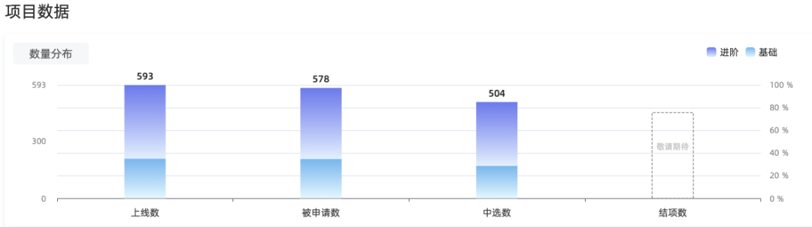
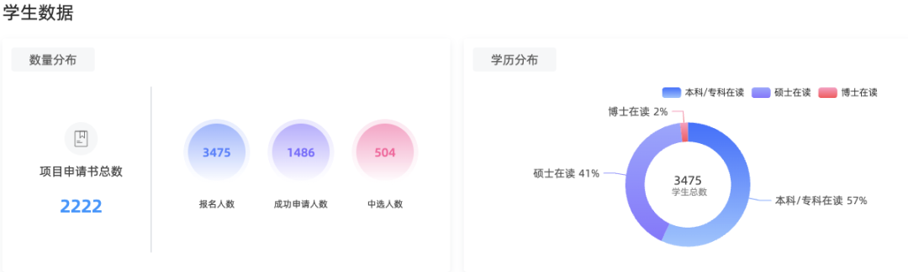
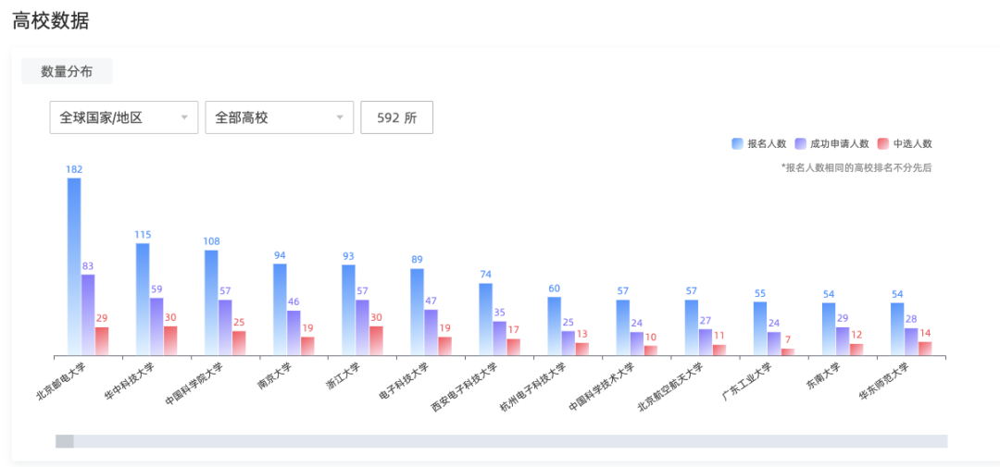
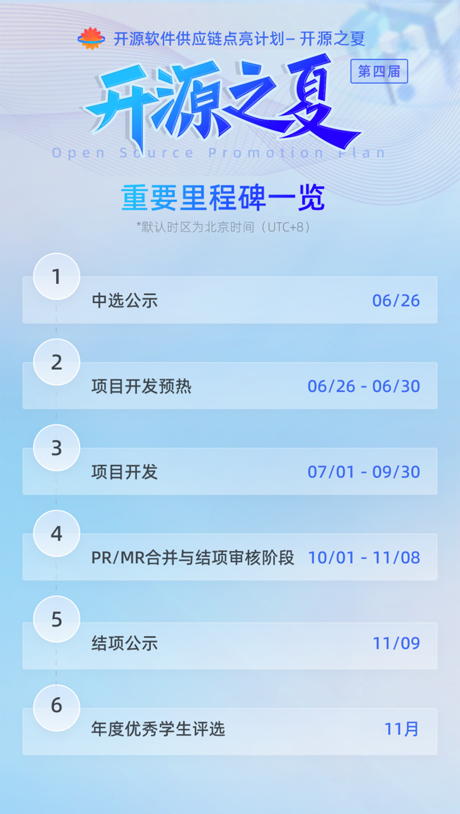
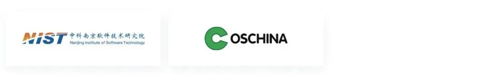

**中国科学院软件研究所**与**openEuler社区**联合主办的开源之夏活动项目申请阶段告一段落，中选学生名单已公布。

前往官网项目列表即可查看项目中选情况

[https://summer-ospp.ac.cn/org/projectlist](https://summer-ospp.ac.cn/org/projectlist)

开源之夏今年已进行至第四届，成为每年暑期前最受高校开发者关注及规模最大的开源活动，本届来自**592所海内外高校**的**3475名学生**报名，在**133家开源社区**发布的**593个项目任务**中选择感兴趣的进行申请，因一个项目最终只能选择一名学生承担，经社区导师和组委会的先后审核，最终**504名学生中选**，在这个暑期将在各社区导师的带领下投入到开源项目的开发中。

其中，openEuler社区上线94个项目任务，94个项目全部被申请，收到309份申请书，最终89名学生中选，承担社区89个项目任务。

恭喜每一位中选的同学，同时也感谢每一位参与开源之夏的小伙伴。**此程不是终点，未来依旧可期，欢迎大家通过更多方式参与开源之夏，共度开源之夏，愿在开源的世界里与你常常相遇。**

共收到2222份项目申请书，总体报名学生本科/专科占比57%，硕士41%，博士2%。

参与高校：

# 盛夏开启，项目任务开发预热中

7月1日起，开源之夏2023将进入为期3个月的项目任务开发期，中选学生与导师进一步沟通项目实现方案，制定详细的开发计划，学习参与开源社区项目开发的流程。在正式开始开发工作前，同学们依旧可以与导师就项目任务内容和目标进行沟通
，进一步完善项目规划，为开发工作做更充足的准备。

完成项目开发的学生需要在项目开发结束前（9月30日24:00
UTC+8）向项目成果仓库提交
PR/MR，并在活动系统中上传项目结项报告、填写PR/MR
链接。PR/MR须于10月31日前成功合并。

**结项审核通过最重要标准**:学生承接的项目需要以PR/MR的形式提交到项目所在的开源社区仓库中并完成合并。

**结项审核时间：**

1\. 10月1日-10月31日：导师结项审核，在此期间，学生开发者依然可以对提交的
PR/MR 进行完善，直至合并。

2\. 11月1日-11月8日：组委会结项审核。

3\. 11月9日：结项项目公示。

**详见学生指南：**

[https://summer-ospp.ac.cn/help/student/](https://summer-ospp.ac.cn/help/student/)

相信这个真实而完整的开源项目贡献旅程会给参与的学生带来满满的成就感与收获！

# 结项奖金发放

每个项目奖金总额根据项目难度分为进阶 12000 元、基础 8000
元（奖金数额为税前人民币金额）。通过结项考核的学生将获得奖金，若结项评审未通过，则不予发放奖金。

通过结项评审的学生还将收到组委会颁发的**结项证书**，同时有机会参与**年度优秀学生评选。**

# 重要里程碑一览

# 联系方式

**官方邮箱**：org@summer-ospp.ac.cn\
**通用邮件列表**：summer-ospp@googlegroups.com

添加小助手微信可进入openEuler社区**学生微信群**（添加请备注"开源之夏"）：

组委会将在 Slack
频道里发布与微信群一致的通知，不习惯使用微信群的参与者可以订阅 Slack
频道：**https://slack.summer-ospp.ac.cn**

# 活动组织方

**主办方**：

**承办方**：

**特约合作伙伴**：

**媒体合作伙伴**：

