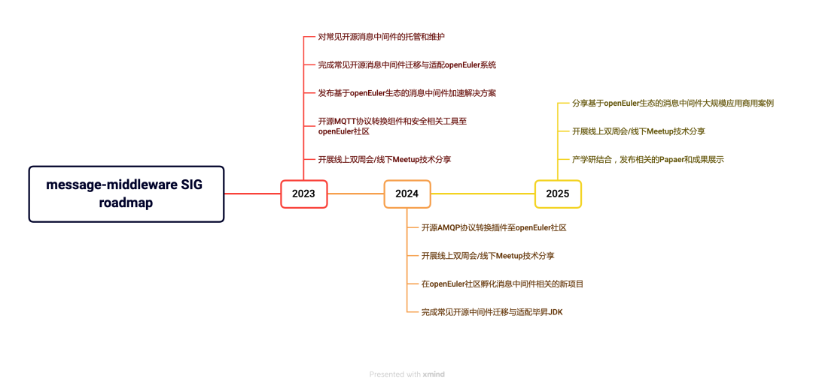

经 openEuler 社区技术委员会讨论决定，openEuler 社区正式成立
message-middleware SIG。该 SIG
组由中国移动云能力中心牵头发起，并主导制定该 SIG
组的相关工作职责、内容和未来发展规划，同时吸引国内多家一线云厂商的共同参与。消息中间件作为消息通信的基础软件，已在业界诸多的
IT 系统（比如，大数据分析领域、面向云计算基础设施的 OpenStack
领域和物联网/车联网、边缘计算应用领域）中被广泛使用。这些领域的诸多应用场景，对于消息中间件的吞吐性能、稳定性、可靠性、容错性和安全性都有较高的要求，而国内面向消息中间件在性能加速、安全性、稳定性和多协议支持等方面都缺乏深入研究。message-middleware
SIG 将专注于探索为开源用户提供基于 openEuler
基础软件的消息中间件性能加速、安全加固、提升稳定性的解决方案，同时孵化消息相关的新项目（多协议消息转换组件、消息
API 标准和消息流转引擎等），补齐国内在该领域的相关能力。

## SIG 组现有的技术储备

1.  SIG 组的多位 Maintainer 和 Committer都在开源消息中间件的上游社区有任职（比如，Apache RocketMQ 和Apache Pulsar 的 PMC 和 Committer），并且在上游社区已经完成数百 PR的提交与合并；

2.  具备多年消息中间件内核代码设计与开发的经验，曾发布消息中间件产品的多个迭代版本到生产环境的大规模实践与应用；

3.  具备消息中间件在大数据分析、物联网/车联网、Openstack、边缘计算等领域的大规模实践与运维经验。

4.  已完成基于 openEuler 操作系统的 RockeMQ 和 RabbitMQ消息中间件的适配、功能验证与生产环境的推广应用；

## SIG 组的工作

1.  对常见开源消息中间件（RocketMQ、RabbitMQ、Kafka）进行托管与维护，修复安全漏洞和合并上游社区的主要代码；

2.  基于 openEuler的操作系统，对常见开源消息中间件（RocketMQ、RabbitMQ、Kafka）进行迁移、适配和优化工作，输出脚本与工具至社区；

3.  基于 openEuler 的操作系统和毕昇JDK，发布对常见开源消息中间件（RocketMQ、RabbitMQ、Kafka）提供性能加速、安全加固和稳定性提升的解决方案至社区；

4.  孵化并开源 MQTT、AMQP等自研消息协议转换软件至欧拉社区。补齐国内社区在多协议支持方面的能力；

5.  定期开展本 SIG 的线上双周会和举办线下 Meetup 的技术交流分享；

## Roadmap

message-middleware SIG
得到了中国移动云能力中心、腾讯云、京东云等公司的大力支持。下面是该 SIG
组的相关 Maintainer 和 Committer。

## Maintainer

| **姓名**   |    **公司**           |               **Giteeid**|
| ---   |   ---          |               --- |
| 胡宗棠      |   中国移动云能力中心       |         hu-zongtang |
|  江海挺     |    腾讯云          |                  jas0n918 |

## Committer

| **姓名**   |    **公司**           |               **Giteeid**|
| ---   |   ---          |               --- |
|  章及第      |    中国移动云能力中心            |       zhangjidi |
| 吴碧清     |     中国移动云能力中心           |        wubiqing |

## SIG 例会

每双周 周三下午 19:30
