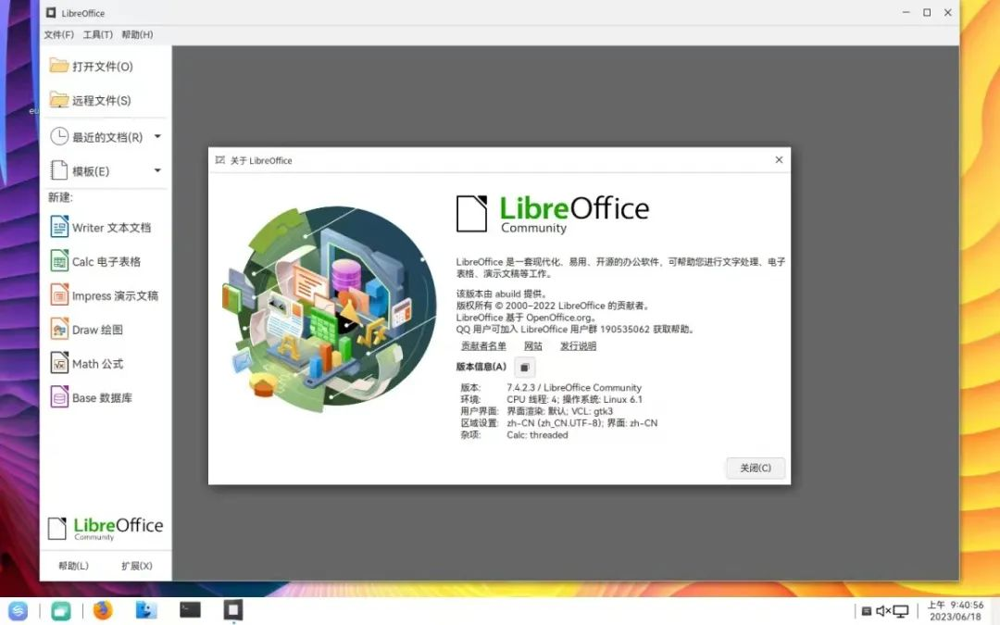

近日，RISC-V SIG 发布了 Eulaceura 版本
23H1，这是发行版的一次重大更新，新版本搭建了 linux kernel 6.1
版本内核，适用于矽速科技 LicheePi 4A 的映像也已公布。Eulaceura 是首个将
RISC-V 架构纳入第一级支持范围的 openEuler 发行，与 openEuler RISC-V
项目共享部分组件。项目地址：<https://gitee.com/eulaceura>

## 支持硬件

-   全志 D1

-   LicheePi 4A

LicheePi 4A 是首款性能对标树莓派 4 的 RISC-V 开发板，基于阿里巴巴平头哥
TH1520 芯片，搭载 4 核 2.0GHz C910 内核、4TOPS NPU 和 50GFLOPS
GPU，为开发者提供强大的性能，可以应对常见的桌面体验场景。

## 版本亮点

Eulaceura 的桌面版本采用社区内湖南麒麟贡献的 Kiran
桌面环境作为预设，初始系统语言含中文，附带一系列常用应用程序。

### 内核版本升级

新版本的 Eulaceura 采用 linux kernel 6.1 版本， 这将会是 openEuler
下一个长期支持版本的候选内核版本。该版本包括了对 RISC-V
架构的许多修订，也添加了更多 RISC-V 设备的支持。

### 基础组件更新

作为例行更新，基础组件的变动如下

-   glibc 2.36

-   systemd 249

-   OpenSSL 3.0.8

-   GCC 10.3.1

-   LLVM 12.0.1/15.0.7

-   Perl 5.34

-   Python 3.11

-   JDK 8u362-b09/11.0.17

-   Rust 1.67.1

-   NodeJS 16.15.0

同时该版本添加了实验性 LuaJIT 支持，使得更多依赖 LuaJIT
的应用得以适配运作。

### 桌面应用变更

-   更新了 Evolution 邮件客户端：由 3.38 版本升级为 3.46.2 版本

-   更新了 Firefox 浏览器：由 102.0.1 版本 升级为 105.0.3 版本（可升级至110 版本）

-   新增了 LibreOffice 办公套件：使用 7.4.2.3 版本

-   更新了 Chromium 浏览器：由 104 版本升级为 108.0.5359.124（可升级至110 版本）

## 映像下载

映像存放于 image/23H1/
资料夹内，欢迎各位下载安装和尝试使用。地址：<https://mirror.iscas.ac.cn/openeuler-sig-riscv/eulaceura/>可以根据自己的需求灵活选用桌面版本、命令版本和硬件适配版本。

## 未来规划

Eulaceura 使用社区的原生解决方案，可以给 RISC-V
爱好者与学习者一个开箱即用的 RISC-V 实验环境、支持在 RISC-V
架构下各种社区项目的验证与落地。目前，新版本已经在模拟器和真实硬件中测试运作，更多详情可以访问项目主页。在未来，Eulaceura
计划让应用于不同开发板硬件的系统采用统一的镜像，达到硬件通用适配的目的。Eulaceura
也可以作为 RISC-V 硬件上长期运作的操作系统候选。

## 联系我们

如果您对 RISC-V 感兴趣，欢迎加入 RISC-V SIG 交流群，讨论更多关于 RISC-V
的更多内容，为推动 openEuler & RISC-V 生态贡献力量

**中科院软件所吴伟微信**

**添加请备注 oerv**

## 关于作者

杨延玲，中科院软件所 PLCT 实验室实习生，欧拉开源社区 RISC-V SIG
成员，目前在温州大学读研二，负责协助 RISC-V SIG 和 ROS SIG 的日常运营。
