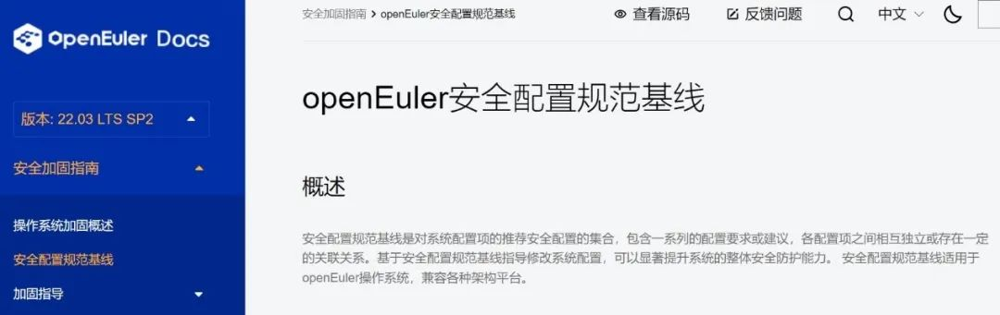
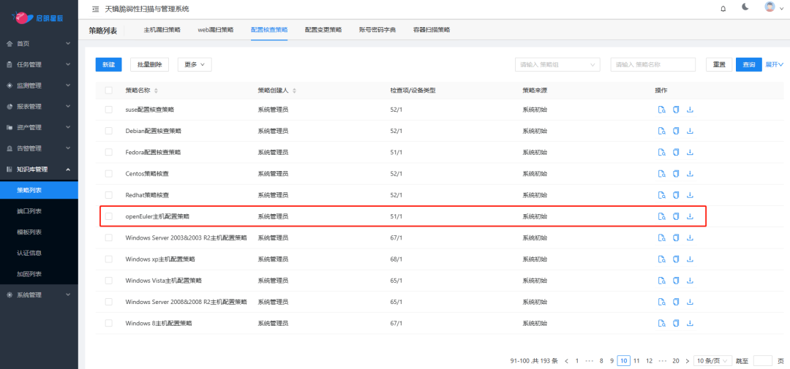

近日，启明星辰成为**首家与 openEuler
社区进行安全配置基线适配技术合作的厂商**。启明星辰将凭借深厚的脆弱性评估技术和丰富的实战经验，与
openEuler 社区共同孵化基线生态，为 openEuler
开源操作系统提供安全配置支撑。

作为国内最早研发漏洞评估与管理产品的安全厂商之一，启明星辰已发布多款漏洞评估与管理产品，在漏洞库覆盖、扫描准确率、核心技术自主创新、结果呈现等多方面均处于行业前列。

**启明星辰天镜脆弱性扫描与管理系统**具备强大的安全配置基线检查能力，能够精准、高效地发现基线配置缺陷问题，并提供详细的加固建议和自动化的加固方案，满足不同行业和市场的安全合规检查要求，帮助用户有效减少网络安全风险，从而为构建领先、可靠、安全的操作系统提供安全支撑，和产业共同守护中国软件供应链安全。

openEuler是面向数字基础设施的开源操作系统，支持服务器、云计算、边缘计算、嵌入式等应用场景。6月30日发布的
openEuler 22.03 LTS SP2 版本首次提供了 openEuler
安全配置基线核心内容项，并将于年底发布操作系统安全配置基线的完整方案，提升操作系统配置安全，建设自主的基线生态。

启明星辰通过天镜脆弱性扫描与管理系统**为 openEuler
操作系统建立专门的安全配置基线策略**。该策略提供了账号管理、口令策略、系统服务、日志审计、网络通信等配置内容的安全基线评估，并与
openEuler 社区同步更新，确保 openEuler
开源操作系统安全基线的精准检测。另外，启明星辰还**提供系统安全配置基线的配置规范和技术指导**，确保系统配置符合安全配置基线标准和最佳实践，简化安全管理和维护工作，提升系统整体安全防护能力。

启明星辰与 openEuler
社区成功携手，彰显了启明星辰在国内安全领域的行业领导者地位，为未来双方的深度合作奠定了坚实基础。作为基线生态建设的关键参与者，同时也是漏洞评估与管理产品市场的头部厂商，启明星辰将坚持自主创新，为行业提供全面、优质、高效的安全解决方案和产品，帮助用户在基线生态中构建坚实的网络安全屏障，助推国内可信产业安全创新发展，为铸基国家数字基础设施建设贡献更大力量。
