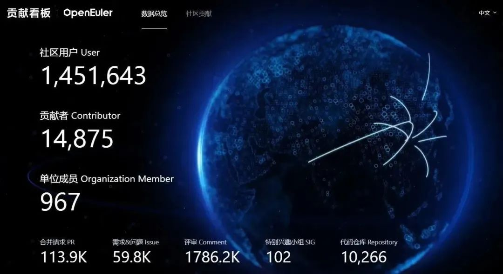
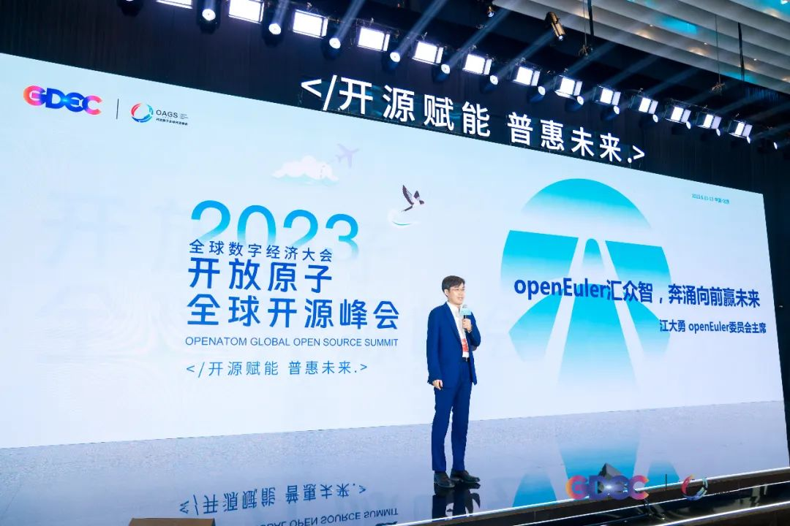
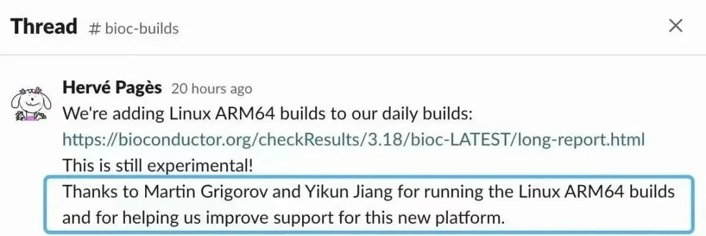
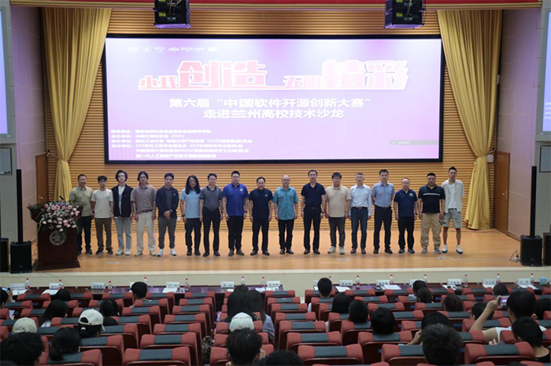
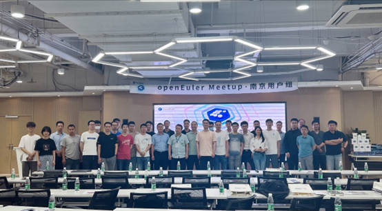
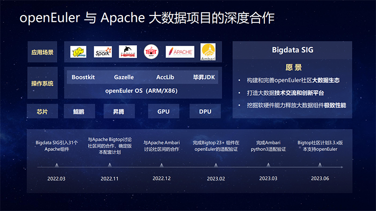
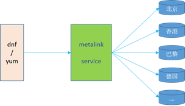
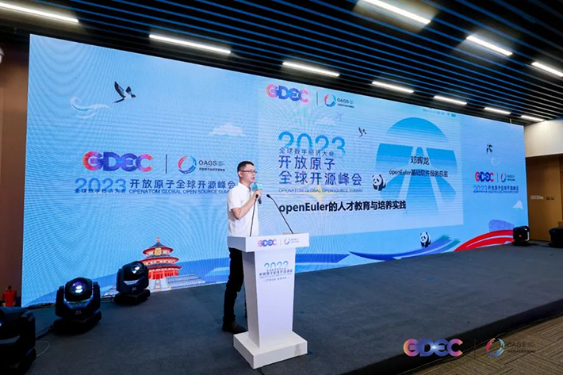
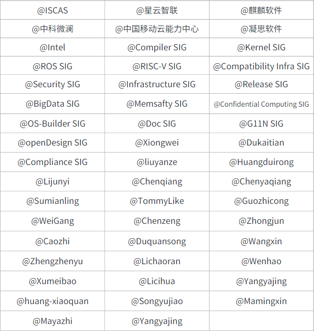

# 概述

本月，openEuler 22.03 LTS
SP2版本发布，场景化竞争力特性、协同能力均得到增强。ROS2-humble、secGear、Metalink服务等相继在该版本中发布，其中Metalink服务让用户下载软件包速度得到10倍以上的提升。

在与其他社区的合作中，openEuler软硬件生态得到进一步繁荣。其中，生物信息学领域Bioconductor社区已宣布将鲲鹏硬件+openEuler
OS作为官方验证平台之一。

技术方面，基于Rust的操作系统引导工具项目正在进行中；BigData
SIG正积极推进与Apache大数据项目的深入合作；Confidential Computing SIG
持续完善secGear开发框架；Intel-Arch与Kernel SIG正积极推进对Emerald
Rapids的支持；刚成立不久的memsafety
SIG组启动Rust重构基础命令行项目等等。同时，openEuler社区新增15个创新技术项目，包含大数据、基础设施、云原生、基础库、加速库等技术方向，感谢项目作者的信任和支持。

其他方面，由openEuler和伙伴们共同打造社区用户案例已增加了30+个，并在官网呈现，欢迎更多朋友们加入。同时，openEuler推出"openEuler
Call for X 计划"，以鼓励更多伙伴和开发者参与到社区共建中。

欢迎大家细品，本月报阅读时长预计20分钟。

# 社区活跃度

2023年6月，openEuler社区用户**超过145万**。超过**1.48万名**开发者在社区持续贡献，累计产生**113.9K**个PR、**59.8K**条Issue。截至目前，累计加入
openEuler 社区的单位成员**967**家，6月新增 **84**家。

社区贡献看板（截至2023/6/30）

# 社区事件

## 2023开放原子全球开源峰会 openEuler 论坛召开

6月12日，开放原子全球开源峰会OpenAtom
openEuler论坛在北京召开。openEuler社区成员、开发者用户以及技术专家参与本次论坛，充分展示openEuler
社区发展的最新成果。

[[原文阅读\>\>\> ]](https://mp.weixin.qq.com/s?__biz=MzI2NDE4OTE2Mg==&mid=2247504612&idx=1&sn=5269899d9673d85c0b645de3f24ddf92&chksm=eab2f761ddc57e77d7ca5b3d2bea04038136ebb2c07e74393ed5f72f2ce15e923a516c223ae7&token=2077163593&lang=zh_CN&scene=21#wechat_redirect)

## 四个项目完成捐赠到 openEuler 项目群的意向签署

在开放原子全球开源峰会OpenAtom
openEuler论坛上，来自中科微澜和中科院软件所的Vtopia
agent、来自中国移动云能力中心的操作系统安全扫描工具secScanner、来自中移云能力中心的ksPack以及来自凝思软件的SecShield等四大项目完成捐赠openEuler意向签署。目前，openEuler社区累计已接受403个原创项目的贡献。

## openEuler 22.03 LTS SP2发布，

## 场景化竞争力特性增强，性能持续提升

6月30日，openEuler 22.03 LTS SP2
版本发布。该版本面向服务器、云原生、边缘和嵌入式等应用场景，统一基于
Linux Kernel 5.10 构建，对外接口遵循 POSIX 标准，具备天然协同基础。同时
openEuler 22.03 LTS SP2
版本集成分布式软总线、KubeEdge+边云协同框架等能力，进一步提升数字基础设施协同能力。

openEuler 22.03 LTS SP2 关键特性：

<https://docs.openeuler.org/zh/docs/22.03_LTS_SP2/docs/Releasenotes/关键特性.html>

openEuler 22.03 LTS SP2 技术白皮书：

<https://www.openeuler.org/zh/showcase/technical-white-paper/>

## 超2000款生信开源软件原生支持鲲鹏+openEuler

近日，生物信息学领域最大社区之一Bioconductor社区宣布选择鲲鹏硬件+openEuler
OS作为官方验证平台之一，超过 2000
款开源软件增加针对鲲鹏硬件和openEuler开源操作系统的支持，意味着高校、研究院所、企业可以直接在鲲鹏上使用这些开源软件。

本次贡献由openEuler社区开发者姜逸坤（GitHub ID：@Yikun）和Martin
Grigorov（GitHub
ID：@martin-g）共同完成，并收到Bioconductor社区的核心Maintainer的肯定和感谢。

[[原文阅读\>\>\> ]](https://mp.weixin.qq.com/s?__biz=MzI2NDE4OTE2Mg==&mid=2247504799&idx=1&sn=1a978f72b5eed3bf73d42013399363e5&chksm=eab2f61addc57f0c0689c1359c294044e157f9f30d371268133ba9cbb01a0ecfa1b197f17e3c&token=860030200&lang=zh_CN&scene=21#wechat_redirect)

## WSL/EulerLauncher开发体验初探

在Windows、MacOS、Linux等主流桌面系统上快速部署openEuler开发环境，提升使用openEuler的便利性和稳定性，这便是开发者工具集EulerLauncher。在6月的技术直播中，openEuler
社区Maintainer 郑振宇与社区基础设施开发者
李超然，共同演示了如何通过EulerLauncher在个人PC端上部署openEuler，亲身带领大家体验该工具便利性。

EulerLauncher：

https://gitee.com/openeuler/eulerlauncher

## "openEuler Call for X 计划"全面启动

秉承开源开放的原则，openEuler希望汇聚更多力量，不断探索科技创新的边界。6月21日，社区推出"openEuler
Call for X
计划"，它旨在鼓励所有社区成员以及开源爱好者积极贡献、乐于分享、热衷实践。欢迎感兴趣的小伙伴一起组织社区活动，为
openEuler 社区汇聚人才，汇聚资源，汇聚知识。

[[原文阅读\>\>\> ]](https://mp.weixin.qq.com/s?__biz=MzI2NDE4OTE2Mg==&mid=2247504696&idx=1&sn=4af0f5149dbde969fbe7462b12fad185&chksm=eab2f6bdddc57faba919176736f4d8a4110e7c009f6effcbe624e59c85856a3fef24045f4aab&token=2077163593&lang=zh_CN&scene=21#wechat_redirect)

## 第六届"开源创新大赛"走进兰州高校

6月21日，[[第六届"开源创新大赛"走进兰州高校技术沙龙活动]](https://mp.weixin.qq.com/s?__biz=MzI2NDE4OTE2Mg==&mid=2247504741&idx=1&sn=5bd295f8126035e0cdaa5603330dd6c1&chksm=eab2f6e0ddc57ff6e7529803d50a3729099a6536d00df952eb6eaf961791119d021824026030&token=860030200&lang=zh_CN&scene=21#wechat_redirect)在西北师范大学（知行校区）毅然报告厅举办。作为操作系统领域的顶级项目，openEuler受邀出席，现场为200余名学生介绍openEuler操作系统的技术体系及其开源社区的基本情况，强调了开源对于人才培养的重要性，并为本次社区贡献的赛题进行详细的讲解，为参赛的学生提供一些指引与参考。

[第六届开源创新大赛---openEuler项目贡献赛赛道介绍](https://mp.weixin.qq.com/s?__biz=MzI2NDE4OTE2Mg==&mid=2247504631&idx=1&sn=dbae425aae4c830d2c6788558662b6b7&chksm=eab2f772ddc57e64e16cde763430ddf931968a20792f340f2b4b80c519cdd8741bea99c4cc7d&token=860030200&lang=zh_CN&scene=21#wechat_redirect)

## openEuler & OpenHarmony 社区合规 SIG 联合研讨会举办

6 月 14 日，由华为和润和软件主办的"openEuler & OpenHarmony 社区合规 SIG
开源合规共建研讨会"于南京成功举办。来自华为、润和、中兴、深开鸿、麒麟软件、安势、维信金科等
10+企业的开源合规治理专家和法务专家现场分享开源合规治理的经验、见解和最佳实践，共同探讨开源合规治理实践过程中遇到的痛点、难点与挑战，同时积极寻求开源合规能力共建的方向和落脚点，共同推动开源软件合规能力的建设和发展。

[[原文阅读\>\>\> ]](https://mp.weixin.qq.com/s?__biz=MzI2NDE4OTE2Mg==&mid=2247504741&idx=2&sn=bf1cb2ad33920b412cb557dffe4ce1be&chksm=eab2f6e0ddc57ff60353f77aeea99d791e392c52a9202adeb10a2fd0579e048c3fcd939256c2&token=860030200&lang=zh_CN&scene=21#wechat_redirect)

## openEuler运维专场Meetup在南京举办

6月2日，由南京用户组成员单位软通动力发起、江苏鲲鹏昇腾生态创新中心/江苏欧拉生态创新中心联合主办，润和软件、中软国际-华为云创新中心协办的openEuler
运维专场Meetup在线下进行。活动以openEuler运维为主题展开讨论，同时南京用户组成员分享在实际业务中应用openEuler的实践案例和经验，吸引了南京地域50+位开发者学习交流。

[[原文阅读\>\>\> ]](https://mp.weixin.qq.com/s?__biz=MzI2NDE4OTE2Mg==&mid=2247504511&idx=1&sn=eea093caf9dee9c9eb1966c5b7beb552&chksm=eab2f7faddc57eec150b9a219d9ec0eaa4dd184693eedf0c4b061df544aac4cecd0615aa7b89&token=860030200&lang=zh_CN&scene=21#wechat_redirect)

## openEuler 用户案例征集

作为一款面向数字基础设施的开源操作系统，openEuler联合伙伴、开发者之力不断演进，提供丰富的功能和工具，希望通过创新的技术方案解决各行各业的数字化转型痛点、满足企业需求。

为此，openEuler
诚邀伙伴们共同打造《openEuler开源操作系统行业应用案例集》，以展示openEuler在不同行业的应用场景与优势，同时为其他用户提供了借鉴和参考，共同探索openEuler的更多可能性。

目前，该案例集已经在【社区官网-用户案例】页面中展示。每周四，openEuler运营团队将选取优秀案例在公众号上同步呈现，欢迎关注。

如果您想增加案例，欢迎联系user@openeuler.sh。

openEuler 用户案例：

<https://www.openeuler.org/zh/showcase/>

用户案例编写指南：

<https://gitee.com/openeuler/community/blob/master/zh/contributors/user-story-guideline.md>

# 社区治理

## openEuler 技术委员会会议摘要

openEuler技术委员会委员通过每月双周例会，及时审视社区各项工作。在6月的TC例会上，经全体技术委员会委员商议，同意openEuler-23.09基于GCC
12.3.0进行升级。

根据以往节奏，GCC for openEuler
每1-2年会升级一个大版本。结合市场与用户的需求，Compiler SIG Committer
黄晓权（Gitee ID：@huang-xiaoquan） 提议在openEuler-23.09 中将GCC
升级至12.3.0版本。

经过上游一年多的演进，GCC 12.3.0版本支持默认C17/C++17标准，armv9-a
架构，x86的AVX512PF16等特性，能更好地扩展和支持新架构及新特性。对于GCC
13.1.0较新的特性，社区可通过回合的策略进行更新，减少升级的风险。在软件包的构建验证与性能测试的结果上，GCC
12.3.0问题少，风险低，比GCC 10.3.0版本在SPECCPU
intrate上提升约1%。经过与社区硬件厂商的交流，均未收到反对意见。综合来看，升级GCC
12.3.0能较好的平衡收益和风险。

在本月例会上，经openEuler技术委员会委员同意，新项目 ketones
在社区开源并运作；源码中心仓服务在openEuler社区部署上线。

## 麒麟软件有限公司贡献新项目 ketones

ketones是一个强大的ebpf工具集，旨在帮助用户快速定位系统问题，当前支持的探测场景包括：CPU、内存、文件系统、网络、磁盘、用户态应用等。

ketones具有小巧的体积,
易于集成，并且能够在各种内核上运行，无需安装编译环境，支持容器环境运行。

该项目持续以开源的方式拓展应用场景，未来会集成到其他优秀的监控软件或服务中，如：pilotgo。

项目地址：

<https://gitee.com/openkylin/ketones>

下图是已实现的工具及所属的监控类型

# 技术进展

## Intel Arch SIG和Kernel SIG正积极推进openEuler对Emerald Rapids平台的支持

在刚发布的22.03 LTS SP2中已经集成了Emerald
Rapids平台的基础支持和上游社区已合并的所有Emerald
Rapids的特性的支持。其中包含了 Intel RAPL驱动, split lock的支持,
Intel-idle, uncore frequency驱动， IFS针对multi-blob
image支持的驱动，以及IFS Array BIST的支持和Intel
PMU驱动的更新等等。同时，22.03 LTS
SP2也合并了更多已知的增强和问题的修复，包括Intel
PRM的增强，对Intel未来Emerald Rapids, Grand Ridge, Granite Rapids,
Sierra Forest等平台的CPU model的支持, notify VM Exit得支持, 以及Intel
SST, PMT, AMX的bug修复等。

Intel Arch
SIG在openEuler上引入了Intel内核测试团队针对Intel平台开发的测试套件LKVS
(Linux Kernel Validation Suite),
并创建了针对openEuler的特定代码仓。LKVS旨在为Intel平台的新特性的功能和代码质量提供一套内核层面的验证工具。该工具已经集成了对AMX,
CET, Intel Trace Hub, Intel PT, UMIP, cstate,
Xsave等特性的验证并且不断在加入新的内核特性的支持。

Intel Arch SIG：

<https://www.openeuler.org/zh/sig/sig-detail/?name=sig-Intel-Arch>

Kernel SIG：

<https://www.openeuler.org/zh/sig/sig-detail/?name=Kernel>

## ROS2-humble在openEuler22.03-LTS-SP2 中发布

ROS2-humble版本组件总计包含872个软件包，通过5轮测试，现已正式加入到openEuler22.03-LTS-SP2软件源中。该组件支持ROS2在x86和arm环境下的安装与基本使用，欢迎开发者进行安装与尝试。

ROS2-humble 安装与部署文档：

<http://docs.openeuler.org>

## 星云智联N1045XS智能网卡m1600驱动作为inbox驱动与openEuler系统一同发布

5XS是基于星云智联自主研发芯片方案的一款10GE智能网卡。该产品集成4个万兆以太网媒介存取控制器(MAC)和SFP+端口，既具有以太网MAC与PHY层的功能，又可以对网络流量进行有效管理。

该产品主要用于云计算、网络安全和工业控制等场景，提供内核态，用户态驱动，适配不同操作系统；支持硬件虚拟化、多队列等卸载功能，可有效减少CPU开销，满足网络流量、业务分流、加速处理及虚拟化与大数据运算的需求。

智联N1045XS智能网卡已经大批量应用于某国家部委大型数据中心计算节点，与基于openEuler操作系统共同支撑了大数据分析等关键业务高稳定性高可靠性运营。此外该网卡还在央企行业云平台等落地商用。

后续星云智联更多智能网卡产品驱动将在openEuler开源，进一步丰富openEuler的硬件生态。

**openEuler Confidential Computing SIG持续完善secGear开发框架和推进机密计算生态建设**

secGear是面向计算产业的机密计算安全应用开发套件，屏蔽不同的TEE（Trusted
Execution
Environment）SDK差异提供统一的开发框架，同时提供开发工具、通用安全组件等，帮助安全应用开发者聚焦业务，提升开发效率。

1.  在openEuler 22.03 LTS
    SP2版本，secGear新增支持远程证明特性，提供统一远程证明和报告校验接口，支持对安全应用动态度量的能力，证明安全应用的可信状态。

2.  在openEuler 22.03 LTS
    SP2版本，secGear新增支持安全通道特性，保护隐私数据安全传入TEE中处理，防止被REE侧非法访问。

3.  基于secGear远程证明和安全通道特性的金融行业百万人脸安全解决方案，亮相2023开放原子全球峰会，构建金融头部客户典型场景数据保护能力。

未来，Confidential Computing
SIG会持续完善secGear开发框架，希望更多伙伴加入Confidential Computing
SIG，共同推进机密计算生态建设。

Confidential Computing SIG：

<https://gitee.com/openeuler/community/tree/master/sig/sig-confidential-computing>

secGear docs：

<https://www.openeuler.org/zh/other/projects/secgear/>

## 基于Rust的操作系统引导工具项目正在进行中

操作系统的启动过程经过BIOS引导grub2，再由grub2
引导内核，grub2作为服务器必选的引导工具，其安全性与可靠性要求较高，现有的grub2
使用C语言编写，存在一定安全隐患，社区计划使用Rust重写一个轻量级的安全可靠的引导程序lboot，满足服务器场景系统引导功能。欢迎感兴趣的开发者加入进来。

项目地址：

<https://gitee.com/openeuler/lboot>

SIG-OS-Builder：

<https://gitee.com/openeuler/community/tree/master/sig/sig-OS-Builder>

## BigData SIG 工作进展

BigData
SIG持续构建和完善openEuler社区下的大数据生态，打造活跃的大数据交流平台，丰富和提升大数据组件功能和性能，发掘用户大数据需求，孵化有潜力的大数据组件。本月，BigData
SIG工作主要有以下几个方面：

-   **新增了技术创新项目：**

（1）CuckooSQL：

基于Spark
SQL提供一种更高效native执行引擎，通过执行层灵活定制算子实现策略，兼容codegen和静态编译方式，基于列式内存布局实现向量化，结合LLVM动态优化生成代码。

代码仓已创建，代码即将开源：<https://gitee.com/openeuler/CuckooSQL>

（2）vectorBlas：

vectorBlas是一个Java平台的BLAS库，在Java端支持了BLAS库中Level1/2/3中的向量与向量、向量与矩阵、矩阵与矩阵等运算，例如GEMV、GEMM等。

代码已提交社区：<https://gitee.com/openeuler/vectorBlas/pulls/1>

更多技术创新项目正在规划和上架中，大家敬请期待。

-   **Apache社区生态拓展：**

（1）Apache bigtop社区\
bigtop社区接受支持openEuler，已创建分支合入适配openEuler代码：

<https://github.com/apache/bigtop/tree/openEuler-support>

（2）Apache Ambari社区\
在openEuler上对Ambari组件进行适配，包括python3版本移植、UT
testcase调整等。

项目地址：

<https://issues.apache.org/jira/browse/AMBARI-25854>

-   **开源实习项目：**

新增dori、kudu和impala在openEuler平台上使能ARM架构开源实习项目，欢迎大家参与。

1.  <https://gitee.com/openeuler/opensource-intern/issues/I7DB6M>

2.  <https://gitee.com/openeuler/opensource-intern/issues/I7D9Q9>

3. < https://gitee.com/openeuler/opensource-intern/issues/I7D9OI>

BigData SIG：

<https://gitee.com/openeuler/bigdata>

## SIG memsafety启动Rust重构基础命令行项目

SIG
memsafety致力于针对操作系统中开源软件内存安全漏洞频发的痛点，采用rust等更为安全的语言对开源软件进行重写，从而达到提升开源软件安全性以及提高软件可维护性的目标。本月，为了提供更为安全的操作系统基础命令，启动easybox、utshell、utsudo等项目。

easybox是一个基础命令行的项目，使用rust语言重写Linux下的基础命令，支持服务器场景以及嵌入式场景。该项目会提供灵活的可扩展框架，支持按需进行基础命令的编译、打包功能。优先会支持当前还未进行rust重构的基础命令，并借助rust的安全能力，提供更为安全的操作系统基础命令行合集。后续会逐步发布开源实习项目，欢迎大家参与。

utsudo、utshell是针对原有sudo以及bash的rust重写项目，该项目会保持同原有软件在命令行、代码架构的兼容，并采用逐步重构的方式，完成对原有C代码部分的重构。

相关链接：

easybox：

<https://gitee.com/openeuler/easybox\>

utsudo：

<https://gitee.com/openeuler/utsudo\>

utsudo：

<https://gitee.com/openeuler/utshell\>

Sig memsafety：

<https://www.openeuler.org/zh/sig/sig-detail/?name=sig-memsafety>

## RocketMQ on openEuler 提供高性能消息队列的稳定性解决方案

RocketMQ on openEuler，是一种将 RocketMQ
消息中间件通过容器化的方式部署在 openEuler 操作系统上运行，借助
openEuler 系统对于 OS
缓存回收效率增强的内核特性，提升消息中间件在面向超大规模高并发、高吞吐量、低延迟场景下稳定性和可靠性的软件解决方案。

[原文阅读\>\>\> ](https://mp.weixin.qq.com/s?__biz=MzI2NDE4OTE2Mg==&mid=2247504798&idx=2&sn=0b697dbe9928d2f2d5aeed1b678e4092&chksm=eab2f61bddc57f0daf1ab140f07b2e6517dca2dc346bf261ef4c381980554230eb5bf3c86a20&token=696803556&lang=zh_CN&scene=21#wechat_redirect)

# 社区基础设施

## Metalink 服务上线，大幅提高用户下载软件包速度

当前openEuler已建设30+个镜像站点，为保证下载速度往往需要用户手动配置最近的镜像站点，Metalink服务可以实时探测镜像站点的距离和可用性并无缝集成在DNF/YUM中。当用户安装软件包时，服务自动选择最优站点。相比从固定站点，其下载速度有10倍以上的提升。

目前Metalink服务在openEuler22.03 LTS SP2中已经默认开启，欢迎大家在22.03
LTS SP2中试用反馈。

QuickIssue：

<https://quickissue.openeuler.org/zh/issues/>

## 社区新增2个镜像站点

当前，社区全球镜像站点建设累计总共31个。本月新增2个，分别为：

瑞典 ACCUM：

<https://mirror.accum.se/mirror/openeuler.org/>

中国 Nanyang-Institute-of-Technology：

<https://mirror.nyist.edu.cn/openeuler/>

## 软硬件兼容性清单

当前，openEuler社区兼容性方案** 1013 **个，北向**609**，南向**380**，OS** 84**，6月新增北向**38**，南向**6**，OS **5。**

社区兼容性清单：

<https://www.openeuler.org/zh/compatibility/>

# 安全公告

2023年6月，社区共发布安全公告**76**个，修复漏洞**51**个（其中
Critical **3**个，High **26**个，其它 **22**个），公告不受影响漏洞 **38**个。

-   **重点漏洞提醒**

如下漏洞评估影响较大，请重点关注：

**Wireshark堆缓冲区溢出漏洞（CVE-2023-0667）**

**CVSS评分为9.8分**

公告链接：

<https://www.openeuler.org/zh/security/cve/detail/?cveId=CVE-2023-0667&packageName=wireshark>

影响范围：

openEuler-20.03-LTS-SP1

openEuler-20.03-LTS-SP3

openEuler-22.03-LTS

openEuler-22.03-LTS-SP1

 

**hdf5越界读漏洞（CVE-2018-13867）**

**CVSS评分为9.8分**

公告链接：

<https://www.openeuler.org/zh/security/cve/detail/?cveId=CVE-2018-13867&packageName=hdf5>

影响范围：

openEuler-20.03-LTS-SP1

openEuler-20.03-LTS-SP3

openEuler-22.03-LTS

openEuler-22.03-LTS-SP1

**kernel UAF漏洞（CVE-2020-36694）**

**CVSS评分为9.8分**

公告链接：

<https://www.openeuler.org/zh/security/cve/detail/?cveId=CVE-2020-36694&packageName=kernel>

影响范围：

openEuler-20.03-LTS-SP1

openEuler-20.03-LTS-SP3

openEuler-22.03-LTS

openEuler-22.03-LTS-SP1

-   **漏洞防护**

openEuler社区针对在维版本例行修复漏洞，发布安全补丁。建议用户关注openEuler官网安全公告，及时安装漏洞补丁进行防护。

openEuler安全公告：

<https://www.openeuler.org/zh/security/security-bulletins/>

# 人才培养

## 社区将推出openEuler-OECP 认证

为了助力 openEuler 开源人才生态的发展，openEuler 社区成立了人才与服务
SIG
组，并联合众多伙伴一起完成了人才评定标准制定、知识管理平台建设等工作。6
月 13
日，该SIG组邓晖龙在开放原子全球开源峰会\--开放科学和开源教育论坛上分享了openEuler人才教育与实践的最近发展。今年
openEuler 社区将会推出 openEuler-OECP
认证，与开放原子开源基金会一道携手各位同仁，一起为国家的科技进步、人才培养贡献力量。

[原文阅读\>\>\> ](https://mp.weixin.qq.com/s?__biz=MzI2NDE4OTE2Mg==&mid=2247504696&idx=2&sn=065d8ac2db1d43089f9e907bd47c2dbe&chksm=eab2f6bdddc57fab2bf6e3b83148701b07b7ab69cc7c832f5beb6ed0cc99742c8914b10377e2&token=2077163593&lang=zh_CN&scene=21#wechat_redirect)

## 人才培养与服务标准制定

在openEuler开源社区人才与服务SIG组联合人才评定合作伙伴的推广下，6月新增openEuler认证人才130+人，目前已累积发展openEuler认证人才940+人。

同时，为了协助行业用户快速获取openEuler操作系统的标准服务内容，openEuler开源社区人才与服务SIG组起草制定了《openEuler操作系统服务标准》，并联合多家openEuler社区人才评定合作伙伴，进行多轮评审，最终在openEuler社区人才与服务SIG组工作例会上完成定稿。

**感谢每一位朋友、开发者的支持**

因为大家的辛勤贡献，openEuler的每一天都发生着好的事情。小编限于视野和能力，难免有所遗漏，在此表示歉意。同时，衷心感谢以下社区朋友、开发者们以及openEuler
SIG组成员对本月月报的贡献：

以上不分先后顺序

如果您希望在月报中增加您的工作内容，或对内容有任何改进建议，请联系wengqiaozhen@openeuler.sh。
