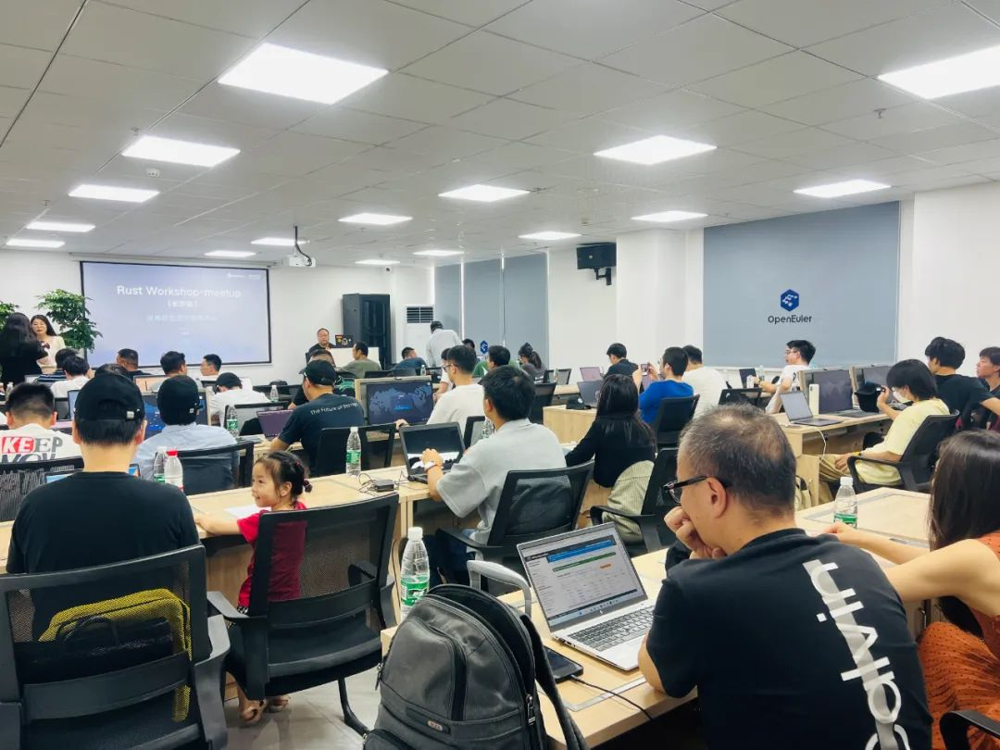
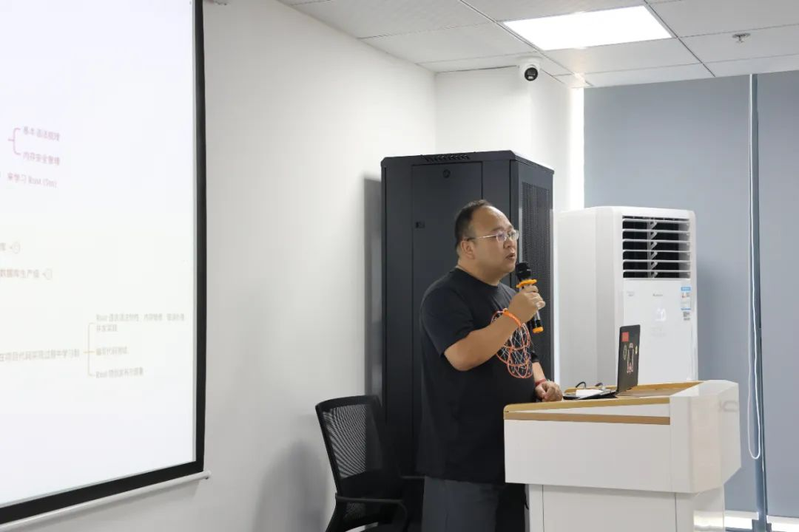
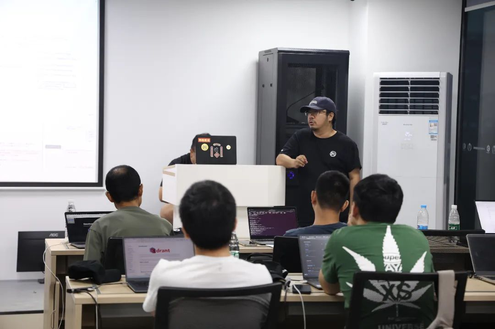
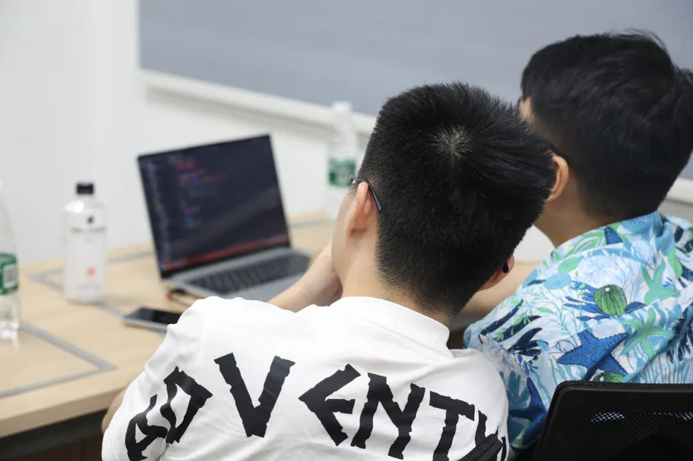
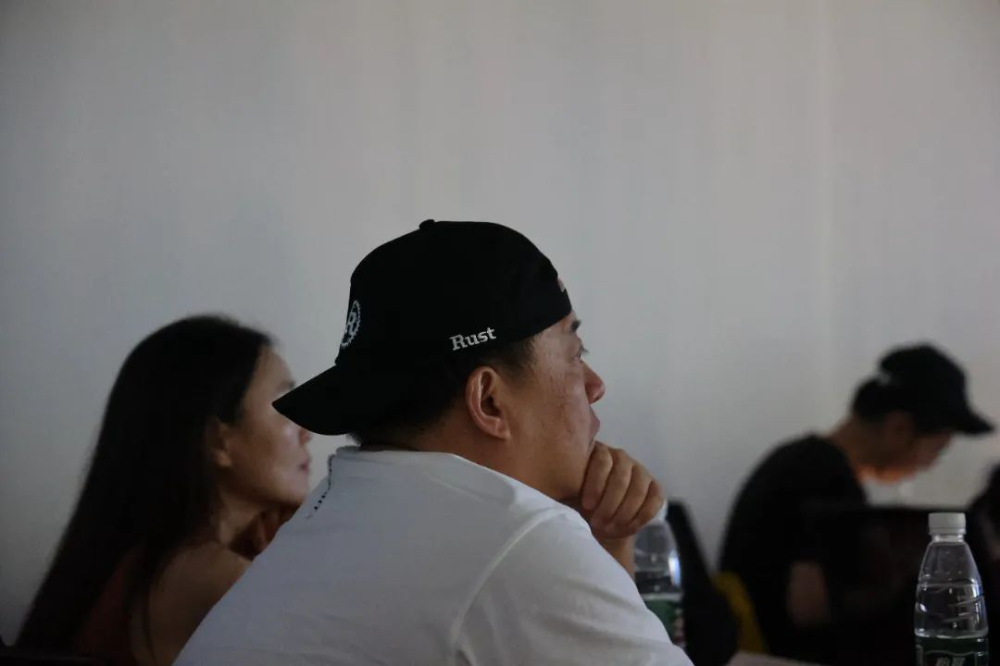

7月22日，由开放原子基金会指导，openEuler社区、湖南欧拉生态创新中心、长沙市软件和信息技术服务业促进会主办，麒麟信安、CSDN协办的openEuler Rust Workshop长沙站在湖南欧拉生态创新中心成功举办。作为一个致力于促进Rust编程语言爱好者之间交流和分享的盛会，本次活动旨在为Rust开发者们提供一个学习、交流和共享的平台，探索Rust在现代软件开发中的广阔应用前景。本次活动吸引了近50名Rust技术爱好者、行业精英线下参与。

# 引领者的智慧：资深Rust大咖张汉东带来主题演讲

活动伊始，华为顾问、资深Rust大咖张汉东老师为大家带来了备受期待的主题演讲《用
Rust
从零实现高性能、并发友好的向量数据库原型》。张汉东老师在演讲中分享了他多年来在Rust编程中的宝贵经验和深入研究，普及了AI时代流行的向量数据库基础知识，探讨了如何利用Rust实现高性能、并发友好的向量数据库原型的技术要点。张汉东老师的精彩分享帮助现场听众对Rust的强大能力有了更深刻的认识，也激发了大家对Rust在应用与创新层面的深入思考。

**知识的碰撞：现场交流讨论碰撞出"火花"**

在主题演讲后，现场编程爱好者们积极踊跃参与Lightning
talks环节。与会者们分享了自己在Rust开发过程中遇到的问题与解决方案，探讨了Rust生态系统中的最新动态和未来发展趋势。参与者们互相启发、共同探索，不仅加深了对Rust技术的理解，也结识了更多志同道合的编程伙伴。

# 欧拉：促进技术交流，共创开源未来

作为本次活动的主办方，湖南欧拉生态创新中心始终致力于推动开源生态繁荣，开源技术创新与发展，而Rust作为一门安全、高效且具备强大抽象能力的语言，与创新中心的理念不谋而合。未来，创新中心将继续支持类似的技术交流活动，为湖南地区的开源编程爱好者们提供更多学习的平台与交流的机会，推动前沿技术的普及与应用，培养更多优秀的开发者，为开源生态的发展贡献力量。
