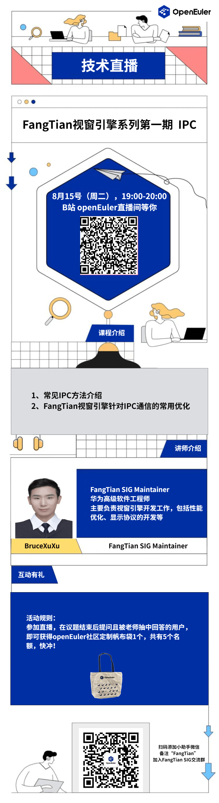

方天视窗引擎是openEuler社区 FangTianSIG开发的一套全新的视窗引擎，包含显示服务，窗口管理，图形绘制、合成、送显等功能。既适用于PC、服务器场景，也适用于移动设备场景，欢迎大家使用。

IPC（Inter-Process
Communication）一般指设备内跨进程通信，本次技术直播将详细介绍在视窗引擎开发过程中常见IPC方法介绍，以及FangTian视窗引擎针对IPC通信的常用优化。赶快预约直播，一探究竟吧！

