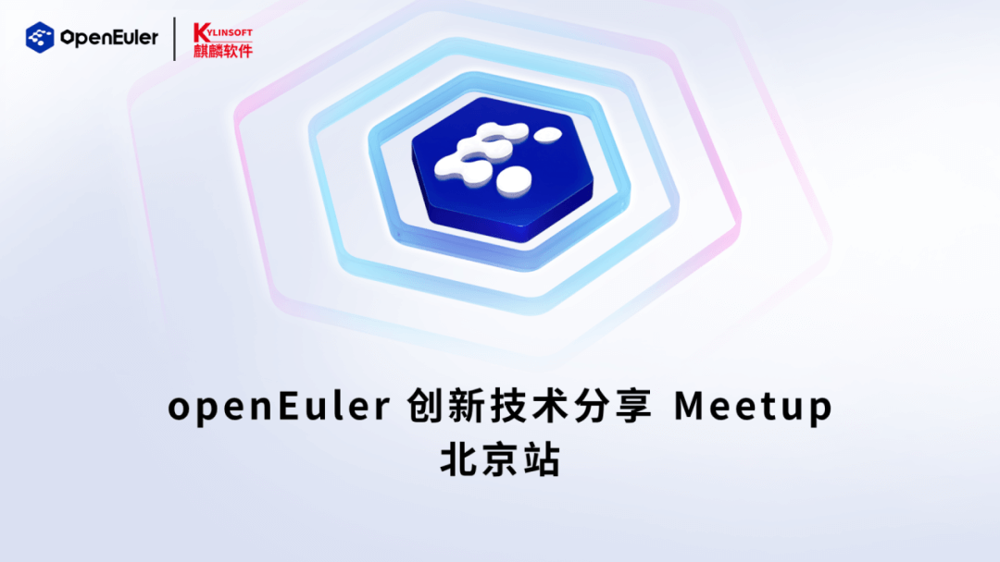

**亲爱的开发者们：**

大家好！

openEuler社区联合麒麟软件将**于8月25日在北京举办一场创新技术交流主题的Meetup**，我们将集分享、学习、交流、创新于一体，邀请多位不同领域的技术专家、开源社区爱好者共同探讨openEuler社区中孵化的创新技术及其未来规划。

为鼓励更多社区开发者登上openEuler社区交流平台，共同探讨和实践操作系统及应用领域技术与创新的未来，**欢迎大家踊跃申报议题**，与现场嘉宾分享开发故事、用户案例和最佳实践等。

**本次Meetup活动的议题方向不限，您可以参考以下方向展开：**

1\.
 openEuler社区创新技术介绍与应用案例分享：展示openEuler社区孵化的创新技术，并分享其在实际应用中的成功案例。

2\.
 开源社区生态圈发展与合作机遇：探讨开源社区与企业、高校之间的合作机遇，分享开源软件在不同领域的成功案例，展望开源社区生态圈的未来发展。

3\.
 开源软件在企业中的应用与挑战：由企业代表分享开源软件在企业应用中的成功经验和面临的挑战，传递实用的经验和启示。

4\.
 社区SIG组的技术创新方向与成果分享：开放给社区SIG组的成员，分享大家在技术创新方向上的工作和成果，以促进更广泛的技术交流和合作。

\...\...

如果您愿意分享您的实践经验和研究成果，请您**于8月14日前提交议题申报表**，议题入选将以时间顺序和主题匹配等综合考量，如您的议题入选，我们会在3个工作日内与您取得联系！

**Meetup活动详情如下：**

日期：8月25日

时间：14:00-17:30

地点：北京市海淀区海淀西大街36号中关村创业大街10号楼拓荒族

扫描下方二维码即可提报本次Meetup议题，8月14日截止提报！这个初秋，和openEuler在北京畅谈技术创新吧！

**扫码申报Meetup议题**
