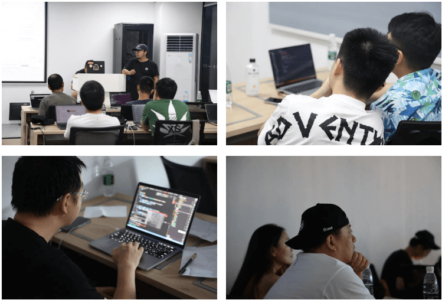
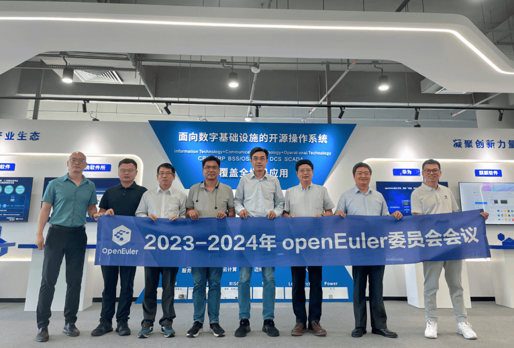
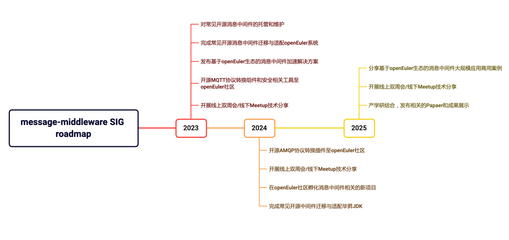
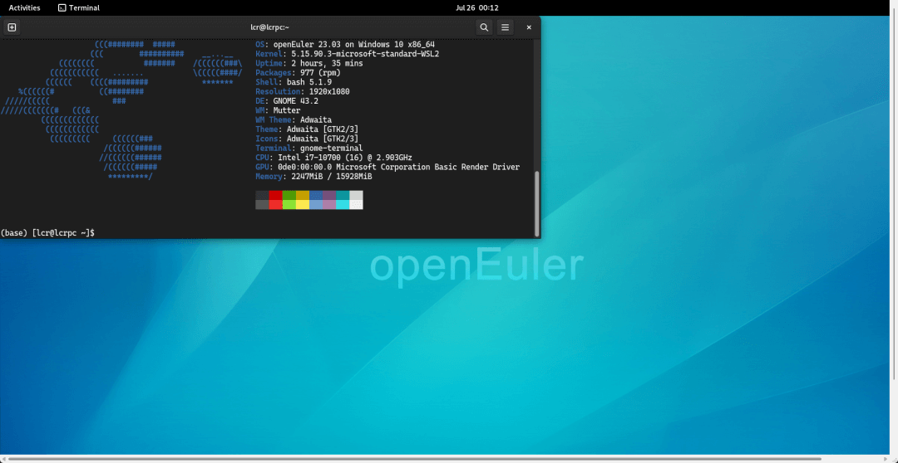

# 概述

近期，《openEuler
操作系统技术白皮书（创新项目总览）》发布，收录了开源3年来的优秀创新项目，也是社区伙伴共同贡献的成果体现。该白皮书每年更新两次，欢迎大家推荐项目。

2023-2024年openEuler委员会会议在北京开放原子开源基金会openEuler办公室召开。会上，openEuler委员会审议了openEuler社区近半年来的运作概况，并深入讨论社区下半年的运作规划与发展。

在技术方面，openEuler 22.03 LTS镜像正式登录AWS
Marketplace；在Linaro和SDS
SIG的推动下，openEuler完成对Ceph的生态适配，并通过CI持续验证；上个月发布的Metalink服务进一步完成调试，软件的下载速度有20+倍的提升；由FangTian
SIG主导的方天视窗引擎已能够在设备上流畅地运行；统信软件有限公司贡献新项目CCPS等等。感谢各位开发者的贡献。

其他方面，开放原子开源基金会openEuler办公室开放使用，欢迎小伙伴们申请。由openEuler和伙伴们共同打造社区用户案例、"openEuler
Call for X 计划"仍对外开放征集，欢迎朋友们加入。

本月报阅读时长预计15分钟。

# 社区规模

2023年7月底，openEuler社区用户累计超过146万。15,222名开发者在社区持续贡献。社区累计产生
120.4K 个PR、62.7K 条Issue。截至目前，加入 openEuler 社区的单位成员超过
1000 家，7月新增 42 家。

社区贡献看板（截至2023/7/31）

# 社区事件

## openEuler 操作系统技术白皮书（创新项目总览）发布

2023年，openEuler进入正循环自加速的发展阶段。我们将社区伙伴的优秀成果、社区技术生态、创新项目等收录进《openEuler操作系统技术白皮书（创新项目总览）》（以下简称：白皮书）中，并发布在社区官网上，以呈现openEuelr社区生态面貌。

欢迎推荐项目进入到白皮书，携手共建，推动社区生态健康发展。

openEuler操作系统技术白皮书（创新项目总览）

更新频次：每年3月和9月

联系：chengxinxin@openeuler.sh

链接：

[openEuler操作系统（创新项目总览）](/whitepaper/openEuler操作系统（创新项目总览）.pdf)

## openEuler 22.03 LTS登录AWS Marketplace

近日，[[openEuler 22.03 LTS镜像正式登录AWS
Marketplace]](https://mp.weixin.qq.com/s?__biz=MzI2NDE4OTE2Mg==&mid=2247505202&idx=1&sn=b0ea2098e614489e5065e3424b221bf9&chksm=eab2f0b7ddc579a1c2c160c62ab522ad3203281edf84bac69d276f3f647cc164f5dfab0fcad5&token=1753499675&lang=zh_CN&scene=21#wechat_redirect)，目前在亚太及欧洲15个Region开放使用，后续将开放更多版本和区域。openEuler
22.03 LTS AMI(Amazon Machine Images)由openEuler社区提供支持。

使用指南：

<https://www.openeuler.org/zh/blog/20230711-AMIs/AMIs.html>

## Ceph社区原生支持openEuler

近期，在openEuler SDS
SIG与Linaro的联合推动下，Ceph社区正式合入openEuler，并通过CI持续验证。这意味着openEuler在对Ceph的生态适配得到了Ceph社区的认可，相关技术已与Ceph生态完成适配。感谢赵帅（GitHub@kevinzs2048）、刘秦飞（GitHub@liuqinfei）、王玺源（GitHub@wangxiyuan）以及每一位为此努力的开发者。

[[原文阅读
\>\>\> ]](https://mp.weixin.qq.com/s?__biz=MzI2NDE4OTE2Mg==&mid=2247505356&idx=1&sn=9b16086dc303931d56ea7f7ae2d58f13&chksm=eab2f049ddc5795f77b9cd66c9cfc703407724420004b244fa1a23669669b0b41442424ba77e&token=1753499675&lang=zh_CN&scene=21#wechat_redirect)

## openEuler Compiler SIG 两名成员成为OpenJDK Committer

上个月在 OpenJDK 社区发起的 CFV: New JDK
Committer 提名投票结果公布，openEuler Compiler SIG 成员Yadong
Wang（GitHub@yadongw）和 Feilong
Jiang（GitHub@feilongjiang）提名通过，正式成为 JDK
Committer。[[（原文阅读）]](https://mp.weixin.qq.com/s?__biz=MzI2NDE4OTE2Mg==&mid=2247505356&idx=3&sn=69ae4f4b14ecafa77cbac5d6fce1044c&chksm=eab2f049ddc5795f25360dc87e8a15a8eff33790d5c9175c4f7ef6774e3641e9c7a8e2351415&token=1753499675&lang=zh_CN&scene=21#wechat_redirect)

openEuler Compiler SIG 专注于编译器领域技术交流探讨和分享，包括
GCC/LLVM/OpenJDK 以及其他的程序优化技术。2020年前后，Compiler SIG发起
OpenJDK RV64GC 移植项目，Yadong Wang、Feilong
Jiang与华为编译器团队的其他开发者共同完成了包括 C2 JIT 在内的 JVM
移植工作。2021
年开源之后，联合阿里巴巴（阿里云）JVM团队、中国科学院软件研究所PLCT实验室等团队向
OpenJDK 上游社区（Upstream）回馈并被社区接收。两位贡献者因在RISC-V
架构上的工作获得了 JDK Committer 提名。

## openEuler Rust Workshop长沙站圆满收官

7月22日，由openEuler社区、湖南欧拉生态创新中心、长沙市软件和信息技术服务业促进会主办，麒麟信安、CSDN协办的[[openEuler
Rust
Workshop长沙站]](https://mp.weixin.qq.com/s?__biz=MzI2NDE4OTE2Mg==&mid=2247505377&idx=2&sn=0a1e615b4fcd60f1d3185008312de1d9&chksm=eab2f064ddc57972bc6a70335ec8de7bcd5dc1d58df9273e846e099554435e094d3cafe0db45&token=1753499675&lang=zh_CN&scene=21#wechat_redirect)在湖南欧拉生态创新中心成功举办。作为一个致力于促进Rust编程语言爱好者之间交流和分享的盛会，活动吸引了近50名Rust技术爱好者线下参加，共同交流自己在Rust开发过程中遇到的问题与解决方案。

## Curve & openEuler 联合推出Summer Code Camp

7月20日，云原生计算基金会 (CNCF) Sandbox 项目Curve与 openEuler
联合推出 [[Summer Code
Camp]](https://mp.weixin.qq.com/s?__biz=MzI2NDE4OTE2Mg==&mid=2247505332&idx=2&sn=089bbc019d44317cf2203391e5f97227&chksm=eab2f031ddc57927f4ea77ef9dd509db748423ac277ad47113d800654b0a875f5f795685199b&token=1753499675&lang=zh_CN&scene=21#wechat_redirect)。活动精心准备了3个难度等级，60+题。欢迎开发者申报感兴趣的题目，完成题目的可获得专属徽章、证书；幸运的朋友还可能得到价值上千的专属大礼包。

活动报名官网：

<https://summercoding-curve.app.codewave.163.com/apply>

## openEuler 用户案例持续征集中

openEuler用户案例持续征集中，社区诚邀伙伴们共同打造《openEuler开源操作系统行业应用案例集》，以展示openEuler在不同行业的应用场景与优势，为其他用户提供借鉴和参考，共同探索openEuler的更多可能性。

发布案例征集以来，社区已收到众多投稿，每周四，openEuler运营团队将选取优秀案例在公众号上同步呈现，欢迎关注。

7月"案例周四见"精选案例：

-   [[超聚变和厦门大学助力兴业银行构建智慧金融隐私计算平台]](https://mp.weixin.qq.com/s?__biz=MzI2NDE4OTE2Mg==&mid=2247505428&idx=1&sn=f6cb7a89d9a214c8fbbffd86eca47e62&chksm=eab2f391ddc57a87e3fe5aa643fecc2a204608f472081f33757ef6c3fae50d15bb4121e8b723&scene=21&cur_album_id=2832526047882493953#wechat_redirect)

-   [[瀚元科技：利用A-OPS
    智能运维助力边缘服务器运维效率提升30%]](https://mp.weixin.qq.com/s?__biz=MzI2NDE4OTE2Mg==&mid=2247505418&idx=1&sn=405f5fc5b032226ad0aae0fae6129bf1&chksm=eab2f38fddc57a99be881419c4a355d0bb45eebbc5d448f6e2fc1960cb946555de496f216fad&scene=21&cur_album_id=2832526047882493953#wechat_redirect)

-   [[大唐集团向阳山等风电厂 SCADA
    系统平滑完成系统迁移]](https://mp.weixin.qq.com/s?__biz=MzI2NDE4OTE2Mg==&mid=2247505332&idx=1&sn=eeb38dc2a6613c1532182c7e7f1c9a6b&chksm=eab2f031ddc57927b57eb26a35f247e5a453d63dcd82c51b950635d767ea026276d4aa4c8d6d&scene=21&cur_album_id=2832526047882493953#wechat_redirect)

-   [[兰州大学超算中心：应用openEuler实现HPC性能倍增]](https://mp.weixin.qq.com/s?__biz=MzI2NDE4OTE2Mg==&mid=2247505243&idx=1&sn=e2c72418c33e85f6cc94bc95e0ff8d8d&chksm=eab2f0deddc579c8f0691f0ced9c50ce54dddc4bec1af44f80aa538d6f4eaa8f611445ea9c24&scene=21&cur_album_id=2832526047882493953#wechat_redirect)

-   [[申万宏源携手超聚变打造极速高频量化交易平台]](https://mp.weixin.qq.com/s?__biz=MzI2NDE4OTE2Mg==&mid=2247505082&idx=1&sn=593376ae4b95c3f289c85696462dd9ba&chksm=eab2f13fddc57829c224c9018a8b9b094dc6c19f2ea0b9ba4dae41a948f88065e6b9c911597e&scene=21&cur_album_id=2832526047882493953#wechat_redirect)

如果您想投稿案例，欢迎联系 user@openeuler.sh

[openEuler用户案例征集，欢迎投稿>>>](https://mp.weixin.qq.com/s?__biz=MzI2NDE4OTE2Mg==&mid=2247504655&idx=1&sn=c999745c471760b99bd601a57bc81c37&chksm=eab2f68addc57f9cc72385b4e5bdd163389368b370655a38606bfe53c3d2e7d5381debd70afc&token=2077163593&lang=zh_CN&scene=21#wechat_redirect)

# 社区治理

## 2023-2024年openEuler委员会在北京召开

2023-2024年openEuler委员会会议在北京开放原子开源基金会openEuler办公室召开。

会上，openEuler委员会审议了openEuler项目群2023年第二季度的重点工作进展和第三季度的工作规划，
openEuler技术委员会介绍了2023年项目群技术工作总结和下半年技术工作规划，openEuler品牌委员会介绍了第三季度的海外重点会议参会策略。openEuler委员会就各区域生态创新中心的工作开展进行深入的讨论、指导和决策。

[[原文阅读
\>\>\> ]](https://mp.weixin.qq.com/s?__biz=MzI2NDE4OTE2Mg==&mid=2247505356&idx=2&sn=bca79cd81cf6426639402dad4dc5f62c&chksm=eab2f049ddc5795fbd57da963ba78e6331f1528440c591a6e8aba7ccaa8903b91aef3a438837&token=1753499675&lang=zh_CN&scene=21#wechat_redirect)

图为：2023-2024年openEuler委员会合影（部分openEuler委员会委员和与会人

## message-middleware SIG 正式成立并投入运作

经openEuler 技术委员会委员（TC）讨论决定，message-middleware
SIG在社区成立并运作。该 SIG 组由中国移动云能力中心牵头发起，并主导制定该
SIG 组的相关工作职责、内容和未来发展规划。

message-middleware SIG 将专注于探索为开源用户提供基于 openEuler
基础软件的消息中间件性能加速、安全加固、提升稳定性的解决方案，同时孵化消息相关的新项目（多协议消息转换组件、消息
API
标准和消息流转引擎等），补齐国内在该领域的相关能力。当前，该SIG组已正式投入运作，并得到腾讯云、京东云等公司的大力支持。感兴趣的朋友可参加message-middleware
SIG双周例会（每双周 周三 19:30），了解并参与该SIG组工作。

[[原文阅读
\>\>\> ]](https://mp.weixin.qq.com/s?__biz=MzI2NDE4OTE2Mg==&mid=2247504991&idx=1&sn=a14c9b2bb64c237e1d7bf04ef24a4f16&chksm=eab2f1daddc578ccf155d7fc79a115fe4aa847fff6e50528956f39af4a40587f796ccc6ac8bc&token=1753499675&lang=zh_CN&scene=21#wechat_redirect)

## openEuler内核kconfig翻新及内核包拆分提案通过

近期，openEuler
技术委员会（TC）通过了由超聚变发起的openEuler内核kconfig翻新及内核包拆分的oEEP提案。其目的在于全面评估openEuler内核的编译配置，开启更多硬件驱动内核模块。

当前openEuler的内核配置主要为服务器场景优化。相比于其他主流发行版如Fedora、openSUSE、Ubuntu和Debian等，openEuler内核开启的硬件驱动模块数量明显偏少。经过此次提案的讨论，社区技术委员会同意对内核配置进行全面的评估，开启更多硬件驱动模块，目标是达到主流发行版水平。该提案落实后，将大大提升openEuler在多样化的硬件平台上的开箱即用体验，便于广大开发者和用户在多种多样的设备上安装、测试和使用openEuler。同时，openEuler的内核包也将进行拆分，未来将提供最小内核包、基础包及扩展包，便于用户根据场景进行选择。

它们分别适用的场景如下：

-   最小内核包去掉了大量物理硬件的驱动，适合于云和虚拟化场景，帮助减少在虚拟机中的资源占用。

-   基础包增加了更多服务器平台常用设备的驱动模块，适合于在物理服务器上的部署。

-   扩展包则包含本次内核配置调整后新增的大量驱动模块，适合于各类PC和开发测试设备。

本提案预计在今年的23.09创新版中实现，提供给广大用户使用并听取反馈，为在下一个LTS版本中引入做好准备。

相关链接：

https://www.openeuler.org/zh/oEEP/?name=oEEP-0006+openEuler内核kconfig翻新及内核包拆分

# 技术进展

## 统信软件有限公司贡献新项目CCPS

2023年7月12日，经过openEuler技术委员会（TC）审核批准，统信软件正式向openEuler社区贡献了容器云管理平台解决方案（CCPS）。

容器云管理平台解决方案（CCPS）是以Kubernetes、OKD、CRI-O为基础，以应用为中心的企业级容器云PaaS平台，通过全栈自动化操作的DevOps工作流，对接各种基础架构的方法，提供自动伸缩、配置管理、资源管理、自动运维等功能，实现对容器化应用的全生命周期管理。

 对于管理员视角，容器云管理平台解决方案具有可视化管理、身份验证和授权、事件和日志收集、监控和报警等功能；对于开发者视角，容器云管理平台解决方案具有自动化的容器和应用构建、部署、扩展、运行状况管理等功能。

 项目地址：<https://gitee.com/ccps>

下图为容器云管理平台解决方案（CCPS）的技术架构图

## Metalink性能提升，软件的下载速度提升20+倍

经过一个月的调试，Metalink服务性能得到进一步的提升。开发者在新版本（openEuler-22.03-LTS-SP2）的dnf配置文件中添加metalink配置项后，服务会自动选择最优站点，提升软件下载速度。测试结果显示，在添加metalink配置项后，国内的下载速度有20\~30倍的提升；欧洲和北美有50\~100倍速度的提升。后续openEuler将在更多版本中添加metalink配置项，保证用户在openEuler下载软件时更高效，稳定。

[[原文阅读
\>\>\> ]](https://mp.weixin.qq.com/s?__biz=MzI2NDE4OTE2Mg==&mid=2247505387&idx=1&sn=22beb4be7d0b07619e22eb90bcf0f72b&chksm=eab2f06eddc57978850f976fe61d1a4bd95b2b03b70efb7cf6328384ed26de74a8a60ac30f08&token=1753499675&lang=zh_CN&scene=21#wechat_redirect)

图为配置metalink服务后的测试结果：

## RISC-V SIG发布 Eulaceura 23H1 版本

近期，[[RISC-V SIG发布了 Eulaceura 23H1
版本]](https://mp.weixin.qq.com/s?__biz=MzI2NDE4OTE2Mg==&mid=2247505224&idx=1&sn=3ffe3f4339fb3eed9ca4daae640093df&chksm=eab2f0cdddc579db3c2d45a1011f8a47df9f39dfa82ffd15829b979e11ef79c8f926f722919a&token=1753499675&lang=zh_CN&scene=21#wechat_redirect)。该版本搭建了
Linux Kernel 6.1 版本内核，适用于矽速科技 LicheePi 4A 的映像也已公布。

Eulaceura是基于 openEuler 开发的RISC-V 架构的发行版，与 openEuler RISC-V
项目共享部分组件，给 RISC-V 的开发者开箱即用的 RISC-V
系统环境，方便开发者进行各种创新项目的开发与验证。

项目地址：<https://gitee.com/eulaceura>

RISC-V SIG：<https://gitee.com/openeuler/RISC-V>

## FangTian SIG 工作进展

经过两个月的开发调试，由FangTian
SIG主导的方天视窗引擎已能够在设备上流畅地运行[[（原文阅读）]](https://mp.weixin.qq.com/s?__biz=MzI2NDE4OTE2Mg==&mid=2247505410&idx=1&sn=92777ca72e0592e1eeb041b5c598ff8b&chksm=eab2f387ddc57a91df927a042bb791c72dd9099216dd79dd5f19e6d0f9976f68714bf854ba5b&token=1753499675&lang=zh_CN&scene=21#wechat_redirect)。该运行Demo展示了方天视窗引擎窗口创建、销毁、层叠、多窗口等基础功能，以及对输入事件进行识别、分发的能力，并能通过鼠标实现窗口移动、缩放等操作；FangTian
SIG将聚焦视窗引擎，持续为用户带来的全新显示体验。

作为全新的一套视窗引擎，方天视窗引擎在为应用提供视窗显示能力的同时，提出新的FT协议，采用自绘制+统一渲染架构以及数据驱动表达，降低Cilent与Server之间交互数据量，达到性能、内存、功耗等各方面的提升。这使得方天引擎既适用于PC、服务器场景，也适用于移动设备场景。FangTian
SIG目前在快速迭代中，后续会继续完善提供更多的视窗能力，欢迎感兴趣的朋友关注。

FangTian SIG：

<https://www.openeuler.org/zh/sig/sig-detail/?name=sig-FangTian>

图为方天视窗引擎在设备上流畅运行的Demo

## SDS SIG 工作进展

SDS
SIG致力于打造高质量、高性能、高可靠性的分布式存储组件版本，构建丰富的南北向生态。本月，SDS的工作主要集中在以下几个方面：

-   联合Linaro完成openEuler对Ceph的生态适配，并通过CI持续验证；

-   持续帮助云原生计算基金会 (CNCF) 项目Curve
    对openEuler的适配工作，丰富openEuler社区生态；

-   完成SDS
    SIG中英文主页的搭建，帮助开发者参与社区工作。开发者不仅可以查看SDS
    SIG 的基本信息，还能了解SDS
    SIG的创新项目及其进展，核心服务维护的工作、技术报告列表，SIG例会日历等等。

 中文页：
https://www.openeuler.org/zh/sig/sig-detail/?name=sig-SDS\

 英文页：
https://www.openeuler.org/en/sig/sig-detail/?name=sig-SDS

## Infrastructure SIG 工作进展

深入分析社区需求，提升开发者使用体验，一直是openEuler基础设施团队努力的方向。官网论坛、QuickIssue、软件包贡献平台、用户软件仓EUR、EulerLauncher等等随手可用的工具，都是社区基础设施团队与其他开发者一起贡献的成果。本月，基础设施团队持续发力：

-   完成Metalink的开发调试，提升软件下载速度。

-   让开发者在不方便访问windows store时使用openEuler的WSL，openEuler
    WSL新增sideload发布件，自openEuler
    22.03-LTS-SP2版本发布起，sideload跟随官方源同步发布，通过仓库根目录下的WSL目录即可下载体验。

- **相关链接：**[[如何使用openEuler WSL sideload]](https://mp.weixin.qq.com/s?__biz=MzI2NDE4OTE2Mg==&mid=2247505243&idx=2&sn=e73b4f071773a829788a30ea11392ea3&chksm=eab2f0deddc579c8d33f7b8c68709f9d8484e88a93e41ee274a61565c024a606c0988a1082c7&token=1753499675&lang=zh_CN&scene=21#wechat_redirect)

-   在EUR中，新增了xrdp组件包 https://eur.openeuler.openatom.cn/coprs/mywaaagh_admin/xrdp/ ，通过该软件包，开发者即可在openEuler中体验完整的桌面环境
    。

- **相关链接：**[[如何在openEuler WSL中体验完整的桌面环境]](https://mp.weixin.qq.com/s?__biz=MzI2NDE4OTE2Mg==&mid=2247505454&idx=1&sn=b2ed1fb3a65267e4ebbb31a4bbd5e3b5&chksm=eab2f3abddc57abd4d4df0d4570ea235f0a52f64a5f76c8bb66563ceaedc5e49b0e4ba87b7ca&token=1753499675&lang=zh_CN&scene=21#wechat_redirect)

# 软硬件兼容性清单

2023年7月，openEuler兼容性方案累计 1071个，其中北向 651个，南向
392个，OS 88个，7月新增 北向 42个，南向 12个，OS 4个。

社区兼容性清单：

<https://www.openeuler.org/zh/compatibility/>

# 安全公告

2023年7月，社区共发布安全公告91个，修复漏洞84个（其中 Critical 9个，High
38个，其它 37个），公告不受影响漏洞 22个。

-   **重点漏洞提醒**

如下漏洞评估影响较大，请重点关注：

**firefox存在整数溢出漏洞（CVE-2022-22822）**

**CVSS评分为9.8分**

公告链接：

<https://www.openeuler.org/zh/security/cve/detail/?cveId=CVE-2022-22822&packageName=firefox>

影响范围：

openEuler-20.03-LTS-SP1

openEuler-20.03-LTS-SP3

**firefox存在整数溢出漏洞（CVE-2022-22823）**

**CVSS评分为9.8分**

公告链接：

https://www.openeuler.org/zh/security/cve/detail/?cveId=CVE-2022-22823&packageName=firefox

影响范围：

openEuler-20.03-LTS-SP1

openEuler-20.03-LTS-SP3

**firefox存在整数溢出漏洞（CVE-2022-22824）**

**CVSS评分为9.8分**

公告链接：

https://www.openeuler.org/zh/security/cve/detail/?cveId=CVE-2022-22824&packageName=firefox

影响范围：

openEuler-20.03-LTS-SP1

openEuler-20.03-LTS-SP3

**syslinux中zlib1.2.8的crc32_big函数可能会被依赖上下文的攻击者利用基于大端CRC计算的向量产生不确定的影响（CVE-2016-9843）**

**CVSS评分为9.8分**

公告链接：

https://www.openeuler.org/zh/security/cve/detail/?cveId=CVE-2016-9843&packageName=syslinux

影响范围：

openEuler-20.03-LTS-SP1

openEuler-20.03-LTS-SP3

openEuler-22.03-LTS

openEuler-22.03-LTS-SP1

openEuler-22.03-LTS-SP2

**syslinux中zlib1.2.8的inffast.c可能会被依赖上下文的攻击者利用不正确的指针运算产生不确定的影响（CVE-2016-9841）**

**CVSS评分为9.8分**

公告链接：

https://www.openeuler.org/zh/security/cve/detail/?cveId=CVE-2016-9841&packageName=syslinux

影响范围：

openEuler-20.03-LTS-SP1

openEuler-20.03-LTS-SP3

openEuler-22.03-LTS

openEuler-22.03-LTS-SP1

openEuler-22.03-LTS-SP2

**gnuplot缓冲区溢出漏洞（CVE-2020-25969）**

**CVSS评分为9.8分**

公告链接：

https://www.openeuler.org/zh/security/cve/detail/?cveId=CVE-2020-25969&packageName=gnuplot

影响范围：

openEuler-20.03-LTS-SP1

openEuler-20.03-LTS-SP3

openEuler-22.03-LTS

openEuler-22.03-LTS-SP1

openEuler-22.03-LTS-SP2

**golang代码注入漏洞（CVE-2023-29402）**

**CVSS评分为9.8分**

公告链接：

https://www.openeuler.org/zh/security/cve/detail/?cveId=CVE-2023-29402&packageName=golang

影响范围：

openEuler-20.03-LTS-SP1

openEuler-20.03-LTS-SP3

openEuler-22.03-LTS

openEuler-22.03-LTS-SP1

**golang执行任意代码漏洞（CVE-2023-29404）**

**CVSS评分为9.8分**

公告链接：

https://www.openeuler.org/zh/security/cve/detail/?cveId=CVE-2023-29404&packageName=golang

影响范围：

openEuler-20.03-LTS-SP1

openEuler-20.03-LTS-SP3

openEuler-22.03-LTS

openEuler-22.03-LTS-SP1

**golang执行任意代码漏洞（CVE-2023-29405）**

**CVSS评分为9.8分**

公告链接：

https://www.openeuler.org/zh/security/cve/detail/?cveId=CVE-2023-29405&packageName=golang

影响范围：

openEuler-20.03-LTS-SP1

openEuler-20.03-LTS-SP3

openEuler-22.03-LTS

openEuler-22.03-LTS-SP1

-   **漏洞防护**

openEuler社区针对在维版本例行修复漏洞，发布安全补丁。建议用户关注openEuler官网安全公告，及时安装漏洞补丁进行防护。

openEuler安全公告：

https://www.openeuler.org/zh/security/security-bulletins/

# 人才培养

## openEuler认证工程师累计超过1000名

南京柯普瑞信息技术有限公司通过openEuler社区项目群评审，成为openEuler开源社区人才评定合作伙伴之一。

   
openEuler人才评定体系，是由openEuler社区与社区合作伙伴共同打造，旨在帮助企业快速培养专业openEuler生态人才，促使技术爱好者踊跃融入社区技术生态建设。7月，90余名开发者通过openEuler人才评定，成为openEuler认证工程师。发展至今，openEuler认证工程师已超过1000名。

openEuler人才评定：

https://talent-assessment.openeuler.org/#/

# 感谢每一位朋友、开发者的支持

因为大家的辛勤贡献，openEuler的每一天都发生着好的事情。小编限于视野和能力，难免有所遗漏，在此表示歉意。同时，衷心感谢社区朋友、开发者们以及openEuler
SIG组成员的贡献：

\* 以上不分先后顺序

如果您希望在月报中增加您的工作内容，或对内容有任何改进建议，请联系wengqiaozhen@openeuler.sh。
