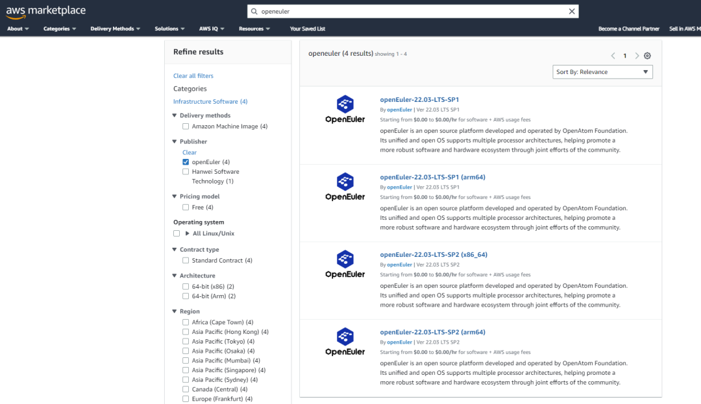

自2023年7月openEuler 22.03 LTS SP1正式登陆AWS
Marketplace后，openEuler社区一直持续于在AWS上提供更多版本。

**目前，openEuler22.03 LTS SP1 ,SP2两个版本及 x86
arm64两种架构的四个镜像均可通过AWS对外提供**，且在亚太及欧洲15个Region开放使用，openEuler将持续提供更多版本和区域。

openEuler 22.03 LTS AMI(Amazon Machine Images)由openEuler社区提供支持。
