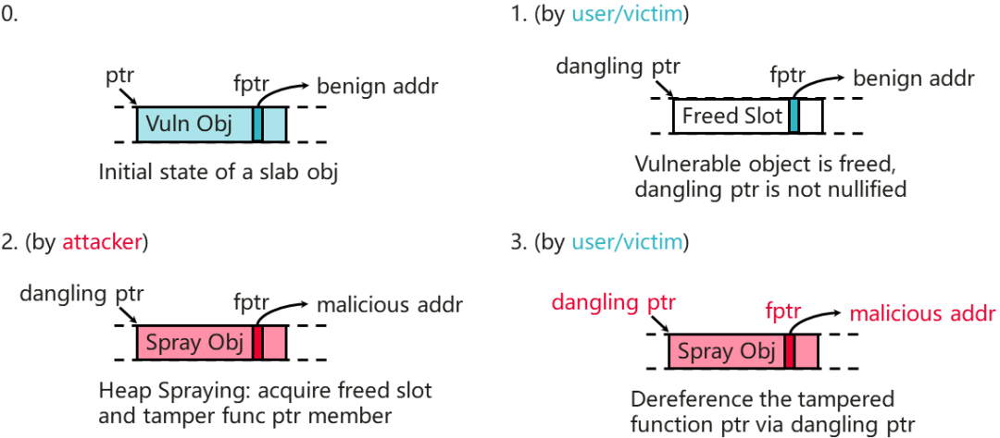
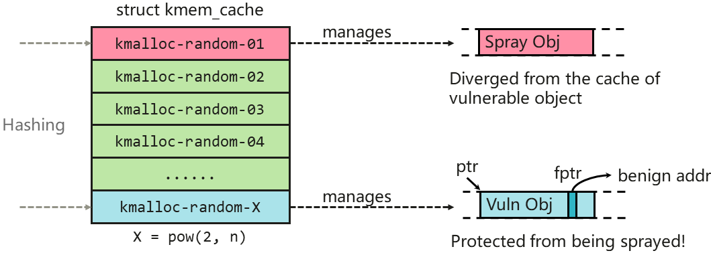
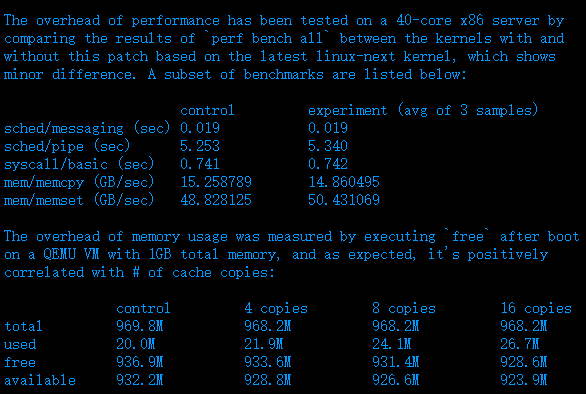

"This is a **nice balance** between the best option we have now
(\"slub_nomerge\") and most invasive changes (type-based allocation
segregation, which requires at least extensive compiler support),forcing
some caches to be \"out of reach\"."

------ Kees Cook，Linux Kernel 安全加固子系统 Maintainer

openEuler 始终坚持 upstream
first,积极与国际主流开源社区合作，华为、麒麟软件、统信软件、麒麟信安等都是
Linux Kernel 社区的贡献者。7 月 14 日下午 2 点 44 分，openEuler
社区成员，来自华为的龚睿奇向 Linux Kernel 社区提交了名为 Randomized slab
caches for kmalloc()的特性补丁（第 5 版），2 个小时后，该补丁被 Linux
Kernel 社区 SLAB 子系统维护者 Vlastimil Babka 接受。该特性预计会随着
Linux Kernel 6.6 版本发布，之后会回合到 openEuler 社区 。

## 内核漏洞年年有，内存问题尤其多

Linux Kernel
存在漏洞不可避免，其中与**内存释放和读写错误**相关的漏洞最为常见，由此引发的常见内存漏洞问题主要有
Use-After-Free（释放后使用，UAF）、Out-of-Bounds（访问越界，OOB）、Double
Free（重复释放）等。攻击者在发现此类漏洞后，通常会以普通用户登录操作系统，然后通过一系列操作来触发内存错误，使内核进入异常状态。这类攻击的最终目的是为了获得操作系统的
root 权限，最终攫取整个操作系统的控制权。触发UAF、OOB
等内存问题，最常见攻击方法是堆喷（Heap
Spraying）。

**UAF 问题**例如：对存在 UAF
问题的内存对象，攻击者可以待其被释放后对其实施喷射，篡改其中的内容，就能影响其在后续被使用时的系统行为。

## Randomized slab caches for kmalloc()

堆喷得以实现的原因主要有两个：「第一，通用 SLAB
缓存跨子系统/模块共享，这在当前 Linux Kernel 中已广泛存在；第二，专用
SLAB 与通用 SLAB 缓存之间可能发生合并，这虽然可以通过 Linux Kernel
启动参数 slab_nomerge 阻止，但这么做对性能影响较大。」龚睿奇提供的
Randomized slab caches for kmalloc()
特性为缓解这个问题提供了一个新方案。首先，创建多份永不合并的通用 SLAB
缓存。第二，kmalloc() 在对外分配内存时从上述多份 SLAB
缓存中随机选取一份。这样就避免了存在漏洞的内存对象与其他子系统/模块的内存对象位于同一个的
SLAB
缓存上，从而避免漏洞内存对象遭受喷射。

Randomized slab caches for
kmalloc()如何实现这个随机机制呢？该方案采用的是获取 kmalloc()
的调用点地址，并基于该地址的哈希值来选取 SLAB 缓存。如此，同一处函数调用
kmalloc() 所选用的随机缓存是固定的，不同函数调用 kmalloc()
所选用的随机缓存则（大概率）不同。这种方式令该方案不会被暴力重复利用绕过，安全性更高。另外，为防止攻击者通过分析
Linux Kernel 源码，来寻找与存在漏洞的内存对象共用同一份 SLAB 缓存的
kmalloc() 调用点，龚睿奇在上述方案的基础上掺入了一个随机种子。该种子在
Linux Kernel 启动时更新，启动后只读。这使得每个 kmalloc() 选择的 SLAB
缓存在每次重启后改变，从而阻止攻击者的上述企图。

Randomized slab caches for
kmalloc()性能和内核测试结果\
龚睿奇提交到 Linux Kernel
社区的补丁展示了方案的性能和内存测试数据，可以看到方案对内核的性能几乎没有影响；其额外内存消耗与新增的
SLAB
缓存数量呈正相关，但增量不大。最终达到了安全和性能之间的"良好平衡（nice
balance）"。目前该特性将被合入到 Linux Kernel 6.6
中，预计在2023年10月底发布。

## openEuler 坚持 upstream first，立足中国，面向全球

openEuler 立足中国，面向全球，积极推进国际化进程。目前全球 4
大主流开源基金会的 95%的开源项目已经原生支持 openEuler，上游开源社区集成
openEuler CI 的有 3 个。

2022 年 9 月 13 日，openEuler
正式亮相欧洲开源峰会（OSSEU），收到了国外开发者的大量关注和反馈，这是欧拉迈向国际化的重要一步，标志着欧拉海外生态正式起航。

2023年9月19-21日，openEuler将在全球开源顶级峰会Open Source Summit Europe
2023上全面亮相，与世界各地的开发者进行互动。

**9月19日西班牙毕尔巴鄂，不见不散！**

