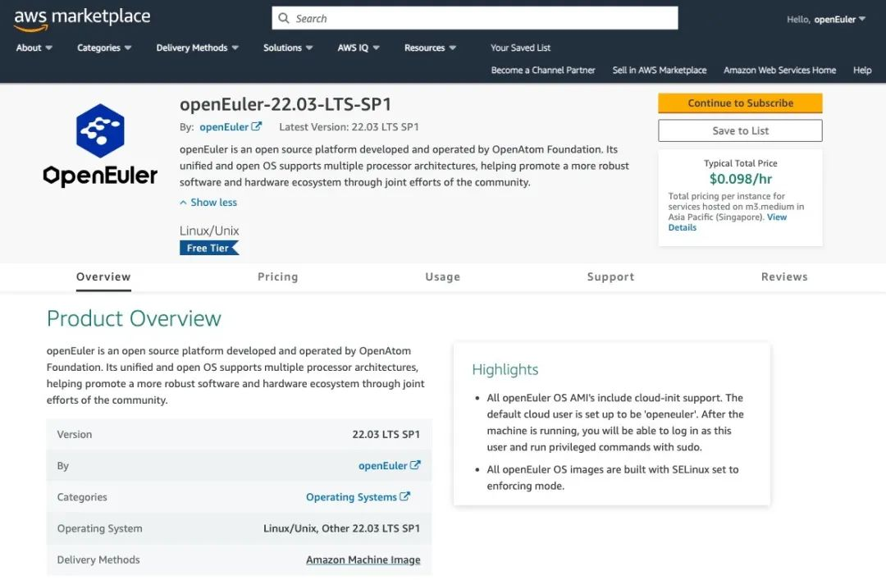

**openEuler 22.03 LTS镜像正式登录AWS
Marketplace**，目前在亚太及欧洲15个Region开放使用，后续将开放更多版本和区域，openEuler
22.03 LTS AMI(Amazon Machine Images)由openEuler社区提供支持。

[点击链接即可查看具体使用指导](https://www.openeuler.org/zh/blog/20230711-AMIs/AMIs.html)
