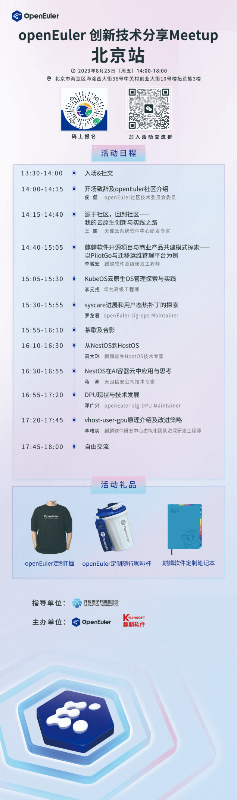

8月 25日，openEuler社区将联合麒麟软件在北京举办【openEuler
创新技术分享Meetup】。在本场线下活动中，我们将集分享、学习、交流、创新于一体，邀请多位不同领域的技术专家、开源社区爱好者共同探讨openEuler社区中孵化的创新技术及其未来规划。我们还为参会伙伴们准备了精美的周边礼品！

## 活动信息

活动时间：2023年8月25日（周五）14:00-18:00

活动地点：北京市海淀区海淀西大街36号中关村创业大街10号楼拓荒族3楼

## 扫码报名

请扫码填写报名表，参与
openEuler创新技术分享Meetup北京站，开启创新技术探索之旅，加入活动交流群，畅所欲言交流技术，第一时间了解活动动态～

扫码报名

## 活动流程

这个初秋，欢迎广大技术爱好者及开发者来北京与我们线下面对面交流\~

PS：本次Meetup届时也会同步openEuler b站直播，欢迎大家参加\~
