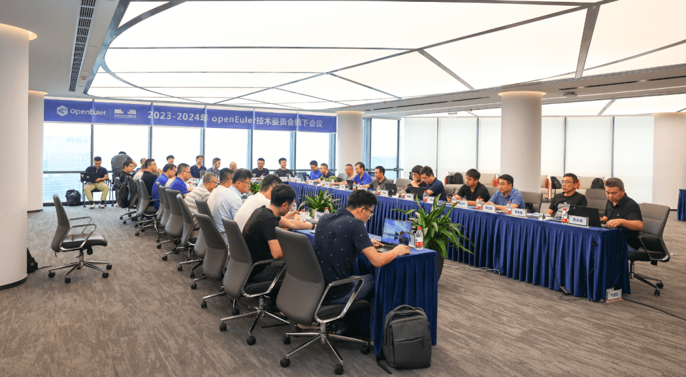
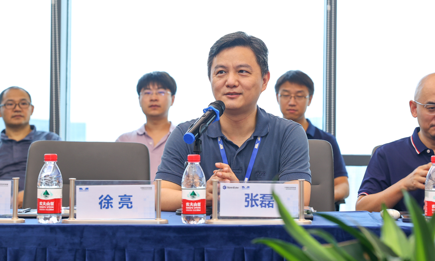
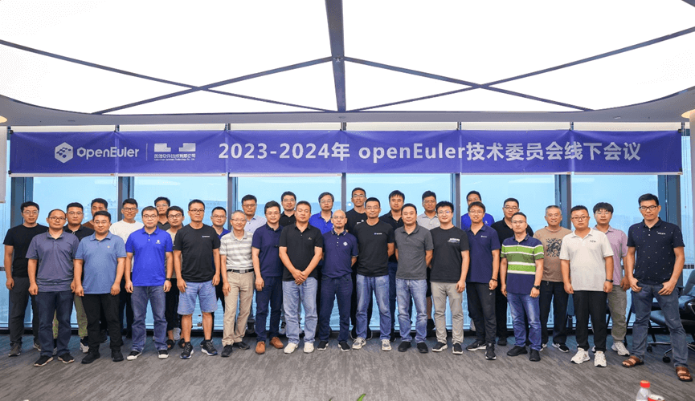

2023年8月11日，
2023-2024年openEuler技术委员会第三次线下会议在北京统信软件顺利召开。本次会议由统信软件承办。\
作为openEuler社区的创始企业之一，统信软件一直以来都大力投入社区各方面的建设工作。这次闭门会议，统信软件准备周到，安排高效，服务贴心，充分体现了统信软件一直以来对openEuler社区的大力支持。openEuler技术委员会对统信软件的支持和安排表示感谢。\
本次线下会议由技术委员会委员胡亚弟主持，线下32人、线上11人参与，包括openEuler技术委员会全体委员及部分往届委员、社区运营专家、议题报告人，以及开放原子开源基金会TOC项目导师罗文江、徐亮、张烨、郑伟波参会指导。\

会议开始前，统信软件技术有限公司高级副总经理
CTO
张磊作为会议的承办方代表致辞，他在致辞中表示，在过去的两年，统信软件秉持自由开放的开源精神向openEuler社区贡献了多款自研软件。未来统信软件将继续携手openEuler社区，以"打造操作系统创新生态，给世界更好的选择"为愿景，专注于操作系统的研发与服务，发展和建设以中国技术为核心的创新生态。

正式会议中，首先openEuler技术委员会主席胡欣蔚总体回顾了openEuler社区当前进展，并提出了下半年社区技术项目发展制度和流程上的规划。为更好地帮助社区的原创创新项目能够更好的发展，熊伟委员提议在openEuler社区建立新项目导师制度，拟计划组建openEuler社区导师团，并为进入社区的新项目配备导师，指导项目在社区成长到发展成熟。胡峰委员汇报了
openEuler 24.03
作为下一个LTS以及版本规划的方案，技术委员会委员全票通过，同意openEuler
24.03 作为社区下一个LTS版本，并同意采用 2023 年年底的上游内核社区LTS
版本作为openEuler 24.03
LTS版本的内核选型版本。曹志委员就社区基础设施建设上的进展向大家进行了汇报，各委员和SIG负责人对社区基础设施提出了各自的反馈和诉求，基础设施团队将在后期继续落实改进。会议还就社区云原生建设、多内核支持、
llvm平行宇宙、memsafety SIG发展规划、Kernel
SIG运作章程等社区技术项目建设议题进行了深入探讨，进一步明确了下一步的工作计划。

本次会议还邀请到用户委员会主席薛蕾向大家介绍了用户委员会的运作及工作计划，以促进技术委员会和用户委员会在工作上有更多连接和合作，让用户的反馈和诉求更好地传递到社区，为社区技术规划提供参考。双方一致同意加强两个委员会的交流和沟通，致力于建立需求从用户中来，最终开发结果回馈用户的正向循环。

会议开展一天时间，来自国内外不同公司不同团队的委员与技术专家、开放原子开源基金会TOC导师汇聚一堂，就每个议题都进行了细致的探讨，提出了众多想法和意见，将对下半年社区技术工作具有重要指导意义。

2023-2024年 openEuler技术委员会第三次线下会议合影

注：openEuler技术委员会是openEuler项目群的技术领导机构，技术委员会委员通过日常线上TC例会及定期开展线下会议共同决策社区技术发展方向事宜。
