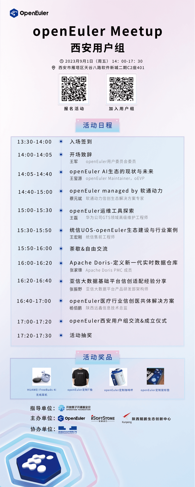

为方便openEuler各区域用户及开发者交流openEuler技术、应用经验，社区陆续在各区域成立了城市用户组。9月1日，将聚集西安地域用户，开展一场线下Meetup，分享交流openEuler生态进展、openEuler运维经验、openEuler案例实践，并正式成立西安用户组，（[**点击申请加入用户组\>\>**](http://mp.weixin.qq.com/s?__biz=MzI2NDE4OTE2Mg==&mid=2247505855&idx=1&sn=37a593a9a931b94f1d84570ed160b6d1&chksm=eab2f23addc57b2c60ce1ad041135f4ab51da4831af2b4b894b5761c08d692fbc2b9c30f1fe6&scene=21#wechat_redirect)）。

## 活动信息

活动时间：2023年9月1日  14:00-17:30

活动地点：西安市雁塔区天谷八路软件新城二期C2座401

## 报名参会

扫码报名

## 活动流程

