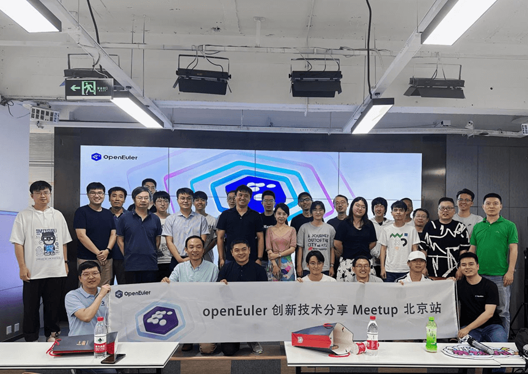

2023年8月25日，openEuler社区联合麒麟软件组织的openEuler社区创新技术分享Meetup在北京顺利召开。本次会议以"开源和商业闭环"为主题，在分享openEuler社区创新技术的同时，讨论如何将创新技术与商业产品结合，促进创新项目良性发展。

参会专家及社区爱好者签到

# 精彩议题分享

侯健进行开场致辞，欢迎各位专家及社区爱好者的到来，并介绍openEuler社区现状。openEuler社区由开放原子开源基金会孵化，国内各个公司通过捐赠者的形式参与管理与推动。经过三年多的发展，openEuler社区发行版已经形成一套完整的研发管理体系和商业模式，现场介绍几个创新项目与商业产品结合的模式，引出大家对创新项目发展的思考。

来自天翼云的王麟专家分享了自己在各个公司参与开源社区的历程，介绍了感兴趣的各类开源技术问题及解决方案，如云原生基础设施中多基线升级与安全更新问题、降本增效背景下云原生新引擎的替代方案、各类应用场景下的新型操作系统、高性价比云主机方案等。王麟专家鼓励年轻人走进社区、爱上社区，并以自身成长经历鼓励年轻人走出自己的技术之路，给开源新人启迪与鼓舞。

来自麒麟软件的李城宏专家介绍了麒麟软件在PilotGo开源项目与银河麒麟服务器迁移运维管理平台产品研发中，依托社区，共建共治，实现技术驱动、先行先试。迁移运维平台作为麒麟软件面向客户的商业产品，以稳定、高效、万台主机大规模管理为目标，重点打造系统运维提质增效与商业服务保障。两个项目从技术、人员、需求、服务等资源上相互打通，优势互补，实现企业与开源社区的互利共惠、良性互动。

李元戎专家分享了KubeOS云原生OS管理探索与实践，介绍了KubeOS技术的底层原理及架构，并讨论了云原生场景下的OS管理问题。通过将OS作为组件接入到K8S集群当中，使用
kubernetes 统一管理 OS 和业务容器，实现业务容器与OS的协同调度。

openEuler sig-ops
Maintainer罗龙君分享了openEuler社区的SysCare热补丁技术，带领大家一窥热补丁技术底层原理及基于rpm的应用实践，并与大家热情讨论SysCare技术在落地时的各种需求。

中场休息期间，各个专家及爱好者深入沟通与交流。

麒麟软件HostOS技术专家高大玮分享了他对NestOS的理解和HostOS技术方案的思考。openEuler
NestOS一直以来是面向云原生场景的操作系统，但缺乏云底座全场景领域的技术方案。麒麟云底座HostOS以云IaaS技术场景为切入点结合NestOS不可变操作系统理念，在不久的未来将演进出双模式形态。依托openEuler和麒麟的技术创新，打造云IaaS底座专属操作系统。

天固信安公司技术专家蒋涛分享了NestOS在AI容器云中应用与思考，结合前沿AI技术与深度优化的NestOS平台，向大家介绍如何借助底层OS深度创新，提高AI应用的稳定性及性能释放。

openEuler社区 DPU SIG
Maintainer邓广兴介绍了openEuler社区DPU现状与技术规划，希望在社区当中吸引国内外各DPU或smartNIC厂商参与，鼓励厂商共同参与制定统一标准，加速DPU技术方案的落地及通用适配，并讨论了DPU的发展趋势及新型使用方式。

麒麟软件研发中心虚拟化团队的李唯实专家回顾了传统云桌面场景下虚拟GPU的痛点以及常规解决方案的优劣，提出了自研的vhost-user-gpu方案，详细介绍了GPU虚拟化方案改进策略，为低成本、高性能云桌面等应用场景提供技术支撑。

本次创新技术线下Meetup会议中，各位专家分享了他们在各自领域的最新研究成果和实践经验，展示了openEuler社区中各类底层创新技术的蓬勃发展，为开发者带来新视野和新思路。
