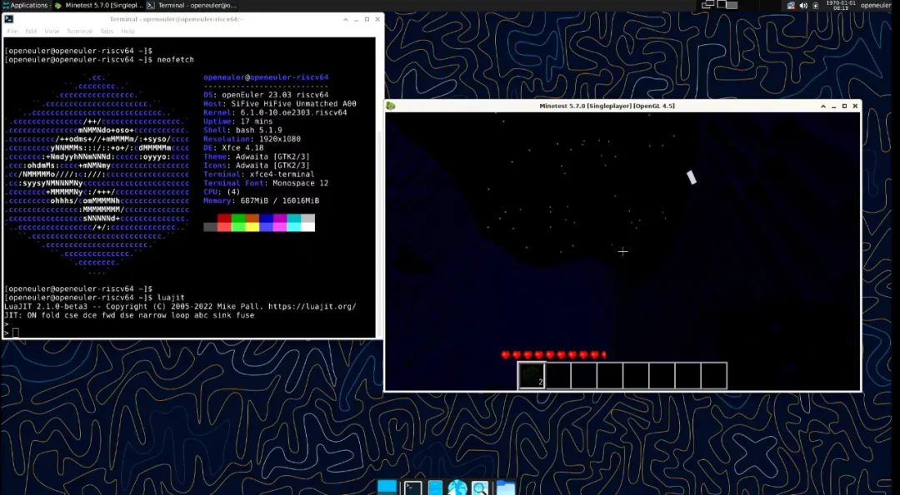
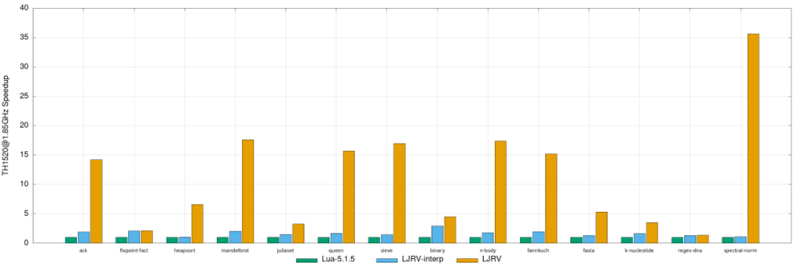
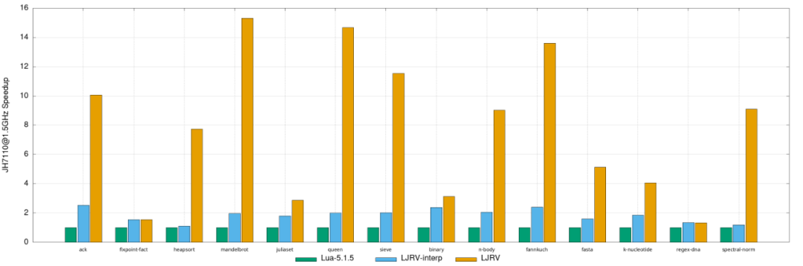

RISC-V SIG 预期随主线发布的 openEuler 23.09 创新版本会集成 LuaJIT RISC-V
支持。本次发版将提供带有完整 LuaJIT 支持的 RISC-V 环境并带有相关软件如
openResty 等软件的支持。

随着 RISC-V SIG 主线推动工作的进展，LuaJIT 和相关软件在 RISC-V
架构下的支持也被合入到 openEuler 主线代码中。这标志着，openEuler
将成为首个在主线分支为 LuaJIT 提供 RISC-V 架构支持的主流发行版。

## LuaJIT 的优势与特点

LuaJIT 是一个高效的 Lua5.1
实现，有高效的解释器与优雅的即时编译引擎，拥有相较原版 Lua5.1
平均数倍的性能，不仅如此，它也有诸如 FFI、Bitop 扩展和部分 Lua
高版本的特性。基于以上原因，LuaJIT 被广泛使用，成为了事实上的 Lua5.1/5.2
运行时。

## LuaJIT RISC-V 项目背景

LuaJIT RISC-V（简称 LJRV）是将 LuaJIT 移植到 64 位 RISC-V
平台上的项目，旨在为 RISC-V 平台提供一个高效的 Lua 运行时，让依赖 LuaJIT
的项目在 RISC-V
平台上也能无障碍运行。此前，相关工作在国内外各个开源发行版平台仍然属于技术空白。

## 技术挑战与工作进展

由于 LuaJIT
的核心部分使用汇编编写，移植到不同指令集平台中的复杂性很大。尤其是
LuaJIT 的 JIT 部分不依赖于如 LLVM 的通用编译框架，此前仅在 x86、ARM
等平台完成移植，而 RISC-V 指令集的移植工作尚未开始，大量依赖 LuaJIT
的软件包在 RISC-V 架构的各个发行版上或无法运行，或只能使用低速的原版
Lua5.1。

目前，中科院软件所成功移植了 LuaJIT 的大部分功能，包括 DynASM
动态汇编器，解释器运行时和 RISC-V 后端，现已通过 PUC Lua5.1 回归测试与
LuaJIT 回归测试。同时，可以在 RISC-V 64 平台上运行依赖 LuaJIT 的程序有
Sysbench，Neovim，OpenResty，LÖVE 等。已知存在的问题是 Unwinding
功能尚未充分移植，JIT 可能会出现一些未知的
bug。待相关工作完成与修复后，工程会进一步合入上游。

另外在 openEuler 主线上，一些依赖 luajit 的包，都是深度集成形式的，如
openResty，wrk 等，移植工作需要进行进一步适配。

## 合入 openEuler 主线

基于 LuaJIT 的移植成果，RISC-V SIG 打包了相关 patch 并且合入了 openEuler
的 LuaJIT master 分支。这意味着从即将发布的 openEuler 23.09
创新版本开始，openEuler 将原生支持 RISC-V 平台的 LuaJIT
以及相关生态软件包，这将是首个在主线分支为 LuaJIT 提供 RISC-V
架构支持的主流发行版。

同时，在 LuaJIT 开发工作的基础上，RISC-V SIG 也为 openResty 等 LuaJIT
强依赖的软件包提供了相应的支持，目前已合入主线。下图是依赖 LuaJIT
的开源游戏 Minetest 的运行演示图，基于的环境是 openEuler RISC-V 平台和
Unmatched 开发板。根据用户测试反馈，游戏画面流畅，操作延迟低。

## 性能对比及结果展示

我们在 VisionFive 2 和 LicheePi 4A 上分别使用 PUC Lua5.1、LJRV 关闭
JIT、LJRV 开启 JIT，运行了 Lua-Benchmarks。在 TH1520 和 JH7110
环境的结果如下：

