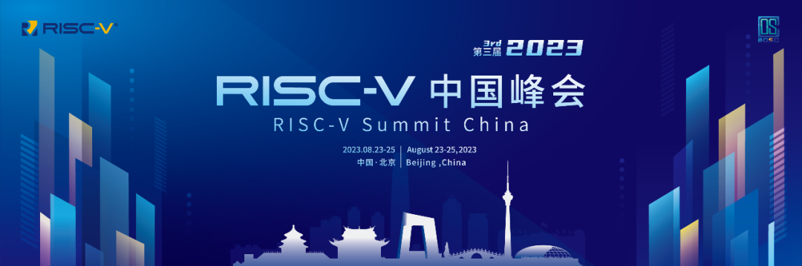
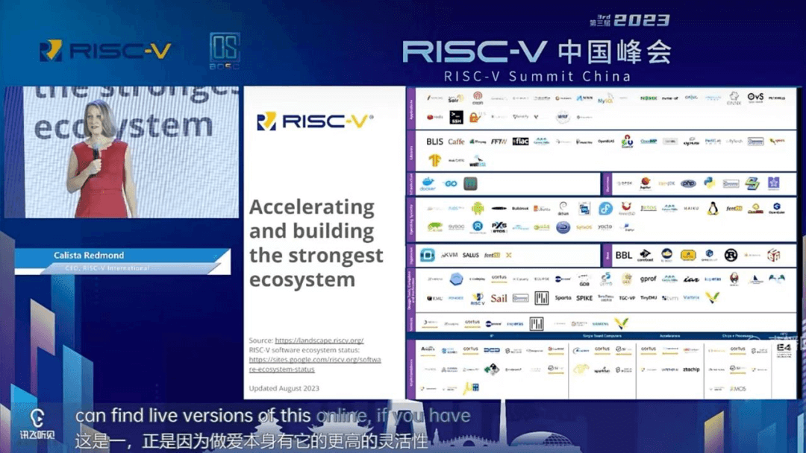
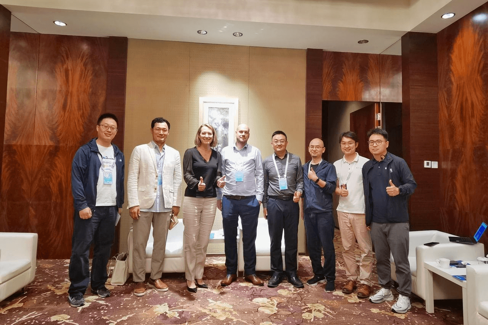
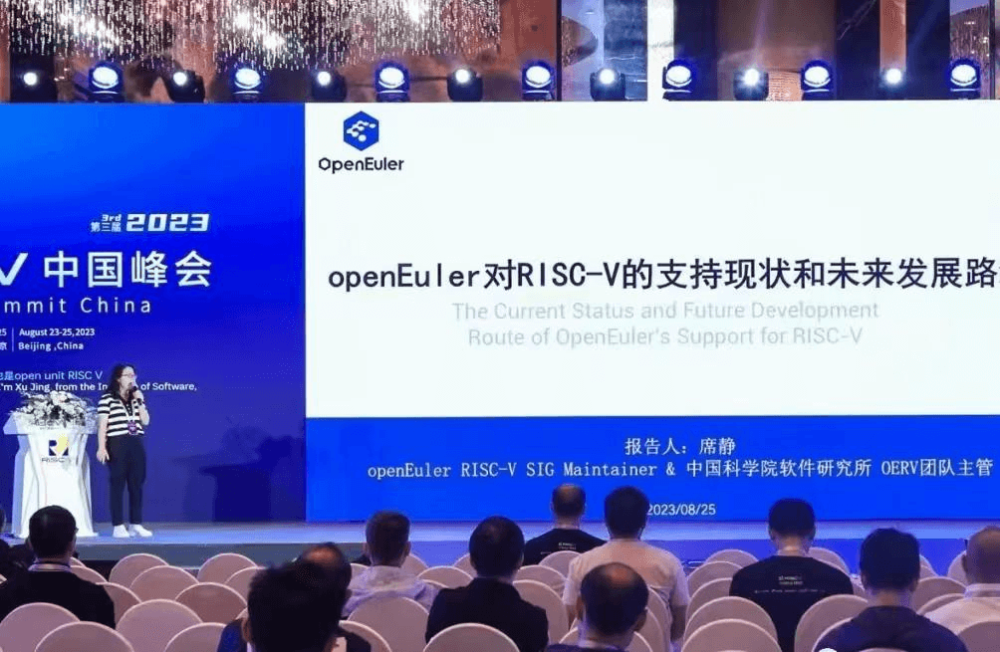
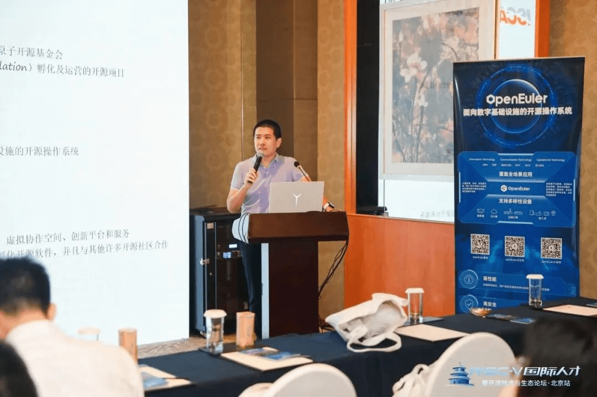

8月23日-25日，第三届
RISC-V中国峰会在北京成功召开。此次峰会以"RISC-V生态共建"为主题，汇聚行业领军人物、RISC-V
International
代表、领域专家及社区伙伴，共同探讨RISC-V技术发展新趋势，并聚集了来自世界各地的RISC-V开发者和爱好者，分享他们在开源处理器领域的研究成果和最佳实践。

## openEuler助力RISC-V生态发展，并亮相RISC-V Landscape

在首日的演讲上， RISC-V国际基金会CEO Calista
Redmond介绍了RISC-V的生态进展。目前，市场上已经有超过100亿颗RISC-V芯片，软件生态也取得了不俗的进展。

在RISC-V生态中，每一个参与者都至关重要，为此RISC-V社区发布了RISC-V
Ecosystem
Landscape，用于展示RISC-V生态中各领域的发展情况。openEuler始终以多样性算力支持最优的OS作为社区发展的重要目标，开源之初就成立了RISC-V
SIG并在RISC-V生态适配做出了诸多贡献，**此次也作为首个源自中国的开源操作系统亮相RISC-V
Landscape的Operating System领域**。

## openEuler 与 RISC-V生态合作的进展和未来规划

24日下午，RISC-V国际基金会CEO Calista Redmond、Board, Software Committee
Chair Philipp Tomsich、TSC Peter Chun
以及openEuler委员会委员武延军、技术委员会主席胡欣蔚、上海交通大学分布式并行实验室教授、博士生导师，Penglai-Enclave发起人夏虞斌，RISC-V
SIG
Maintainer、RISC-V中国大使吴伟、openEuler社区运营经理郑振宇等进行了深入交流。双方就openEuler
与
RISC-V生态合作的进展和规划充分的交换了意见，未来两个社区将在技术、生态、开发者、用户等进一步深化合作，共同推动RISC-V生态的快速发展。

## openEuler 精彩议题分享

openEuler在本次大会也带来众多议题，其中openEuler 社区 RISC-V SIG
Maintainer、RuyiSDK 团队 OERV 主管席静发表《openEuler 对 RISC-V
的支持现状和未来发展路线》，介绍了openEuler 对 RISC-V
支持的现状，包括软硬件适配、发行版维护、RISC-V 架构 合入主线、LLVM
平行宇宙等工作情况，同时也带来openEuler RISC-V
SIG未来的发展路线。openEuler当前已发布了4个全面支持RISC-V架构的社区版本，完成超过6000款软件在RISC-V架构上的适配，未来将进一步提升软件数量及质量。

中科院软件所硕士生导师、openEuler Embedded SIG、RISC-V SIG
活跃开发者于佳耕带来《基于openEuler
Embedded的AI边缘计算解决方案》，介绍了由中科院软件所在openEuler社区及OpenHarmony社区共同开发的基于openEuler Embedded的AI边缘计算解决方案，该方案利用布式软总线完成基于openEuler的RISC-V嵌入式Linux设备与OpenHarmony的互联互通，实现高效、可靠、自发现、自接入的AI边缘计算集群。

链接：

https://isrc.iscas.ac.cn/riscv-raios/docs/software/dsoftbus/index.html

openEuler非常重视在RISC-V架构上的适配和优化，2020 年4月 openEuler
社区成立了 RISC-V SIG 组，旨在提供openEuler RISC-V版本，并指导openEuler
RISC-V的软件包和体系建设，促进对RISC-V感兴趣的开发者参与开源系统的开发。经过3年的开发，**openEuler目前已支持超过6000款软件在RISC-V架构上的适配，同时已发布4个可以完整适配RISC-V的社区发行版。**
