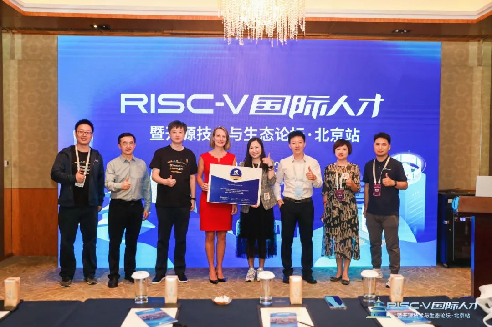
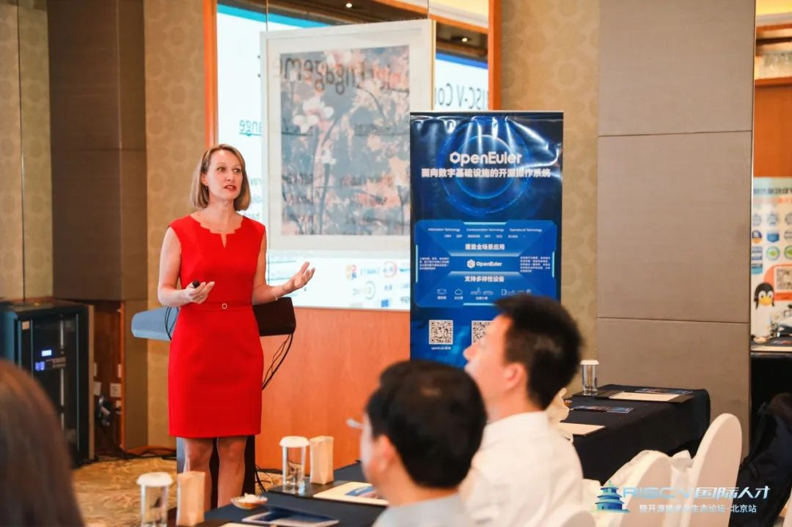
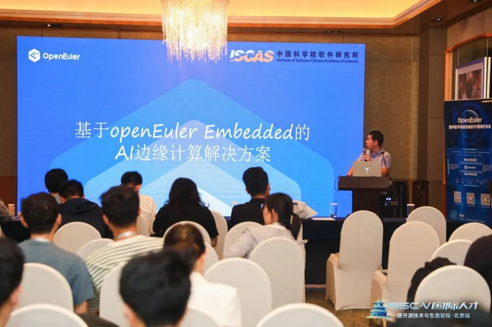
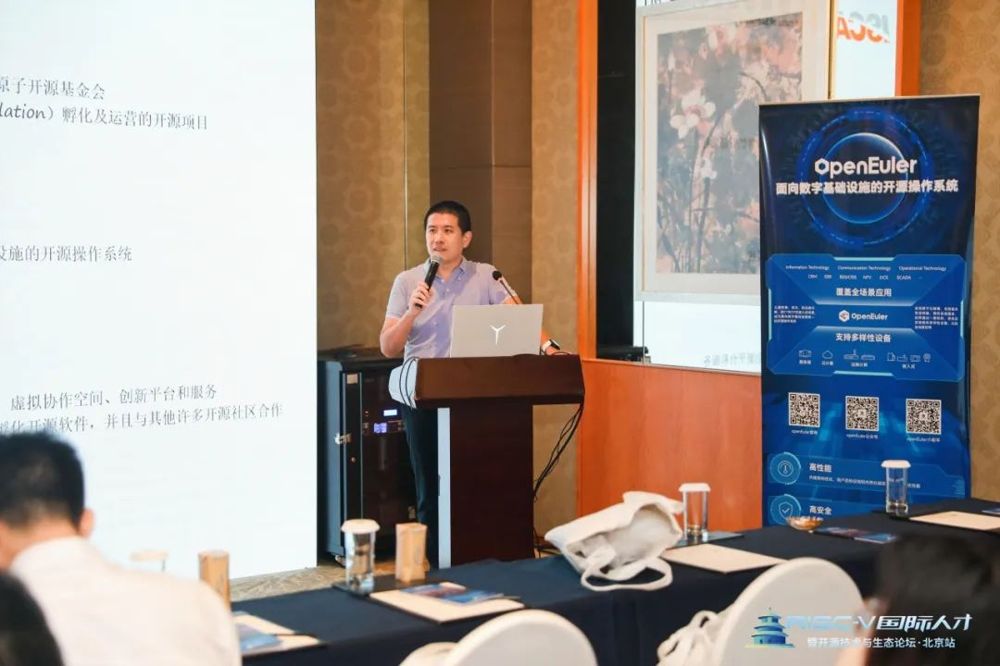

8月23日至25日， 2023 RISC-V中国峰会（RISC-V Summit China
2023）在北京举行。作为操作系统的关键项目，openEuler深入参与本次峰会分论坛【RISC-V国际人才暨开源技术与生态】的举办。8月23日，RISC-V
International、中国科学院软件研究所、openEuler、RIOS、MindSpore、平头哥等国内外开源专家齐聚现场，分享开源技术的最新成果和实践经验，探讨数字中国开源之路的发展方向和机遇。

本次分论坛非常有幸邀请到RISC-V基金会CEO Calista Redmond
女士做开场致辞，并共同发布RISC-V人才培养计划，此计划专为企业、高校及科研单位而设，希望透过这个计划，可以帮助机构进一步培养更多RISC-V开源人才，共建更好的RISC-V社区。

作为本次活动的联合主办方，openEuler社区参与其中。

## 基于openEuler Embedded的AI边缘计算解决方案

来自中科院软件所的于佳耕老师带来了有关openEuler
RISC-V领域发展情况以及未来计划。openEuler自成立之初就将RISC-V作为重点支持的主要架构之一，目前已发布多个支持RISC-V架构的操作系统版本，openEuler在RISC-V领域的人才培养也做出了诸多贡献。

**由中科院软件所在openEuler社区及OpenHarmony社区共同开发的基于openEuler
Embedded的AI边缘计算解决方案也在本论坛上发布**。该方案介绍分布式软总线的背景知识，以及如何基于软总线完成RISC-V嵌入式Linux设备与OpenHarmony的互联互通。

链接：

<https://isrc.iscas.ac.cn/riscv-raios/docs/software/dsoftbus/index.html>

RISC-V国际人才暨开源技术与生态论坛已落下帷幕，openEuler社区依然会带着最初的愿景「聚合
RISC-V 上下游开发者和生态伙伴，在社区构建活跃的 RISC-V
生态。」，保持并弘扬对开源操作系统一贯的热情，照亮其他开发者的开源之路。

openEuler非常重视在RISC-V架构上的适配和优化，2020 年4月 openEuler
社区成立了 RISC-V SIG 组，旨在提供openEuler RISC-V版本，并指导openEuler
RISC-V的软件包和体系建设，促进对RISC-V感兴趣的开发者参与开源系统的开发。经过3年的开发，**openEuler目前已支持超过6000款软件在RISC-V架构上的适配，同时已发布4个可以完整适配RISC-V的社区发行版。**

欢迎大家加入openEuler社区 RISC-V SIG，与其他 Linux 用户和 RISC-V
爱好者交流互动，学习新知识，共同推动 openEuler RISC-V 的发展。
