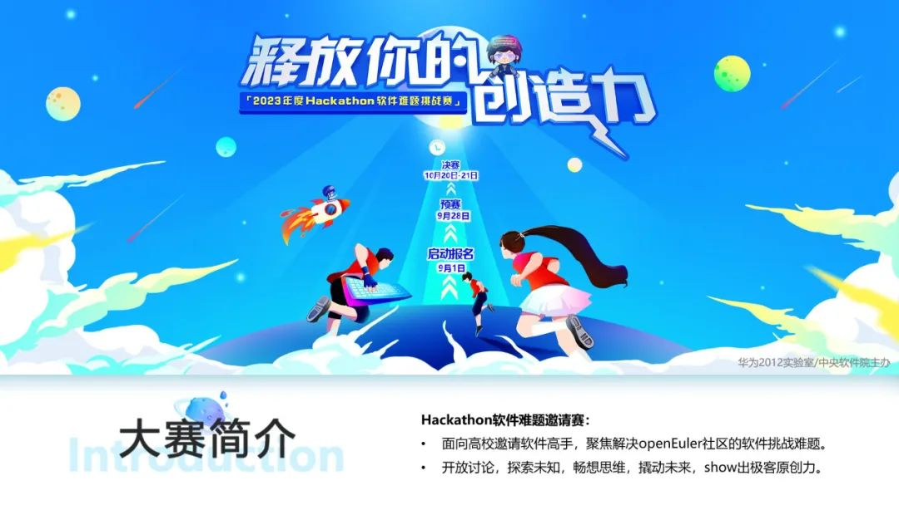

hi，同学！

想一起挑战软件难题吗？

深入开源社区、与软件精英一结对编程，扩大知识视野，show
出极致自我，晋级决赛还可以开展一段松山湖欧洲小镇之旅。

那么，机会来了\~

华为 2023 年度 Hackathon
软件难题邀请赛，它来辣，邀请社区的高校学生积极参与。

## 大赛简介

2023 年 Hackathon 软件难题挑战赛由华为 2012
实验室/中央软件院主办。同时邀请开源社区的软件高手，解决 openEuler
社区的软件难题，开放讨论，探索未知，畅想思维，撬动未来，show
出极客原创力。

## 大赛计划

2023 年度 Hackathon 软件邀请赛将于 9 月 1
日启动报名，分为预赛和决赛：预赛基于在线平台，结对编程答题，选拔编程能力和算法思维优秀的软件高手进入决赛；决赛采用开放思维，在规定时间内通过集中编程，解决
openEuler 社区软件难题，涌现未来专家。

## 预赛

预赛基于在线平台进行，3 小时在线结对编程，语言不限，选拔编程&算法能力的
Top2 团队晋级。

-   报名时间：9 月 1 日\~9 月 22 日

-   比赛时间：9 月 26 日 09:00\~12:00

-   3 人/队自由组队参赛

-   报名方式：参赛队长提交邮件申请（内容如下）至 wuxu.wu@huawei.com 邮箱

  --------------------------------------------------------------------------------------------------------------
  **队名**   **人员**   **高校**   **专业**   **年级**   **辅导老师（可选）**   **社区贡献（PR    **联系方式**
                                                                                记录等）**        
  ---------- ---------- ---------- ---------- ---------- ---------------------- ----------------- --------------
  精英队     张三       X 大       计算机     研二       王 X 老师              代码提交记录      1515884XXXX

  --------------------------------------------------------------------------------------------------------------

## 决赛

决赛提前一周公布赛题，10 月 19 日-22
日集结在东莞松山湖小镇，在规定时间内集中编程（语言不限），软件高手同场竞技，解决
openEuler 社区软件难题。

-   比赛时间：10 月 20 日

-   作品评审：10 月 21 日

-   颁奖表彰：10 月 22 日

-   3 人/队自由组队参赛

## 奖项设置

-   一等奖：20000 元

-   二等奖：10000 元

-   三等奖：5000 元

## 其他收益

### 大赛荣誉

入围决赛的团队成员，可获得大赛比赛证书。

### 社区荣誉

入围决赛的团队成员，参与解决社区难题获得 openEuler
社区精美礼品。入围决赛并获得奖项的团队，可获得 openEuler 专访的机会。

### 优先内推

入围决赛的团队成员，可获得华为中央软件院实习、求职优先内推的机会。

### 走进松山湖小镇

华为松山湖欧洲小镇 3 日大赛行程（差旅住宿费用由大赛组织方承担）。

### 与业内大咖交朋友

每个决赛队伍配备资深业务导师，带你一起探索开源软件难题，深度参与社区贡献，并在比赛过程中有机会与企业资深开发者面对面交流。

### 入围条件

-   在校本科生/研究生/博士生

-   openEuler 社区贡献者

-   3 人/队自由组队

## 联系我们

如果你对 Hackathon
软件难题邀请赛感兴趣，欢迎邮件咨询：wuxu.wu@huawei.com。初赛入围、决赛晋级名单另行公布，请关注
openEuler 社区公众号信息发布。
