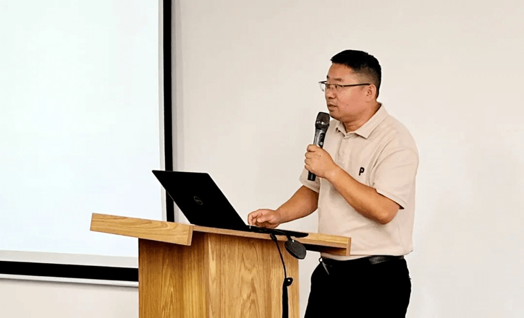
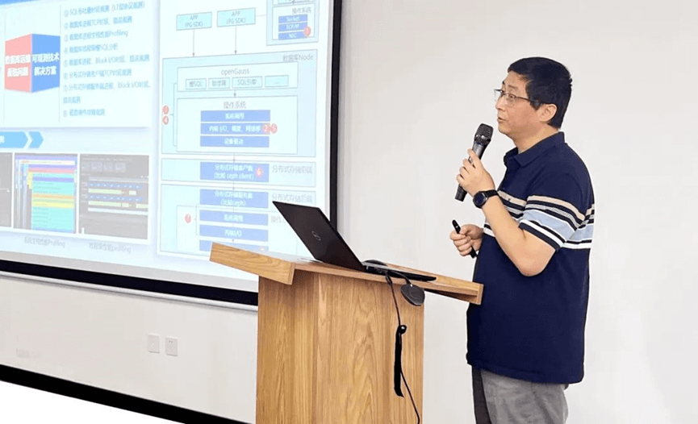
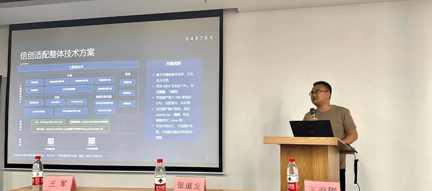

**9月1日，openEuler西安用户组Meetup成功举办，本次活动由openEuler社区、软通动力、陕西鲲鹏生态创新中心联合主办，统信软件协办**。此次活动聚集了西安地域众多用户、开发者和开源爱好者，共同探讨openEuler操作系统的应用经验，并分享交流openEuler生态进展、运维经验和实践案例。

**在活动上西安用户组正式成立，该组织旨在聚集西安区域的openEuler行业用户，打造一个本地化交流平台，拓展区域用户生态**。到场的首批openEuler西安用户组成员进行了圆桌会面交流，各成员现场向社区代表反馈了在实际应用openEuler的过程中的疑问和诉求，后续这些反馈将进一步在社区落地改进。未来在用户组内成员将更多分享openEuler的使用案例和经验，一起推动openEuler在各行业内的应用。

[**点击申请加入西安用户组\>\>**](http://mp.weixin.qq.com/s?__biz=MzI2NDE4OTE2Mg==&mid=2247505855&idx=1&sn=37a593a9a931b94f1d84570ed160b6d1&chksm=eab2f23addc57b2c60ce1ad041135f4ab51da4831af2b4b894b5761c08d692fbc2b9c30f1fe6&scene=21#wechat_redirect)

在开场致辞中，软通动力助理副总裁、openEuler用户委员会委员王军介绍了openEuler社区近期的发展情况，openEuler的市场份额持续正向增长，离不开各位开发者的共同努力。软通动力持续拥抱openEuler生态战略，发行了商业版天鹤操作系统，可以基于发行版和社区版本为用户提供一站式服务解决方案。软通动力将持续加大在开源社区的投入，与openEuler社区共同推进开源生态的持续正向发展。

openEuler社区Maintainer、oEVP 王玺源在《openEuler
AI生态的现状与未来》的主题分享中介绍到openEuler提供了丰富的AI框架和库，使开发者可以轻松构建和训练各种深度学习模型。此外，openEuler还提供了高性能计算和分布式计算的支持，以满足大规模AI任务的需求。未来，openEuler
AI生态系统将继续扩展和完善。openEuler社区致力于与更多的AI技术合作伙伴合作，推动AI领域的创新和发展。

软通动力openEuler研究中心操作系统高级专家张道龙分享了主题《openEuler
managed by
软通动力》，介绍了软通动力基于openEuler生态体系构建服务能力，在安装部署、补丁修复、迁移支持等方面为客户使用的openEuler版本提供全方位商业保障。

openEuler社区运维专家王磊带来了《openEuler运维工具探索》的分享，详细介绍了openEuler运维工具和运维解决方案，现场听众对运维领域尤为关注，向分享嘉宾提出众多问题。

统信售前工程师王宏刚分享了基于openEuler的统信UOS服务器操作系统解决方案，当前的生态建设成果和在市政、国企、运营商领域的应用案例。

活动下半场，来自openEuler生态圈的伙伴和用户围绕基于openEuler的生态适配、实践案例、解决方案等方面的经验进行分享。

国内大数据和数据库领域最活跃的开源项目之一Apache Doris的commiter
吴迪，分享了Apache
Doris的技术特性、应用生态，以及与openEuler的生态集成。

来自亚信科技大数据平台产品研发部的架构师张振野分享了亚信在信创适配上的探索和成功经验，以及从centos替换到openEuler的案例介绍。

陕西远鑫信息技术总监分享了openEuler在医疗行业的信创解决方案、运维方案、安全保障方案。

此外，在议题分享结束后，针对西安用户组组织了用户组闭门交流会议，来自不同行业的用户组成员提出了众多疑问、建议和诉求，社区代表现场对一部分疑问和诉求进行了解答，重要的诉求后续将进一步对接到社区对应的技术SIG。

**openEuler西安用户组**

openEuler西安用户组成员持续招募中，作为一个区域的用户交流与生态发展平台，用户组成员可以在这里交流openEuler技术、使用经验、案例，向社区反馈用户意见，欢迎加入！

扫码申请加入openEuler西安用户组
