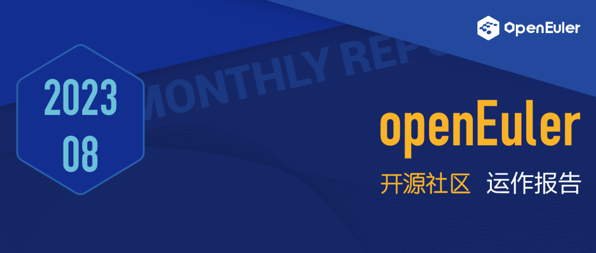

## 概述

在本月的TC例会上，经全体TC委员同意，openEuler 24.03
将作为社区下一个LTS版本，并采用 2023 年年底的上游内核社区LTS
版本作为openEuler 24.03 LTS版本的内核选型版本。

技术方面，openEuler容器基础镜像周期自动更新功能于8月30日上线。社区开发者可以体验更稳定、安全、实时的容器基础镜像。此外，Linux
内核社区接受了来自openEuler社区开发者龚睿奇（@raverstern）提交的安全加固特性补丁，该特性预计进入Linux
Kernel 6.6版本。

本月SIG工作方面，Computing
SIG实现了最新的GB18030强制标准中文字符集，达到三级（最高）实现标准；由dev-utils
SIG维护的sysMaster发布了新版本；消息中间件SIG则完成了kafka软件包仓库的迁移；Embedded
SIG完成poky升级，落地yocto最新长稳版本；Infra
SIG基于开发者的使用需求，对官网、论坛、小程序等进行了一系列的体验提升。将在9月发布的openEuler
23.09 创新版本将集成 LuaJIT RISC-V
技术，新增PilotGo、utshell、sysMaster、CVE-ease、CPDS等多项特性，欢迎大家关注。

9月19日到21日，openEuler将参加在西班牙举办的Open Source Summit Europe
2023，欢迎关注。

本月报阅读时长预计15分钟。

## 社区规模

截止2023年8月底，openEuler社区用户累计超过175万。一万五千余名开发者在社区持续贡献。社区累计产生
127K 个PR、65.8K 条Issue。加入 openEuler 社区的单位成员超过
1000 家，8月新增 58 家。

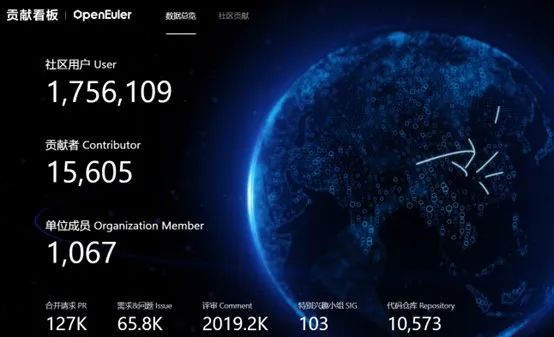

社区贡献看板（截至2023/8/31）

## 社区事件

### openEuler将参加全球开源顶级峰会

### Open Source Summit Europe 2023

openEuler 立足中国，面向全球，积极推进国际化进程。去年9月，openEuler 
正式亮相欧洲开源峰会([[OSSEU
2022]](https://mp.weixin.qq.com/s?__biz=MzI2NDE4OTE2Mg==&mid=2247496360&idx=1&sn=79f1a53f54504339fbbcea7818e0dcf5&chksm=eab2d72dddc55e3b126035264a3b3aff15ee768a9a6d26d310136acbf98151cb0cf6b62c00ed&token=468141164&lang=zh_CN&scene=21#wechat_redirect))，受到众多开发者的关注。这是openEuler迈向国际化的重要一步，标志着openEuler海外生态正式起航。

时隔一年，openEuler将再度现身全球开源顶级峰会Open Source Summit Europe
2023，与世界各地的开发者对话。欢迎朋友们关注。

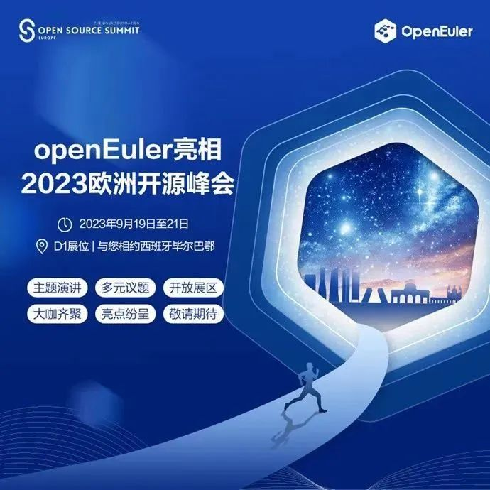

### openEuler亮相RISC-V中国峰会，共建开源生态发展

[[8月23日-25日，第三届RISC-V中国峰会在北京召开]](https://mp.weixin.qq.com/s?__biz=MzI2NDE4OTE2Mg==&mid=2247506034&idx=1&sn=b30a14153ff0c7436c62f9cd819f1a1c&chksm=eab2fdf7ddc574e19e58deebe2913ba5ca184f0bef449cd4404f831d4479016b9a5380dd3470&token=1035293251&lang=zh_CN&scene=21#wechat_redirect)，openEuler深度参与其中，并作为开源操作系统进入RISC-V
Landscape。

openEuler RISC-V SIG Maintainer 席静在会上介绍了openEuler 对 RISC-V
支持的现状以及未来发展路线。openEuler Embedded SIG、RISC-V SIG
活跃开发者于佳耕带来《基于openEuler Embedded的AI边缘计算解决方案》。

当前，openEuler已发布了4个全面支持RISC-V架构的社区版本，完成超过6000款软件在RISC-V架构上的适配，未来将进一步提升软件数量及质量，共建社区生态发展。

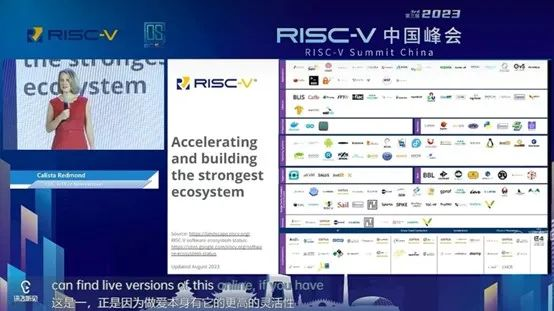

**openEuler参加TARSIER 开放日暨 RISC-V 开源操作系统进展交流活动**

近日，由TARSIER 团队组织的[TARSIER 开放日暨 RISC-V 开源操作系统进展交流](https://mp.weixin.qq.com/s?__biz=MzI2NDE4OTE2Mg==&mid=2247505981&idx=2&sn=b651fb60a95f0ede5ba0b388b72ea806&chksm=eab2fdb8ddc574ae7d3ce230e1ae8a24f6f45057816e4c75194e73f2b88387f8646cee1412c8&token=1035293251&lang=zh_CN&scene=21#wechat_redirect)活动在中国科学院软件研究所举办，多位来自RISC-V
操作系统适配开发的一线工程师现场分享经验报告并参加圆桌讨论。

开源操作系统对 RISC-V 的适配优化是完善 RISC-V
软件生态的重要抓手。openEuler RISC-V 2309 出品人王经纬、TARSIER 原 ROS
SIG 小队成员李永泰、张天宇、郑俊杰以及Eulaceura
发起人、LV4实习生湘江一桥在本次活动中带来了openEuler与RISC-V适配的最近进展和成果，与现场朋友们互动交流，推动社区发展。

### openEuler创新技术分享Meetup在北京举办

近期，[[由openEuler社区与麒麟软件共同组织的创新技术分享Meetup在北京顺利召开]](https://mp.weixin.qq.com/s?__biz=MzI2NDE4OTE2Mg==&mid=2247506102&idx=2&sn=c75196199029068312fa810b6c14b63f&chksm=eab2fd33ddc57425c5543f5e1376e8edaba1ff656bb5b2d0edcc7a98a247ce59db9f9689e059&token=1035293251&lang=zh_CN&scene=21#wechat_redirect)。来自麒麟软件、天翼云、天固信安等技术专家，分享了他们在云原生、DPU、运维管理等领域的实践与探索，并与现场来宾共同探讨创新技术与商业产品的结合方式，促进创新项目良性发展。

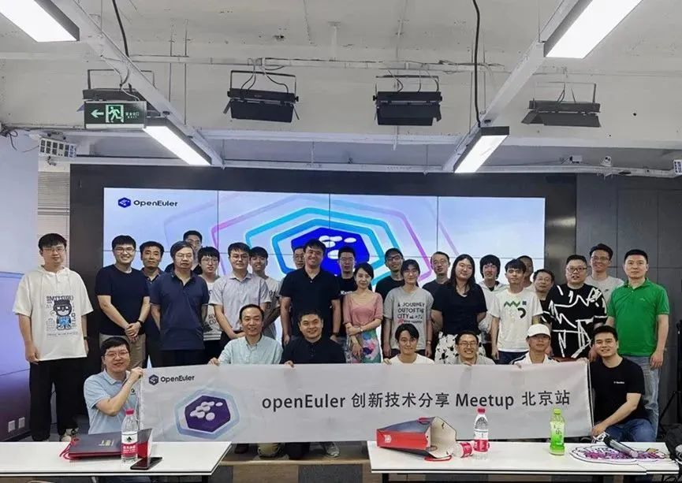

### openEuler技术委员会委员王建民受邀出席「Night of AI」线上大会

8月初， AO.space 傲空间与 AGI
早早聊、KCC@新加坡社区联合举办线上大会「Night of AI」 ，openEuler
社区的技术委员会委员、傲空间团队项目发起人之一王建民出席本次活动，并在会上分享了如何利用人工智能实现操作系统性能调优，及其在
A-Tune
项目的实践经验。（[[原文阅读]](https://mp.weixin.qq.com/s?__biz=MzI2NDE4OTE2Mg==&mid=2247506136&idx=2&sn=bb182bb66864bafc3f963a609db77ec1&chksm=eab2fd5dddc5744bad252440ba2e0ac0dbd890e5fbcd5fee07e83eaef78ad4ed78d30b5785ab&token=1035293251&lang=zh_CN&scene=21#wechat_redirect)）

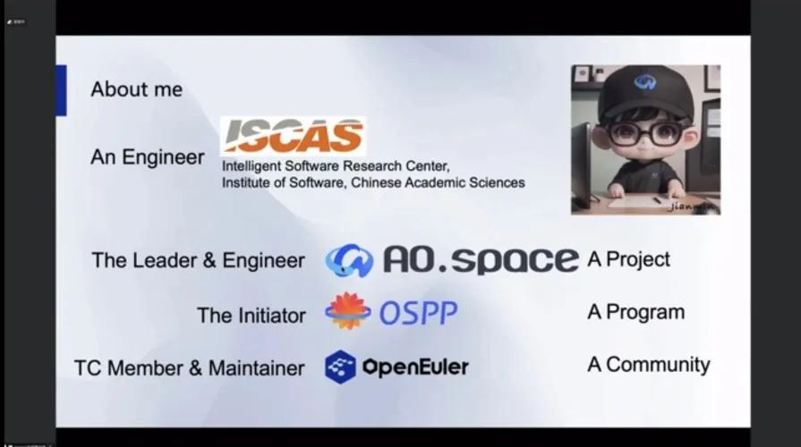

### FangTian视窗引擎系列第一期开播

由 FangTian SIG
主导的方天视窗引擎包含显示服务，窗口管理，图形绘制、合成、送显等功能。既适用于PC、服务器场景，也适用于移动设备场景。8月初，应社区开发者的需求，FangTian
SIG 开展了方天视窗引擎直播的第一期：IPC（Inter-Process
Communication），与线上朋友们分享开发过程中常见IPC方法，以及FangTian视窗引擎针对IPC通信的常用优化。

方天视窗引擎系列直播第一期: IPC

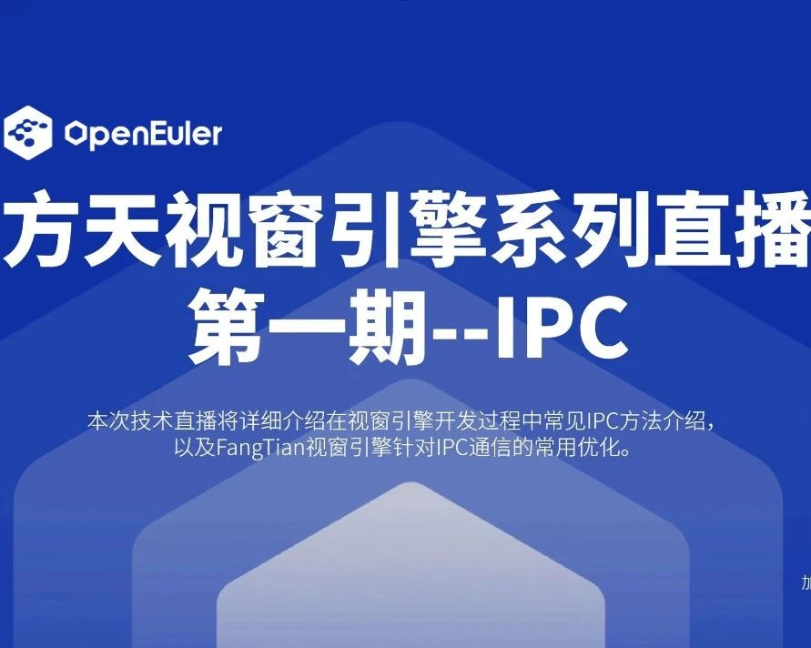

### openEuler 用户案例持续征集中

openEuler社区诚邀伙伴们共同打造《openEuler开源操作系统行业应用案例集》，以展示openEuler在不同行业的应用场景与优势，为其他用户提供借鉴和参考，共同探索openEuler的更多可能性。

发布案例征集以来，社区已收到众多投稿，每周四，openEuler运营团队将选取优秀案例在公众号上同步呈现，欢迎关注。

8月"案例周四见"精选案例：

-   [[银河麒麟高级操作系统V10助力联通云提供可靠、高质量的应用上云服务]](https://mp.weixin.qq.com/s?__biz=MzI2NDE4OTE2Mg==&mid=2247505581&idx=1&sn=1f1840e75f3369297a9cacc1a45d2cb5&chksm=eab2f328ddc57a3ef22d521a978c78d8d3ef9d766a40fa2db62dbbade5b36832aefa9893d067&token=1562954243&lang=zh_CN&scene=21#wechat_redirect)

-   [[北航基于openEuler构建工业机器人操作系统]](https://mp.weixin.qq.com/s?__biz=MzI2NDE4OTE2Mg==&mid=2247505643&idx=2&sn=901a29d9620d925c9752808cf39c0453&chksm=eab2f36eddc57a78dc7a698cd831101d92de667c368e232dce72f291424ebce7aa73c3ec2147&token=1562954243&lang=zh_CN&scene=21#wechat_redirect)

-   [[创普云边缘计算云服务平台]](https://mp.weixin.qq.com/s?__biz=MzI2NDE4OTE2Mg==&mid=2247505743&idx=1&sn=5f818dcb8d939d3fde7b27141f1c8c4b&chksm=eab2f2caddc57bdcae7ebb87735bdeb25d3313a0c28f8477ae1b9b1169e718849abbb8b3178e&token=1562954243&lang=zh_CN&scene=21#wechat_redirect)

-   [[恒生电子发布金融证券场景解决方案]](https://mp.weixin.qq.com/s?__biz=MzI2NDE4OTE2Mg==&mid=2247505866&idx=1&sn=e8c716069ad5b80318a21715f5cdae0a&chksm=eab2f24fddc57b599813f33bd2756eefc45493f5355517276191b61709252c572e5bd15a6d1c&token=1562954243&lang=zh_CN&scene=21#wechat_redirect)

-   [[浙商银行全栈财务管理系统完成操作系统迁移]](https://mp.weixin.qq.com/s?__biz=MzI2NDE4OTE2Mg==&mid=2247506136&idx=1&sn=1f67a24230dab979b4ec878e779b54c8&chksm=eab2fd5dddc5744b7119de9f1155327e5c6fce230a3ef0c6bd3de40a5f7f9a4cad219df38c4f&token=1562954243&lang=zh_CN&scene=21#wechat_redirect)

如果您想投稿案例，欢迎联系 user@openeuler.sh

[openEuler用户案例征集](https://mp.weixin.qq.com/s?__biz=MzI2NDE4OTE2Mg==&mid=2247504655&idx=1&sn=c999745c471760b99bd601a57bc81c37&chksm=eab2f68addc57f9cc72385b4e5bdd163389368b370655a38606bfe53c3d2e7d5381debd70afc&token=2077163593&lang=zh_CN&scene=21#wechat_redirect)

[\
](https://mp.weixin.qq.com/s?__biz=MzI2NDE4OTE2Mg==&mid=2247504655&idx=1&sn=c999745c471760b99bd601a57bc81c37&chksm=eab2f68addc57f9cc72385b4e5bdd163389368b370655a38606bfe53c3d2e7d5381debd70afc&token=2077163593&lang=zh_CN&scene=21#wechat_redirect)

## 社区治理

### 2023-2024年openEuler技术委员会会议在北京召开

8月11日，2023-2024年openEuler技术委员会会议在北京召开，由**统信软件**承办。openEuler技术委员会全体委员及部分往届委员、社区运营专家、社区开发者共40余人出席本次会议，开放原子开源基金会TOC项目导师罗文江、徐亮、张烨、郑伟波参会指导。

会议围绕openEuler社区当前进展、技术项目发展制度和流程、基础设施建设、下一代LTS内核选型、云原生建设、多内核支持、
llvm平行宇宙、memsafety SIG发展规划、Kernel
SIG运作章程等多个议题进行深入探讨，进一步明确下半年的工作计划。同时，**经技术委员会委员全票通过，
同意openEuler 24.03 作为社区下一个LTS版本，并同意采用 2023
年年底的上游内核社区LTS 版本作为openEuler 24.03
LTS版本的内核选型版本。**

[[原文阅读
\>\>\> ]](https://mp.weixin.qq.com/s?__biz=MzI2NDE4OTE2Mg==&mid=2247505822&idx=2&sn=a97d65b24a2ce37af21e1154d793bee6&chksm=eab2f21bddc57b0da9861406ce51a4f9346da9c20d091f4f6e5693fd186bc5086702dc766cd9&token=1035293251&lang=zh_CN&scene=21#wechat_redirect)

[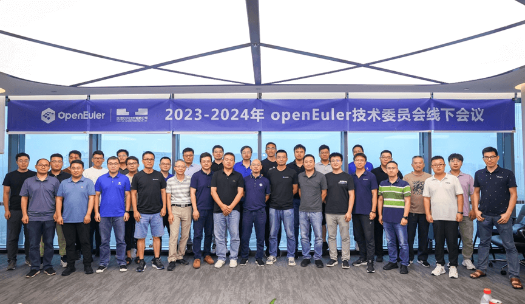](https://mp.weixin.qq.com/s?__biz=MzI2NDE4OTE2Mg==&mid=2247505822&idx=2&sn=a97d65b24a2ce37af21e1154d793bee6&chksm=eab2f21bddc57b0da9861406ce51a4f9346da9c20d091f4f6e5693fd186bc5086702dc766cd9&token=1035293251&lang=zh_CN&scene=21#wechat_redirect)

[图为：2023-2024年openEuler技术委员会线下会议合影](https://mp.weixin.qq.com/s?__biz=MzI2NDE4OTE2Mg==&mid=2247505822&idx=2&sn=a97d65b24a2ce37af21e1154d793bee6&chksm=eab2f21bddc57b0da9861406ce51a4f9346da9c20d091f4f6e5693fd186bc5086702dc766cd9&token=1035293251&lang=zh_CN&scene=21#wechat_redirect)

[注：openEuler技术委员会是openEuler项目群的技术领导机构，技术委员会委员通过日常线上TC例会及定期开展线下会议共同决策社区技术发展方向事宜。](https://mp.weixin.qq.com/s?__biz=MzI2NDE4OTE2Mg==&mid=2247505822&idx=2&sn=a97d65b24a2ce37af21e1154d793bee6&chksm=eab2f21bddc57b0da9861406ce51a4f9346da9c20d091f4f6e5693fd186bc5086702dc766cd9&token=1035293251&lang=zh_CN&scene=21#wechat_redirect)

### openEuler将成立运维专区

在8月23日的TC例会上，经审议，openEuler技术委员会批准成立openEuler运维专区。该运维专区将由openEuler联合伙伴共同打造，涵盖openEuler运维全集，包括系统性的运维方案、工具、组件等，以满足用户对运维的核心述求。据了解，运维专区预计9月上线，敬请期待。

## 技术进展

### openEuler容器基础镜像已支持周期更新

在 Release SIG、Infra SIG
等共同努力下，容器镜像周期自动更新功能已于2023年8月30日上线，目前包含20.03及22.03维护版本的周期更新 \[1\]。

容器镜像更新以每月一次的频率，发布在openEuler官方网站\[2\]，并通过
EulerPublisher\[3\] 自动发布在包括Dockerhub在内的容器仓库\[4\]，让openEuler社区用户可以体验稳定、安全、实时更新的容器基础镜像。

后续，EulerPublisher将陆续集成云镜像、WSL镜像的定制和一键发布、验证功能，也欢迎大家继续反馈对容器镜像、云、WSL等镜像的需求、建议和问题。

**相关链接：**

\[1\] https://hub.docker.com/r/openeuler/openeuler/tags

\[2\] https://repo.openeuler.org/openEuler-22.03-LTS-SP2/docker_img/update/

\[3\] EulerPublisher - A tool to publish openeuler docker and cloud
images.:

https://gitee.com/openeuler/eulerpublisher

\[4\] 容器自动化发布的Jenkins地址：

https://jenkins.osinfra.cn/view/openEuler/job/luweijun/job/eulerpublisher/

### openEuler 开发者向 Linux 内核提交安全新特性

近日，Linux
内核社区接受了来自openEuler社区开发者龚睿奇（@raverstern）的安全加固特性补丁：**Randomized
slab caches for kmalloc()**。该特性实现了一种基于调用路径的 kmalloc
堆隔离技术，以极低内存代价实现对基于堆喷的内核漏洞攻击的有效防护，获得了内核社区的积极评价。该特性预计进入Linux
Kernel
6.6版本。[[（原文阅读）]{.underline}](https://mp.weixin.qq.com/s?__biz=MzI2NDE4OTE2Mg==&mid=2247505780&idx=2&sn=7f620d47b147e7a5408a37ea01b20698&chksm=eab2f2f1ddc57be7f229ba7162938e0e575e077c870282f0ec2bdeb7e3358f00032148c43447&token=1562954243&lang=zh_CN&scene=21#wechat_redirect)

相关链接：

https://lwn.net/Articles/938637/

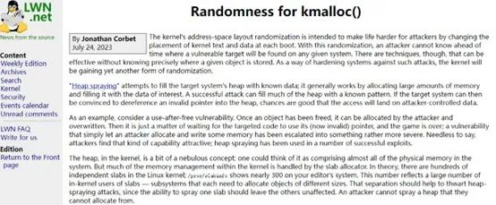

### openEuler 主线集成 LuaJIT RISC-V JIT 技术

RISC-V SIG 预期随主线发布的 openEuler 23.09 创新版本会集成 LuaJIT RISC-V
支持。本次发版将提供带有完整 LuaJIT 支持的 RISC-V 环境并带有相关软件如
openResty 等软件的支持。

随着 RISC-V SIG 主线推动工作的进展，LuaJIT 和相关软件在 RISC-V
架构下的支持也被合入到 openEuler 主线代码中。这标志着，openEuler
将成为首个在主线分支为 LuaJIT 提供 RISC-V 架构支持的主流发行版。

[[原文阅读
\>\>\> ]](https://mp.weixin.qq.com/s?__biz=MzI2NDE4OTE2Mg==&mid=2247506114&idx=1&sn=8eb6a6903199dd23e1a23098da373681&chksm=eab2fd47ddc57451fee26938b2dcc7be2a20b12a55950195ad3a835273ff58a9921df3856527&token=1035293251&lang=zh_CN&scene=21#wechat_redirect)

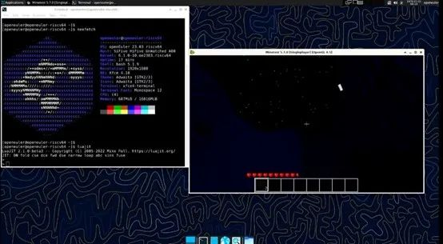

### openEuler 22.03 LTS 支持GB18030中文字符集强制标准

近期，openEuler Computing
SIG实现了最新的GB18030强制标准中文字符集，达到三级（最高）实现标准，满足政务和公共服务准入要求。感谢李江霖（@lijianglin）、杨演超（@openeuler-robot）
和李清清（@liqingqing_1229）以及为此贡献的每一位开发者。

GB18030-2022的主要变化包含：

-   增加CJK统一汉字中新增的17672个汉字，

-   增加康熙部首214个

-   增加西双版纳新傣文字符83个，老傣文字符127个

-   增加傈僳文字符48个

-   增加滇东北苗文字符149个

-   删除15个重复编码的汉字构件与汉字

### sysMaster 新版本 v0.5.0 发布

近期，由dev-utils sig维护的sysMaster项目发布了
v0.5.0版本，该更新主要集中在两个重要方面：

首先，作为sysMaster的设备管理模块devMaster，其开发工作已基本完成，支持系统设备的热插拔管理,
扮演着支持系统快速启动和确保系统功能正常运行的核心角色。

其次，sysMaster项目增加了对虚拟机场景的支持。它可以作为1号进程来管理虚拟机的开关机以及系统中的各项服务，这样不仅能让底噪更低，且性能也优于其他init程序。

欢迎下载openEuler
22.09进行体验。如果您对系统可靠性和1号进程感兴趣，请关注sysMaster项目https://gitee.com/openeuler/sysmaster ，获取更多详细信息。

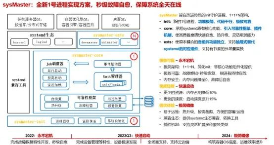

### message-middleware SIG 工作进展

由中国移动云能力中心发起message-middleware
SIG，自7月份成立以来积极运作，通过每月周例会推动社区消息中间件的各项工作进展。

本月，message-middleware SIG
组织了2场周SIG会议，完成了pulsar、EventMesh、rocketmq仓库的创建以及第1个PR的提交与合并，完成了kafka软件包仓库的迁移。该SIG组Maintainer胡宗棠受邀参加CommunityOverCode
Aisa 2023的主论坛，并分享消息中间件技术。

message-middleware SIG专注于探索为开源用户提供基于 openEuler
基础软件的消息中间件性能加速、安全加固、提升稳定性的解决方案，助力消息相关的技术项目孵。欢迎感兴趣的朋友加入。

项目地址：

https://gitee.com/openeuler/community/tree/master/sig/sig-message-middleware

### Embedded SIG 工作进展

Embedded
Sig是以Linux为中心的综合嵌入式系统软件平台，提供硬实时、极致性能、混合关键性等各具特色的生态。

本月，Embedded SIG 完成poky升级，及时落地yocto最新长稳版本，为openEuler
Embedded健康发展奠定了基础。

此外，Embedded
SIG将联合嵌湖南大学、麒麟信安、湖南欧拉生态创新中心，湖南欧拉技术创新与产业发展联盟、CCF
YOCSEF长沙等单位举办嵌入式Meetup。据了解，该活动将在9月8日长沙举办（[[点击了解详情]](https://mp.weixin.qq.com/s?__biz=MzI2NDE4OTE2Mg==&mid=2247505894&idx=1&sn=c00f88532d4d8eca49638aa36b8a3e52&chksm=eab2f263ddc57b7578b1b1451f0e3d5adfb250158572847754b1ff1f837a7dc2a5cacd14e6e8&token=1035293251&lang=zh_CN&scene=21#wechat_redirect)）。欢迎感兴趣的朋友参加。

项目地址：https://www.openeuler.org/zh/sig/sig-detail/?name=sig-embedded

### Infrastructure SIG 工作进展

深入分析社区需求，提升开发者使用体验，一直是openEuler基础设施团队努力的方向。官网论坛、QuickIssue、软件包贡献平台、用户软件仓EUR、EulerLauncher等等随手可用的工具，都是社区基础设施团队与其他开发者一起贡献的成果。本月，基础设施团队持续发力：

-   **EUR服务平台新增用户组的功能**，开发者以openEuler
    ID登录EUR平台后，不仅能够在自己的name
    space下创建项目，也可以以自己所在的SIG组来创建项目。

> 原文阅读：https://www.openeuler.org/zh/blog/waaagh/groups_supported_in_EUR.html

-   **openEuler小程序支持WeLink（蓝版）预定会议**。开发者预定会议之后，通过浏览器打开会议链接，即可入会。

> 原文阅读：
>
> [[https://mp.weixin.qq.com/s/-NDnfdzY1JcaZKEWRaIVkw]](https://mp.weixin.qq.com/s?__biz=MzI2NDE4OTE2Mg==&mid=2247506034&idx=2&sn=4061f8daf5d27312b258ea400b78791f&scene=21#wechat_redirect)

-   **openEulerForum新增贡献值排行榜。**开发者在论坛发表文章、帖子、评论、点赞等等，均能获取不同的积分；通过积分可兑换社区限定礼品，积极贡献者还可申请社区oEVP（openEuler
    Valuable Professional）荣誉。

> openEuler Forum：
>
> https://forum.openeuler.org/
>
> Call for oEVP：
>
> https://www.openeuler.org/zh/community/program/join-oEVP/

-   **社区官网搜索功能增加了服务检索条件**。例如开发者在官网搜索"软件包"，除了能看到相关的文档、博客之外，还能查看并选择跳转至"软件包仓"、"软件包贡献"等相关服务平台。

-   **社区官网新增满意度反馈卡**。我们在官网的每个页面新增满意度反馈，欢迎大家体验。我们将深入分析大家的需求，提升各位的使用和体验

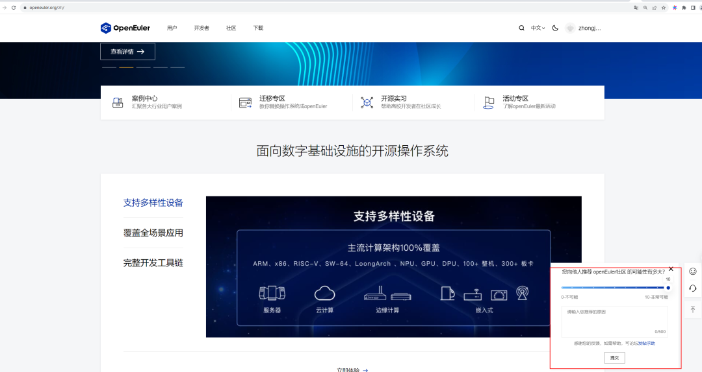

### 软硬件兼容性清单

2023年8月，openEuler兼容性方案累计1114个，北向682，南向406；新增
北向31，南向 8。

社区兼容性清单：

https://www.openeuler.org/zh/compatibility/

## 安全公告

2023年8月社区共发布安全公告94个，修复漏洞62个（其中 Critical 6个，High
35个，其它 21个），公告不受影响漏洞 8个。

-   **重点漏洞提醒**

如下漏洞评估影响较大，请重点关注：

**python-GitPython存在RCE（CVE-2022-24439）**

**CVSS评分为9.8分**

公告链接：

https://www.openeuler.org/zh/security/cve/detail/?cveId=CVE-2022-24439&packageName=python-GitPython

影响范围：

openEuler-20.03-LTS-SP1

openEuler-20.03-LTS-SP3

openEuler-22.03-LTS

openEuler-22.03-LTS-SP1

openEuler-22.03-LTS-SP2

**6.3.9版本之前的kernel的ksmbd模块存在越界读漏洞（CVE-2023-38430）**

**CVSS评分为9.1分**

公告链接：

https://www.openeuler.org/zh/security/cve/detail/?cveId=CVE-2023-38430&packageName=kernel

影响范围：

openEuler-22.03-LTS

openEuler-22.03-LTS-SP1

openEuler-22.03-LTS-SP2

**6.3.8版本之前的Kernel的ksmbd模块中fs/smb/server/smb2pdu.c的deassemble_neg_contexts函数存在整数溢出和越界读漏洞（CVE-2023-38427）**

**CVSS评分为9.8分**

公告链接：

https://www.openeuler.org/zh/security/cve/detail/?cveId=CVE-2023-38427&packageName=kernel

影响范围：

openEuler-22.03-LTS

openEuler-22.03-LTS-SP1

openEuler-22.03-LTS-SP2

**6.3.4版本之前的kernel的ksmbd模块中fs/ksmbd/connection.c的ksmbd_smb2_check_message函数存在差一错误，导致越界访问漏洞（CVE-2023-38429）**

**CVSS评分为9.8分**

公告链接：

https://www.openeuler.org/zh/security/cve/detail/?cveId=CVE-2023-38429&packageName=kernel

影响范围：

openEuler-22.03-LTS

openEuler-22.03-LTS-SP1

openEuler-22.03-LTS-SP2

**6.3.4版本之前的kernel的ksmbd模块中fs/ksmbd/smb2pdu.c中存在越界读漏洞（CVE-2023-38428）**

**CVSS评分为9.8分**

公告链接：

https://www.openeuler.org/zh/security/cve/detail/?cveId=CVE-2023-38428&packageName=kernel

影响范围：

openEuler-22.03-LTS

openEuler-22.03-LTS-SP1

openEuler-22.03-LTS-SP2

**6.3.4版本之前的kernel的ksmbd模块中smb2_find_context_vals存在越界读漏洞（CVE-2023-38426）**

**CVSS评分为9.8分**

公告链接：

https://www.openeuler.org/zh/security/cve/detail/?cveId=CVE-2023-38426&packageName=kernel

影响范围：

openEuler-22.03-LTS

openEuler-22.03-LTS-SP1

openEuler-22.03-LTS-SP2

-   **漏洞防护**

openEuler社区针对在维版本例行修复漏洞，发布安全补丁。建议用户关注openEuler官网安全公告，及时安装漏洞补丁进行防护。

openEuler安全公告：

https://www.openeuler.org/zh/security/security-bulletins/

## 人才培养

### openEuler社区已发展10家人才能力评定合作伙伴

湖南欧拉创新中心有限公司通过openEuler社区项目群评审，成为openEuler社区人才能力评定合作伙伴之一。当前，openEuler社区已发展了10家人才能力评定合作伙伴，助力openEuler专业生态人才的发展。

openEuler人才能力评定体系，是由openEuler社区与社区合作伙伴共同打造，通过课程培训、工程师认证、布道活动等快速培养专业openEuler生态人才，让技术爱好者更好地融入社区技术生态建设。

openEuler人才能力评定：

https://talent-assessment.openeuler.org/#/

### 感谢每一位朋友、开发者的支持

因为大家的辛勤贡献，openEuler的每一天都发生着好的事情。小编限于视野和能力，难免有所遗漏，在此表示歉意。同时，衷心感谢社区朋友、开发者们以及openEuler
SIG组成员的贡献：

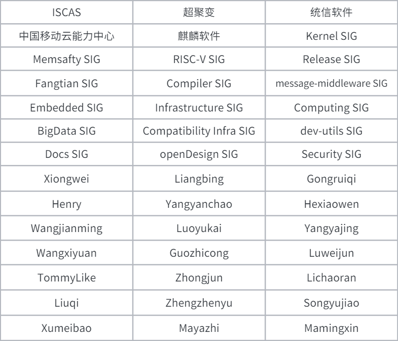

\* 以上不分先后顺序

如果您希望在月报中增加您的工作内容，或对内容有任何改进建议，请联系wengqiaozhen@openeuler.sh。
