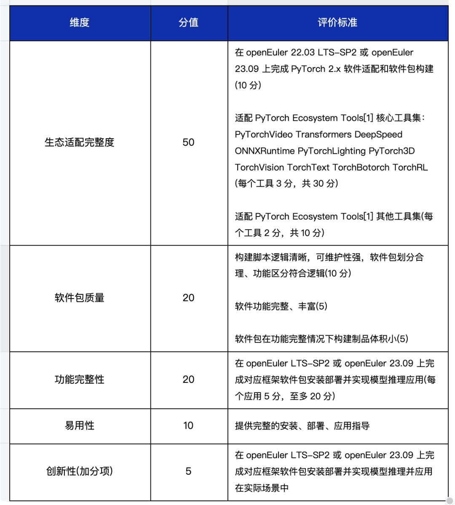
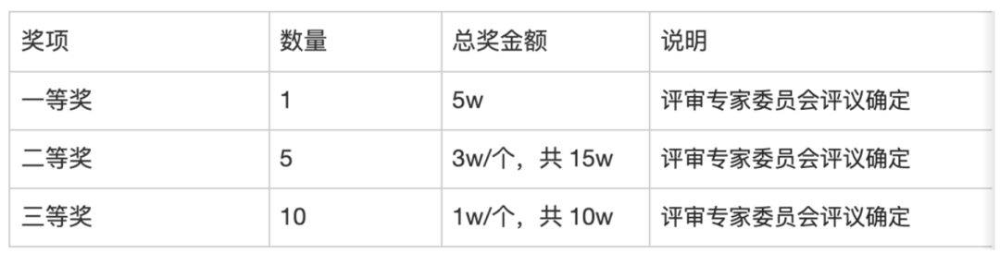
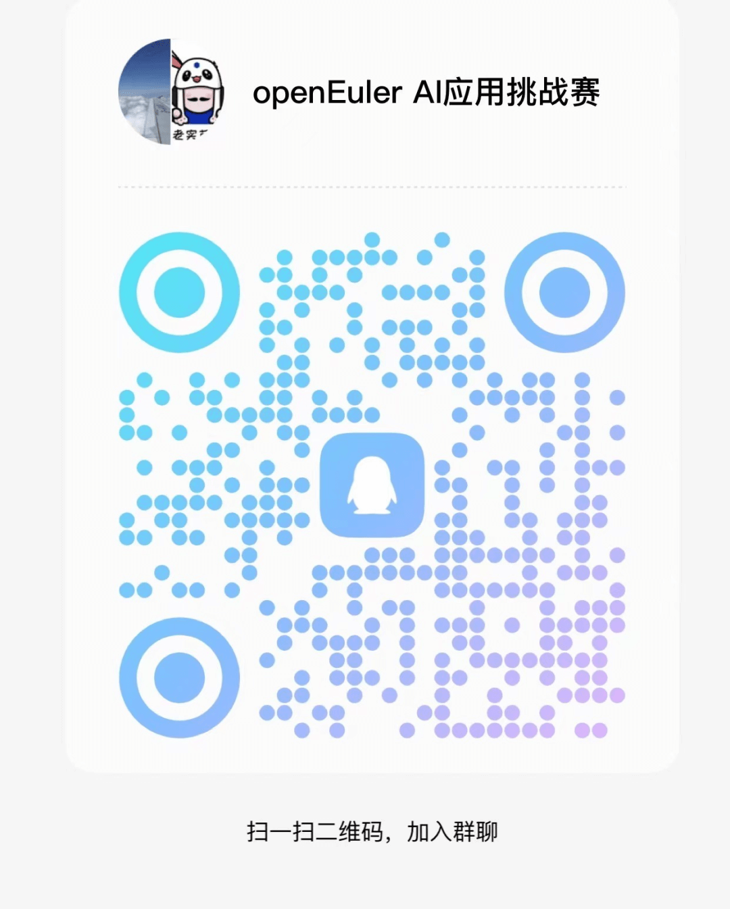

8月29日，由工业和信息化部、江苏省人民政府、湖南省人民政府共同主办的2023开源和信息消费大赛新闻发布会在北京召开，宣布开放原子开源大赛正式启动。

作为主流OS社区，**openEuler参与首届"开放原子开源大赛"，设置openEuler
AI应用挑战赛**，目标是希望参赛者能够在openEuler平台上适配主流开源AI框架，使用openEuler社区相关开发者工具，完成开源AI框架的软件包搭建，并通过完成完成常用AI模型的部署和使用，实现基于openEuler的AI应用适配和应用。

大赛组委会搭建AtomGit代码托管与协作平台，本赛题奖金总额**30w**，奖金将由基金会直接发放给获奖团队！

本赛题由openEuler社区与超聚变数字技术有限公司共建。

## 赛题详情

本赛题主要目标是在openEuler平台上适配主流开源AI框架，使用openEuler社区相关开发者工具，完成开源AI框架的软件包构建，并通过完成常用AI模型的部署和使用，实现基于openEuler的AI应用适配和应用，主要包括以下子任务：

1\. 在openEuler 22.03 LTS-SP2 或 openEuler 23.09 上完成PyTorch 2.x
软件适配和软件包构建；

2\. 适配PyTorch Ecosystem Tools\[1\] 核心工具集：PyTorchVideo、
Transformers、DeepSpeed、ONNXRuntime、PyTorchLighting PyTorch3D、
TorchVision 、TorchText 、TorchBotorch 、TorchRL；

3\. 适配PyTorch Ecosystem Tools\[1\] 其他工具集

## 参考文档

\[1\] Pytorch Ecosystem Tools:

https://pytorch.org/ecosystem/

https://github.com/pytorch/vision

https://github.com/pytorch/text

https://github.com/pytorch/botorch

https://github.com/pytorch/r

\[2\] AtomgGit地址：

https://atomgit.com/

\[3\] openEuler主要包括两个代码仓库：

1\. 代码仓:  https://gitee.com/openeuler

2\. 软件包仓:  https://gitee.com/src-openeuler

加入方式参见： 

https://openeuler.org/zh/community/contribution/

\[4\] openEuler用户软件仓（EUR）介绍：

https://forum.openeuler.org/t/topic/800

如何使用openEuler用户软件仓（EUR）：

https://www.openeuler.org/zh/blog/waaagh/openEuler-user-repo-howto.html

https://mp.weixin.qq.com/s/flG_Ul7XTgcIi3NfIV8GoQ

## 赛制/赛程（拟）

2023.09月 比赛启动

2023.09-2023.11.9 参赛团队报名

2023.10.01-2023.11.10  初赛，线上提交任务

2023.11.15-2023.11.30  决赛

2023.12月 终评及颁奖

## 作品提交要求

✓基于openEuler 22.03-LTS SP2 或 openEuler 23.09 版本完成PyTorch
2.0.1版本及PyTorch Ecosystem Tools软件适配及构建

✓ 参赛者在AtomGit上创建仓库并上传构建脚本，通过EUR(openEuler User
Repo)完成软件及相关依赖的构建

✓
参赛者通过EUR完成相关软件的安装和部署，并对主流AI模型进行部署和推理应用，方向可包括但不限于AIGC(文字、语音、图像)、目标检测、智能问答等AI创新方向。

✓ 优胜方案将合入openEuler社区代码主干

AtomgGit地址：https://atomgit.com/

## 评审规则

## 赛题奖金说明

2023年大赛总奖金池为30w元，奖项分配具体如下：

一等奖、二等奖和三等奖的获奖作品由
openEuler挑战赛的评审专家委员会来共同确定。

## 更多信息

更多要求可详见大赛官网（openEuler归属新兴及应用赛道）：

https://competition.atomgit.com/competitionInfo?id=1ea056d0418e11eeb9c0eb26c552c0c4

大赛火热报名中，邀请各大高校学子踊跃参赛！扫描下方二维码或点击阅读原文即可报名。

如有任何疑问，可QQ扫码进交流群，或添加QQ2054233583，备注"大赛"进入群聊以便通知后续赛事信息。

