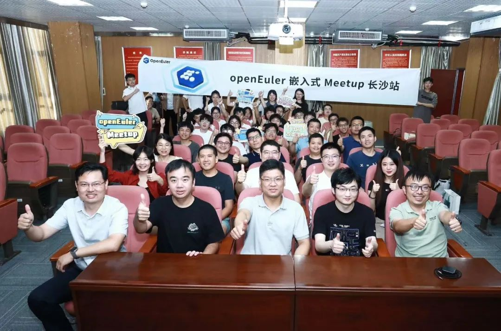
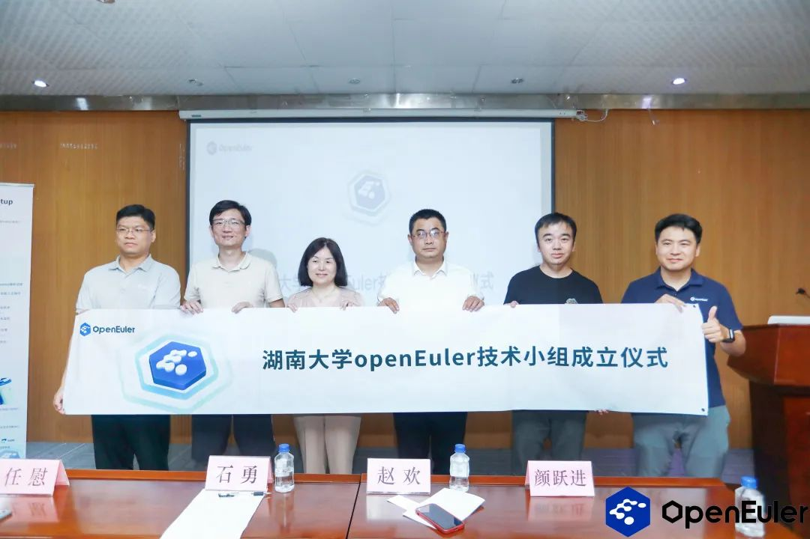
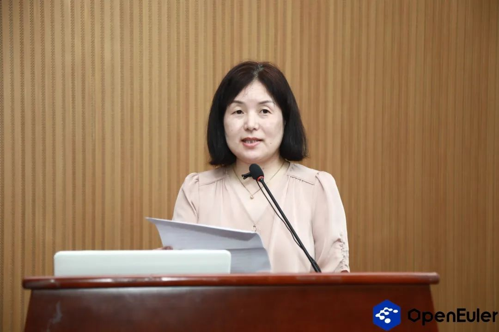
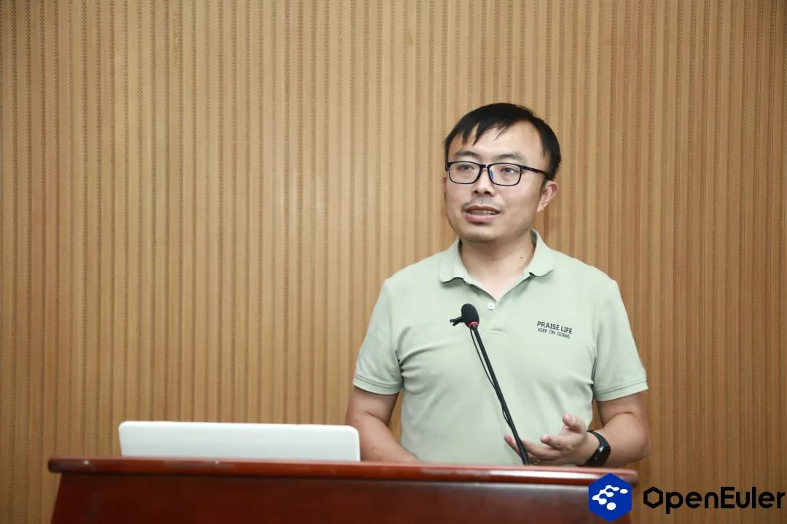
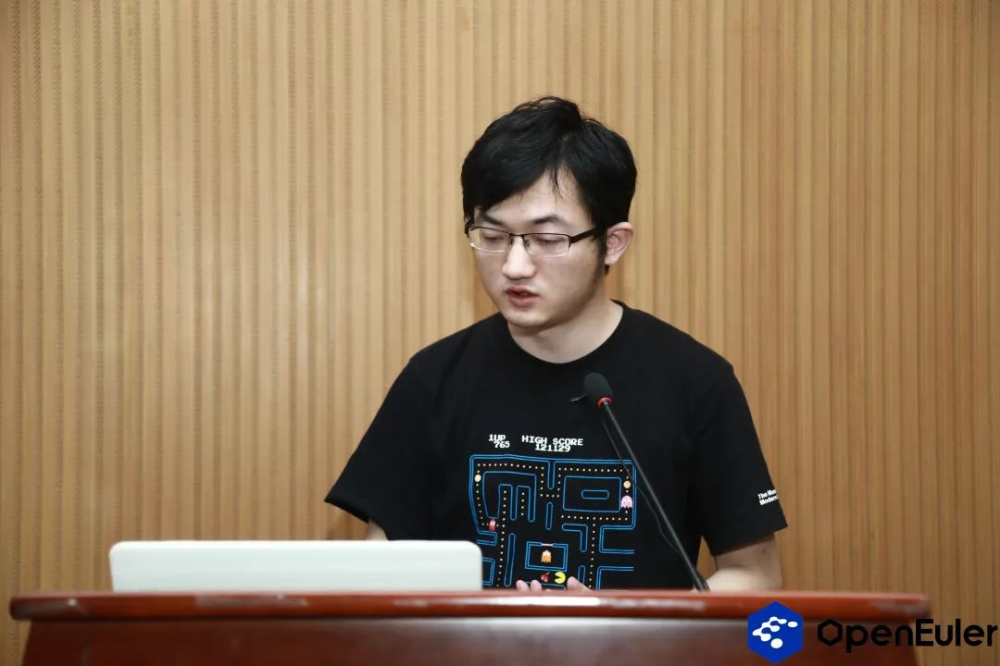
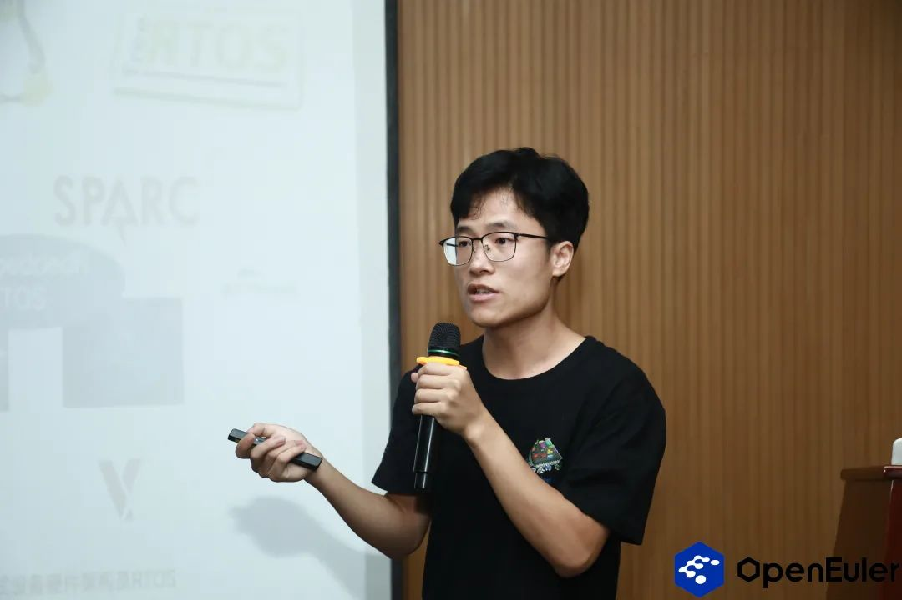
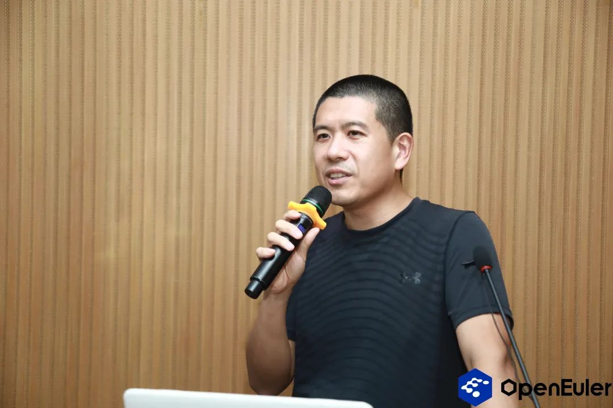
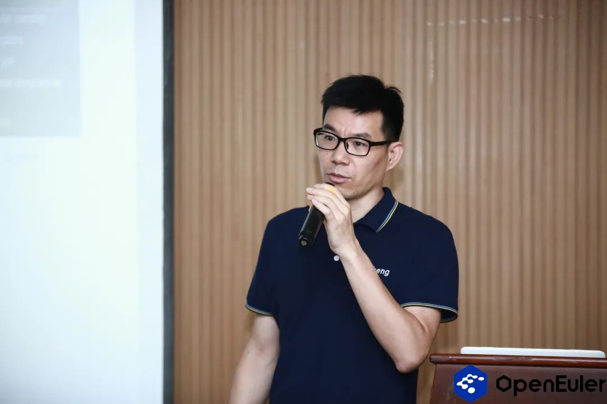
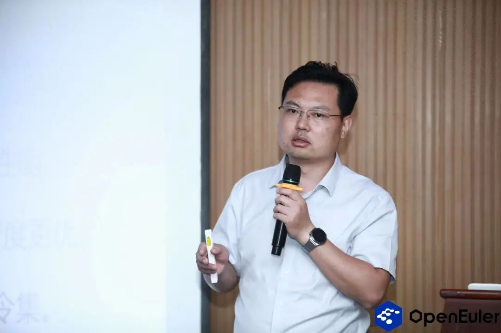

9月8日，由openEuler社区、麒麟信安、湖南欧拉生态创新中心以及湖南大学联合主办的openEuler嵌入式Meetup长沙站在湖南大学成功举办。活动现场，来自openEuler社区、麒麟信安、湖南大学、中国科学院软件研究所的技术专家及50+参会者面对面交流，就openEuler
Embedded、ZVM、LLVM、RISC-V等行业热点议题分享技术见解。**湖南大学openEuler技术小组在Meetup上正式成立，进一步加强的校企合作和产学研结合。**

## 湖南大学openEuler技术小组正式成立！

**湖南大学openEuler技术小组是openEuler社区、湖南欧拉生态创新中心、麒麟信安与湖南大学联合组建的高校交流平台**。通过成立湖南大学openEuler技术小组，社区进一步加强了校企合作和产学研结合，该小组不仅涵盖了技术方向的合作，同时融入了多样化的高校人才项目，其中包括开放原子开源大赛、开源之夏、开源实习等一系列活动，以提高学生的技术水平，促进开源文化的传播和发展。湖南大学openEuler技术小组将持续推动openEuler生态在湖南地区的技术研究和应用。

麒麟信安副总裁，湖南欧拉生态创新中心总经理颜跃进，湖南大学信息科学与工程学院副书记赵欢作为嘉宾，上台共同见证湖南大学openEuler技术小组成立。

湖南大学信息科学与工程学院副书记赵欢为本次活动发表致辞，她表示**湖南大学与openEuler社区的合作，集双方之所长，强强联合，融入了多样化的高校人才项目**。在本次活动之前，湖南大学与openEuler已经建立起非常良好的教学科研一体化合作的体制，湖南大学师生参与openEuler社区包括开放原子开源大赛、开源之夏、开源实习等一系列活动。此次Meetup活动成立湖南大学openEuler技术小组，是双方的又一实践活动落地，将进一步加强湖南大学与openEuler的合作，为提高我国人才自主培养质量贡献一份力量。

未来，湖南大学将与openEuler社区展开进一步合作，共同促进高质量创新人才培养及openEuler生态在湖南地区的技术研究和应用。

## 精彩议题回顾

openEuler 技术委员会委员任慰分享了openEuler社区介绍及openEuler
Embedded最新进展。**openEuler
Embedded适用于任何需要Linux的嵌入式操作系统，提供丰富生态与功能、混合关键性系统、基础设施等特性，打造硬实时、极致性能、混合关键性生态。**openEuler
Embedded 23.09版本将带来：yocto 升级4.0
LTS，400+软件包支持，小型化、快速启动、Preempt-RT优化等关键特性，iSula全面支持，Jailhouse完善，虚拟化、openAMP的融合，ROS2
Humble支持和南向更完善的RISC-V支持和RK3588芯片支持，openEuler社区将逐步打造自主可控机器人操作系统，openEuler
Embedded将重点突破边缘、嵌入式场景下的运行态软件栈。

来自麒麟信安的研发工程师邱文博分享了**基于openEuler
Embedded的麒麟信安嵌入式操作系统及应用实践**。介绍了麒麟信安嵌入式操作系统基于openEuler
embedded的特性及麒麟信安嵌入式操作系统混合部署框架的实现方式，麒麟信安嵌入式操作系统V3已在电力智能监控系统便携式运维网关中大规模应用，提高了电力系统的运维效率和可靠性，为电力行业的发展和安全提供了有力保障。

openEuler ZVM SIG Maintainer熊程来分享了Zephyr
RTOS软硬件适配与ZVM虚拟化技术。湖南大学嵌入式计算省重点实验室长期基于Zephyr
RTOS进行相关项目研发，目前在以下三方面工作取得了关键技术创新：研发完成了Zephyr对国产芯片RK3568
SoC上的适配工作，被相关企业采纳，该工作是国内首个使用Zephyr对RK3568进行适配的方案。开发完成了Paddle
Lite推理模型在Zephyr上的部署，能够在RK3568上运行ResNet50 等分类模型，在推理速度上比Linux快好几倍，迈出了Paddle
Lite模型在RTOS上推理的关键一步。研发了基于Zephyr的实时虚拟机（Zephyr-based
Virtual Machine, ZVM），利用Zephyr
RTOS特性，**ZVM能够在同一硬件上运行多个虚拟机实例，已在openEuler社区开源并进行孵化。**

来自中科院软件所的高级工程师于佳耕对**openEuler
Embedded支持RISC-V体系架构进行分享**。openEuler社区自成立之初就将RISC-V作为重点支持的主要架构之一。于佳耕老师现场介绍了openEuler
embedded版本RISC-V领域发展情况以及未来计划，包括RISC-V硬件移植、RISC-V嵌入式设备对接软总线等。

openEuler Compiler SIG Maintainer赵川峰对**LLVM平行宇宙计划及openEuler
Embedded场景实践作分享**。近年来，LLVM编译器凭借其先进架构和友好协议，社区活跃度逐年增加，越来越多软件包支持Clang/LLVM构建（包括Linux
Kernel）。业界对Clang/LLVM构建OS软件包也进行尝试甚至商用。LLVM平行宇宙计划是尝试使用 Clang/LLVM 构建的 openEuler更多的软件包，此尝试独立于openEuler版本发布工作。此外还分享了华为的毕昇编译器和庞佳莱团队基于openEuler
Embedded场景的具体实践。

最后一个分享的是湖南大学的王锋教授，他分享了**编译系统针对RISC-V架构的CodeSize优化**。他介绍了团队在CodeSize方面针对RISC-V架构所做的一些优化，包括编译器、汇编器、链接器协同优化，过程抽象优化，寄存器分配优化等以及分享了业界在相同问题上的探索和成果。

## 彩蛋！！！

本次openEuler嵌入式Meetup长沙站我们一同走进了美丽的湖南大学，与业界专家的面对面现场交流让大家深入了解嵌入式领域的最新动态和技术趋势。感谢联合主办方湖南大学、麒麟信安、
湖南欧拉生态创新中心对活动的鼎力支持，本次Meetup直播回放已上传至openEuler
B站，欢迎大家关注查看，现场嘉宾分享课件可添加小助手发送【长沙Meetup学习资料】获取！

