近些年芯片的快速发展推动着编译器技术不断进步和创新，同时对编译器的性能、效率、可维护性等方面提出更高的要求。依托先进开放的编译架构和友好的License，LLVM社区贡献持续维持高热度，吸引越来越多的开发者加入，同时业界厂商也纷纷切换或计划切换到LLVM的技术路线。

作为主流且日益发展壮大的OS社区，2023年9月14日，openEuler Compiler SIG
发起本次线下Meetup活动，与HelloLLVM和CNRV等社区的编译器和OS专家一起探讨openEuler
Compiler的最新进展和未来发展方向。

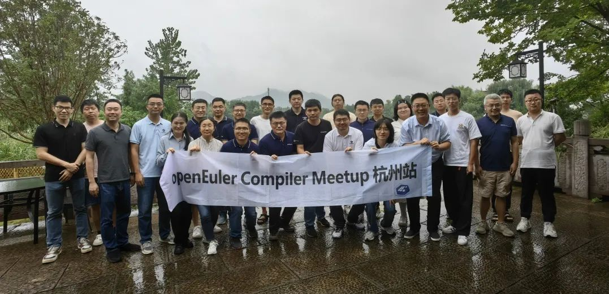

## 开场致辞

**openEuler社区TC委员、开放原子开源基金会TOC成员熊伟博士**做了精彩的开场致辞，简述了openEuler发展历程，对编译器在OS领域的创新探索给予了肯定和鼓励，建议不要过于激进，要脚踏实地、稳步地向前推进。

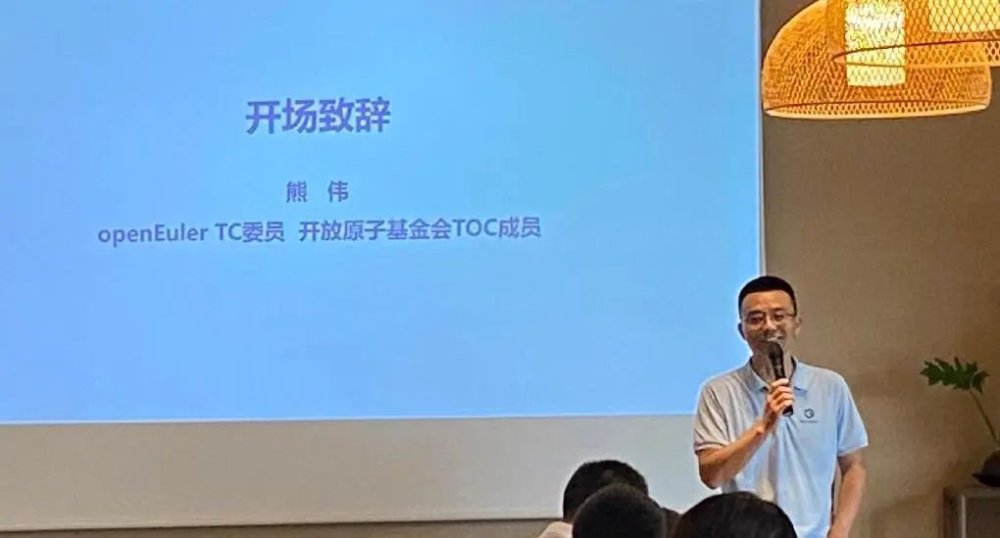

## 业界编译器切换：从GCC到Clang/LLVM

**华为编译器首席技术专家张雁**介绍了LLVM社区的发展趋势。从2007年开始，LLVM社区的活跃度飞速发展并成为最活跃的编译器社区。Apple是LLVM社区的第一贡献者，当前Apple所有的操作系统均由Clang/LLVM构建。谷歌于2011年贡献了地址消毒（ASAN）相关代码，在2017年的Pixel手机上使用了基于LLVM构建的Android系统。其他厂商如AMD、Arm、IBM、NVIDIA等也转向LLVM技术栈。Rust语言也基于LLVM实现，并已经成为Linux
OS内核（除C之外的）第二开发语言。当前Rust语言已于6.1版本正式进入Linux内核，可用于开发内核驱动模块。

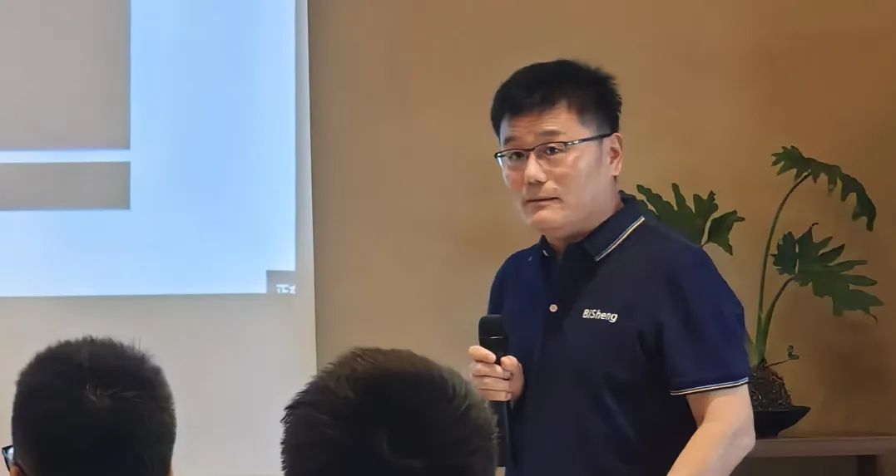

## 从LLVM的发展历史看未来趋势

**LLVM基金会理事&RISC-V大使吴伟老师**带我们回顾了LLVM的发展历史，认为摩尔定律是有极限的，而算力需求没有极限；软件系统的复杂度是超线性增长的，有能力驾驭软件开发复杂度的开发者是有限的。基于这些观察，开源基础设施、开源指令集将会越来越繁荣，而一个基础软件细分领域中往往只会有1\~2个开源社区会最终活跃，而不被上游维护的代码则面临维护成本高、人才获取难等问题，过去这些年，LLVM编译器人才的增长远超GCC。最后，吴伟老师介绍了LLVM平行宇宙计划，"这个挑战是我们乐于接受的，是我们不愿意推迟的，是我们志在必得的，其他的挑战也是如此"。

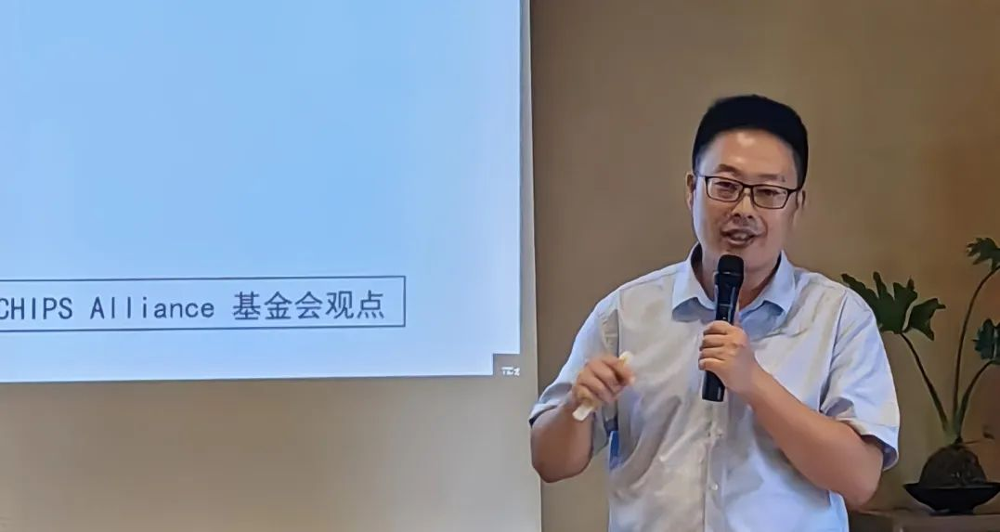

## 编译器反馈优化的实践

**麒麟软件编译器专家黎简**介绍了编译器的反馈优化实践，结合实践，总结了编译器三个方向的趋势：业务软件对性能的需求越来越高，操作系统提供高性能解决方案的需求越来越多，同时高性能编译器选择LLVM架构的越来越多。从SPEC
CPU的评测结果看，BiSheng编译器在speccpu
peak模式下，lto的优化效果要优于其他编译器，说明在编译时和链接时的优化结果就已经接近编译器能达到的最高值，使用上更加便捷。

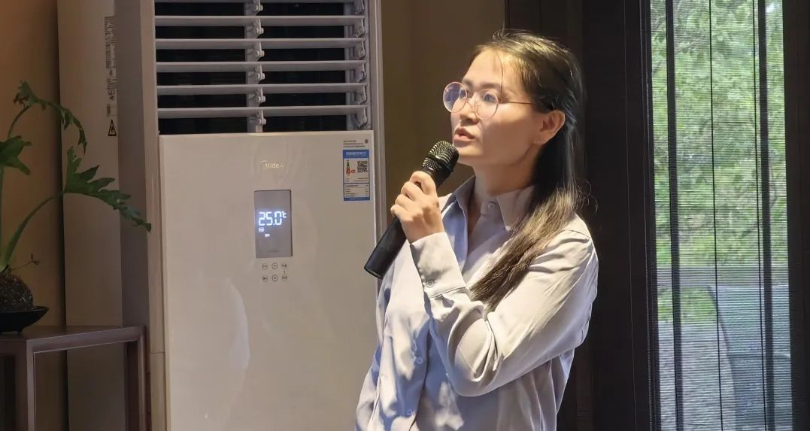

**嵌入式领域\--LLVM构建经验分享**

**华为编译器高级工程师程从秀**介绍了LLVM工具链在嵌入式领域的应用实践。当前在嵌入式领域完整的工具链技术已经成熟，包括编译器、汇编器、链接器、标准库等已经可以全栈打通，可对内核、C库、外围包进行全栈切换。其中LLVM
C++标准库相对GNU工具链更小型化，可减小编译产物的codesize，同时性能更优。

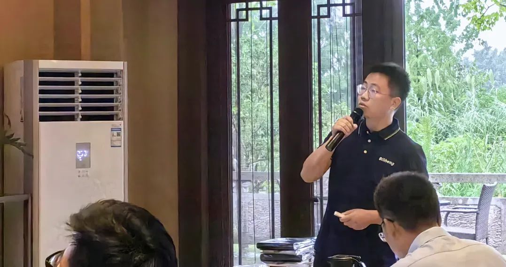

## LLVM/GCC：助力Intel新一代硬件平台

**Intel编译器架构师Annita
Zhang**介绍了针对Intel未来硬件平台编译器的使能路线图，着重介绍了刚刚公布的2个重要特性---APX和AVX10，以及目前编译器使能的计划和现状。这其中包含了多个子特性，APX第一阶段和AVX10.1计划在今年年底完成，目标版本GCC14.1和LLVM18.0。APX第二阶段和AVX10.2计划进入GCC15.1和LLVM19.0。Intel也希望和上游和下游社区一起合作来将硬件能力发挥到极致。此外，Annita还介绍了Intel编译器团队在LLVM和GCC社区所做的贡献，并分享了在IA上的编译器优化和取得的性能增长。

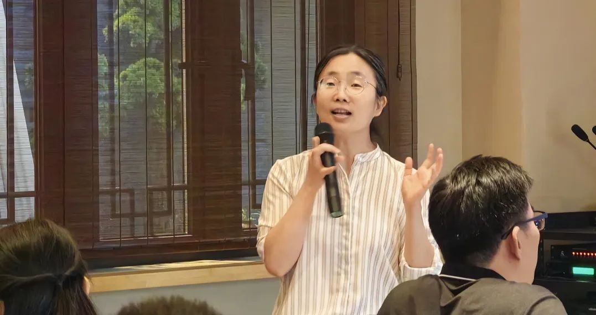

## 使用Clang编译Linux内核

**超聚变OS首席架构师刘恺**介绍了超聚变Clang编译Linux内核的实践。没有一个编译器是完美的，使用多种编译器有助于暴露潜在的问题。这对LLVM社区和Linux社区本身都是好事，有助于项目质量的演进。刘恺还介绍了超聚变使用Clang编译Linux内核的探索，使用Clang编译openEuler
23.09内核，编译后的文件大小比GCC降低约15%，下一步将会探索反馈优化等手段使能kernel极致性能。

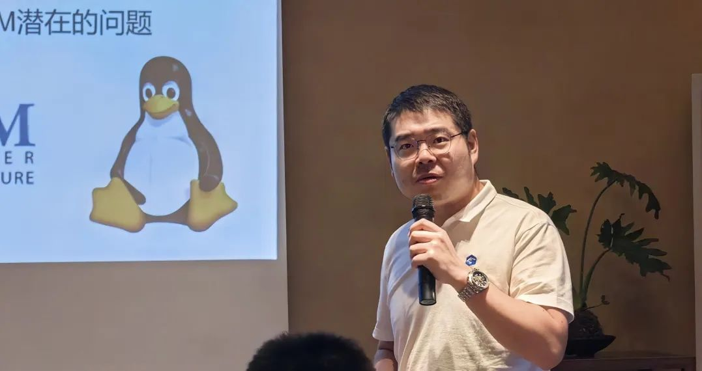

## 圆桌讨论

本次Meetup邀请了openEuler社区的赵川峰&张雁（Compiler
SIG）、谢秀奇（Kernel SIG）、胡峰（Release SIG）、范佳臣（QA
SIG）、刘彦泽（兼容性
SIG）等几个SIG的Maintainer，围绕"当openEuler遇上LLVM"这个主题展开讨论，首先各个Maintainer介绍了一下各自SIG负责的工作及对编译器的诉求和期望，然后对LLVM构建的openEuler的首个发力场景进行了讨论，大家一致认为LLVM从技术趋势上看值得openEuler社区逐步跟进，尝试LLVM构建的kernel算是社区走的第一步，后续在考虑稳定性和兼容性的基础上在社区进一步对齐具体节奏，逐步落实，体现LLVM构建openEuler的竞争力。

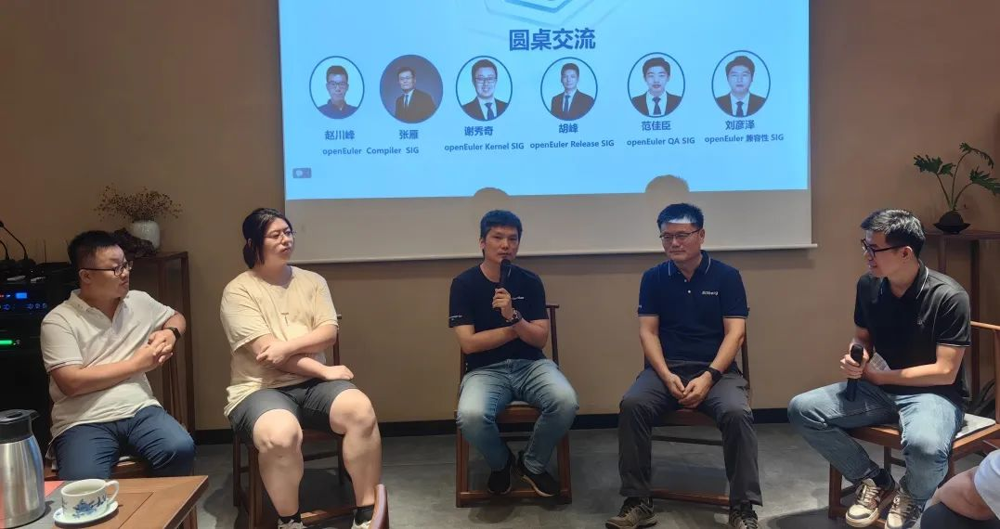

**#畅所欲言**

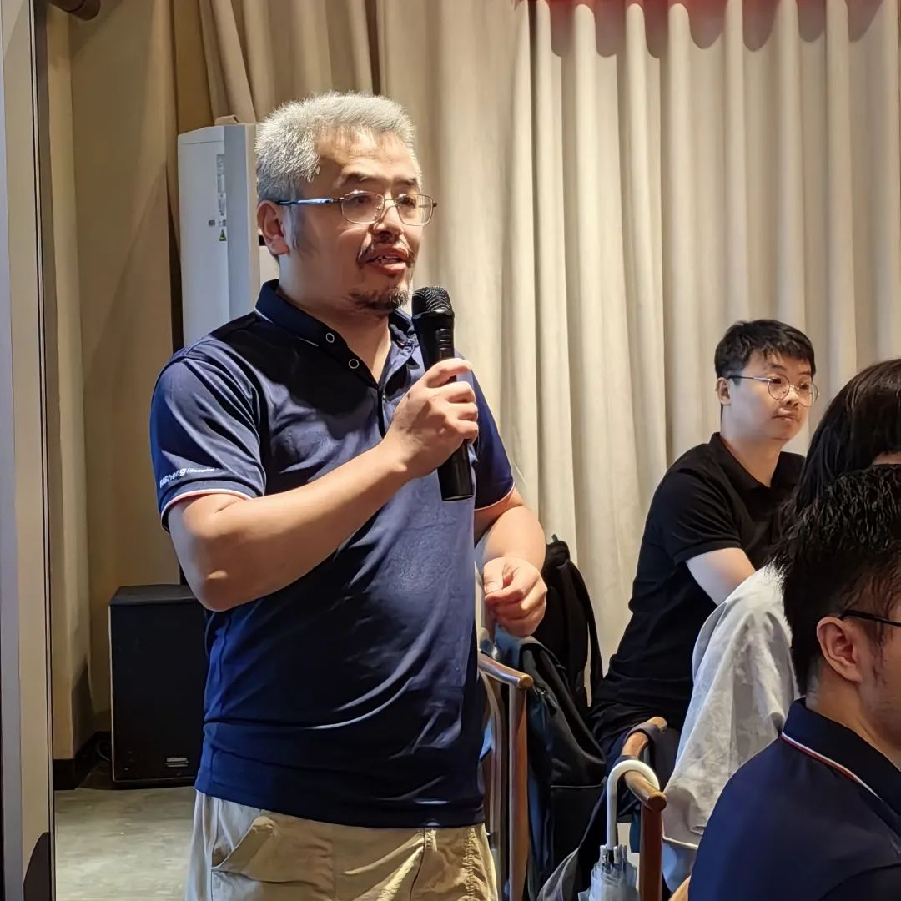

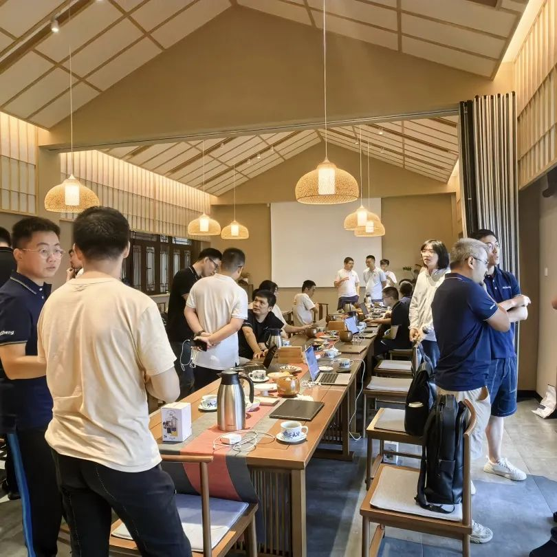

*添加编译器小助手，回复【杭州
Meetup】，即可领取本次Meetup部分议题嘉宾授权分享的演讲PPT。*

