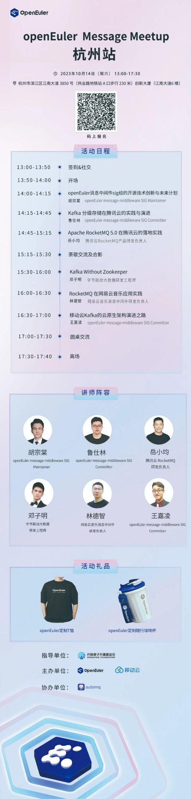

**10月14日，由openEuler message-middleware
SIG和移动云主办，安托盟丘（AutoMQ）协办的消息中间件主题Meetup将在杭州举办**。消息中间件是一种用于实现分布式系统之间通信的技术领域。它提供了一种可靠、高效的机制，用于在不同的应用、服务或组件之间传递消息。\
openEuler message-middleware SIG 将专注于探索为开源用户提供基于
openEuler
基础软件的消息中间件性能加速、安全加固、提升稳定性的解决方案，同时孵化消息相关的新项目（多协议消息转换组件、消息
API 标准和消息流转引擎等），补齐国内在该领域的相关能力。

## 活动信息

**时间**：2023年10月14日（周六） 13:00-17:30

**地点**：杭州市滨江区江南大道 3850 号（伟业路地铁站 A 口步行 230
米）创新大厦（江南大道6 楼）

**主题**：openEuler Message Meetup 杭州站

无论你是消息中间件的专家、爱好者，或者是对该领域感兴趣的开发者，这都是一个极好的机会来学习、分享和交流。

## Meetup亮点

实践案例分享：来自各大公司和社区的技术专家将分享他们在消息中间件领域的实践经验，了解不同场景下的应用案例。

问答互动环节：有机会与演讲嘉宾进行面对面的交流，解答你关于消息中间件的疑问。 

社区动态分享：了解openEuler
message-middleware SIG的最新进展和未来发展规划。

请扫描下方活动海报二维码报名，期待您的到来！

欢迎添加小助手备注【消息中间件】加入openEuler message-middleware
SIG交流群，随时随地get最新动态，畅聊消息中间件技术！

