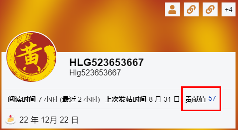
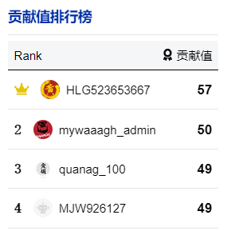

使用openEuler时有疑问，上论坛寻求帮助！

上论坛帮助他人解决问题，分享经验，助人为乐，提升技术影响力，还能获得openEuler精美周边礼物哦！

 

openEuler论坛旨在让openEuler用户、开发者互帮互助解决使用中的问题，分享交流经验，欢迎大家登陆使用。

**地址：https://forum.openeuler.org/**

## **贡献值计算制度**

近期论坛上线了贡献值计算制度，"贡献值"代表着一个用户在论坛的贡献价值、技术资深度，主要由解答他人问题、发布帖子、收到他人点赞以及一些活跃动作而获得。

### **贡献值计算方法：**

-   每创建一个帖子/发布一篇文章：5分

-   每回复一个帖子：2分

-   每一个答案被采纳（被标记为解决方案）：20分

-   每收到一个赞：5分

-   每给出一个赞：1分 （每日上限10个）

-   每邀请一个用户：5分

-   每天登陆访问：1分

-   每阅读一小时的帖子：2分

-   每阅读100个帖子：10分

-   用户举报帖子并该举报被管理人接受：10分

 

### **贡献值激励活动：**

贡献值达 300 ：获得openEuler宇宙能量咖啡杯一个

贡献值达 600：获得openEuler新款定制T恤一件

贡献值达1000：获得openEuler定制卫衣一件

**活动时间：2023年9月19日-2023年12月31日**

### **礼品领取规则：**

在活动时间内，达到相应贡献值后，联系openEuler小助手微信领取奖品。

 

