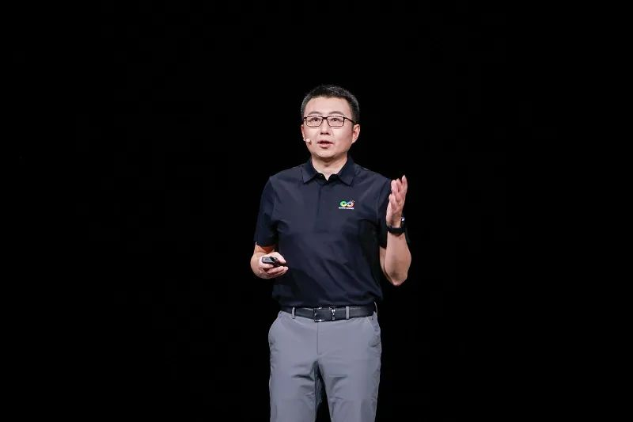

[中国，上海，2023年9月22日] 华为全联接大会2023期间，华为计算产品线总裁张熙伟表示，openEuler开源操作系统面向AI将持续演进，AI赋能openEuler更智能，openEuler使能AI更高效。openEuler作为首个广泛支持AI的开源操作系统，颠覆了传统的命令行交互方式，基于大模型，训练出了
EulerCopilot，初步实现代码辅助生成、问题智能分析、辅助运维等功能。此外，openEuler通过异构资源统一管理与调度，实现CPU和XPU的深度融合，有效提升AI训练和推理性能。

**华为计算产品线总裁张熙伟发表主题演讲**\
会上，华为计算产品线总裁张熙伟表示，人工智能的飞速发展对操作系统也带来了深刻影响。\
一方面，大模型让openEuler更智能。面向终端用户，Windows
12结合AI为大家带来了无限期待。面向数字基础设施，openEuler作为首个广泛支持AI的开源操作系统，正在颠覆传统的命令行交互方式。openEuler 使用ChatGLM基础模型，基于大量 openEuler 操作系统的代码和数据，训练出了 EulerCopilot，初步实现代码辅助生成、问题智能分析、系统辅助运维等功能。以前需要多领域专家协同解决的问题，未来都可以交给 EulerCopilot。

另一方面，AI时代异构算力资源充分共享和利用变得尤为重要，硬件主要从互联总线的角度解决这个问题，操作系统从资源统筹管理的方向也能够发挥更大的作用。openEuler
通过异构资源统一管理与调度，实现CPU和XPU的深度融合，以更全局、更均衡和更精细化的视角统筹内存和算力，充分挖掘空闲资源，提升有效利用率，进而提升AI训练和推理性能。这些功能都会持续贡献社区，并合入
openEuler 23.09 与 openEuler 24.03 LTS 版本发布。

以上这些功能都会持续贡献openEuler社区，并在 openEuler 23.09与
openEuler 24.03 LTS 版本陆续发布。\
会上，开放原子开源基金会理事长
孙文龙先生总结了openEuler社区最新的成果并发布了openEuler 23.09版本。

openEuler 23.09 版本除了支持 EulerCopilot
，帮助开发者进行辅助编程和智能诊断和调优，在全场景能力上也持续升级：

-   在服务器方面，面向CVE场景，支持热补丁端到端方案，实现漏洞快速修复；

-   在云计算方面，统一容器运行时，使得底噪降低50%

-   在嵌入式方面，发布 ROS SDK，简化开发，支持业务容器化部署。

openEuler自开源以来获得产业界的积极支持和响应，是中国最具创新力的开源社区。截至目前，已有超过15000名开发者和1100多家企业、高校、组织和机构加入openEuler社区，汇聚从处理器、整机、操作系统发行版厂商、到行业应用等全产业链，二十多家主流操作系统系统领军企业发行基于openEuler的商业版本。\
openEuler在操作系统 AI
能力上的技术创新和全场景能力上的持续升级将吸引更多人工智能领域、云计算、边缘计算、嵌入式领域伙伴加入社区，未来openEuler将携手伙伴、社区开发者，面向快速发展的行业需求，集成更多AI能力，高效统筹异构算力，致力于将openEuler打造成为全球领先的开源操作系统。
