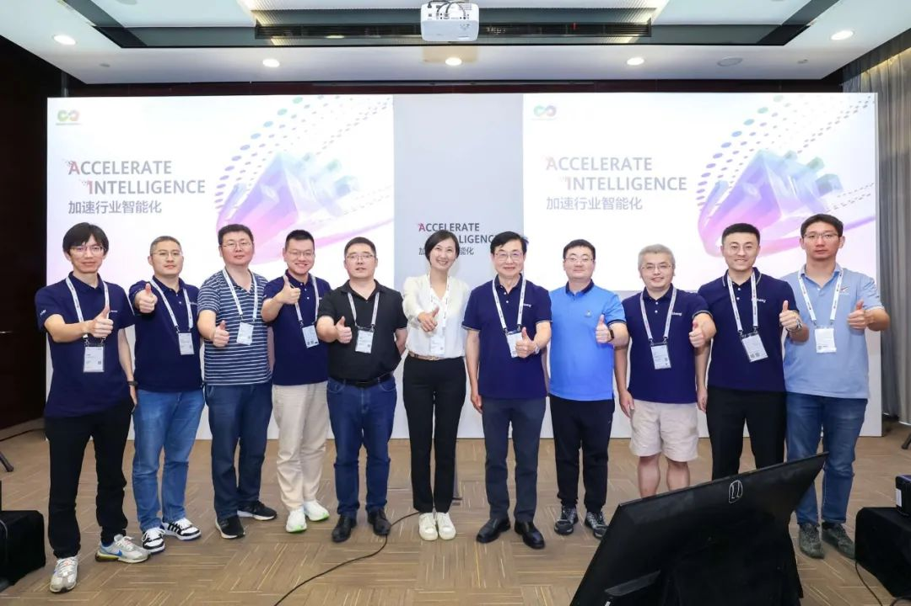
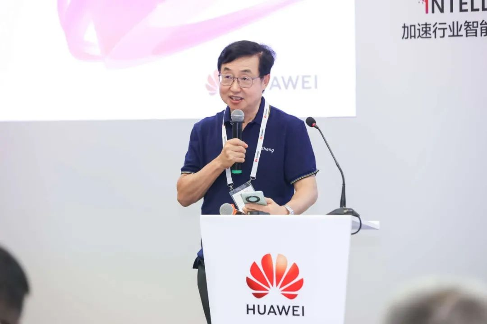
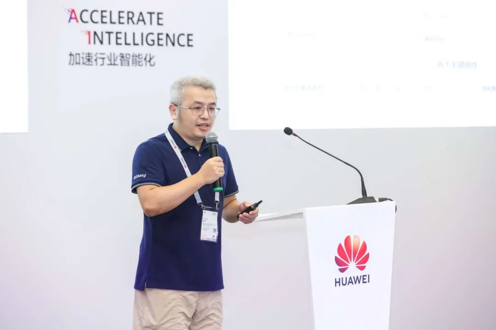
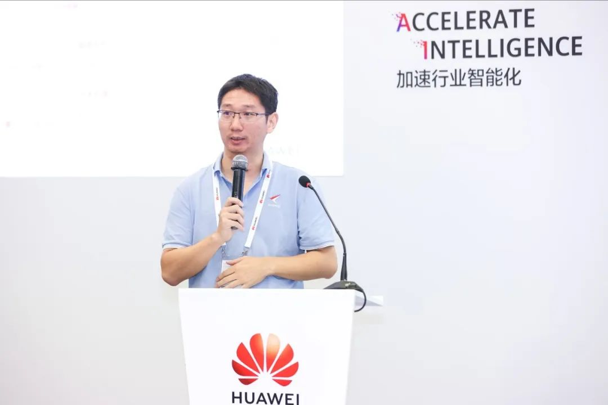
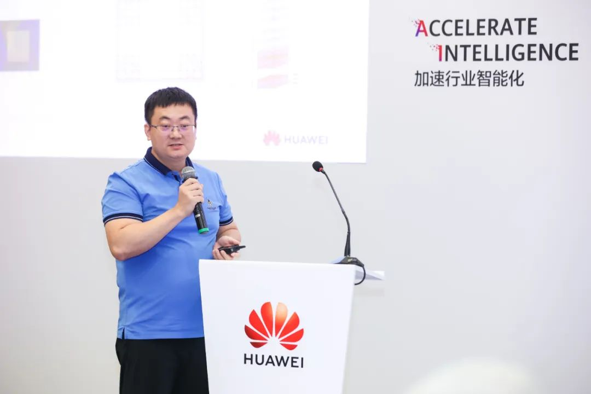
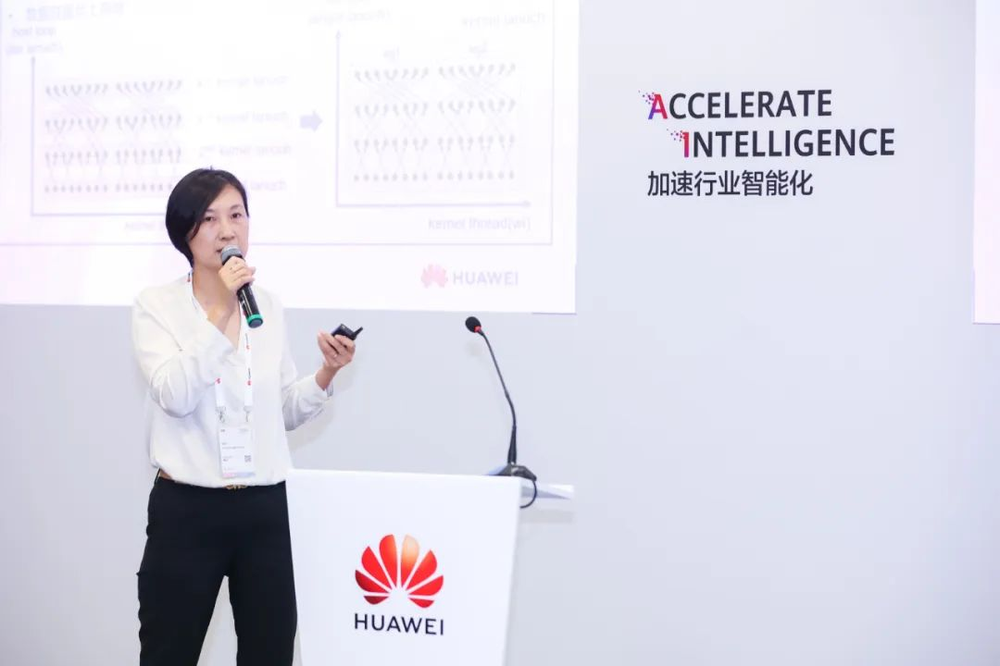

\[中国，上海，2023 年 9 月 22 日\] 华为全联接大会2023（HUAWEI CONNECT
2023）第三日，以"融合编译，协同优化，释放多样算力最大性能"为主题的毕昇编译器分论坛顺利举办。

 HC2023 毕昇编译器分论坛嘉宾合影

华为编译器与编程语言实验室主任高耀清先生在开场致辞中提到，毕昇编译器、毕昇JDK等产品为开发者提供全栈解决方案，实现性能竞争力领先，释放鲲鹏、昇腾极致算力。同时，毕昇编译团队与上游开源社区保持密切的互动与合作，有20+位Committer引导和贡献开源社区的特性演进，在openEuler与毕昇编译器的协同上，进行跨域创新，不断探索编程编译领域新技术方向。高耀清表示，"面向当下AI大模型历史机遇，让我们一起为编程编译技术的领域共同努力，为加速行业全面智能化做贡献。"

 华为编译器与编程语言实验室主任 高耀清

华为编译器技术专家魏伟带来《毕昇融合编译器特性介绍与跨域协同的应用实践》精彩演讲，为大家解读了毕昇编译器最新特性、与欧拉/高斯跨域协同，以及对毕昇未来发展的展望。魏伟表示，"在openEuler
23.03版本，通过kernel的LTO编译、CFGO等实现开箱性能测试，如lmbench、stream等有5%-10%的性能提升。"
除了性能之外，还详细介绍了毕昇编译器在安全编码、静态检测以及安全特性上的探索，比如引入KCFI特性，针对间接函数调用非法跳转到函数体内部场景，防止OS
kernel受到非线性溢出、错误的内存写操作等影响。

 华为编译器技术专家 魏伟

openEuler Compiler SIG
Maintainer周磊发表《毕昇JDK特性介绍》技术演讲。毕昇JDK作为openEuler开箱自带的JDK，进行了一系列优化。通过在指令、虚拟内存方面进行调整，提升JDK17的zgc吞吐量9%，减少停顿15%。在启动加速方面，使用类归档的方案减少启动的工作量，从而节省springboot启动时间18%。另外在Java标准测试套specjvm和specjbb，毕昇JDK相对于基线OpenJDK都有所提升。

 openEuler Compiler SIG Maintainer 周磊

会上，中国科学院南海海洋研究所超算平台负责人周巍、中科院计算技术研究所高级工程师刘颖分别带来了毕昇编译器的产业实践分享。

中国科学院南海海洋研究所超算平台负责人周巍在演讲中提到，气候变化加剧，各种极端天气和海洋灾害频发，这些对海洋和大气过程的精准和精细化预报提出了更高要求。周巍表示，"我们与毕昇编译器团队紧密合作，通过优化海洋模型代码，并充分利用鲲鹏处理器硬件优势以及毕昇编译器编译优化方面的优势，大幅提升了海洋模拟的计算效率。这不仅缩短了模拟时间，还可以支持更高精度的海洋预报，为应对极端天气和海洋灾害提供关键支撑。"

 中国科学院南海海洋研究所超算平台负责人 周巍

中科院计算技术研究所高级工程师刘颖在分享中指出，高性能计算、人工智能等领域涌现出多样的异构算力为编译技术带来了一些新的挑战，中科院计算技术研究所与毕昇编译器团队共同探索深融合编译机制，希望可以融合不同算力上的所有（非对称）线程进行协同分析和优化，当前深融合机制的应用已经从通用编译器扩展到人工智能编译器，期待未来共同探索深融合编译机制的更多场景。

 中科院计算技术研究所高级工程师 刘颖

繁荣的基础软件生态是数字基础设施创新的重要组成部分，当前全行业正在进行基础软件全栈创新。未来毕昇编译器希望能继续与大家携手合作，共同推动编译器与编程语言技术发展和行业应用的繁荣。
