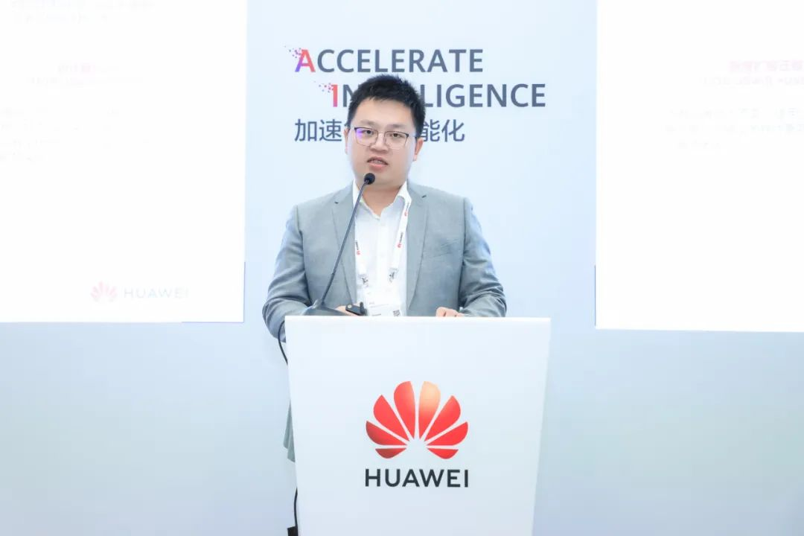

\[中国，上海，2023 年 9 月 22 日\] 华为全联接大会 2023（HUAWEI CONNECT
2023）于 9 月 20-22 日在上海世博展览馆隆重举行。同期，"openEuler
使能全场景创新
夯实算力底座分论坛"成功举办，本次分论坛邀请社区核心成员、重磅用户以及行业大咖分享基于
openEuler 的行业解决方案。为业界充分展示 openEuler
开源项目的运作成果，传递开源开放的 openEuler 发展模式。

openEuler 总经理 胡正策
 

首先，openEuler
总经理胡正策为大家分享了社区的最新进展。openEuler社区目前汇聚了
1080个社区成员单位，开发者数量已经达到了 15000 多人，openEuler
软件包数量已经达到了3.5万个，已经和Fedora、Ubuntu
的软件包数量持平。截止到今年9月，openEuler系操作系统已经累计商用515万套，成为国内操作系统首选路线，预计年底会突破
600 万套，覆盖 14个关键基础设施行业。能够取得这样的成绩，离不开基于
openEuler 开发商业发行版的OSV
伙伴的努力，也离不开广大自用版伙伴和开源社区广大用户的支持。openEuler
社区联合伙伴和客户，陆续发布了电力、运营商、证券行业的应用与生态白皮书，今年还会发布金融行业的应用与生态白皮书。openEuler持续走在创新的路上。在行业智能化方面，openEuler推出了"AI
for openEuler"和"openEuler for
AI"大颗粒创新特性。openEuler是首个广泛支持AI的开源操作系统，颠覆传统的命令行交互模式，基于ChartGLM模型结合大量欧拉开源操作系统的代码和数据，训练出EulerCopilot，初步实现问题的自动分析优化、辅助运维；openEuler使能AI更高效，支持PB级异构内存管理、异构算力多维调度，使AI训练和推理性能持续提升。

openEuler 技术委员会主席胡欣蔚
 

在 OSSEU2023 的主题演讲
 

openEuler立足中国，面向全球，在国内生态取得跨越式发展的同时，openEuler也在积极拓展海外生态，9月19日-22日，openEuler在Linux Foundation欧洲开源峰会上隆重登场，与海外的开发者见面，展现出的先进技术受到海外开发者的广泛关注。回顾历史，操作系统作为协同北向应用生态和南向芯片/硬件生态的枢纽，操作系统路线的发展节奏就是信息产业链的心跳，促进操作系统路线归一，能够极大提高社会协作效率，促进生产力发展。展望未来，作为最具创新力的开源社区，openEuler将为世界开源注入更多中国智慧，未来openEuler 将给世界带来更优选择。

华为与 CFCA 合作备忘录签约仪式
 

来自中国金融认证中心（CFCA）副总经理张野分享了华为与 CFCA 合作进展。CFCA
以鲲鹏为底座，结合 CFCA
自研密码卡、签名验签服务器以及相关软件，形成行业解决方案，相关的技术成果会陆续贡献到
openEuler 社区。会上，来自华为的 openEuler
总经理胡正策与张野举行了华为与 CFCA 合作备忘录签约仪式。

华为鲲鹏计算的openEuler开源操作系统首席架构师 李洋
 

来自华为鲲鹏计算的openEuler开源操作系统首席架构师李洋为大家分享了
openEuler
在构筑基础竞争力、场景化竞争力和生态服务竞争力的相关内容。openEuler
23.09 将发布异构通用内存管理框架 GMEM，GMEM 让NPU等加速器复用Linux
内存管理的高层逻辑，减少驱动对内存管理系统的重复实现，显著降低异构编程复杂度，易用性好、高性能，是目前面向
OS For AI 的最优内存管理解决方案。openEuler
作为支持多样性算力的全场景操作系统，一直致力于提供从内核、虚拟化、容器到中间件的高性能、高安全的基础能力。在内核，openEuler
提供新的分级内存管理，支持容器级的分级内存控制，提供更丰富高效的内存压缩、去重、回收、交换等机制与配套策略，实现业务无影响情况下，内存利用率提升10%。在安全上，openEuler
发布了 DIM+IMA 完整性保护链，在提高系统安全能力的同时，降低了
80%的度量系统启动时的性能损耗。在云原生场景，基于
iSulad+Kuasar+StratoVirt，相比于业界的 Containerd+Kata
Container，可以做到内存底噪降低 50%以上，并行启动速度大幅提升。

麒麟软件产品与社区发展中心副总经理 杨汇成
 

来自麒麟软件产品与社区发展中心副总经理杨汇成，分享了银河麒麟高级服务器操作系统
V10 在金融、能源、交通、医疗等重点行业的创新应用。

-   金融行业：麒麟软件联合中电金信、神州信息等行业伙伴，共同打造的基于主流软硬件环境的分布式银行核心系统解决方案。采取了分布式和微服务架构，具有高性能、低成本、弹性扩展和敏捷交付的特点，目前已经在国有大行得到了完全的部署，实现了对于客户交易系统的 2 亿笔日交易量支持，系统吞吐量达到一万以上。

-   能源行业：麒麟软件与中国电子和中国华电企业联合攻关，推出了基于银河麒麟服务器操作系统V10的"华电睿蓝"电力分布式控制系统解决方案，目前在华电能源的多个电厂投入运行，并且获得了广泛应用，具有典型的行业示范意义

-   交通行业：麒麟软件联合行业应用伙伴共同打造了城轨的自动售检票解决方案。该方案已经在深圳市的地铁四季工程得到全面应用，使用了银河麒麟嵌入操作系统 3000 余套、银河麒麟高级服务器系统 V10 200 余套、高可用集群近 100 套，全面支撑了 AFC 系统的稳定和高效运行。

-   医疗行业：麒麟软件携手中电云电脑联合打造了基于业界先进的总线技术和集成引擎中间件，通过统一的医院运营管理数据中心和临床业务的数据中心，在我市医院得到了充分应用，新建和升级了23 个信息化系统，系统提升了患者就医体验和管理效率。

统信软件华东大区技术总监 蔡健
 

来自统信软件华东大区技术总监蔡健，分享了基于 openEuler
打造的金融行业解决方案和商业实践。统信软件携手赞同科技打造新统一支付平台解决方案，基于统信服务器操作系统
V20，深度适配赞同新统一支付平台，采用微服务设计并进行微服务部署，大幅提高资源使用效率和系统运行安全指数，平台运行性能超过
1300 笔/s ，响应时间\<0.3s，服务稳定运行水平达到
99.999%。该方案在西南某片区的农信合作社进行了落地商用。统信软件和云宏科技联合发布了
WinStack
的云虚拟化解决方案。该方案在上海本地的超大保险集团落地，搭载统信基于
openEuler 的 20.03 的 UOSV20
，项目平衡运行两年，每日访问人数最高达到了日高峰 3 万人，覆盖用户规模 12
万人，每天收发文及业务操作达千万级。

麒麟信安副总裁 王攀
 

来自麒麟信安副总裁王攀，分享了基于 openEuler
的麒麟信安操作系统在电力行业应用实践。麒麟信安一直在电力行业里深耕，针对电力行业，基于国内主流芯片和麒麟信安操作系统，提供行业解决方案，例如高可用冗余网络、集中运维管控、云边融合边缘容器云。目前麒麟信安操作系统在电力行业累计上线
16
万余套，麒麟信安操作系统广泛应用国家电网、南方电网两大客户，成为国内调度、变电、输电、配电、用电，以及电力专用装备等应用场景的操作系统主力军。

中国电建华东院新能源工程院副总工，正高级工程师 朱夏良
 

来自中国电建华东院新能源工程院副总工，正高级工程师朱夏良，分享新能源领域操作系统创新方案与实践。中国电建华东院新能源工程院联合润和软件，基于
openEuler
，并根据新能源领域的一些要求，开发了"**中国电建华东院安全操作系统O-Power** ",该系统有以下特点：注重高可用性。通过高可用解决方案，如负载均衡、多链路、智能运维、系统升级组件，给新能源领域提供高可用解决方案；内置国密算法。业务系统可以直接引用这些算法，把外挂式的密码方式进行了全面替换；建设分布式可信
PLC。在原有的软组线基础上进行优化，通过异构网络、跨协议通讯特性，构建了下一代的
PLC 基础能力，增强了电厂内各个设备的通讯能力。

软通动力基础软件事业部总裁 张先民
 

来自软通动力基础软件事业部总裁张先民分享了软通动力为使用 openEuler
社区版的用户提供商业服务。用户使用 openEuler
社区版最大的优势就是成本低，遇到最大的问题是社区版的维护问题，软通动力的"openEuler
managed by
软通动力"产品为用户提供商业化服务，包括技术支持、问题处理、知识库、补丁，工具方面有迁移工具、部署工具、运维工具。软通动力通过该产品搭建客户与社区的桥梁，让客户可以更加安心的使用openEuler社区版本，从根本上降低客户的运维成本。除了专题演讲环节以外，openEuler
在华为全联接大会 2023 展览展示、开发者动手体验等环节隆重亮相，展示
openEuler
最新技术特性和商业落地实践成果。

