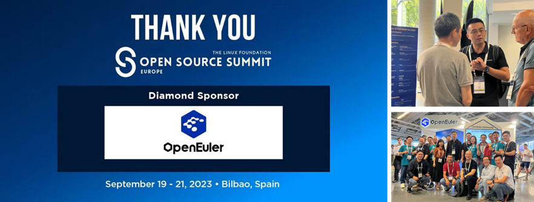
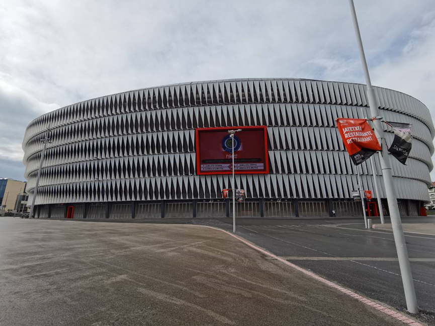
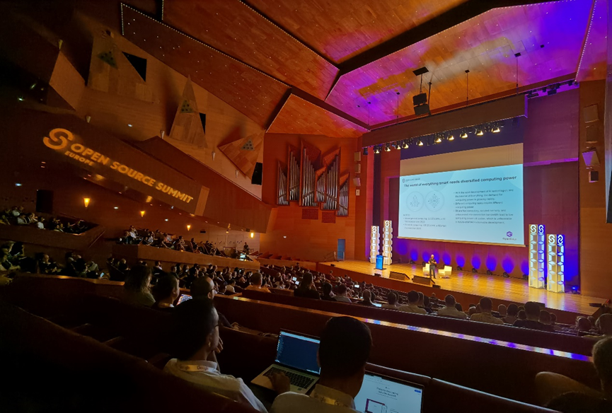
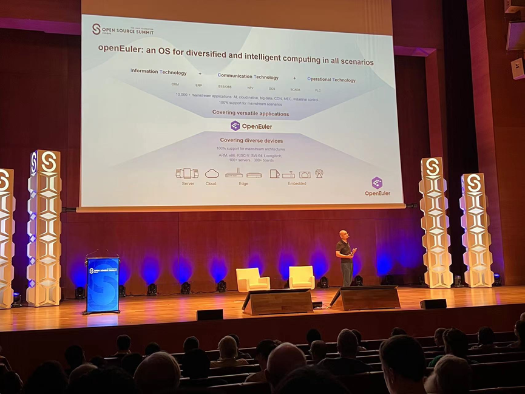
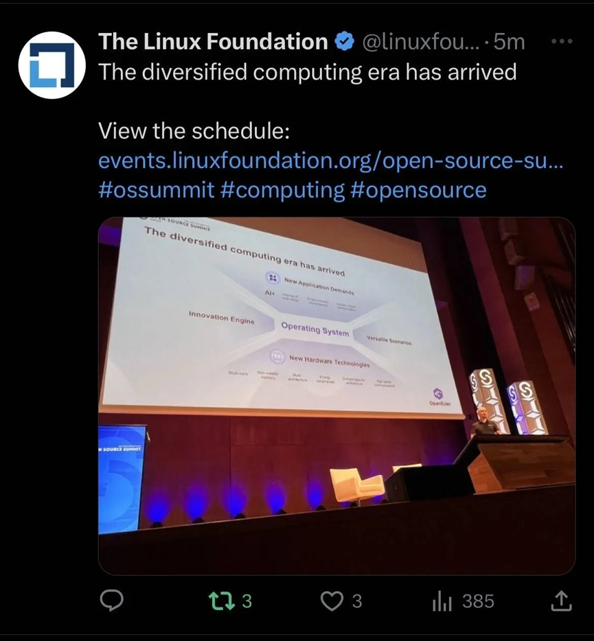
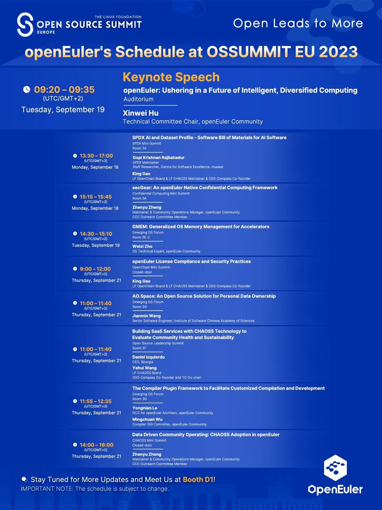
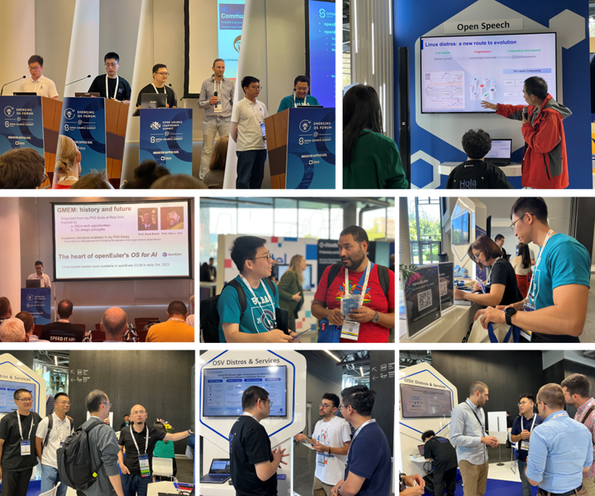

**编者按：**2023年9月19日，为期3天的欧洲顶级开源峰会OSSUMMIT 2023（Open
Source
Summit）在西班牙举办。作为开放原子开源基金会旗下的项目，openEuler作为钻石级别赞助参会。这也是**openEuler和OpenAtom基金会首次联袂在国际舞台上进行展示和亮相**。我们很荣幸邀请openEuler技术委员会委员熊伟博士，来谈谈他本次亲身参会后的感受。

图：左上角为熊博在会场现场跟开发者交流，右下角为openEuler参会代表团队合影

### 以下是「熊伟博士」全文：

开源系统软件重要的会议Open Source Summit
2023欧洲站（以下简称OSSUMMIT）于9月19到21日在西班牙的比尔巴鄂举行。如果不是一个球迷，估计很少有人知道比尔巴鄂这个城市。比尔巴鄂竞技队在西甲中独树一帜，特立独行。在商业化大潮的浸染之下，比尔巴鄂竞技始终努力保持不被商业化过度侵蚀，甚至据介绍球队主席都是由球迷选出来的。这种在当今时代颇具理想主义的一种运营模式倒是和开源产业，开源生态的初衷颇有几分神似。

作为年度最重要的开源会议之一，OSSUMMIT是以Linux系统软件起家的会议，一般来说代表了系统软件在一定阶段的演进，赞助商也是行业内IT基础设施的提供者为主。但有趣的是，作为基础设施核心提供者Intel，英伟达等公司并没有作为主要赞助者出现，甚至在会场也没有想象中很大的展台。企业参与的数量相对并不是很多。除了华为以外，只有富士通等个别公司有比较大的展台。\
从参会的议题来看，重量级的项目发布不是很多。现场参会3天，唯一有印象的项目是google发布了OpenWallet项目。但这种偏向应用软件层面的项目越来越多，从一个侧面说明在全球范围内，传统意义上的基础软件、芯片、体系架构等IT基础设施都沉寂太久了。

一切深刻而深远的变化往往都是悄无声息地开始了，且大多数人并不会意识到。这些微妙的变化，我相信就藏在openEuler技术委员会主席胡欣蔚的Keynote演讲中。胡欣蔚主席的演讲被安排在Keynote演讲的第一位，这个颇为出乎意料。因为openEuler毕竟是聚焦在操作系统这个非常"传统"的领域，相对google的OpenWallet这种颇为夺人眼球的项目，openEuler多少显得和时代有些错位感。原因虽然不得而知，但是我相信这是组委会对于传统的回归和被胡欣蔚主席演讲里新颖内容所吸引。

胡欣蔚主席的演讲题目是"**openEuler : Ushering In A Future Of
Intelligent, Diversified
Computing**"，直白的翻译就是openEuler社区对多样性算力和智能时代的基础软件的思考。对于从事IT基础架构的从业人员，过去的二十年，不论是芯片、体系架构，还是操作系统等，一直都是在技术的延长线上做小幅修改。但在AI、大模型、万物互联等等新兴需求的推动下，实际上IT基础设施正在发生着缓慢而深远的变化。这些在胡欣蔚主席的演讲中都有充分的阐述，我这里就不累述了。

胡欣蔚主席代表openEuler为行业展现了我们在底层架构层面，面向未来的思考以及相关探索，相信openEuler能够引领产业下个阶段的变革。当胡欣蔚主席的演讲结束之后，我在现场听到了全场最热烈的一次掌声。而**Linux基金会也在第一时间通过twitter官方账号上转发了现场胡欣蔚主席的演讲内容，并表示多样性算力时代到来了**。这也可能是因为OSSUMMIT会场上很久没有这么基础性的技术讲演吧。

即使是一些具体细分领域，比如容器，虚拟化，安全，云原生等等，openEuler也在不断地进行创新，iSula,
stratoVirt, secGear,
rubik,sysmaster等等这些在国内已经被很多用户和开发者耳熟能详的项目，当他们第一次成规模的集体亮相海外，众多开发者对于有如此多新颖有趣的项目都颇感惊讶和震撼。

当海外的众多公司更多将力量投入到AI应用等领域的时候，我相信源自国内产业界的坚守和努力，以openEuler为代表的基础平台未来在全球范围内能够获得更大的成功，并引领下一个产业周期的发展。

除了技术方面的海外拓展，我们也看到一些国内企业也开始有意识地和openEuler一起出海试水，这次超聚变公司、中科院软件所和开放原子开源基金会与openEuler社区一起参加了大会，大家的展台也融为一体。参展人员也互相站台，互相支撑。这是一个颇为亮眼的举动，对于中国企业界来说，我们需要形成一个开放的体系，共同在海外的市场上进行。openEuler社区希望未来携手更多的企业一起出海，看到不一样的风景。

现在的世界，纷繁复杂，变化很大，不和谐的声音似乎越来越多，但是当我们回到技术的世界、开源的世界，你会发现，来自不同国家、不同地域的人们并没有变化，他们的热情没有变化，他们的友善没有变化，他们的开放没有变化。我们所需要的变化是不断追求技术的进步、创新的涌现，新一代的开发者、新一代的项目能够敢于挑战现有的技术规则，不断推动世界的变化。

**对于世界，我们依然要以桐花万里丹山路的乐观主义精神去拥抱世界，更要有雏凤清于老凤声的魄力去改变世界。**

期待明年的OSSUMMIT我们再见！
