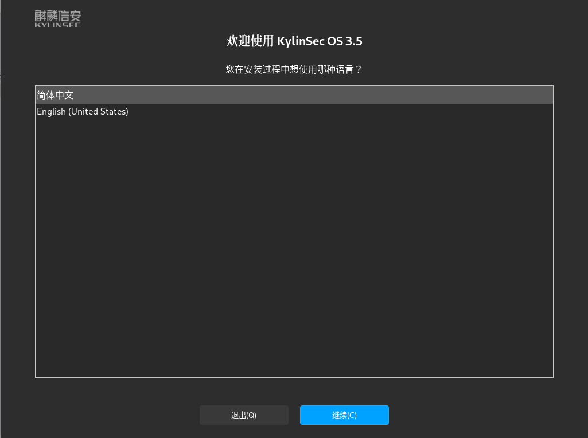
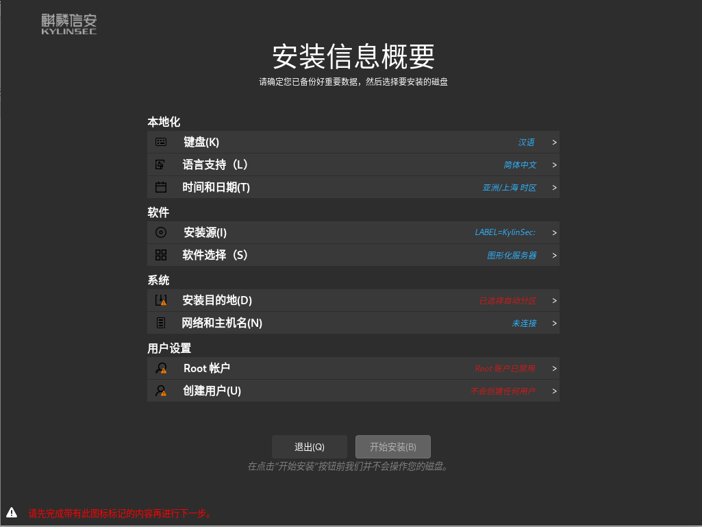
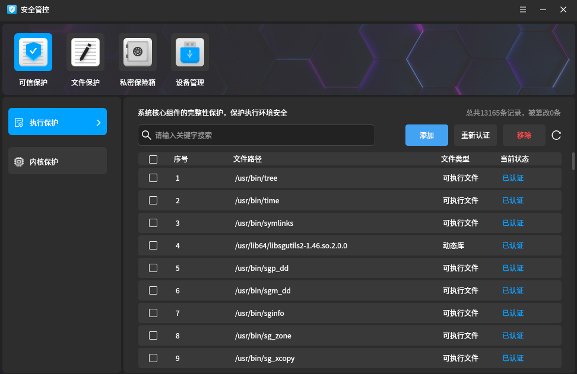
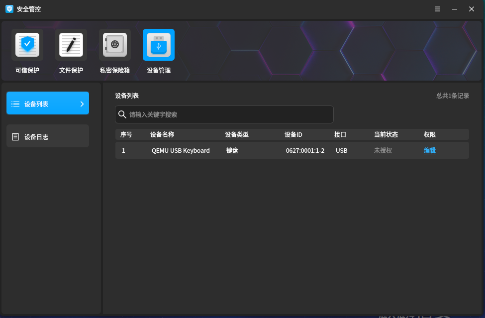
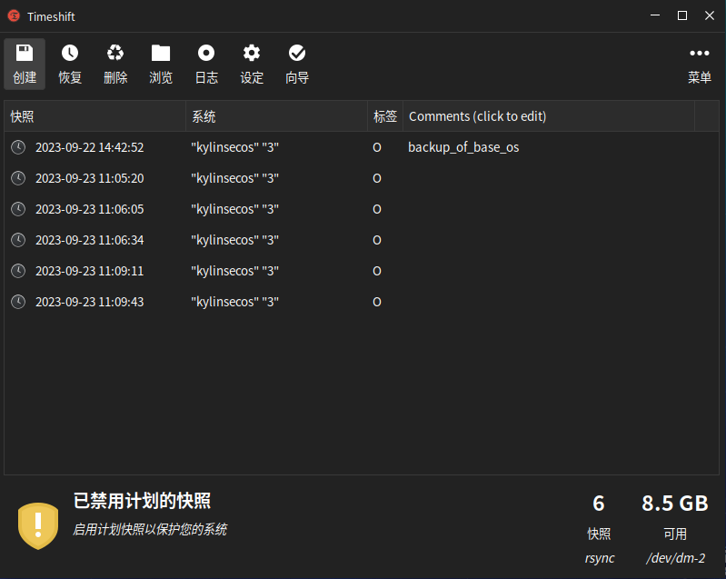
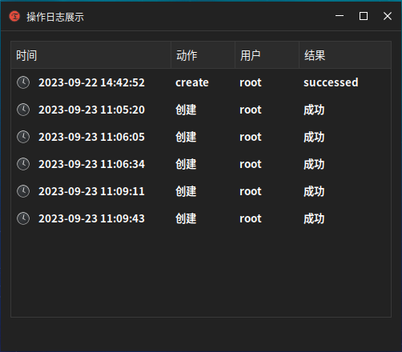

**9月25日，麒麟信安基于openEuler 22.03 LTS SP1版本的商业发行版------麒麟信安服务器操作系统V3.5.2正式发布。**

麒麟信安服务器操作系统V3定位于电力、金融、政务、能源、国防、工业等领域信息系统建设，以安全、稳定、高效为突破点，满足重要行业领域用户高安全、高可靠的规模化部署需求。

本次发布的V3.5.2纵向兼容麒麟信安服务器操作系统V3.5.1，可保障用户系统从V3.5.1平滑升级至V3.5.2；横向兼容openEuler
22.03 LTS SP1，继承openEuler社区全部软硬件生态成果。

## 两大亮点，开启"创新加速度"

从源码上实现了X86_64、AArch64、LoongArch64和SW_64四款指令集同源异构的产品，同时还新增支持RISC-V指令集，可支持海光、兆芯、鲲鹏、飞腾、龙芯和申威等国产CPU。

实现了与OpenHarmony设备间的相互识别和通信。麒麟信安服务器操作系统V3.5.2通过支持分布式软总线技术，实现了服务器系统与嵌入式系统之间的互通互联，为端边领域协同发展构建了技术基座。

#   六种方式，稳扎稳打提升性能   

## 更优的锁并发处理

麒麟信安结合在国防、电力、政务等领域的多年实战经验，发现不同架构的特定原子访问指令和其非原子访问指令在性能上存在较大差异。例如，部分原子指令在高并发场景下响应速度快，但在低并发场景下响应性能劣于其非原子指令。通过对内核代码应用场景的详细分析与反复验证，在适当位置优化原子指令，使系统在低并发的单线程场景中和高并发的多线程场景中，性能均有明显提升。

## 更高效的进程唤醒流程

随着服务器系统中CPU个数和核数增多、内存容量增大，根据CPU与内存的亲和划分了多个NUMA节点，跨不同NUMA节点之间数据访问开销增大。在对特定场景的多线程性能测试时发现，默认的内核进程调度算法会将线程在NUMA中分布的较为散列，降低了多线程应用的性能。麒麟信安针对该场景，优化了内核进程调度算法，使得相互关联的线程尽可能的集中到最小的调度域中，降低数据同步消耗，对于系统性能有了显著提升。

## 更快的内存页拷贝

内存拷贝是计算机系统中常见的操作，它涉及将数据从一个内存位置复制到另一个内存位置。在多线程应用中，内存拷贝操作常常成为性能瓶颈之一。

麒麟信安服务器操作系统V3.5.2针对内存拷贝进行多项优化，大幅提升了多线程应用的性能。例如，使用位宽更高的矢量寄存器实现内存页拷贝函数，位宽更高的矢量寄存器提供了更优的访存性能，更精简的代码实现，从而有效的提升了内存页拷贝性能。

## 更灵活的进程调度策略

通过优化进程调度策略，提高了系统的响应能力、降低延迟，并实现更好的负载均衡。可根据客户具体的应用场景和系统需求提供多种时钟调频方案，从而使业务需要和资源限制、节能减排的目标达到平衡。如资源有限的系统或对能耗要求较高的场景中优化调度时钟频率，以提高资源利用率和节能效果。

## 更优的系统调用

系统调用作为系统用户态和内核态交互过程中必不可少的模块，对系统性能的影响至关重要。麒麟信安服务器操作系统V3.5.2对系统调用核心路径进行了重点优化，主要包括：

●冗余函数调用优化

●同步操作优化

●页表切换优化

## 更精简的内核配置

通过对内核代码和配置文件的详尽分析，在保障安全、稳定性的前提下，精简内核代码执行流程并优化配置，从而有效提升内核性能。

#   七大升级，全面提升先睹为快   

## 重新定义安装风格

麒麟信安服务器操作系统V3.5.2对系统安装界面做了全面升级，采用全新的黑色系简约大气的设计风格，融入了更多的本地化特色。

## 安全管控

安全管控是麒麟信安自研的安全功能软件，为麒麟信安操作系统安全核心技术相关功能提供集中式、图形化的管理配置界面，保障系统安全性同时提高灵活性和便捷性。

安全管控软件提供以下功能：

●可信保护：对可执行程序进行执行控制；

●文件保护：保护关键文件路径，防止恶意篡改或删除；

●私密保护箱：提供数据隔离、隐藏和加密保护功能；

●外设管控：对外部设备进行读写执行控制。

## 商密全栈

麒麟信安服务器操作系统V3.5.2集成了商密可信CA安全根证书，并且对商密支持关键安全特性进行商密算法使能，同时为上层应用提供商密算法库、商密证书和商密安全传输协议等密码服务。已支持的商密特性包括：

●OpenSSL/Libgcrypt等用户态算法库支持SM2、SM3和SM4算法；

●OpenSSH支持SM2、SM3和SM4商密算法套件；

●OpenSSL支持商密TLCP协议栈；

●磁盘加密（DM-Crypt/Cryptsetup）支持SM3和SM4算法；

●用户身份鉴别（PAM/Libuser/Shadow）支持SM3口令加密；

●入侵检测（AIDE）支持SM3摘要算法；

●内核加密框架（Crypto）支持SM2、SM3和SM4算法，以及AVX/CE/NEON等指令集优化；

●内核完整性度量架构（IMA/EVM）支持SM3摘要算法和SM2证书；

●内核模块签名/验签支持SM2证书；

●内核KTLS支持SM4-CBC和SM4-GCM算法；

●鲲鹏KAE加速引擎支持SM3和SM4算法加速；

●UEFI安全启动支持SM3摘要算法和SM2数字签名。

## 智能运维

麒麟信安服务器操作系统V3.5.2提供智能运维框架A-OPS，具备CVE管理、配置溯源和异常检测等能力，支持快速排障、降低运维成本。

●CVE在线巡检：提供CVE批量感知修复能力，系统管理各主机漏洞情况，方便用户快速识别主机漏洞，区分受影响与不受影响的CVE，并提供一键修复功能，提升漏洞修复效率。

●异常检测：突破在线巡检、高性能和高精度探针等关键技术，在MySQL、openGauss业务场景实现网络I/O时延、丢包、中断等故障以及磁盘I/O高负载故障的发现。

●运维工具集：一款集分析、流程跟踪、信息记录、历史经验固化等功能于一体的操作系统内核问题定位工具。

## 新增支持通用vDPA设备

当前内核态vDPA仅支持virtIO-NET设备，并不支持其他存储设备如VIRTO-BLK设备。这种方式导致用户态的vDPA存在一些限制和挑战。

麒麟信安服务器操作系统V3.5.2通过支持通用vDPA设备，用一种通用类型支持VIRTIO_ID_CRYPTO,VIRTIO_ID_FS,VIRTIO_ID_NET等共计9种VIRTIO设备，提供了更高效的网络虚拟化解决方案。

## 新增备份还原组件

基于Timeshift
22.11.2二次开发的备份功能组件，支持全量备份、增量备份，支持立即备份和自定义周期的自动备份，支持对备份日志查看追溯。

## 全面支持GB 18030-2022中文编码字符集

麒麟信安服务器操作系统V3.5.2支持GB
18030-2022中文编码字符集，能高度满足不同行业用户对于操作系统的中文信息处理及生僻字输入的需求，为用户带来良好的中文使用体验。

长久以来，麒麟信安积极参与openEuler社区建设，并成为首批openEuler商业发行版操作系统厂商。麒麟信安始终根植于操作系统技术，在openEuler基础上不断迭代演进，致力于商业发行版本在关键行业和领域的应用推广，并在党政、国防、电力、金融等行业得到大规模商用。未来也将继续携手openEuler，推动国产操作系统实现高质飞跃。
