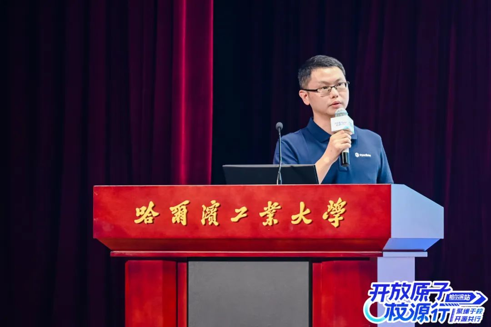
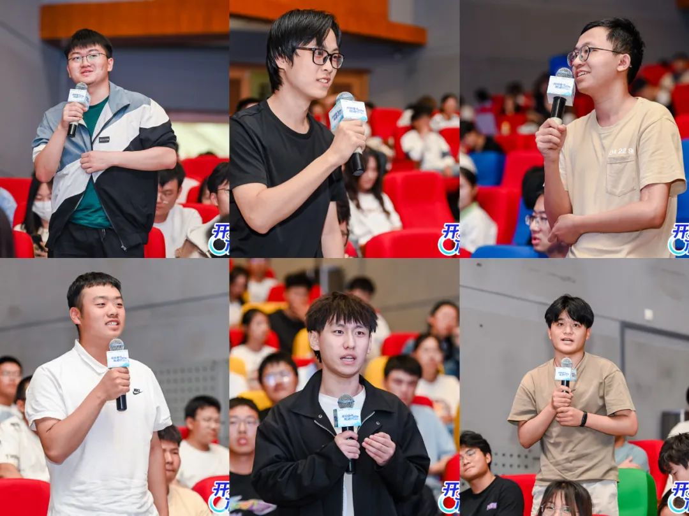

2023年9月17日，开放原子校源行（哈尔滨站）在哈尔滨工业大学成功举行。工业和信息化部信息技术发展司相关领导，开放原子开源基金会理事长孙文龙，哈尔滨工业大学党委常委、副校长刘挺参加活动并致辞。

本次活动旨在普及开源文化，推动开源生态建设，引导学生了解参与开源的路径和意义，特邀教授学者、社团负责人、技术专家和相关领域的工程师共聚校园共话开源。

**openEuler作为开放原子开源基金会孵化的项目，同样积极参与到开源人才的培养当中**，openEuler基础软件服务总监邓晖龙分享了《openEuler人才培养的必要性及产教融合实践》，他表示随着openEuler市场占有率不断增加，导致openEuler业务快速增长，带动了openEuler人才需求的增长，openEuler必须加快专业人才培养。同时，openEuler开源社区也联合开放原子开源基金会及各产业公司共同提供了竞赛、实习等机会和平台，旨在帮助高校学生快速提升能力！

活动现场，来自哈尔滨工业大学及其兄弟院校的学生代表们，积极参与互动，就openEuler相关话题，与演讲嘉宾展开了互动交流。

openEuler社区将充分依托企业、学校、学生等各方力量，打造开放、包容、共享的优质高校平台，期待更多高校积极参与，共同培养更多具有卓越创新能力的开源人才!

## openEuler目前开展的课程&高校活动简介

**1）开源软件供应链点亮计划-暑期2023（简称"开源之夏"）**

开源之夏是由中国科学院软件研究所与openEuler社区共同举办的一项面向高校学生的暑期开源活动，旨在鼓励在校学生积极参与开源软件的开发维护，促进优秀开源软件社区的蓬勃发展。

主办方联合各大开源社区，针对重要开源软件的开发与维护提供项目，并向全球高校学生开放报名。学生在社区导师指导下，按计划完成开发工作，并将成果贡献给社区。根据项目的难易程度和完成情况，参与者将获取由主办方发放的6000-12000元的项目奖金。

项目详情链接：https://summer-ospp.ac.cn

**2）开源实习**

openEuler开源实习是openEuler社区和社区合作单位共同发起的线上实习项目，旨在鼓励在校学生积极参与开源社区，在实际的开源环境中提升实践能力，在社区中成长为优秀的开源人才。由社区提供实习任务，并提供导师辅导，学生通过实习申请后，可在社区领取任务，每完成一个任务可获得相应积分，积分累计达规定量后，可获得实习证明和实习工资。

项目详情链接：https://www.openeuler.org/zh/internship

**3）openEuler社区开源贡献实践微认证**

为让高校师生更进一步了解掌握参与开源社区开发的方法，openEuler社区联合华为鲲鹏社区，上线了openEuler社区开源贡献实践微认证课程，在学习完本次课程并通过认证考试后，将获得官方鲲鹏微认证证书。

通过参与openEuler社区贡献指导学员掌握参与主流开源社区的基本方法，掌握Linux环境下软件开发的基本能力。本认证流程包含在线学习、在线实验、认证考试三部分。

微认证链接：

https://www.hikunpeng.com/learn/micro-certification/detail/ad537279d82b4d38bcd96afbdb2181d3

 

**4）openEuler开设课程**

 开源基础软件学习培训-openEuler精品课程

openEuler社区联合伙伴共同打造openEuler人才评定体系，推动高校新生、技术爱好者踊跃融入社区技术生态建设。在官网上传有openEuler精品课程，供高校学子进一步了解社区。

链接：https://c0605e03bb6b40dca9cd34ab5b3fb1f8.shixizhi.huawei.com/portal/1643780836745113602?pageId=1650768876006805506&activeIndex=-1&sxz-lang=zh_CN

  

openEuler MoocStudio

MoocStudio是集计算机课程编写和学习一体的教育平台，供大家能够在浏览器中使用真实环境学习新技术。

链接：https://moocstudio.openeuler.org/zh

**5）欧拉人才加速计划**

欧拉人才发展加速计划是华为公司基于"智能基座-产教融合协同育人基地"的教学实践成果，围绕操作系统方向向应用本科进一步深化推进的一项人才发展举措。该项目已联合各大高校共同建设了74个教学实践平台，开设超过1300门课程，覆盖20万名学生。 

项目详情链接：https://edu.hicomputing.huawei.com/openeuler-opengauss-talent

**6）鲲鹏众智计划**

鲲鹏众智计划主要围绕 鲲鹏DevKit、openEuler
Devkit开发套件、BoostKit开源应用使能套件等
发布100+众智任务，百万美金激励。目前首批任务及相应的激励计划已经在鲲鹏社区发布，开发者可以在线提交申请，参与鲲鹏众智合作计划，成功提交代码并通过验收即可获得激励。

社区链接：https://kunpeng.huawei.com/zh/#/ecosystem/ecology_remit

**7）开放原子开源大赛openEuler AI应用挑战赛**

参赛者在openEuler平台上适配主流开源AI框架，使用openEuler社区相关开发者工具，完成开源AI框架的软件包搭建，并通过完成完成常用AI模型的部署和使用，实现基于openEuler的AI应用适配和应用。本赛题奖金总额30w，奖金将由基金会直接发放给获奖团队！大赛官网（openEuler归属新兴及应用赛道）：https://competition.atomgit.com/competitionInfo?id=1ea056d0418e11eeb9c0eb26c552c0c4
